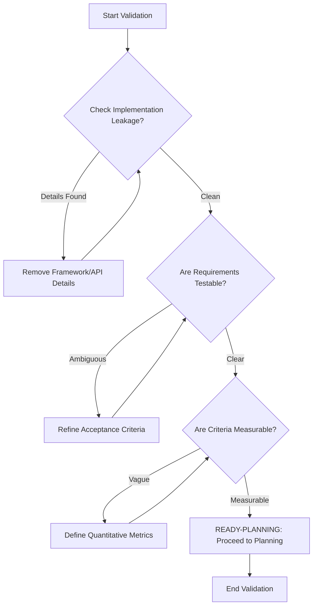
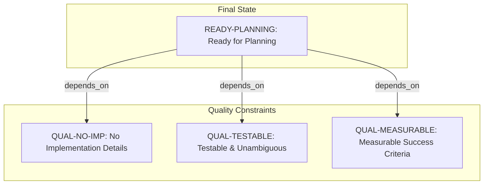

# CourseHub API - Technical Specification & Architecture Document

## 1. Executive Summary & Architecture Overview

### 1.1 Executive Brief
The CourseHub API project is currently represented by a quality assurance validation layer rather than a functional specification. The core objective is to ensure the API specifications are testable, technology-agnostic, and focused on business value. The current context is a pre-planning validation phase aimed at auditing the completeness of the accompanying `spec.md` documentation.

### 1.2 Maturity Assessment
The project's structural integrity is currently compromised as the input is a checklist rather than a functional spec, resulting in critical gaps regarding Functional Requirements and Scope boundaries. Despite the checklist being marked as complete, the absence of core business logic and entity definitions necessitates a status of **NEEDS REFINEMENT** before execution can begin.

### 1.3 Technical Stack
* No specific languages, frameworks, or databases defined in the current validation source.

### 1.4 Architectural Constraints
* **Zero Implementation Leakage**: No implementation details (languages, frameworks, APIs) must be exposed within feature definitions.
* **Requirement Unambiguity**: All requirements must be strictly testable and unambiguous.
* **Technology-Agnosticism**: Success criteria must be measurable and independent of the chosen technology stack.
* **Strict Boundary Definition**: Project scope must be clearly bounded to prevent scope creep.

### 1.5 Critical Dependencies
* **External Documentation**: Referential dependence on the external `spec.md` file for all functional requirements.
* **Logical Validation**: Planning readiness is strictly contingent upon the validation of `QUAL-NO-IMP`, `QUAL-TESTABLE`, and `QUAL-MEASURABLE` constraints.

## 2. Architecture Workflows & Visual Diagrams

### 2.1 Specification Readiness Workflow
A logic flow representing the validation process of the CourseHub API specification based on the quality checklist constraints.

### 2.2 Quality Constraint Traceability
Mapping the dependency between the final readiness state and the specific quality constraints required for the CourseHub API.

## 3. Detailed Technical Specifications & Business Rules

### 3.1 Requirements Traceability
| Identifier | Type | Description | Source Section |
| :--- | :--- | :--- | :--- |
| QUAL-NO-IMP | Constraint | No implementation details (languages, frameworks, APIs) are exposed in the feature definition. | Content Quality |
| QUAL-TESTABLE | Constraint | Requirements must be testable and unambiguous. | Requirement Completeness |
| QUAL-MEASURABLE | Constraint | Success criteria must be measurable and technology-agnostic. | Requirement Completeness |
| READY-PLANNING | Assumption | The specification is complete and ready to proceed to planning. | Notes |

### 3.2 Security Rules
* Not specified in the provided validation source.

### 3.3 Data Models
* Not specified in the provided validation source.

## 4. Project Governance & Structural Gaps

### 4.1 Structural Gaps
| Missing Section | Priority | Remediation Advice |
| :--- | :--- | :--- |
| Functional Requirements | HIGH | This document is a checklist; the actual functional requirements are located in the referenced spec.md file. |
| Scope & Out-of-Scope | HIGH | Define the specific boundaries of the CourseHub API functionality. |
| Open Questions & Uncertainties | MEDIUM | List any remaining technical or business unknowns for the API. |

### 4.2 Remediation & Workflow
The project must transition from a "Checklist" state to a "Functional Specification" state by integrating the content of `spec.md` into this master document. Validation of the constraints listed in Section 3.1 must be performed against the integrated content before the project is marked as "Ready for Planning".

## 5. Technical & Domain Glossary (Terminology Reference)

| Term | Category | Context Anchor | Project Definition |
| :--- | :--- | :--- | :--- |
| API | TECHNICAL_STACK | QUAL-NO-IMP | The programmatic interface layer that must remain abstracted from the high-level functional descriptions to prevent implementation leakage. |
| Feature | BUSINESS_DOMAIN | Feature Readiness | A discrete unit of deliverable functionality that must align with measurable success criteria and validated user scenarios. |