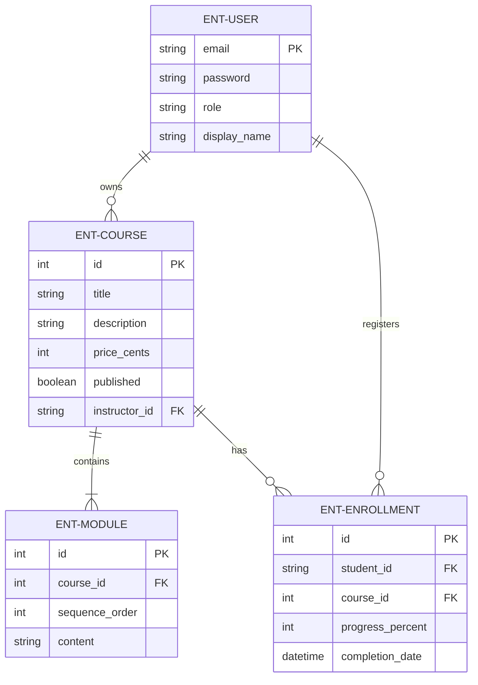
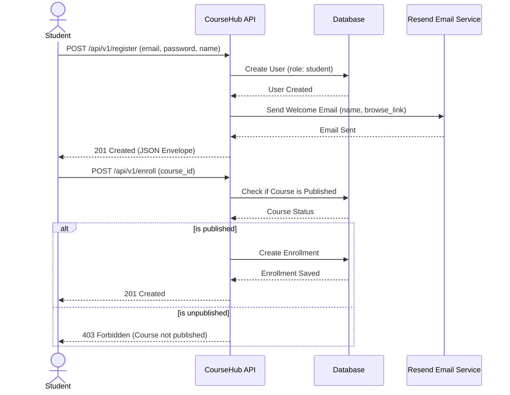
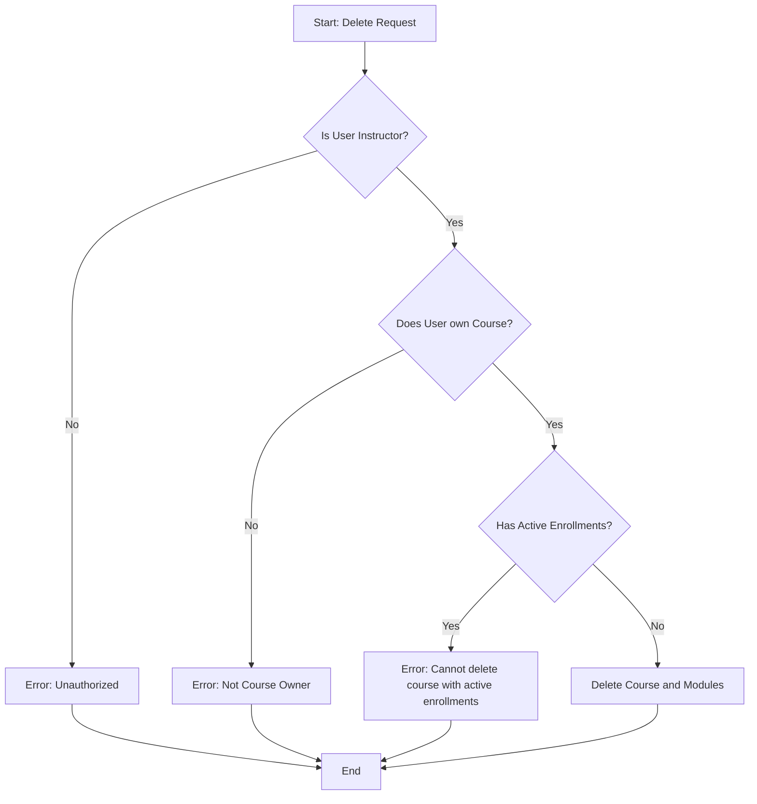
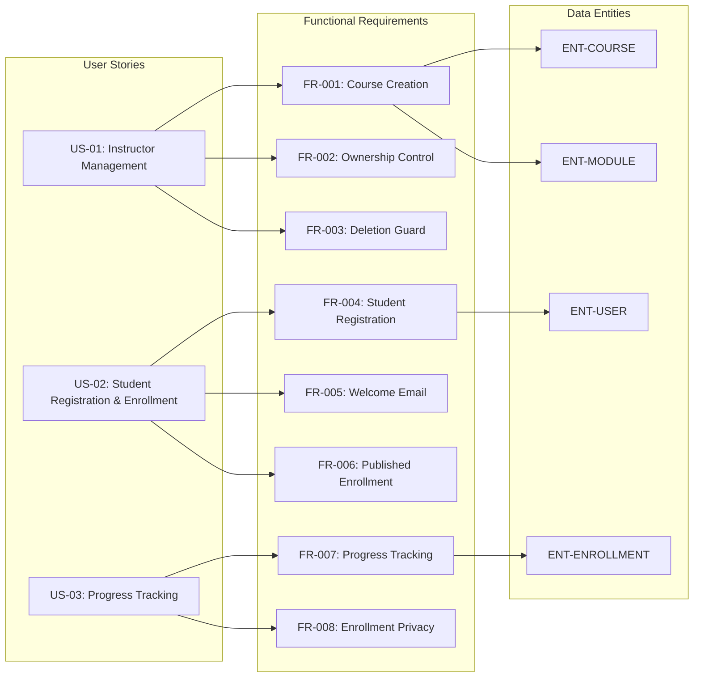

# CourseHub API - Technical Specification & Architecture Document

## 1. Executive Summary & Architecture Overview

### 1.1 Executive Brief
CourseHub API is a RESTful platform facilitating online learning by enabling instructors to create and manage structured courses and students to register, enroll, and track progress. The system implements a shared user identity model with role-based access control and integrates with Resend for automated student onboarding. The architecture centers on a strict ownership and enrollment tracking pattern to ensure data isolation between roles.

### 1.2 Maturity Assessment
The project is structurally sound and READY for execution. While the parser identified a medium-severity gap regarding the explicit definition of Out-of-Scope boundaries and a low-severity gap regarding open technical uncertainties, the functional requirements and success criteria are comprehensive enough to drive implementation without ambiguity.

### 1.3 Technical Stack
* **Architectural Style**: REST
* **Data Format**: JSON
* **Email Service**: Resend
* **API Versioning**: /api/v1/

### 1.4 Architectural Constraints
* Endpoints must be exposed under `/api/v1/`.
* JSON responses must follow the envelope: `{"data": ..., "meta": ..., "errors": []}`.
* Price must be strictly defined in cents.
* Enrollment progress values must be between 0 and 100 inclusive.
* Course deletion is strictly rejected if active enrollments exist.
* Modules must maintain a fixed sequence ordering.
* Students are restricted to enrolling only in published courses.
* Instructors are restricted to managing only courses they own.
* Students are restricted to accessing only their own enrollment records.
* Core course, enrollment, and authorization behaviors must have >= 90% E2E test coverage.

### 1.5 Critical Dependencies
* `RESEND_API_KEY` environment variable for welcome email delivery.
* Strong referential integrity between Enrollment, User, and Course entities.
* Cascading restriction: Course deletion dependent on absence of active Enrollments.
* Role-based access mapping within the shared User table to distinguish Instructor and Student permissions.

## 2. Architecture Workflows & Visual Diagrams

### 2.1 CourseHub Data Model

### 2.2 Student Registration & Enrollment Flow

### 2.3 Course Deletion Workflow

### 2.4 Requirements Traceability Matrix

## 3. Detailed Technical Specifications & Business Rules

### 3.1 Requirements Traceability
| ID | Type | Description | Linked US | Linked Entity |
| :--- | :--- | :--- | :--- | :--- |
| **FR-001** | Requirement | Allow instructors to create courses with title, description, price in cents, published flag, and ordered modules. | US-01 | ENT-COURSE, ENT-MODULE |
| **FR-002** | Requirement | Associate each course with a single instructor and restrict management actions to that instructor. | US-01 | - |
| **FR-003** | Requirement | Reject course deletion when the course has active enrolments and return a clear error message. | US-01 | - |
| **FR-004** | Requirement | Allow students to register with email and password and assign them the student role. | US-02 | ENT-USER |
| **FR-005** | Requirement | Send a welcome email through Resend after successful student registration. | US-02 | - |
| **FR-006** | Requirement | Allow students to enroll only in published courses. | US-02 | - |
| **FR-007** | Requirement | Track enrolment progress (0-100%) and record completion date at 100%. | US-03 | ENT-ENROLLMENT |
| **FR-008** | Requirement | Ensure students can view and update only their own enrolments. | US-03 | - |
| **FR-009** | Requirement | Expose REST endpoints under /api/v1/ with JSON envelope responses. | - | - |
| **FR-010** | Requirement | Use a shared user table with a role field to distinguish students and instructors. | - | ENT-USER |
| **FR-011** | Requirement | Preserve the defined ordering of modules within each course. | - | ENT-MODULE |
| **US-01** | User Story | Instructor can create, publish, and manage their own courses. | - | - |
| **US-02** | User Story | Student can register, receive welcome email, and enroll in published courses. | - | - |
| **US-03** | User Story | Students can update their own enrolment progress safely. | - | - |
| **SC-001** | Success Crit. | Instructor can publish a course and make it available in a single workflow. | - | - |
| **SC-002** | Success Crit. | Student can register, enroll, and update progress without accessing others' data. | - | - |
| **SC-003** | Success Crit. | >= 90% of core behaviors covered by automated E2E tests. | - | - |
| **SC-004** | Success Crit. | Consistent error returned when deleting course with active enrolments. | - | - |
| **ASM-01** | Assumption | Each course has one instructor owner; instructors may own multiple courses. | - | - |
| **ASM-02** | Assumption | Only published courses are available for enrollment in initial release. | - | - |
| **ASM-03** | Assumption | Accounts are created via API and authenticated via standard RBAC. | - | - |
| **ASM-04** | Assumption | Resend integration available via RESEND_API_KEY. | - | - |

### 3.2 Security Rules
* **Role-Based Access Control (RBAC)**: Users are distinguished by a `role` field in the shared `ENT-USER` table.
* **Ownership Enforcement**: Instructors are strictly prohibited from managing courses they do not own (`FR-002`).
* **Data Isolation**: Students are restricted to viewing and updating only their own enrollment records (`FR-008`).
* **Registration Security**: Password credentials must be stored using cryptographic hashing (Implicit).

### 3.3 Data Models
* **ENT-USER**: Shared account identity containing role, email, password credential, and display name.
* **ENT-COURSE**: Learning offering owned by an instructor, with title, description, price in cents, published status, and ordered modules.
* **ENT-MODULE**: Child record of a course representing a lesson or section in a fixed sequence.
* **ENT-ENROLLMENT**: Student-course relationship recording progress (0-100%) and completion date.

## 4. Project Governance & Structural Gaps

### 4.1 Structural Gaps
| Gap | Priority | Remediation Advice |
| :--- | :--- | :--- |
| Scope & Out-of-Scope | MEDIUM | Define what the API will NOT do (e.g., content delivery, payment processing, etc.) to avoid scope creep. |
| Open Questions & Uncertainties | LOW | List any technical uncertainties regarding Resend integration or role management. |

### 4.2 Remediation & Workflow
The identified gaps should be addressed during the transition from the Design phase to the Implementation phase. The "Out-of-Scope" definition is critical to prevent feature creep regarding payment gateways, as the current spec only defines "price in cents" without a payment processing workflow.

## 5. Technical & Domain Glossary (Terminology Reference)

| Term | Category | Context Anchor | Project Definition |
| :--- | :--- | :--- | :--- |
| API | TECHNICAL_STACK | FR-009 | The set of endpoints located under /api/v1/ providing programmatic access to learning platform resources. |
| Course | BUSINESS_DOMAIN | ENT-COURSE | A learning offering owned by an instructor, containing a title, description, price in cents, published status, and ordered modules. |
| Cryptographic Hashing | TECHNICAL_STACK | ENT-USER | The required security mechanism for storing password credentials within the shared identity table. |
| Enrollment | BUSINESS_DOMAIN | ENT-ENROLLMENT | A student-course relationship that records progress and completion date. |
| Fixed-Point Numeric Constraint | TECHNICAL_STACK | FR-001 | The requirement to store pricing exclusively in cents to avoid floating-point precision errors. |
| JSON | TECHNICAL_STACK | FR-009 | The mandatory data interchange format for all responses, following a specific envelope containing data, meta, and errors. |
| Module | BUSINESS_DOMAIN | ENT-MODULE | A child record of a learning offering representing a lesson or section in a fixed sequence. |
| REST | TECHNICAL_STACK | FR-009 | The architectural style governing the design of the network endpoints for the platform. |
| User | BUSINESS_DOMAIN | ENT-USER | A shared account identity containing a role, email, password credential, and display name. |