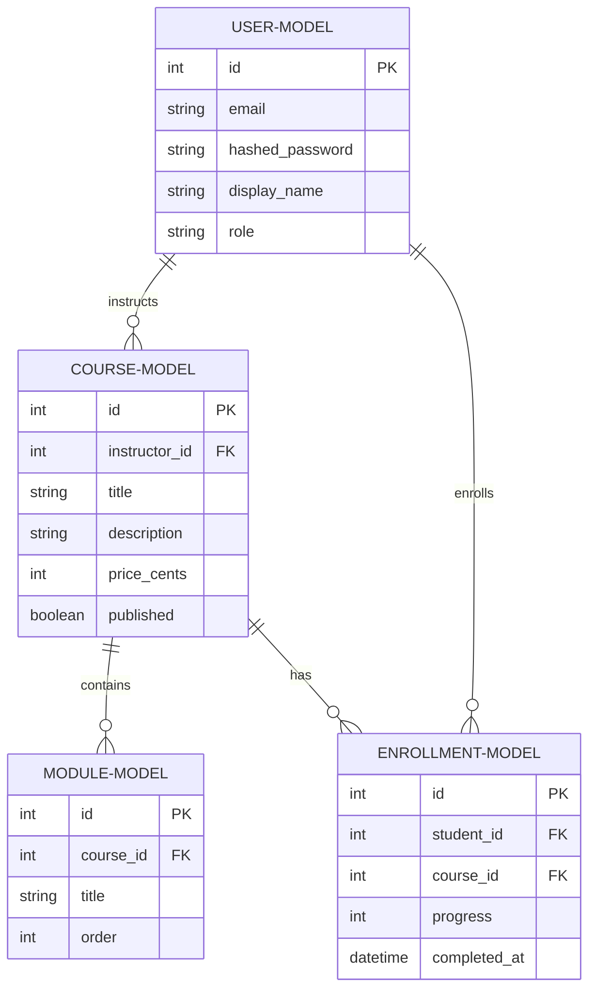
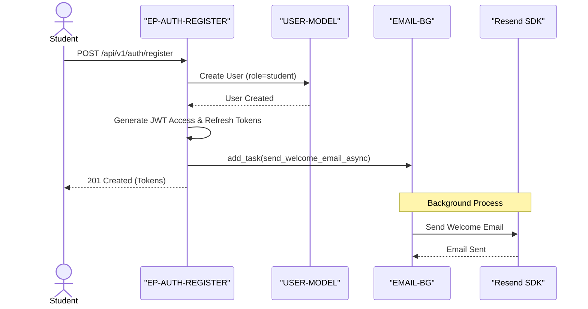
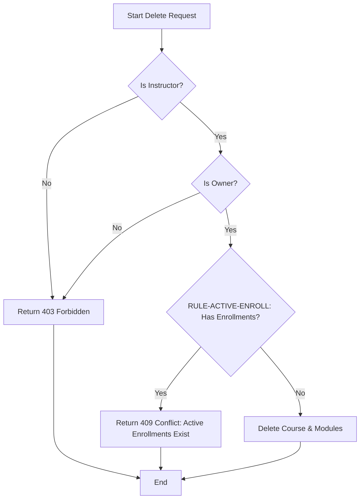
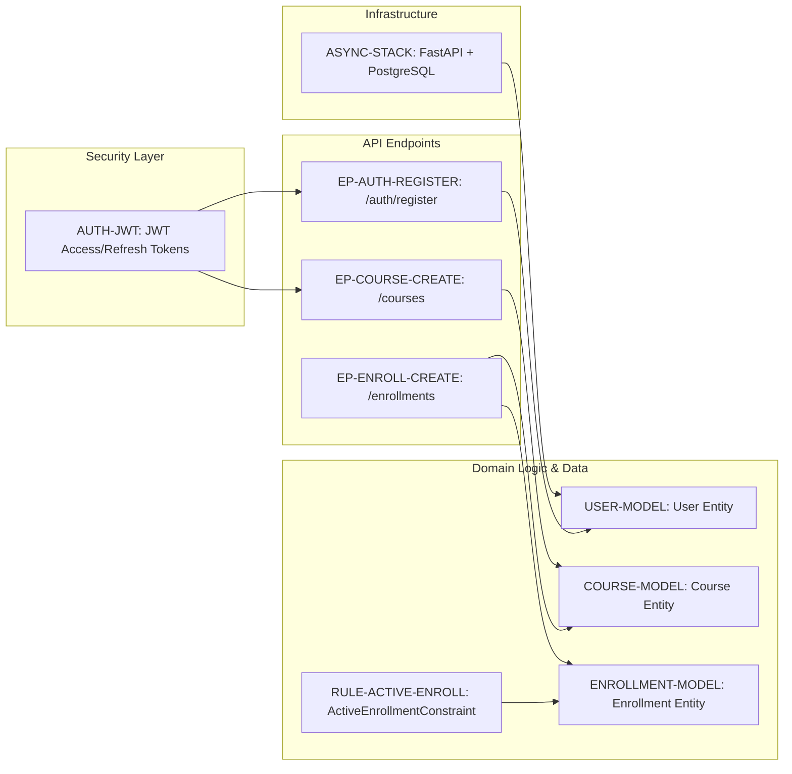

# CourseHub API - Technical Specification & Architecture Document

## 1. Executive Summary & Architecture Overview

### 1.1 Executive Brief
CourseHub API is a high-performance RESTful service built with FastAPI and PostgreSQL, implementing a role-based course management system. It utilizes an asynchronous architecture for database persistence and email dispatch to ensure non-blocking execution. The system enforces strict ownership boundaries between instructors and students, managed via JWT-based authentication and a structured domain routing layer.

### 1.2 Maturity Assessment
The specifications are technically robust with a high completeness score, though they require REFINEMENT. While the core logic and constraints are well-defined, the project lacks a consolidated data model schema and a formalized list of open uncertainties, particularly regarding refresh token revocation strategies and email template management.

### 1.3 Technical Stack
* **Framework**: FastAPI
* **ORM**: SQLAlchemy 2.0 (Async)
* **Database Driver**: asyncpg
* **Validation**: Pydantic v2
* **Migrations**: Alembic
* **Testing**: pytest, pytest-asyncio, pytest-cov, httpx
* **Security**: python-jose, passlib, python-multipart
* **External Services**: Resend SDK

### 1.4 Architectural Constraints
* **Coverage**: Business logic coverage must be >= 80%.
* **Progress Validation**: Enrollment progress values must be strictly between 0 and 100 inclusive.
* **Financial Data**: Course pricing must be stored as `price_cents` (integer).
* **Data Integrity**: Unique constraint on `(student_id, course_id)` for enrollments.
* **Auth Lifecycle**: Access tokens expire in 15 min; Refresh tokens expire in 7 days.
* **Isolation (Instructors)**: Instructors can only list, update, or delete courses they own (`instructor_id == current_user.id`).
* **Isolation (Students)**: Students can only access and update their own enrollments (`student_id == current_user.id`).
* **Business Rule**: `ActiveEnrollmentConstraint` - Course deletion rejected (409 Conflict) if active enrollments exist.
* **Sequence**: Module ordering must be strictly enforced via the `order` field.

### 1.5 Critical Dependencies
* `RESEND_API_KEY` environment variable for email dispatch.
* PostgreSQL instance with `asyncpg` driver support.
* JWT for session management and role-based access control.
* Cascading deletion of modules upon course deletion (via Foreign Key).
* Strict foreign key dependence: Enrollment relies on both User and Course entities.
* FastAPI `BackgroundTask` for non-blocking Resend SDK integration.

## 2. Architecture Workflows & Visual Diagrams

### 2.1 CourseHub API Data Model

### 2.2 User Registration & Welcome Flow

### 2.3 Course Deletion Workflow

### 2.4 Requirements Traceability Map

## 3. Detailed Technical Specifications & Business Rules

### 3.1 Requirements Traceability
| Identifier | Type | Description | Source Section |
| :--- | :--- | :--- | :--- |
| ASYNC-STACK | Architecture Choice | FastAPI + PostgreSQL with async SQLAlchemy 2.0 and asyncpg | Phase 1 |
| USER-MODEL | Entity | User: email, hashed_password, display_name, role (student\|instructor) | Phase 1 |
| COURSE-MODEL | Entity | Course: instructor_id (FK), title, description, price_cents, published | Phase 1 |
| MODULE-MODEL | Entity | Module: course_id (FK), title, order | Phase 1 |
| ENROLLMENT-MODEL | Entity | Enrollment: student_id (FK), course_id (FK), progress, completed_at; Unique(student_id, course_id) | Phase 1 |
| AUTH-JWT | Architecture Choice | JWT Access Tokens (15 min) and Refresh Tokens (7 days) | Phase 2 |
| EP-AUTH-REGISTER | Endpoint | POST /api/v1/auth/register: Student registration and token issuance | Phase 2 |
| EP-AUTH-LOGIN | Endpoint | POST /api/v1/auth/login: Token issuance via email/password | Phase 2 |
| EMAIL-BG | Task | Asynchronous welcome email via Resend SDK using FastAPI BackgroundTask | Phase 3 |
| EP-COURSE-CREATE | Endpoint | POST /api/v1/courses: Course and Module creation in one transaction | Phase 4 |
| RULE-ACTIVE-ENROLL | Decision | ActiveEnrollmentConstraint: Block course deletion if active enrollments exist (409 Conflict) | Phase 4 |
| EP-ENROLL-CREATE | Endpoint | POST /api/v1/enrollments: Student enrollment in published courses | Phase 5 |
| TEST-SUITE | Task | Pytest suite with async support, test DB, and 80%+ coverage target | Phase 6 |

### 3.2 Security Rules
* **Authentication**: Stateless JWT implementation. Access tokens (15m) for requests, Refresh tokens (7d) for session extension.
* **Authorization**: Role-Based Access Control (RBAC) using dependencies:
    * `get_current_user`: Validates token and returns User object.
    * `get_current_instructor`: Asserts `role == "instructor"`.
    * `get_current_student`: Asserts `role == "student"`.
* **Password Safety**: One-way cryptographic hashing via `passlib` before storage.
* **Ownership Verification**: All `PUT` and `DELETE` operations on courses and enrollments must verify that the `current_user.id` matches the resource owner ID.

### 3.3 Data Models
* **User**: Primary identity table. Roles are restricted to "student" or "instructor".
* **Course**: Owned by an instructor. Includes a `published` flag to control student visibility.
* **Module**: Child of Course. Includes an `order` integer to maintain sequential structure.
* **Enrollment**: Join table between User (student) and Course. Tracks `progress` (0-100) and `completed_at` timestamp.

## 4. Project Governance & Structural Gaps

### 4.1 Structural Gaps
| Gap | Priority | Remediation Advice |
| :--- | :--- | :--- |
| Data Models & Schemas | LOW | While models are defined in Phase 1 and schemas in others, a dedicated consolidated Data Models & Schemas section would improve clarity. |
| Open Questions & Uncertainties | LOW | The 'Further Considerations' section contains some uncertainties, but a formalized gap list is missing. |

### 4.2 Remediation & Workflow
1. **Consolidation**: Merge Pydantic schemas and SQLAlchemy models into a single reference document.
2. **Decision Log**: Address the following open questions:
    * Refresh token persistence for revocation support.
    * Externalization of email templates (Resend dashboard vs. local files).
    * Implementation of bulk update endpoints for module reordering.

## 5. Technical & Domain Glossary (Terminology Reference)

| Term | Category | Context Anchor | Project Definition |
| :--- | :--- | :--- | :--- |
| API | TECHNICAL_STACK | Plan: CourseHub API Implementation | The RESTful interface leveraging FastAPI to expose educational management endpoints. |
| ActiveEnrollmentConstraint | BUSINESS_DOMAIN | RULE-ACTIVE-ENROLL | A validation rule preventing the removal of educational content when linked to existing student subscriptions, triggering a 409 status. |
| Async throughout | TECHNICAL_STACK | ASYNC-STACK | The architectural mandate to use non-blocking I/O for all persistence and network operations. |
| AsyncClient | TECHNICAL_STACK | TEST-SUITE | The asynchronous HTTP testing utility used for verifying endpoint responses. |
| AsyncSession | TECHNICAL_STACK | Phase 1: Project Foundation & Database Schema | The non-blocking database connection context provided via dependency injection. |
| Auth first | TECHNICAL_STACK | AUTH-JWT | The implementation priority ensuring identity and access layers are established before domain logic. |
| Background email | TECHNICAL_STACK | EMAIL-BG | The deferral of transactional notifications to a post-response execution thread. |
| BackgroundTask | TECHNICAL_STACK | EMAIL-BG | The FastAPI utility used to trigger the Resend notification service without blocking the main response. |
| BusinessRuleViolation | TECHNICAL_STACK | Phase 7: Response Envelope & Error Handling | A specific exception raised when a domain constraint, such as existing subscriptions during deletion, is breached. |
| CORS Standard | TECHNICAL_STACK | Phase 7: Response Envelope & Error Handling | The cross-origin resource sharing protocol required for browser-based client interaction. |
| CRUD | TECHNICAL_STACK | Phase 4: Courses Router — CRUD with Ownership | The four foundational persistent storage mutation primitives. |
| ConfigError | TECHNICAL_STACK | Phase 3: Resend Email Integration as Service | An exception triggered by missing environmental variables, specifically for the external mail key. |
| Course | BUSINESS_DOMAIN | COURSE-MODEL | An educational entity containing a title, price, and associated instructional modules. |
| CourseCreate | TECHNICAL_STACK | Phase 4: Courses Router — CRUD with Ownership | The Pydantic input model for establishing new educational content and its initial modules. |
| CourseResponse | TECHNICAL_STACK | Phase 4: Courses Router — CRUD with Ownership | The data transfer object returning educational content details including associated modules. |
| CourseUpdate | TECHNICAL_STACK | Phase 4: Courses Router — CRUD with Ownership | The Pydantic model for modifying existing educational content attributes. |
| Cryptographic Hashing | TECHNICAL_STACK | Phase 2: Auth Router — JWT & Refresh Token Flow | The one-way transformation process applied to passwords using passlib. |
| DB | TECHNICAL_STACK | Phase 1: Project Foundation & Database Schema | The PostgreSQL relational storage engine used for all persistence. |
| DR | TECHNICAL_STACK | Phase 6: Testing & Verification | The disaster recovery or data restoration strategy for test environment fixtures. |
| Enrollment | BUSINESS_DOMAIN | ENROLLMENT-MODEL | A link between a student and a course tracking learning progress from 0 to 100. |
| EnrollmentCreate | TECHNICAL_STACK | Phase 5: Enrolments Router — Student Access & Progress | The Pydantic model used to request access to a specific educational entity. |
| EnrollmentResponse | TECHNICAL_STACK | Phase 5: Enrolments Router — Student Access & Progress | The data transfer object describing the status and completion date of a student's course access. |
| EnrollmentUpdate | TECHNICAL_STACK | Phase 5: Enrolments Router — Student Access & Progress | The Pydantic model for adjusting the completion percentage and end date of learning. |
| FK | TECHNICAL_STACK | Phase 1: Project Foundation & Database Schema | The relational constraint linking a child table column to a primary key in a parent table. |
| JWT | TECHNICAL_STACK | AUTH-JWT | The signed token standard used for stateless authentication and role verification. |
| Middleware | TECHNICAL_STACK | Phase 7: Response Envelope & Error Handling | The request/response interception layer used to wrap all outputs in a standard envelope. |
| Module | BUSINESS_DOMAIN | MODULE-MODEL | A titled sub-unit of an educational course with a specific sequential order. |
| ModuleCreate | TECHNICAL_STACK | Phase 4: Courses Router — CRUD with Ownership | The Pydantic model for defining the title and order of a course component. |
| ModuleResponse | TECHNICAL_STACK | Phase 4: Courses Router — CRUD with Ownership | The data transfer object returning the identity and sequence of a course component. |
| NAMED | TECHNICAL_STACK | RULE-ACTIVE-ENROLL | The practice of assigning a specific alphanumeric identifier to a business logic constraint for traceability. |
| NOT | TECHNICAL_STACK | Phase 2: Auth Router — JWT & Refresh Token Flow | The logical negation applied to registration flows to prevent premature notification triggers. |
| ORM | TECHNICAL_STACK | ASYNC-STACK | The object-relational mapping layer provided by SQLAlchemy 2.0 to abstract raw queries. |
| PermissionError | TECHNICAL_STACK | Phase 4: Courses Router — CRUD with Ownership | An exception raised when an actor attempts to modify a resource they do not own. |
| REST | TECHNICAL_STACK | Plan: CourseHub API Implementation | The architectural style utilizing standard HTTP methods for state transfer. |
| RULE | BUSINESS_DOMAIN | RULE-ACTIVE-ENROLL | A deterministic logic check that must be satisfied before a state change is permitted. |
| SDK | TECHNICAL_STACK | Phase 3: Resend Email Integration as Service | The external library provided by Resend to facilitate mail delivery. |
| SQL | TECHNICAL_STACK | ASYNC-STACK | The structured query language implicitly managed by the ORM for data persistence. |
| SQLAlchemy 2.0 | TECHNICAL_STACK | ASYNC-STACK | The specific version of the database toolkit implementing async support. |
| TL | TECHNICAL_STACK | TL;DR | The high-level executive summary of the technical implementation strategy. |
| Target | TECHNICAL_STACK | TEST-SUITE | The 80% minimum threshold for logic coverage during verification. |
| TokenResponse | TECHNICAL_STACK | Phase 2: Auth Router — JWT & Refresh Token Flow | The Pydantic model returning access and refresh credentials upon successful authentication. |
| User | BUSINESS_DOMAIN | USER-MODEL | An identity in the system acting as either a student or an instructor. |
| UserLogin | TECHNICAL_STACK | Phase 2: Auth Router — JWT & Refresh Token Flow | The Pydantic input model for verifying identity via email and password. |
| UserRegister | TECHNICAL_STACK | Phase 2: Auth Router — JWT & Refresh Token Flow | The Pydantic model for creating a new identity with a student role. |
| UserResponse | TECHNICAL_STACK | Phase 2: Auth Router — JWT & Refresh Token Flow | The data transfer object returning sanitized profile information. |
| ValueError | TECHNICAL_STACK | Phase 5: Enrolments Router — Student Access & Progress | An exception raised when input data, such as progress, falls outside the 0-100 range. |