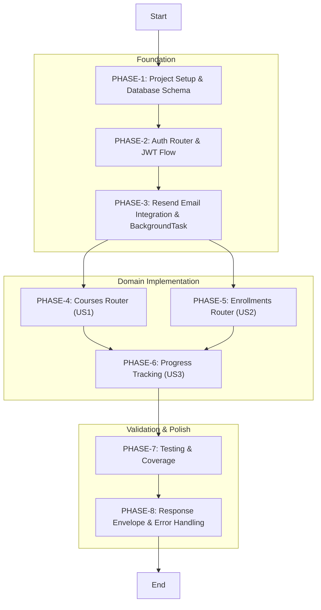
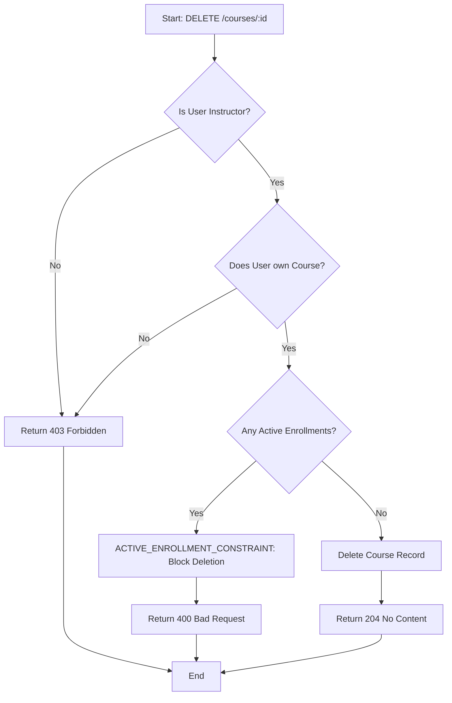
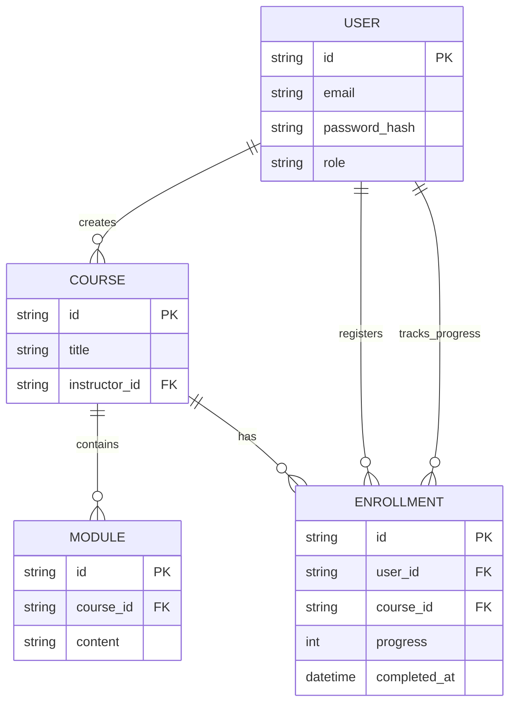
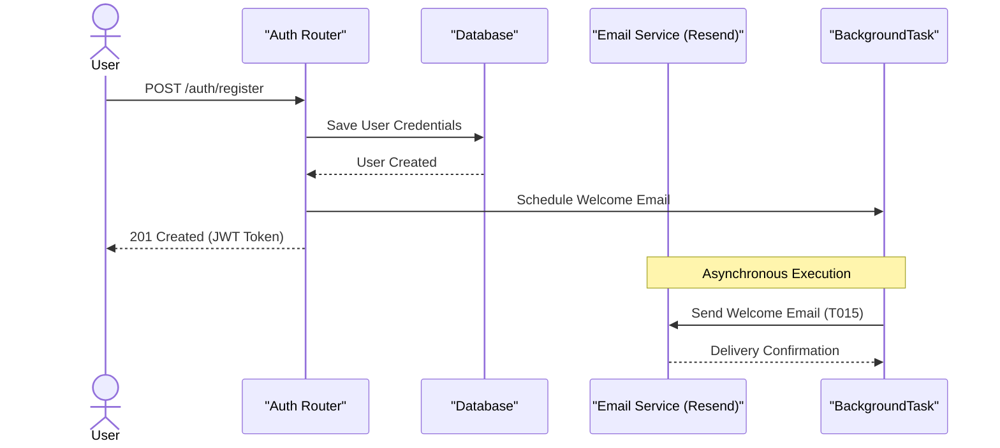

# CourseHub API - Technical Specification & Architecture Document

## 1. Executive Summary & Architecture Overview

### 1.1 Executive Brief
CourseHub API is a course management system providing secure academic workflows, featuring instructor-led content creation and student progress tracking. Hosted as a FastAPI-based service, it implements a role-based access control pattern to isolate student data and enforce strict course ownership and enrollment dependencies.

### 1.2 Maturity Assessment
The specifications demonstrate high structural integrity with all core phases from setup to polish clearly mapped. While a minor gap exists regarding explicit edge-case documentation for the email service, the comprehensive task list and defined success criteria render the project READY for execution.

### 1.3 Technical Stack
* FastAPI
* JWT
* PostgreSQL
* Resend
* Pytest

### 1.4 Architectural Constraints
* Refresh token expiration: 7 days.
* Business logic test coverage: >= 80%.
* Course deletion: Forbidden if active enrollments exist.
* Data Isolation: Students strictly forbidden from updating other students' progress (403).
* Progress logic: Progress == 100 must trigger auto-set of completed_at.
* Testing constraint: Zero mocking of PostgreSQL; requires real test instance.
* Response structure: Consistent global APIResponse envelope across all endpoints.

### 1.5 Critical Dependencies
* **RESEND_API_KEY**: Mandatory environment variable required at startup (raises ConfigError if missing).
* **JWT**: Core dependency for auth flow and role-based access control.
* **PostgreSQL**: Required for persistence and real-instance integration testing.
* **Referential Integrity**: Strict dependency between Course and Enrollment entities for deletion constraints.
* **Phase Sequence**: Linear dependency chain from Setup -> Auth -> Email before domain implementation.

## 2. Architecture Workflows & Visual Diagrams

### 2.1 Implementation Roadmap
Visualizes the dependency-ordered phases of the API implementation, including the parallel development of domain features and the final polish stages.

### 2.2 Course Deletion Logic Flow
Detailed workflow for the Course deletion process, implementing the ACTIVE_ENROLLMENT_CONSTRAINT logic.

### 2.3 CourseHub Data Model
Entity Relationship Diagram based on the ORM models defined in T005.

### 2.4 User Registration & Welcome Flow
Sequence of interactions for user registration involving the Auth router and the Resend email background service.

## 3. Detailed Technical Specifications & Business Rules

### 3.1 Requirements Traceability
| ID | Requirement / Task Description | Phase | Status/Constraint |
| :--- | :--- | :--- | :--- |
| PHASE-1 | Project Setup & Database Schema | Phase 1 | Foundation |
| T001 | Create project structure: app/, app/core/, etc. | Phase 1 | Implementation |
| T005 | Define ORM models: User, Course, Module, Enrollment | Phase 1 | Implementation |
| PHASE-2 | Auth Router & JWT Flow | Phase 2 | Foundation |
| T009 | Create security utilities (JWT, hashing) | Phase 2 | Implementation |
| T013 | Implement /auth/register, /auth/login, /auth/refresh | Phase 2 | Implementation |
| PHASE-3 | Resend Email Integration & BackgroundTask | Phase 3 | Integration |
| T015 | Implement async welcome email service using Resend SDK | Phase 3 | Implementation |
| PHASE-4 | Courses Router — Instructor Management (US1) | Phase 4 | Domain |
| T020 | Implement Course CRUD endpoints for instructors | Phase 4 | Implementation |
| ACTIVE_ENROLLMENT_CONSTRAINT | Prevent course deletion if active enrollments exist | Phase 4 | Business Rule |
| PHASE-5 | Enrollments Router — Student Discovery & Enrollment (US2) | Phase 5 | Domain |
| T023 | Implement enrollment endpoints for students | Phase 5 | Implementation |
| PHASE-6 | Progress Tracking & Data Isolation (US3) | Phase 6 | Domain |
| T025 | Implement student data isolation checks | Phase 6 | Implementation |
| PHASE-7 | Testing & Coverage | Phase 7 | QA |
| TC-E2E | End-to-end workflow: Register -> Create Course -> Enroll -> Progress | Phase 7 | Validation |
| PHASE-8 | Response Envelope & Error Handling | Phase 8 | Polish |
| T033 | Implement global exception handler and APIResponse envelope | Phase 8 | Implementation |
| AC-COVERAGE | 80%+ coverage on business logic | Success Criteria | Acceptance |

### 3.2 Security Rules
* **Authentication**: Stateless JWT-based authentication.
* **Authorization**: Role-Based Access Control (RBAC) to distinguish between Instructors and Students.
* **Data Isolation**: Strict enforcement of ownership; students are forbidden from modifying progress data belonging to other users (HTTP 403).
* **Input Validation**: Global exception handler to ensure consistent error response envelopes.

### 3.3 Data Models
The system utilizes an ORM-based PostgreSQL schema consisting of:
* **User**: Identity and role management.
* **Course**: Content metadata and instructor ownership.
* **Module**: Granular content units linked to courses.
* **Enrollment**: Junction table tracking student-course relationships and progress.

## 4. Project Governance & Structural Gaps

### 4.1 Structural Gaps
| Gap ID | Missing Section / Issue | Priority | Remediation Advice |
| :--- | :--- | :--- | :--- |
| GAP-01 | Open Questions & Uncertainties | LOW | The document is very detailed; however, no specific open questions were listed. Check if any edge cases for the Resend API are unknown. |

### 4.2 Remediation & Workflow
The project follows a linear dependency chain: `Setup` $\rightarrow$ `Auth` $\rightarrow$ `Email` $\rightarrow$ `Domain (US1, US2)` $\rightarrow$ `Progress (US3)` $\rightarrow$ `Testing` $\rightarrow$ `Polish`. Any gaps identified in the Resend API integration should be resolved during Phase 3 before proceeding to Domain development.

## 5. Technical & Domain Glossary (Terminology Reference)

| Term | Category | Context Anchor | Project Definition |
| :--- | :--- | :--- | :--- |
| API | TECHNICAL_STACK | T033 | The programmatic interface providing structured response envelopes for course management operations. |
| All | BUSINESS_DOMAIN | Success Criteria | The complete set of 36 mandated implementation tasks required for system validation. |
| AsyncSession | TECHNICAL_STACK | PHASE-1 | The non-blocking database connection handler managed within the project initialization lifecycle. |
| BackgroundTask | TECHNICAL_STACK | PHASE-3 | The asynchronous execution mechanism used for dispatching transactional email notifications. |
| CORS Standard | TECHNICAL_STACK | PHASE-8 | The cross-origin resource sharing security policy governing browser-based request accessibility. |
| CRUD | TECHNICAL_STACK | T020 | The four foundational persistent storage mutation primitives applied to course entities. |
| ConfigError | TECHNICAL_STACK | T015 | The exception triggered during startup when mandatory external service keys are absent. |
| Feature | BUSINESS_DOMAIN | Tasks: CourseHub API Implementation | The high-level functional capability identified as 001-coursehub-api. |
| ISOlation | BUSINESS_DOMAIN | T025 | The security boundary ensuring a learner cannot modify or access another user's progress data. |
| JWT | TECHNICAL_STACK | T009 | The signed token standard used for stateless authentication and session expiry claims. |
| MVP | BUSINESS_DOMAIN | MVP Scope (Phase 1 Delivery) | The initial deliverable subset comprising phases 1-5 and phase 7. |
| ORM | TECHNICAL_STACK | T005 | The object-relational mapping layer defining the structure for User, Course, Module, and Enrollment. |
| Reference | TECHNICAL_STACK | Tasks: CourseHub API Implementation | The external documentation links including spec.md and plan.md. |
| SDK | TECHNICAL_STACK | T015 | The external software development kit used to integrate the Resend email platform. |