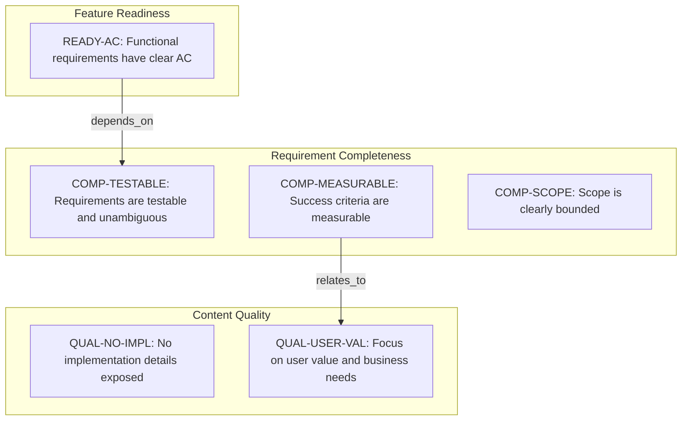
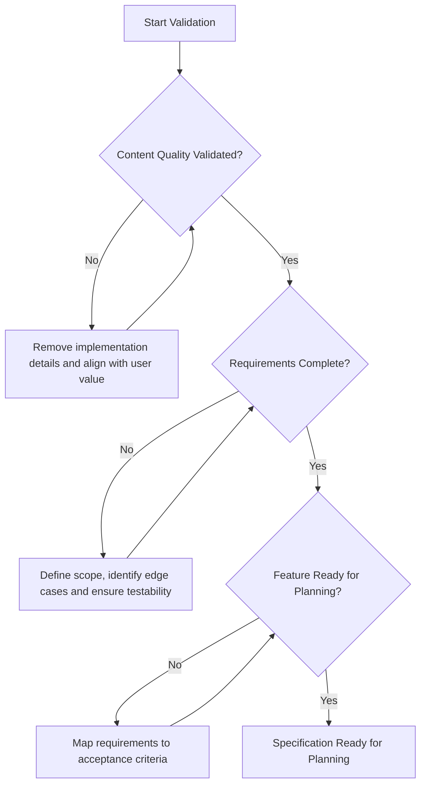

# CourseHub API - Technical Specification & Architecture Document

## 1. Executive Summary & Architecture Overview

### 1.1 Executive Brief
The CourseHub API project is currently represented by a quality validation framework designed to ensure specification completeness and readiness. The system focuses on decoupling business value from implementation details, ensuring that all functional requirements are testable, measurable, and bounded by clear acceptance criteria before proceeding to the planning phase.

### 1.2 Maturity Assessment
The project is currently in a state of REFINEMENT. While the quality checklist indicates a high level of internal validation, the actual architectural substance—including scope definitions and technical specifications—is absent from the current graph, residing instead in external references. The presence of high-severity structural gaps regarding scope and out-of-scope boundaries prevents a READY status.

### 1.3 Technical Stack
*   No specific languages, frameworks, or databases defined in the current validation scope.

### 1.4 Architectural Constraints
*   Strict prohibition of implementation leakage (languages, frameworks, APIs) within feature definitions.
*   Requirement for technology-agnostic success criteria.
*   Mandatory alignment between functional requirements and measurable outcomes.
*   Requirement for unambiguous and testable acceptance scenarios for all primary user flows.

### 1.5 Critical Dependencies
*   External reference to `spec.md` for core functional definitions.
*   Logical dependency between Acceptance Criteria (`READY-AC`) and Requirement Testability (`COMP-TESTABLE`).
*   Relational link between Measurable Success Criteria (`COMP-MEASURABLE`) and User Value focus (`QUAL-USER-VAL`).

## 2. Architecture Workflows & Visual Diagrams

### 2.1 CourseHub API Specification Quality Traceability
Maps the relationship between quality constraints, completeness requirements, and feature readiness for the CourseHub API specification.

### 2.2 Specification Validation Workflow
The operational process for validating the CourseHub API specification based on the provided checklist criteria.

## 3. Detailed Technical Specifications & Business Rules

### 3.1 Requirements Traceability
| Identifier | Type | Description | Source Section | Status |
| :--- | :--- | :--- | :--- | :--- |
| QUAL-NO-IMPL | Constraint | No implementation details (languages, frameworks, APIs) are exposed in the feature definition. | Content Quality | validated |
| QUAL-USER-VAL | Constraint | The specification focuses on user value and business needs. | Content Quality | validated |
| COMP-TESTABLE | Requirement | Requirements are testable and unambiguous. | Requirement Completeness | validated |
| COMP-MEASURABLE | Success Criterion | Success criteria are measurable and technology-agnostic. | Requirement Completeness | validated |
| COMP-SCOPE | Requirement | Scope is clearly bounded. | Requirement Completeness | validated |
| READY-AC | Requirement | All functional requirements have clear acceptance criteria. | Feature Readiness | validated |

### 3.2 Security Rules
*   No specific security rules defined in the current validation scope.

### 3.3 Data Models
*   No specific data models defined in the current validation scope.

## 4. Project Governance & Structural Gaps

### 4.1 Structural Gaps
| Missing Section | Priority | Remediation Advice |
| :--- | :--- | :--- |
| Scope & Out-of-Scope | HIGH | The document is a checklist; the actual scope definition is likely in the referenced 'spec.md' file. |
| Open Questions & Uncertainties | MEDIUM | No open questions were listed as the checklist indicates all items are complete. |

### 4.2 Remediation & Workflow
The project must integrate the content of the external `spec.md` into the central technical specification to resolve high-priority gaps and move from the REFINEMENT phase to a READY status.

## 5. Technical & Domain Glossary (Terminology Reference)

| Term | Category | Context Anchor | Project Definition |
| :--- | :--- | :--- | :--- |
| API | TECHNICAL_STACK | QUAL-NO-IMPL | The programmatic interface whose implementation details must remain hidden from the high-level functional definitions to prevent leakage. |
| Feature | BUSINESS_DOMAIN | READY-AC | A distinct unit of functionality that must align with measurable outcomes and possess clear acceptance criteria. |