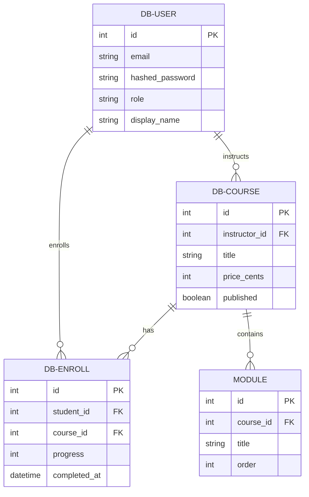
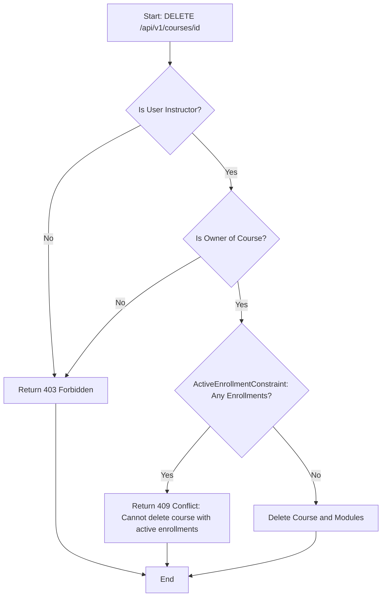
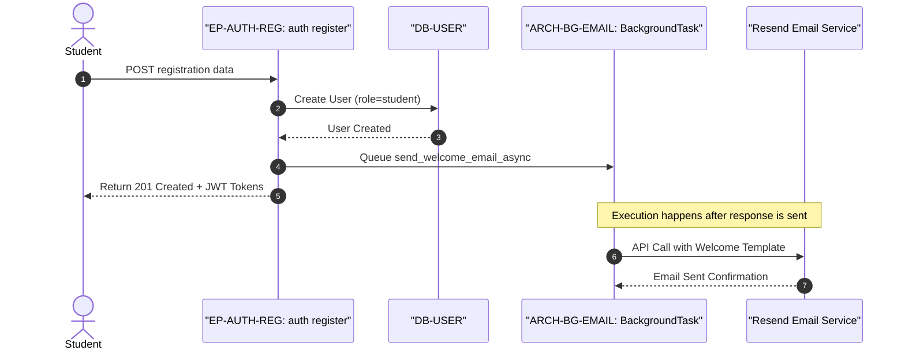
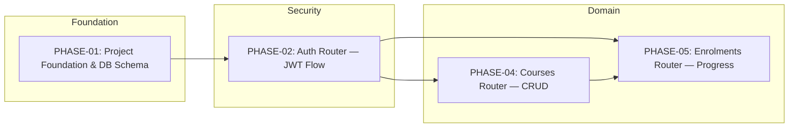

# CourseHub API - Technical Specification & Architecture Document

## 1. Executive Summary & Architecture Overview

### 1.1 Executive Brief
CourseHub API is a FastAPI-based RESTful service leveraging PostgreSQL for course management and student enrollments. The architecture implements a strict role-based access control (RBAC) system via JWT and refresh tokens, ensuring a clear trust boundary between students and instructors. The system utilizes an asynchronous data pattern with SQLAlchemy 2.0 and asyncpg to maintain non-blocking I/O, integrating Resend for asynchronous email notifications via FastAPI BackgroundTasks.

### 1.2 Maturity Assessment
The specifications are highly comprehensive with a complete structural mapping of the development phases, leading to a REFINEMENT status. While the architectural blueprint and data models are fully defined, the presence of unresolved uncertainties regarding refresh token persistence and email template externalization requires final design decisions before full execution.

### 1.3 Technical Stack
* **Framework**: FastAPI
* **ORM**: SQLAlchemy 2.0 (Async)
* **Database Driver**: asyncpg
* **Database**: PostgreSQL
* **Validation**: Pydantic v2
* **Migrations**: Alembic
* **Testing**: pytest, pytest-asyncio, pytest-cov, httpx
* **Security**: python-jose, passlib
* **Utilities**: python-multipart
* **Email Service**: Resend SDK

### 1.4 Architectural Constraints
* **Async-Only Persistence**: All database interactions must utilize non-blocking I/O via `AsyncSession` and `await` keywords; raw SQL is prohibited.
* **Non-Blocking Registration**: Email dispatch must be deferred to a `BackgroundTask` to prevent external service latency from blocking the registration API response.
* **Role-Based Gating**: Strict RBAC must be enforced; domain routers (Courses, Enrollments) are dependent on the successful implementation of the Auth router.
* **Data Integrity**: Course deletion is rejected (HTTP 409) if active enrollments exist (`ActiveEnrollmentConstraint`).
* **Validation Bounds**: Enrollment progress values must be strictly between 0 and 100 inclusive.
* **Ownership Isolation**: Only the instructor who created a course can update or delete it; students can only access/update their own enrollments.
* **Course Visibility**: Students can only enroll in courses where the `published` flag is set to true.
* **Quality Gate**: Minimum 80% code coverage on business logic via `pytest-cov`.

### 1.5 Critical Dependencies
* **RESEND_API_KEY**: Mandatory environment variable for email service functionality.
* **PostgreSQL**: External database engine required for all persistence.
* **JWT**: Core dependency for authentication, session management, and role extraction.
* **Cascading Deletion**: Course deletion must trigger the removal of associated Modules via Foreign Key constraints.
* **Referential Integrity**: Enrollment entities depend on the existence of both User (student) and Course entities.

## 2. Architecture Workflows & Visual Diagrams

### 2.1 CourseHub API Data Model

### 2.2 Course Deletion Workflow

### 2.3 User Registration & Email Sequence

### 2.4 Implementation Phase Traceability

## 3. Detailed Technical Specifications & Business Rules

### 3.1 Requirements Traceability
| Identifier | Component | Description | Source/Phase |
| :--- | :--- | :--- | :--- |
| PHASE-01 | Project Foundation | Project structure, DB initialization, and core models setup | Phase 1 |
| DB-USER | Entity | User model supporting roles: "student" or "instructor" | Phase 1 |
| DB-COURSE | Entity | Course model linked to instructor with pricing and publication status | Phase 1 |
| DB-ENROLL | Entity | Enrollment model with unique(student_id, course_id) constraint | Phase 1 |
| ARCH-ASYNC | Architecture | Use of Async SQLAlchemy 2.0 and asyncpg for all DB interactions | Decisions |
| PHASE-02 | Auth Router | Implementation of JWT and Refresh Token flow | Phase 2 |
| EP-AUTH-REG | Endpoint | `POST /api/v1/auth/register` - Student registration | Phase 2 |
| ARCH-BG-EMAIL | Architecture | FastAPI BackgroundTask for Resend email integration | Phase 3 |
| PHASE-04 | Courses Router | CRUD operations with ownership verification | Phase 4 |
| RULE-ACTIVE-ENROLL | Business Rule | `ActiveEnrollmentConstraint`: Prevent course deletion if enrollments exist (409) | Phase 4 |
| EP-COURSE-DEL | Endpoint | `DELETE /api/v1/courses/{course_id}` - Instructor only | Phase 4 |
| PHASE-05 | Enrolments Router | Student access and progress tracking | Phase 5 |
| EP-ENROLL-POST | Endpoint | `POST /api/v1/enrollments` - Enroll in published course | Phase 5 |
| TASK-TEST-COVERAGE | Task | Achieve 80%+ coverage on business logic using pytest-cov | Phase 6 |

### 3.2 Security Rules
* **Authentication**: Stateless session management using JWT (Access Token: 15 min, Refresh Token: 7 days).
* **Authorization**: 
    * `get_current_instructor`: Asserts `role == "instructor"`.
    * `get_current_student`: Asserts `role == "student"`.
* **Password Security**: Passwords must be hashed using `passlib` before storage.
* **Access Control**: 
    * Course updates/deletions require ownership verification (`instructor_id == current_user.id`).
    * Enrollment access/updates require student ownership verification (`student_id == current_user.id`).

### 3.3 Data Models
* **User**: `id`, `email`, `hashed_password`, `display_name`, `role` ("student" | "instructor"), `created_at`.
* **Course**: `id`, `instructor_id` (FK $\rightarrow$ User), `title`, `description`, `price_cents`, `published`, `created_at`, `updated_at`.
* **Module**: `id`, `course_id` (FK $\rightarrow$ Course), `title`, `order`, `created_at`.
* **Enrollment**: `id`, `student_id` (FK $\rightarrow$ User), `course_id` (FK $\rightarrow$ Course), `progress` (0-100), `completed_at`, `created_at`, `updated_at`.

## 4. Project Governance & Structural Gaps

### 4.1 Structural Gaps
No critical structural gaps identified in the current implementation plan. The mapping from foundation to testing is linear and logically sequenced.

### 4.2 Remediation & Workflow
The following open questions must be resolved to finalize the design:
1. **Refresh Token Persistence**: Determine if refresh tokens should be stored in a database table to support explicit revocation, rather than relying solely on JWT expiration.
2. **Email Templating**: Decide whether to move hardcoded email bodies to external template files or utilize Resend's native template management.
3. **Module Reordering**: Define if a bulk update endpoint is required for modifying the `order` column of modules post-creation.

## 5. Technical & Domain Glossary (Terminology Reference)

| Term | Category | Context Anchor | Project Definition |
| :--- | :--- | :--- | :--- |
| API | TECHNICAL_STACK | TL;DR | The RESTful interface built with FastAPI providing endpoints for authentication, educational content management, and student registration. |
| Achieve | TECHNICAL_STACK | TASK-TEST-COVERAGE | The quantitative goal of reaching 80% or more test coverage on the business logic layer using pytest-cov. |
| ActiveEnrollmentConstraint | BUSINESS_DOMAIN | RULE-ACTIVE-ENROLL | A validation rule that prevents the removal of an educational offering if students are currently linked to it, triggering a 409 Conflict response. |
| Async throughout | TECHNICAL_STACK | ARCH-ASYNC | The architectural requirement that all database interactions must utilize non-blocking I/O via AsyncSession and await keywords. |
| AsyncClient | TECHNICAL_STACK | Phase 6: Testing & Verification | A non-blocking HTTP client used within pytest fixtures to simulate requests to the application. |
| AsyncSession | TECHNICAL_STACK | PHASE-01 | The database session factory context used to manage asynchronous transactions and unit-of-work patterns. |
| Auth first | TECHNICAL_STACK | TL;DR | A development strategy prioritizing the security layer to establish trust boundaries and role-based access control before domain logic implementation. |
| Auth layer | TECHNICAL_STACK | PHASE-02 | The security subsystem comprising token generation, verification, and password hashing logic. |
| Background email | TECHNICAL_STACK | ARCH-BG-EMAIL | The offloading of transactional mail delivery to a non-blocking task to avoid latency in the registration response. |
| BackgroundTask | TECHNICAL_STACK | ARCH-BG-EMAIL | A FastAPI feature used to execute the Resend SDK call after the HTTP response has been returned to the client. |
| BusinessRuleViolation | TECHNICAL_STACK | Phase 7: Response Envelope & Error Handling | A custom exception raised when a domain constraint, such as the active enrollment check, is failed. |
| CORS Standard | TECHNICAL_STACK | Phase 7: Response Envelope & Error Handling | The mechanism for managing cross-origin resource sharing to allow the frontend to interact with the server. |
| CRUD | TECHNICAL_STACK | PHASE-04 | The four foundational persistent storage mutation primitives applied to course management. |
| Config | TECHNICAL_STACK | Relevant Files | The centralized environment variable management system located in the core directory. |
| ConfigError | TECHNICAL_STACK | Phase 3: Resend Email Integration as Service | An exception raised when a mandatory environment variable, such as the email provider key, is missing. |
| Course | BUSINESS_DOMAIN | DB-COURSE | An educational entity owned by an instructor, containing modules and a pricing attribute. |
| Course ordering | BUSINESS_DOMAIN | Further Considerations | The sequence management of modules within a learning path, enforced via a numerical column. |
| CourseCreate | TECHNICAL_STACK | PHASE-04 | The Pydantic input model for initializing a new educational entity and its associated modules. |
| CourseResponse | TECHNICAL_STACK | PHASE-04 | The Pydantic output model providing the public-facing data of an educational entity, including its modules. |
| CourseUpdate | TECHNICAL_STACK | PHASE-04 | The Pydantic model for modifying existing attributes of an educational offering. |
| Cryptographic Hashing | TECHNICAL_STACK | PHASE-02 | The process of transforming passwords into secure strings using passlib for storage. |
| DB | TECHNICAL_STACK | PHASE-01 | The PostgreSQL relational storage system used for all persistence. |
| DR | TECHNICAL_STACK | PHASE-01 | The structural definition of the data relations and schema mappings. |
| Dependencies | TECHNICAL_STACK | PHASE-01 | The collection of external libraries including FastAPI, SQLAlchemy, and Pydantic required for execution. |
| Email template | TECHNICAL_STACK | Further Considerations | The structured message body used for welcome communications, currently defined as a hardcoded string. |
| Enrollment | BUSINESS_DOMAIN | DB-ENROLL | A many-to-many relationship entity linking a student to a course, tracking progress from 0 to 100. |
| EnrollmentCreate | TECHNICAL_STACK | PHASE-05 | The Pydantic model for initiating a student's link to a specific educational offering. |
| EnrollmentResponse | TECHNICAL_STACK | PHASE-05 | The Pydantic model for retrieving the current status and progress of a student's course participation. |
| EnrollmentUpdate | TECHNICAL_STACK | PHASE-05 | The Pydantic model used to modify the completion percentage and date of a student's course progress. |
| FK | TECHNICAL_STACK | PHASE-01 | Database constraints ensuring referential integrity between User, Course, and Module tables. |
| JWT | TECHNICAL_STACK | PHASE-02 | The signed token standard used for stateless session management and role identification. |
| Middleware | TECHNICAL_STACK | Phase 7: Response Envelope & Error Handling | The software layer that intercepts all responses to wrap them in a consistent envelope shape. |
| Migrations | TECHNICAL_STACK | PHASE-01 | The Alembic-managed version control for the relational schema evolution. |
| Module | BUSINESS_DOMAIN | PHASE-01 | A constituent part of an educational offering, characterized by a specific title and sequence order. |
| ModuleCreate | TECHNICAL_STACK | PHASE-04 | The Pydantic model for defining a new sequence segment within an educational offering. |
| ModuleResponse | TECHNICAL_STACK | PHASE-04 | The Pydantic model for returning detailed information about a specific sequence segment. |
| NAMED | TECHNICAL_STACK | TL;DR | The practice of explicitly labeling specific business constraints for traceability within the logic. |
| NOT | TECHNICAL_STACK | EP-AUTH-REG | The logic gate ensuring that email dispatch is excluded from the synchronous registration flow. |
| ORM | TECHNICAL_STACK | ARCH-ASYNC | The object-relational mapping tool used exclusively to avoid raw SQL for all persistence operations. |
| PermissionError | TECHNICAL_STACK | Phase 7: Response Envelope & Error Handling | An exception raised when an actor attempts to access or modify an entity they do not own. |
| REST | TECHNICAL_STACK | TL;DR | The architectural style used for the communication interface between the client and the server. |
| RULE | BUSINESS_DOMAIN | RULE-ACTIVE-ENROLL | A formalized logic constraint that must be satisfied before a specific system state transition occurs. |
| RefreshToken | TECHNICAL_STACK | PHASE-02 | A long-lived token used to acquire a new short-lived access token without re-authenticating. |
| Return | TECHNICAL_STACK | PHASE-02 | The operational act of delivering a Pydantic-validated response envelope to the client. |
| Routers | TECHNICAL_STACK | TL;DR | The FastAPI endpoint grouping mechanism for auth, courses, and enrolments. |
| SDK | TECHNICAL_STACK | Phase 3: Resend Email Integration as Service | The provided software library for interacting with the external mail service. |
| SQL | TECHNICAL_STACK | ARCH-ASYNC | The structured query language, the use of which is prohibited in favor of the object-relational mapper. |
| SQLAlchemy 2.0 | TECHNICAL_STACK | ARCH-ASYNC | The specific version of the database toolkit used for asynchronous persistence. |
| Schemas | TECHNICAL_STACK | PHASE-01 | The collection of Pydantic v2 models used for request validation and response shaping. |
| Services | TECHNICAL_STACK | Relevant Files | The business logic layer where complex operations and external integrations are isolated from routers. |
| TL | TECHNICAL_STACK | TL;DR | The high-level architectural summary of the implementation plan. |
| Target | TECHNICAL_STACK | TASK-TEST-COVERAGE | The specified metric of 80%+ logic coverage to be verified in the testing phase. |
| Tests | TECHNICAL_STACK | Phase 6: Testing & Verification | The suite of pytest-asyncio cases used to validate functional requirements and role isolation. |
| TokenResponse | TECHNICAL_STACK | PHASE-02 | The Pydantic model returning the access and refresh credentials to the client. |
| User | BUSINESS_DOMAIN | DB-USER | An account entity with a distinct role of either student or instructor. |
| UserLogin | TECHNICAL_STACK | PHASE-02 | The Pydantic model capturing credentials for identity verification. |
| UserRegister | TECHNICAL_STACK | PHASE-02 | The Pydantic model for creating a new account with the student role. |
| UserResponse | TECHNICAL_STACK | PHASE-02 | The Pydantic model providing safe, public-facing information about an account. |
| ValueError | TECHNICAL_STACK | PHASE-05 | An exception raised when progress values fall outside the 0-100 integer range. |