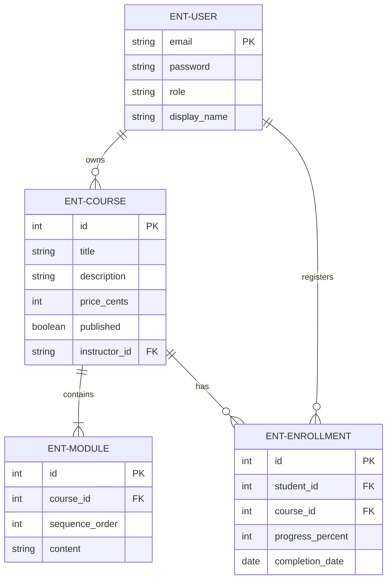
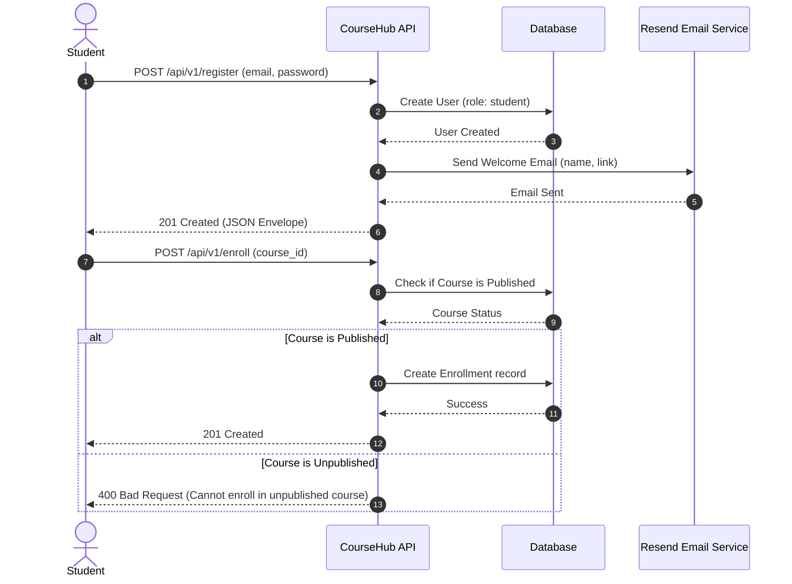
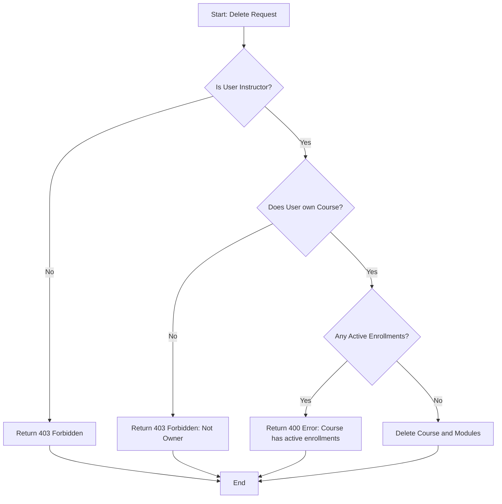
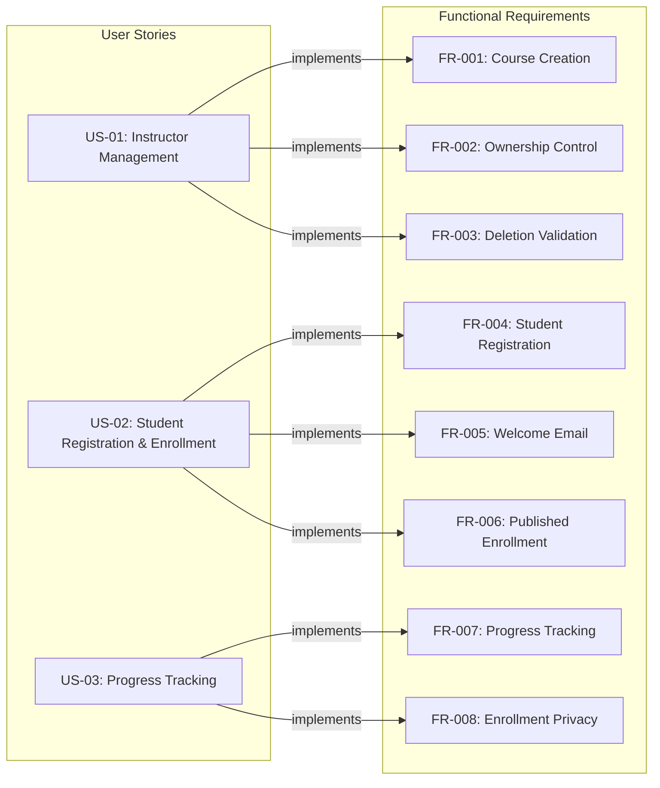

# CourseHub API - Technical Specification & Architecture Document

## 1. Executive Summary & Architecture Overview

### 1.1 Executive Brief
CourseHub API is a RESTful backend for an online learning platform enabling instructor-led course management and student enrollment. The system implements a role-based access model via a shared user table, facilitating course creation, sequential module ordering, and progress tracking. It integrates Resend for automated student onboarding and enforces strict ownership boundaries for content management.

### 1.2 Maturity Assessment
The specification is structurally sound and technically detailed, showing a high degree of alignment between user stories and functional requirements. While there are minor omissions regarding explicit scope boundaries and open uncertainties, these do not impede the initial build. The project is READY for execution.

### 1.3 Technical Stack
* **Architectural Style**: REST
* **Data Format**: JSON
* **External Services**: Resend (Email Delivery)

### 1.4 Architectural Constraints
* **API Versioning**: All endpoints must be exposed under `/api/v1/`.
* **Response Format**: Mandatory JSON envelope: `{"data": ..., "meta": ..., "errors": []}`.
* **Financial Precision**: Course prices must be stored strictly in cents (integers).
* **Data Validation**: Enrolment progress values must be between 0 and 100 inclusive.
* **Ordering**: Modules within a course must maintain a fixed sequence ordering.
* **Quality Gate**: At least 90% of core course, enrollment, and authorization behaviors must be covered by automated E2E tests.
* **Access Control**: 
    * Instructors are restricted to managing only courses they own.
    * Students are restricted to viewing and updating only their own enrolments.
* **Business Logic**: Course deletion is rejected if active enrolments exist.
* **Enrollment Logic**: Student enrollment is permitted only for courses with a published flag set to true.

### 1.5 Critical Dependencies
* **RESEND_API_KEY**: Environment variable required for student welcome emails.
* **Relational Integrity**: Enrollment requires valid User and Course entities.
* **Hierarchical Dependency**: Modules are child records of a specific Course.
* **RBAC**: Role-based access control mapping on the shared User table.

## 2. Architecture Workflows & Visual Diagrams

### 2.1 CourseHub API Data Model

### 2.2 Student Registration & Enrollment Flow

### 2.3 Course Deletion Logic

### 2.4 Requirements Traceability Matrix

## 3. Detailed Technical Specifications & Business Rules

### 3.1 Requirements Traceability
| ID | Type | Description | Related User Story |
| :--- | :--- | :--- | :--- |
| **FR-001** | Functional | Allow instructors to create courses with title, description, price in cents, published flag, and ordered modules. | US-01 |
| **FR-002** | Functional | Associate each course with a single instructor and restrict management actions to that instructor. | US-01 |
| **FR-003** | Functional | Reject course deletion when the course has active enrolments and return a clear error message. | US-01 |
| **FR-004** | Functional | Allow students to register with email and password and assign them the student role. | US-02 |
| **FR-005** | Functional | Send a welcome email through Resend after successful student registration (name and browse link). | US-02 |
| **FR-006** | Functional | Allow students to enroll only in published courses. | US-02 |
| **FR-007** | Functional | Track enrolment progress (0-100%) and record completion date at 100%. | US-03 |
| **FR-008** | Functional | Ensure students can view and update only their own enrolments. | US-03 |
| **FR-009** | Functional | Expose REST endpoints under `/api/v1/` with JSON envelope `{"data": ..., "meta": ..., "errors": []}`. | N/A |
| **FR-010** | Functional | Use a shared user table with a role field to distinguish students and instructors. | N/A |
| **FR-011** | Functional | Preserve the defined ordering of modules within each course. | N/A |
| **SC-001** | Success | Instructor can publish a course and make it available to students in a single workflow. | N/A |
| **SC-002** | Success | Student can register, enroll, and update progress without accessing other students' data. | N/A |
| **SC-003** | Success | At least 90% of core behaviors covered by automated E2E tests. | N/A |
| **SC-004** | Success | System returns consistent error when deleting a course with active enrolments. | N/A |

### 3.2 Security Rules
* **Ownership Enforcement**: All `UPDATE` and `DELETE` operations on `ENT-COURSE` must verify that the authenticated `ENT-USER` is the owner.
* **Data Isolation**: All `GET` and `PATCH` operations on `ENT-ENROLLMENT` must verify that the authenticated `ENT-USER` is the student associated with that specific enrollment.
* **Role Validation**: Access to course management endpoints is restricted to users with the `instructor` role.
* **Credential Safety**: Passwords must be stored using cryptographic hashing (Implicit requirement for FR-004).

### 3.3 Data Models
| Entity ID | Name | Description | Key Attributes |
| :--- | :--- | :--- | :--- |
| **ENT-USER** | User | Shared account identity | email (PK), password, role, display_name |
| **ENT-COURSE** | Course | Learning offering owned by instructor | id (PK), title, description, price_cents, published, instructor_id (FK) |
| **ENT-MODULE** | Module | Child record of a course | id (PK), course_id (FK), sequence_order, content |
| **ENT-ENROLLMENT** | Enrollment | Student-course relationship | id (PK), student_id (FK), course_id (FK), progress_percent, completion_date |

## 4. Project Governance & Structural Gaps

### 4.1 Structural Gaps
| Gap | Priority | Remediation Advice |
| :--- | :--- | :--- |
| **Scope & Out-of-Scope** | MEDIUM | Explicitly define what is not included in the API (e.g., content delivery, payment processing, user profile management) to avoid scope creep. |
| **Open Questions & Uncertainties** | LOW | List any pending decisions regarding the API design or external integrations. |

### 4.2 Remediation & Workflow
The identified gaps should be addressed during the technical design phase before the start of the implementation sprint. The "Scope" document should be appended to this specification to ensure alignment between stakeholders and the development team.

## 5. Technical & Domain Glossary (Terminology Reference)

| Term | Category | Context Anchor | Project Definition |
| :--- | :--- | :--- | :--- |
| API | TECHNICAL_STACK | FR-009 | The set of programmatic endpoints hosted under /api/v1/ providing the interface for platform operations. |
| Course | BUSINESS_DOMAIN | ENT-COURSE | A learning offering owned by an instructor, containing a title, description, pricing in cents, visibility status, and sequential content. |
| Cryptographic Hashing | TECHNICAL_STACK | FR-004 | The required security mechanism for transforming sensitive password credentials into non-reversible strings for storage. |
| Enrollment | BUSINESS_DOMAIN | ENT-ENROLLMENT | A relational link between a student and a specific learning offering that tracks a percentage from 0 to 100 and a finalization date. |
| Fixed-Point Numeric Constraint | TECHNICAL_STACK | FR-001 | The requirement to store monetary values using integers representing the smallest currency unit to avoid floating-point precision errors. |
| JSON | TECHNICAL_STACK | FR-009 | The standardized lightweight data-interchange format used for all response envelopes containing data, meta, and error arrays. |
| Module | BUSINESS_DOMAIN | ENT-MODULE | A child component of a learning offering representing a lesson or section within a strictly defined sequence. |
| REST | TECHNICAL_STACK | FR-009 | The architectural style governing the network interface and the design of the system endpoints. |
| User | BUSINESS_DOMAIN | ENT-USER | A shared account identity containing a role, email, credentials, and display name to distinguish between students and instructors. |