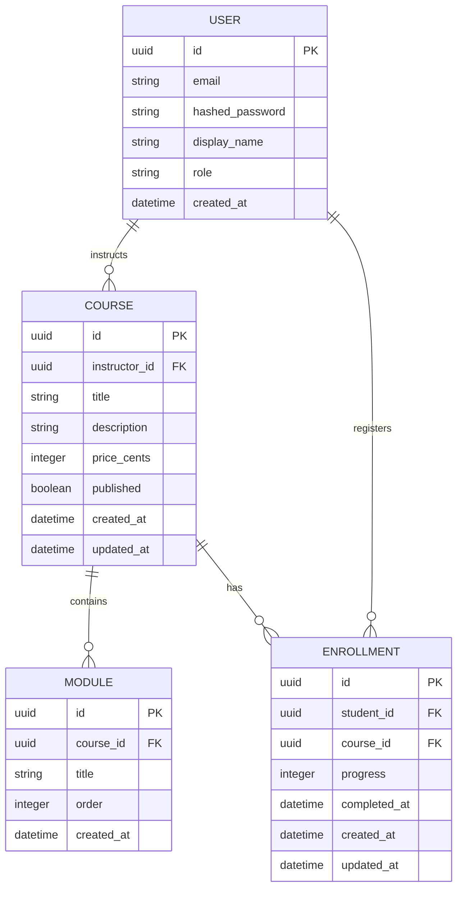
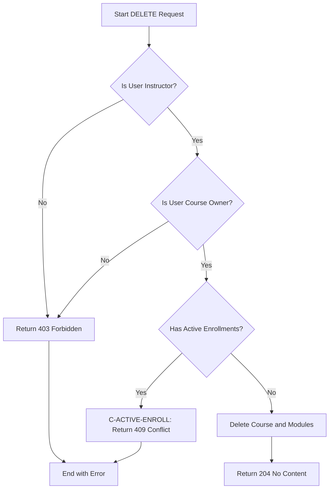
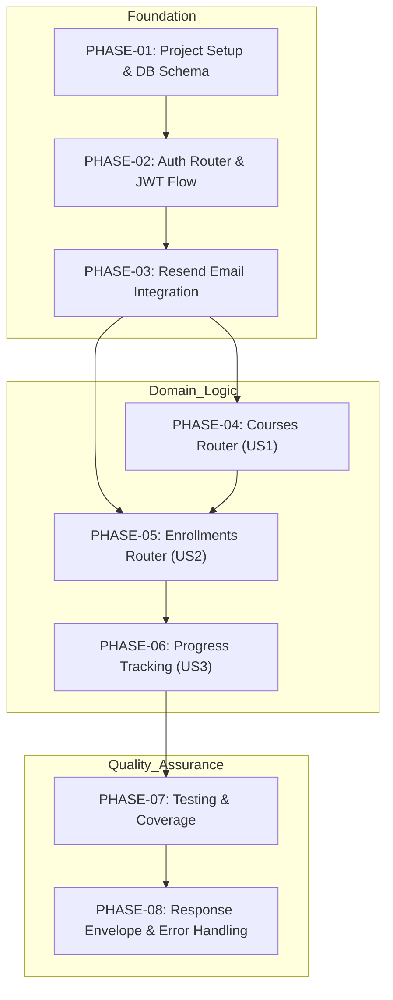
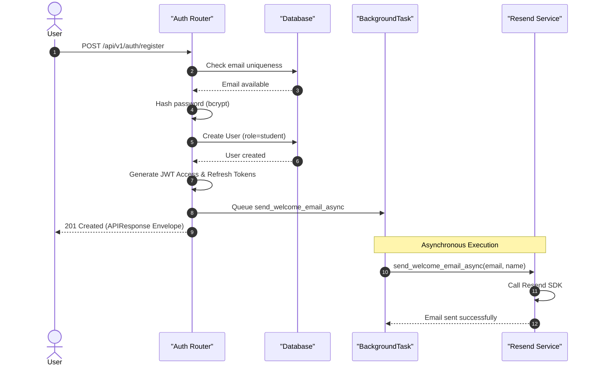

# CourseHub API - Technical Specification & Architecture Document

## 1. Executive Summary & Architecture Overview

### 1.1 Executive Brief
CourseHub API is a course management system implementing a role-based architecture for instructors and students. It features a robust JWT authentication flow, asynchronous email notifications via Resend, and a structured course-module-enrollment data model. The system ensures strict data isolation and enforces business rules regarding course ownership and enrollment-based deletion constraints.

### 1.2 Maturity Assessment
The specifications are exceptionally detailed, covering everything from project structure and ORM definitions to precise HTTP status codes and error envelopes. With a perfect health index and no high or medium severity gaps, the project is READY for execution. Only a minor lack of an 'Open Questions' section exists, which does not impede implementation.

### 1.3 Technical Stack
* **Languages & Frameworks**: FastAPI, Pydantic v2
* **Database & ORM**: SQLAlchemy 2.0 (Async), asyncpg, Alembic
* **Security**: python-jose, passlib (bcrypt)
* **Testing**: pytest, pytest-asyncio, httpx
* **External Services**: Resend (Email SDK)

### 1.4 Architectural Constraints
* **Business Logic Coverage**: Target >= 80% coverage on business logic.
* **Progress Validation**: Enrollment progress must be within the inclusive range 0 to 100.
* **Course Deletion**: Forbidden if active enrollments exist (`ACTIVE_ENROLLMENT_CONSTRAINT` -> 409 Conflict).
* **Data Isolation**: Instructors may only manage/delete owned courses; Students may only access/update own enrollments.
* **JWT Expiration**: Access tokens expire in 15 minutes; Refresh tokens expire in 7 days.
* **Consistency**: All API responses must be wrapped in a standardized `APIResponse` envelope.
* **Ordering**: Modules must maintain a unique combined constraint on `(course_id, order)`.

### 1.5 Critical Dependencies
* **RESEND_API_KEY**: Mandatory environment variable for email services.
* **PostgreSQL**: Async database requirement utilizing `asyncpg`.
* **JWT Flow**: Domain routers depend on `current_user` and role-based dependencies.
* **Referential Integrity**: Cascade deletion of modules upon course deletion.
* **Unique Constraints**: Strict enforcement of `unique(student_id, course_id)` for enrollments.
* **Resend SDK**: External dependency for background welcome emails.

## 2. Architecture Workflows & Visual Diagrams

### 2.1 CourseHub API Data Model

### 2.2 Course Deletion Workflow

### 2.3 Implementation Roadmap & Traceability

### 2.4 User Registration Sequence

## 3. Detailed Technical Specifications & Business Rules

### 3.1 Requirements Traceability
| ID | Component | Description | Phase |
| :--- | :--- | :--- | :--- |
| T001 | Project Structure | Create `app/`, `app/core/`, `app/models/`, `app/schemas/`, `app/routers/`, `app/services/`, `tests/` | PHASE-01 |
| T002 | Project Init | Initialize Python project with FastAPI, SQLAlchemy 2.0, asyncpg, Pydantic v2, Alembic, pytest, httpx, python-jose, passlib, resend | PHASE-01 |
| T003 | DB Config | Configure `app/core/config.py` with async PostgreSQL URL and pool settings | PHASE-01 |
| T004 | Alembic Init | Initialize Alembic with async template and configure `alembic.ini` | PHASE-01 |
| T005 | ORM Models | Define User, Course, Module, and Enrollment models | PHASE-01 |
| T006 | Migration | Create initial Alembic migration for all four tables | PHASE-01 |
| T007 | Session Factory | Set up async database session factory in `app/core/database.py` | PHASE-01 |
| T008 | Schema Verify | Run migration on test PostgreSQL instance | PHASE-01 |
| T009 | Security Utils | Implement JWT creation, verification, and bcrypt password hashing | PHASE-02 |
| T010 | Dependencies | Implement `get_db`, `get_current_user`, `get_current_instructor`, `get_current_student` | PHASE-02 |
| T011 | Response Envelope | Create `APIResponse[T]` Pydantic v2 schema | PHASE-02 |
| T012 | Auth Schemas | Create `UserRegister`, `UserLogin`, `TokenResponse`, `UserResponse` | PHASE-02 |
| T013 | Auth Endpoints | Implement `/auth/register`, `/auth/login`, `/auth/refresh` | PHASE-02 |
| T014 | Main App | Initialize FastAPI and register auth router | PHASE-02 |
| T015 | Email Service | Create `send_welcome_email_async` using Resend SDK | PHASE-03 |
| T016 | Email Integration | Integrate `BackgroundTask` into `/auth/register` | PHASE-03 |
| T017 | Email Mocking | Create Resend mock fixture in `tests/conftest.py` | PHASE-03 |
| T018 | Course Schemas | Create `ModuleCreate`, `ModuleResponse`, `CourseCreate`, `CourseUpdate`, `CourseResponse` | PHASE-04 |
| T019 | Course Services | Implement `get_course_by_id`, `verify_course_ownership`, `check_course_has_enrollments`, `delete_course_with_ownership_check` | PHASE-04 |
| T020 | Course Endpoints | Implement Course CRUD with ownership and publication checks | PHASE-04 |
| T021 | Enrollment Schemas | Create `EnrollmentCreate`, `EnrollmentUpdate`, `EnrollmentResponse` | PHASE-05 |
| T022 | Enrollment Services | Implement `get_user_enrollment`, `create_enrollment_if_published`, `validate_progress` | PHASE-05 |
| T023 | Enrollment Endpoints | Implement enroll, list, and update progress endpoints | PHASE-05 |
| T024 | Progress Validation | Implement logic to reject progress values outside 0-100 | PHASE-06 |
| T025 | Data Isolation | Enforce `student_id == current_user.id` for all enrollment operations | PHASE-06 |
| T026 | E2E Progress Test | Test flow: enroll -> 0% -> 50% -> 100% -> completed_at set | PHASE-06 |
| T027 | Test Config | Setup `pytest-asyncio`, test DB fixture, and `AsyncClient` | PHASE-07 |
| T028 | Auth Tests | Test registration, login, and token refresh flows | PHASE-07 |
| T029 | Course Tests | Test CRUD, ownership, and `ACTIVE_ENROLLMENT_CONSTRAINT` | PHASE-07 |
| T030 | Enrollment Tests | Test enrollment, isolation, and progress updates | PHASE-07 |
| T031 | Integration Tests | End-to-end workflow from registration to course completion | PHASE-07 |
| T032 | Coverage | Run pytest with target 80%+ coverage on business logic | PHASE-07 |
| T033 | Exception Handler | Implement global handler for `PermissionError`, `BusinessRuleViolation`, `ValueError` | PHASE-08 |
| T034 | Response Middleware | Implement middleware to wrap all responses in `APIResponse` | PHASE-08 |
| T035 | Status Code Audit | Verify consistency of 200, 201, 204, 400, 401, 403, 404, 409, 500 | PHASE-08 |
| T036 | Envelope Verification | Ensure all success/error responses follow the defined JSON format | PHASE-08 |

### 3.2 Security Rules
* **Authentication**: Stateless JWT-based authentication.
* **Authorization**: Role-Based Access Control (RBAC) using `instructor` and `student` roles.
* **Password Security**: Passwords must be hashed using bcrypt via `passlib`.
* **Data Isolation**: 
    * Instructors are restricted to operations on courses they own.
    * Students are restricted to operations on enrollments they own.
* **Token Lifecycle**: Access tokens (15m) and Refresh tokens (7d) to minimize exposure.

### 3.3 Data Models
* **User**: `id (UUID)`, `email (Unique)`, `hashed_password`, `display_name`, `role (Enum)`, `created_at`.
* **Course**: `id (UUID)`, `instructor_id (FK)`, `title`, `description`, `price_cents`, `published (Bool)`, `created_at`, `updated_at`.
* **Module**: `id (UUID)`, `course_id (FK)`, `title`, `order (Int)`, `created_at`. (Constraint: `unique(course_id, order)`).
* **Enrollment**: `id (UUID)`, `student_id (FK)`, `course_id (FK)`, `progress (Int 0-100)`, `completed_at (Nullable)`, `created_at`, `updated_at`. (Constraint: `unique(student_id, course_id)`).

## 4. Project Governance & Structural Gaps

### 4.1 Structural Gaps
| Gap | Priority | Remediation Advice |
| :--- | :--- | :--- |
| Open Questions & Uncertainties | LOW | The document is highly detailed; no explicit uncertainties were noted, but a dedicated section for edge-case discussion could be added. |

### 4.2 Remediation & Workflow
The project is currently marked as **READY for Implementation**. The identified gap is minor and can be addressed during the "Polish" phase (Phase 8) by documenting encountered edge cases.

## 5. Technical & Domain Glossary (Terminology Reference)

| Term | Category | Context Anchor | Project Definition |
| :--- | :--- | :--- | :--- |
| API | TECHNICAL_STACK | Tasks: CourseHub API Implementation | The primary interface facilitating communication between the client and the server for course management operations. |
| ActiveEnrollmentConstraint | BUSINESS_DOMAIN | C-ACTIVE-ENROLL | A validation rule preventing the deletion of a learning resource if users are currently registered to it. |
| All | TECHNICAL_STACK | PHASE-07 | The total set of defined test cases that must pass to satisfy deployment criteria. |
| AsyncClient | TECHNICAL_STACK | PHASE-07 | A non-blocking HTTP utility used within the test suite to simulate requests to the application. |
| AsyncSession | TECHNICAL_STACK | T005 | A non-blocking database connection context used for transactional data operations. |
| BackgroundTask | TECHNICAL_STACK | Phase 3: Resend Email Integration & BackgroundTask | An asynchronous execution mechanism that triggers email dispatch after the HTTP response is sent. |
| BusinessRuleViolation | TECHNICAL_STACK | T033 | A specific exception type mapped to a 409 Conflict response when a domain constraint is breached. |
| CORS Standard | TECHNICAL_STACK | PHASE-08 | The security protocol managing cross-origin resource sharing for the web interface. |
| CRUD | TECHNICAL_STACK | T020 | The four foundational persistent storage mutation primitives. |
| ConfigError | TECHNICAL_STACK | T015 | An exception raised when mandatory environment variables, such as the transactional mail key, are absent. |
| CourseCreate | TECHNICAL_STACK | PHASE-04 | A Pydantic data transfer object defining the required fields for initiating a new educational resource. |
| CourseResponse | TECHNICAL_STACK | PHASE-04 | A Pydantic data transfer object outlining the public and internal data exposed when retrieving educational resources. |
| CourseUpdate | TECHNICAL_STACK | PHASE-04 | A Pydantic data transfer object specifying the modifiable fields for an existing educational resource. |
| Cryptographic Hashing | TECHNICAL_STACK | T009 | The process of transforming passwords into non-reversible strings using the bcrypt algorithm. |
| DB | TECHNICAL_STACK | PHASE-01 | The PostgreSQL persistent storage instance managing the relational schema. |
| Dependencies | TECHNICAL_STACK | T010 | The FastAPI injection system providing database sessions and authenticated user contexts to route handlers. |
| EnrollmentCreate | TECHNICAL_STACK | PHASE-05 | A Pydantic data transfer object used to link a student to a specific educational resource. |
| EnrollmentResponse | TECHNICAL_STACK | PHASE-05 | A Pydantic data transfer object returning the state and progress of a student's registration in a resource. |
| EnrollmentUpdate | TECHNICAL_STACK | PHASE-05 | A Pydantic data transfer object used to modify the progress percentage and completion date. |
| FK | TECHNICAL_STACK | T005 | A relational constraint ensuring referential integrity between tables, such as linking modules to a parent resource. |
| Feature | BUSINESS_DOMAIN | Tasks: CourseHub API Implementation | A high-level functional block of the system, specifically the course management suite. |
| HTTPException | TECHNICAL_STACK | T010 | The standard mechanism for returning specific error codes like 401 or 403 to the client. |
| ID | TECHNICAL_STACK | T005 | A unique identifier for every record, implemented as a universally unique alphanumeric string. |
| ISOlation | BUSINESS_DOMAIN | PHASE-06 | The security boundary ensuring students can only access their own registration and progress data. |
| JWT | TECHNICAL_STACK | PHASE-02 | The signed token format used for stateless authentication and role verification. |
| MVP | BUSINESS_DOMAIN | MVP Scope (Phase 1 Delivery) | The minimum set of functional requirements including database, auth, and basic course management for initial delivery. |
| Middleware | TECHNICAL_STACK | T034 | A software layer that intercepts all outbound responses to wrap them in a standardized envelope. |
| ModuleCreate | TECHNICAL_STACK | PHASE-04 | A Pydantic data transfer object for defining a segment of an educational resource. |
| ModuleResponse | TECHNICAL_STACK | PHASE-04 | A Pydantic data transfer object containing the metadata and ordering of an educational resource segment. |
| NOT | TECHNICAL_STACK | T013 | A logical negation used to defer email dispatch during the registration flow. |
| ORM | TECHNICAL_STACK | T005 | The abstraction layer mapping Python classes to PostgreSQL tables. |
| Parallelization Opportunities | TECHNICAL_STACK | Dependency Graph | The capability to develop domain routers for instructors and students concurrently after the foundation is laid. |
| PermissionError | TECHNICAL_STACK | T033 | An exception triggered when an authenticated user lacks the required role or ownership to perform an action. |
| Raise | TECHNICAL_STACK | T015 | The operational act of triggering a software exception to halt execution and signal an error. |
| Reference | TECHNICAL_STACK | Tasks: CourseHub API Implementation | The external documentation links providing the full specification and planning details. |
| Return | TECHNICAL_STACK | T013 | The process of sending a finalized payload and HTTP status code back to the calling client. |
| SDK | TECHNICAL_STACK | T015 | The provided Python library for interacting with the external transactional mail service. |
| SQLAlchemy 2.0 | TECHNICAL_STACK | PHASE-01 | The specific version of the database toolkit used for asynchronous interaction with PostgreSQL. |
| Target | TECHNICAL_STACK | PHASE-07 | The minimum acceptable threshold of 80% for business logic test coverage. |
| Test Criteria | TECHNICAL_STACK | PHASE-01 | The set of verifiable outcomes required to mark a phase as complete. |
| TokenResponse | TECHNICAL_STACK | T012 | A Pydantic data transfer object containing short-term access and long-term refresh strings. |
| UUID | TECHNICAL_STACK | T005 | The data type used for primary keys to ensure unique identification across distributed environments. |
| UserLogin | TECHNICAL_STACK | T012 | A Pydantic data transfer object capturing credentials for identity verification. |
| UserRegister | TECHNICAL_STACK | T012 | A Pydantic data transfer object containing the necessary information to create a new account. |
| UserResponse | TECHNICAL_STACK | T012 | A Pydantic data transfer object returning sanitized profile information. |
| ValidationError | TECHNICAL_STACK | T033 | An exception raised by the data validation library when a payload does not match the expected schema. |
| ValueError | TECHNICAL_STACK | T033 | An exception raised when a numeric value, such as progress, falls outside the 0-100 range. |
| alembic init | TECHNICAL_STACK | PHASE-01 | The command used to bootstrap the database migration environment with async support. |