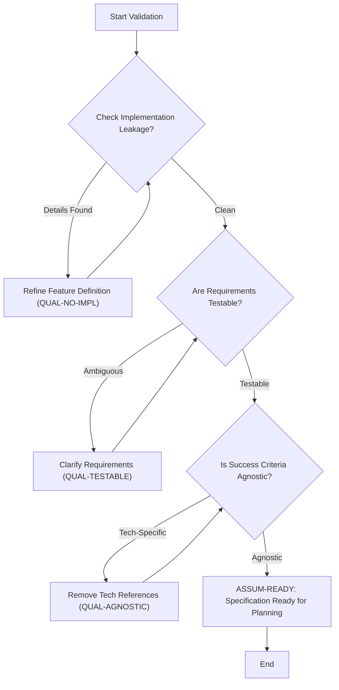
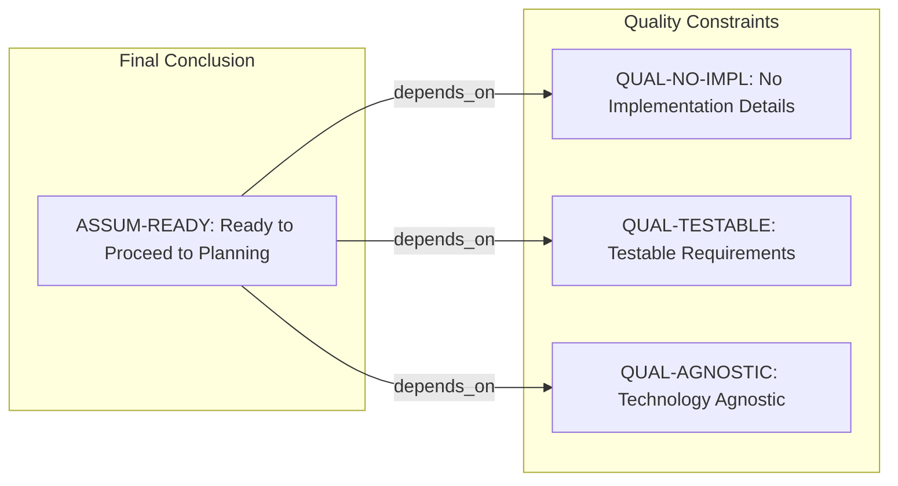

# CourseHub API - Technical Specification & Architecture Document

## 1. Executive Summary & Architecture Overview

### 1.1 Executive Brief
The project pertains to the CourseHub API, currently represented by a meta-document acting as a Specification Quality Checklist. The core value is the validation of the functional specification's readiness for planning, ensuring that business needs are decoupled from implementation details and that success criteria are measurable and technology-agnostic.

### 1.2 Maturity Assessment
The project is currently in a state of REFINEMENT. While the checklist reports a high completeness score, this is a meta-document; the actual technical substance is missing. High-severity structural gaps exist regarding the absence of Goals, Objectives, and Scope boundaries, meaning the project lacks the foundational functional data required for execution despite the checklist being marked as complete.

### 1.3 Technical Stack
*   No specific languages, frameworks, or databases defined (Specification is intentionally technology-agnostic).

### 1.4 Architectural Constraints
*   **Strict Decoupling**: No implementation details (languages, frameworks, APIs) must be exposed in feature definitions.
*   **Requirement Quality**: All requirements must be testable and unambiguous.
*   **Technology-Agnosticism**: Success criteria must remain independent of specific technology choices.

### 1.5 Critical Dependencies
*   Direct dependency on the `spec.md` file for all functional requirements and business goals.
*   Verification gate: Completion of all quality checklist items before proceeding to the planning phase.

## 2. Architecture Workflows & Visual Diagrams

### 2.1 Specification Readiness Workflow
Models the validation process of the CourseHub API specification based on the quality checklist constraints.

### 2.2 Quality Constraint Traceability
Maps the relationship between the final readiness assumption and the underlying quality constraints.

## 3. Detailed Technical Specifications & Business Rules

### 3.1 Requirements Traceability
| ID | Type | Description | Source Section | Status |
| :--- | :--- | :--- | :--- | :--- |
| QUAL-NO-IMPL | Constraint | No implementation details (languages, frameworks, APIs) are exposed in the feature definition. | Content Quality | Verified |
| QUAL-TESTABLE | Constraint | Requirements must be testable and unambiguous. | Requirement Completeness | Verified |
| QUAL-AGNOSTIC | Constraint | Success criteria must be technology-agnostic. | Requirement Completeness | Verified |
| ASSUM-READY | Assumption | The specification is ready to proceed to planning as all checklist items are complete. | Notes | Ready |

### 3.2 Security Rules
*   No specific security rules defined in the provided quality checklist.

### 3.3 Data Models
*   No data models defined in the provided quality checklist.

## 4. Project Governance & Structural Gaps

### 4.1 Structural Gaps
| Missing Section | Priority | Remediation Advice |
| :--- | :--- | :--- |
| Goals & Objectives | HIGH | This document is a checklist. Please provide the actual 'spec.md' file to extract the business goals and objectives. |
| Scope & Out-of-Scope | HIGH | The checklist confirms scope is bounded, but the boundaries are not defined here. Provide the primary specification document. |
| Open Questions & Uncertainties | MEDIUM | Checklist indicates no markers remain, but actual open questions for the API design are missing from this meta-document. |

### 4.2 Remediation & Workflow
The current document serves as a quality gate. To move from the REFINEMENT phase to the PLANNING phase, the actual functional specification (`spec.md`) must be ingested to populate the missing business logic, scope, and technical goals.

## 5. Technical & Domain Glossary (Terminology Reference)

| Term | Category | Context Anchor | Project Definition |
| :--- | :--- | :--- | :--- |
| API | TECHNICAL_STACK | QUAL-NO-IMPL | The technical interface whose implementation details must remain isolated from the core functional descriptions to maintain a technology-agnostic specification. |
| Feature | BUSINESS_DOMAIN | Feature Readiness | A bounded set of functional requirements aligned with measurable outcomes and validated through specific acceptance criteria. |