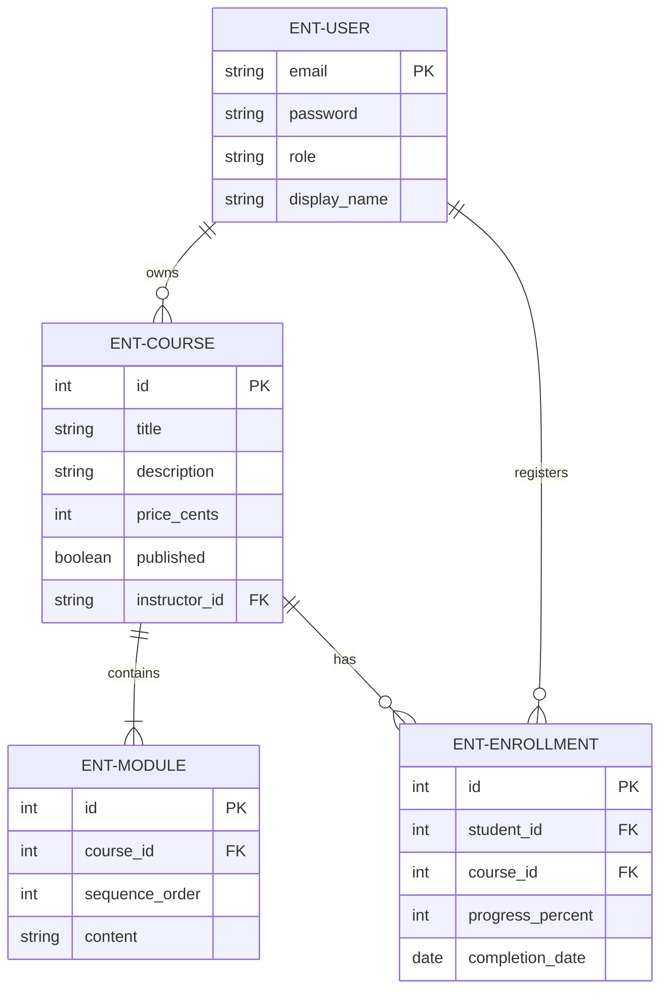
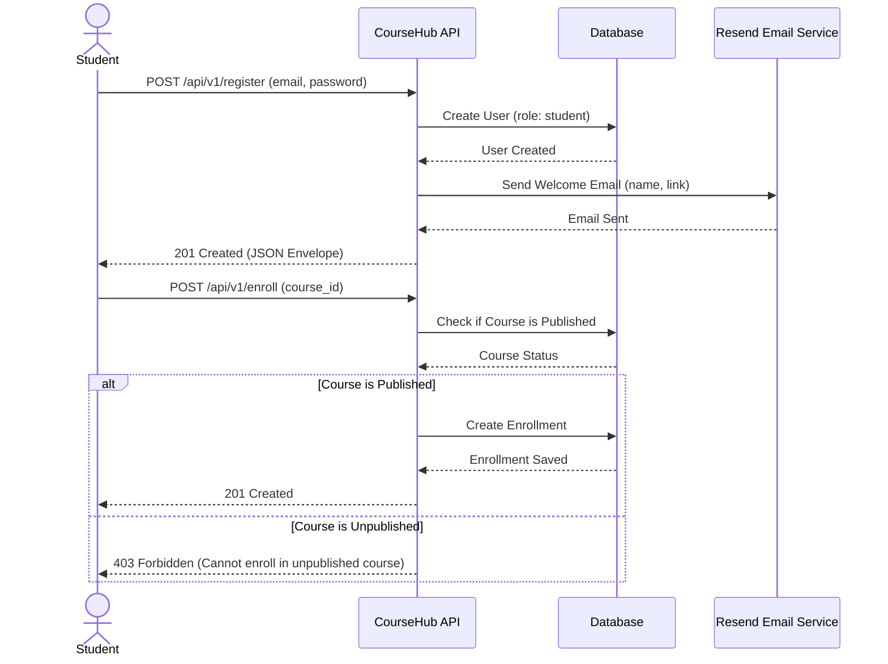
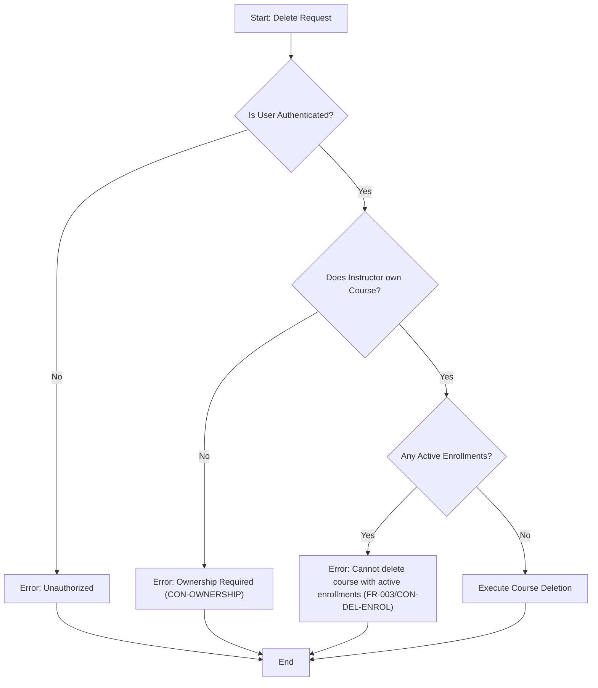
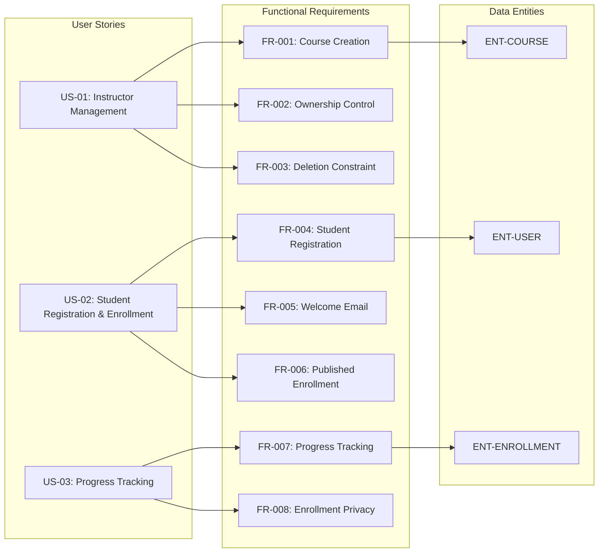

# CourseHub API - Technical Specification & Architecture Document

## 1. Executive Summary & Architecture Overview

### 1.1 Executive Brief
CourseHub API is a RESTful learning platform enabling instructors to create structured courses and students to manage enrollments. The system implements a shared identity model with role-based access control to isolate content ownership and enrollment data. Core value is delivered through a strict course-module hierarchy and progress tracking mechanisms hosted on a v1 API.

### 1.2 Maturity Assessment
The specification is technically robust and structurally sound, characterized by clear success criteria and precise edge-case definitions. While a few medium and low severity gaps exist regarding the formal definition of out-of-scope boundaries and minor uncertainties, they do not impede the current technical trajectory. Status: READY.

### 1.3 Technical Stack
* REST
* JSON
* Resend

### 1.4 Architectural Constraints
* API endpoints must be hosted under `/api/v1/`.
* JSON response envelope requirement: `{"data": ..., "meta": ..., "errors": []}`.
* Course prices must be stored strictly in cents.
* Enrollment progress must be a value between 0 and 100 inclusive.
* Course modules must maintain a fixed sequence ordering.
* Core course, enrollment, and authorization behaviors must have >= 90% E2E test coverage.
* Instructors can only manage/delete courses they own.
* Students can only access and update their own enrollments.
* Enrollment is strictly forbidden for unpublished courses.

### 1.5 Critical Dependencies
* `RESEND_API_KEY` environment variable for welcome email dispatch.
* Strict foreign key dependence between Enrollment, User, and Course entities.
* Course deletion blocked by existence of active Enrollment records.
* Shared User table utilizing a 'role' field for access control differentiation.
* Course-to-Module one-to-many relationship with sequence preservation.

## 2. Architecture Workflows & Visual Diagrams

### 2.1 CourseHub Data Model
Entity Relationship Diagram showing the shared user table, course ownership, module sequencing, and student enrollments.

### 2.2 Student Registration & Enrollment Flow
Sequence of interactions for a student registering and enrolling in a course, including the external Resend email integration.

### 2.3 Course Deletion Workflow
Logic flow for instructors attempting to delete courses, incorporating ownership and active enrollment constraints.

### 2.4 Requirements Traceability Matrix
Mapping of User Stories to Functional Requirements and their associated Data Entities.

## 3. Detailed Technical Specifications & Business Rules

### 3.1 Requirements Traceability

| ID | Type | Description | Related User Story | Related Entity |
| :--- | :--- | :--- | :--- | :--- |
| **FR-001** | Requirement | Allow instructors to create courses (title, description, price in cents, published flag, ordered modules). | US-01 | ENT-COURSE |
| **FR-002** | Requirement | Associate each course with a single instructor and restrict management actions to that instructor. | US-01 | - |
| **FR-003** | Requirement | Reject course deletion when the course has active enrolments and return a clear error message. | US-01 | - |
| **FR-004** | Requirement | Allow students to register with email and password and assign them the student role. | US-02 | ENT-USER |
| **FR-005** | Requirement | Send a welcome email through Resend after successful student registration. | US-02 | - |
| **FR-006** | Requirement | Allow students to enroll only in published courses. | US-02 | - |
| **FR-007** | Requirement | Track enrolment progress (0-100%) and record completion date at 100%. | US-03 | ENT-ENROLLMENT |
| **FR-008** | Requirement | Ensure students can view and update only their own enrolments. | US-03 | - |
| **FR-009** | Requirement | Expose REST endpoints under `/api/v1/` with JSON envelope `{"data": ..., "meta": ..., "errors": []}`. | - | - |
| **FR-010** | Requirement | Use a shared user table with a role field to distinguish students and instructors. | - | ENT-USER |
| **FR-011** | Requirement | Preserve the defined ordering of modules within each course. | - | ENT-MODULE |
| **US-01** | User Story | Instructor can create, publish, and manage courses without affecting others. | - | - |
| **US-02** | User Story | Student can register, receive welcome email, enroll, and view own records. | - | - |
| **US-03** | User Story | Students can update own progress and completion status safely. | - | - |
| **CON-DEL-ENROL** | Constraint | Deleting a course with one or more active enrolments must fail with a clear validation error. | - | - |
| **CON-PROG-RANGE** | Constraint | Progress values outside the 0–100% range must be rejected. | - | - |
| **CON-PUBLISHED-ONLY** | Constraint | Students must not be able to enroll in unpublished courses. | - | - |
| **CON-OWNERSHIP** | Constraint | Instructors must not be able to manage courses they do not own. | - | - |
| **SC-001** | Success Crit. | Instructor can publish a course and make it available in a single workflow. | - | - |
| **SC-002** | Success Crit. | Student can register, enroll, and update progress without accessing others' data. | - | - |
| **SC-003** | Success Crit. | >= 90% of core course, enrollment, and authorization behaviors covered by E2E tests. | - | - |
| **SC-004** | Success Crit. | System returns a clear, consistent error when deleting a course with active enrolments. | - | - |
| **AS-01** | Assumption | Each course has one instructor owner; an instructor may own multiple courses. | - | - |

### 3.2 Security Rules
* **Role-Based Access Control (RBAC)**: Access is governed by the `role` field in the shared User table.
* **Ownership Isolation**: Instructors are strictly forbidden from managing courses they do not own (`CON-OWNERSHIP`).
* **Data Privacy**: Students are restricted to viewing and updating only their own enrollment records (`FR-008`).
* **Authentication**: All management and enrollment endpoints require a valid authenticated session.

### 3.3 Data Models

| Entity | Description | Key Attributes |
| :--- | :--- | :--- |
| **ENT-USER** | Shared account identity | email (PK), password, role, display_name |
| **ENT-COURSE** | Learning offering owned by instructor | id (PK), title, description, price_cents, published, instructor_id (FK) |
| **ENT-MODULE** | Child record of a course (lesson/section) | id (PK), course_id (FK), sequence_order, content |
| **ENT-ENROLLMENT** | Student-course relationship | id (PK), student_id (FK), course_id (FK), progress_percent, completion_date |

## 4. Project Governance & Structural Gaps

### 4.1 Structural Gaps
| Gap | Priority | Remediation Advice |
| :--- | :--- | :--- |
| **Scope & Out-of-Scope** | MEDIUM | Explicitly list what the API will NOT handle to avoid scope creep. |
| **Open Questions & Uncertainties** | LOW | Document any ambiguities regarding role transitions or email template management. |

### 4.2 Remediation & Workflow
The identified gaps should be addressed during the transition from the "Draft" status to "Final" specification. The Lead Architect must define the boundaries of the API (e.g., whether payment processing is handled by this API or an external gateway) to satisfy the Scope gap.

## 5. Technical & Domain Glossary (Terminology Reference)

| Term | Category | Context Anchor | Project Definition |
| :--- | :--- | :--- | :--- |
| API | TECHNICAL_STACK | FR-009 | The interface exposing endpoints under /api/v1/ to handle requests and provide responses. |
| Course | BUSINESS_DOMAIN | ENT-COURSE | A learning offering owned by an instructor, containing a title, description, price in cents, published status, and ordered modules. |
| Cryptographic Hashing | TECHNICAL_STACK | FR-004 | The mechanism used to secure password credentials during registration and authentication. |
| Enrollment | BUSINESS_DOMAIN | ENT-ENROLLMENT | A relationship between a student and a learning offering that records progress and a completion date. |
| Fixed-Point Numeric Constraint | TECHNICAL_STACK | FR-001 | The requirement to store monetary values in cents to avoid floating point precision errors. |
| JSON | TECHNICAL_STACK | FR-009 | The data interchange format used for responses, following a specific envelope with data, meta, and errors fields. |
| Module | BUSINESS_DOMAIN | ENT-MODULE | A child record of a learning offering representing a lesson or section in a fixed sequence. |
| REST | TECHNICAL_STACK | FR-009 | The architectural style governing the design of endpoints and resource interactions. |
| User | BUSINESS_DOMAIN | ENT-USER | A shared account identity containing a role, email, password credential, and display name. |