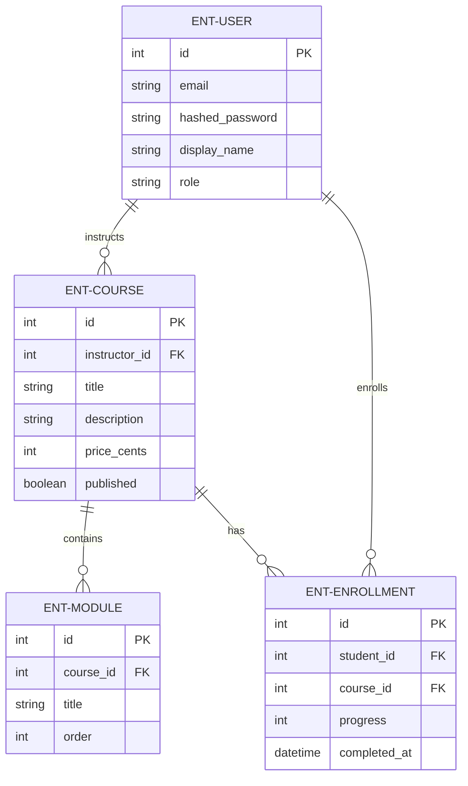
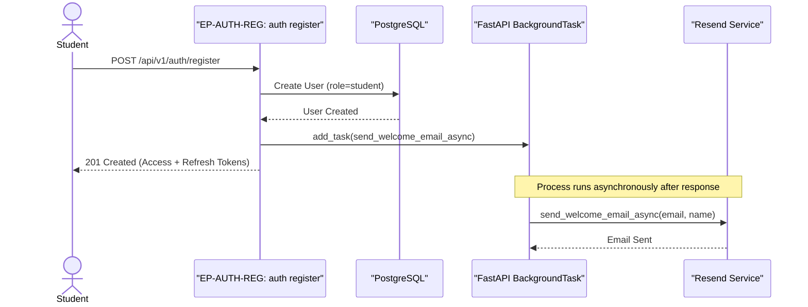
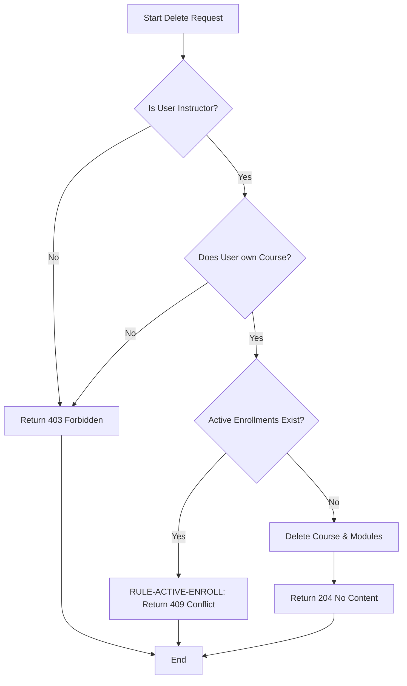
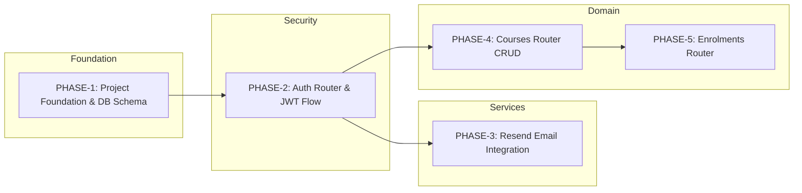

# CourseHub API - Technical Specification & Architecture Document

## 1. Executive Summary & Architecture Overview

### 1.1 Executive Brief
CourseHub API is a high-performance RESTful system built with FastAPI and PostgreSQL, utilizing an asynchronous SQLAlchemy 2.0 architecture. The platform implements a strict role-based access control (RBAC) model separating 'student' and 'instructor' personas, focusing on secure course lifecycle management and student enrollment tracking with a non-blocking email notification pattern.

### 1.2 Maturity Assessment
The specifications are structurally complete with a high degree of implementation detail, although the project remains in the REFINEMENT status. While the core domain logic is well-defined, there are unresolved uncertainties regarding refresh token persistence for revocation and the strategy for email template management. No high-severity structural gaps were identified, only a low-priority lack of a formal uncertainty section.

### 1.3 Technical Stack
* **Languages & Frameworks**: FastAPI, Pydantic v2
* **Database & ORM**: PostgreSQL, SQLAlchemy 2.0 async, asyncpg, Alembic
* **Security**: python-jose, passlib, python-multipart
* **Testing**: pytest, pytest-asyncio, pytest-cov, httpx
* **External Services**: Resend SDK

### 1.4 Architectural Constraints
* **DB Access**: Exclusive use of `AsyncSession`; synchronous SQLAlchemy is prohibited.
* **Email Integration**: Resend SDK calls must be wrapped in FastAPI `BackgroundTask` to prevent registration blocking.
* **Data Validation**: Enrollment progress must be an integer strictly between 0 and 100 inclusive.
* **Quality Gate**: Target minimum 80% code coverage on business logic via `pytest-cov`.
* **Business Rule (ActiveEnrollmentConstraint)**: Course deletion must return 409 Conflict if any associated Enrollment rows exist.
* **Role Isolation**: Instructors can only access/update courses where `instructor_id == current_user.id`.
* **Role Isolation**: Students can only access/update enrollments where `student_id == current_user.id`.
* **Data Integrity**: Enrollment must enforce a unique constraint on `(student_id, course_id)`.
* **Data Integrity**: Course deletion triggers cascading delete of associated Modules via Foreign Key.

### 1.5 Critical Dependencies
* `RESEND_API_KEY` environment variable (Mandatory for Email Service).
* PostgreSQL database with `asyncpg` driver support.
* JWT for stateless authentication and role-based session management.
* Cascading deletion dependency: Modules depend on Course entity existence.
* Referential integrity: Enrollment depends on both User (student) and Course entities.
* `Pytest-asyncio` for asynchronous test execution environment.

## 2. Architecture Workflows & Visual Diagrams

### 2.1 CourseHub Data Model

### 2.2 User Registration & Welcome Flow

### 2.3 Course Deletion Workflow

### 2.4 Implementation Phase Traceability

## 3. Detailed Technical Specifications & Business Rules

### 3.1 Requirements Traceability
| Identifier | Component | Description | Source Section |
| :--- | :--- | :--- | :--- |
| PHASE-1 | Phase | Project Foundation & Database Schema | Phase 1 |
| ENT-USER | Entity | User: email, hashed_password, display_name, role (student/instructor) | Phase 1 |
| ENT-COURSE | Entity | Course: instructor_id, title, description, price_cents, published | Phase 1 |
| ENT-MODULE | Entity | Module: course_id, title, order | Phase 1 |
| ENT-ENROLLMENT | Entity | Enrollment: student_id, course_id, progress, completed_at | Phase 1 |
| PHASE-2 | Phase | Auth Router — JWT & Refresh Token Flow | Phase 2 |
| EP-AUTH-REG | Endpoint | POST /api/v1/auth/register (Student-only) | Phase 2 |
| EP-AUTH-LOG | Endpoint | POST /api/v1/auth/login | Phase 2 |
| EP-AUTH-REF | Endpoint | POST /api/v1/auth/refresh | Phase 2 |
| PHASE-3 | Phase | Resend Email Integration | Phase 3 |
| ARCH-ASYNC-DB | Arch Choice | All DB calls use AsyncSession and async/await (SQLAlchemy 2.0 async) | Decisions |
| ARCH-BG-EMAIL | Arch Choice | Resend integration via FastAPI BackgroundTask to prevent blocking registration | Decisions |
| RULE-ACTIVE-ENROLL | Decision | ActiveEnrollmentConstraint: Course deletion returns 409 if active enrollments exist | Decisions |
| PHASE-4 | Phase | Courses Router — CRUD with Ownership | Phase 4 |
| EP-CORS-DEL | Endpoint | DELETE /api/v1/courses/{course_id} (Instructor-only) | Phase 4 |
| PHASE-5 | Phase | Enrolments Router — Student Access & Progress | Phase 5 |

### 3.2 Security Rules
* **Authentication**: Stateless JWT implementation with short-lived access tokens (15 min) and long-lived refresh tokens (7 days).
* **RBAC**: 
    * `get_current_instructor`: Asserts `role == "instructor"`.
    * `get_current_student`: Asserts `role == "student"`.
* **Ownership**: 
    * Courses: `instructor_id` must match `current_user.id` for PUT/DELETE.
    * Enrollments: `student_id` must match `current_user.id` for GET/PUT.
* **Password Safety**: Passwords must be hashed using `passlib` before storage.

### 3.3 Data Models
* **User**: Primary identity entity. Roles: `student` | `instructor`.
* **Course**: Educational offering. Linked to `User` (Instructor).
* **Module**: Course components. Linked to `Course` with a mandatory `order` field.
* **Enrollment**: Junction between `User` (Student) and `Course`. Unique constraint on `(student_id, course_id)`.

## 4. Project Governance & Structural Gaps

### 4.1 Structural Gaps
| Gap | Priority | Remediation Advice |
| :--- | :--- | :--- |
| Missing "Open Questions & Uncertainties" section | LOW | Convert existing 'Further Considerations' into a formal risk/question log. |

### 4.2 Remediation & Workflow
* **Unresolved Questions**:
    1. Should refresh tokens be persisted in a database for revocation support?
    2. Should email templates be moved to external files or Resend templates?
    3. Is a bulk update endpoint needed for module reordering?

## 5. Technical & Domain Glossary (Terminology Reference)

| Term | Category | Context Anchor | Project Definition |
| :--- | :--- | :--- | :--- |
| API | TECHNICAL_STACK | TL;DR | The FastAPI-based interface providing RESTful endpoints for authentication, education content, and student registration. |
| ActiveEnrollmentConstraint | BUSINESS_DOMAIN | RULE-ACTIVE-ENROLL | A logic gate preventing the removal of an educational offering if any student association records exist, triggering a 409 conflict. |
| Async throughout | TECHNICAL_STACK | ARCH-ASYNC-DB | A requirement that all persistence layer interactions use non-blocking awaitable patterns. |
| AsyncClient | TECHNICAL_STACK | Phase 6: Testing & Verification | The httpx-based asynchronous utility used within pytest fixtures to simulate requests. |
| AsyncSession | TECHNICAL_STACK | ARCH-ASYNC-DB | The SQLAlchemy 2.0 non-blocking database connection context managed via dependency injection. |
| Auth first | TECHNICAL_STACK | PHASE-2 | An architectural sequence prioritizing identity verification and role-based access control over domain logic. |
| Background email | TECHNICAL_STACK | ARCH-BG-EMAIL | The deferral of transactional messages to a non-blocking task to avoid delaying the primary response. |
| BackgroundTask | TECHNICAL_STACK | ARCH-BG-EMAIL | A FastAPI native mechanism used to execute the Resend SDK call after the HTTP response is dispatched. |
| BusinessRuleViolation | TECHNICAL_STACK | Phase 7: Response Envelope & Error Handling | A custom exception raised when an operation conflicts with a named domain constraint. |
| CORS Standard | TECHNICAL_STACK | TL;DR | The cross-origin resource sharing protocol managed by FastAPI middleware for browser-based access. |
| CRUD | TECHNICAL_STACK | PHASE-4 | The four foundational persistent storage mutation primitives applied to education entities. |
| ConfigError | TECHNICAL_STACK | Phase 3: Resend Email Integration as Service | An exception triggered when essential environment variables, specifically the external mail platform key, are missing. |
| Course | BUSINESS_DOMAIN | ENT-COURSE | An educational offering owned by an instructor containing pricing, publication status, and associated modules. |
| CourseCreate | TECHNICAL_STACK | PHASE-4 | A Pydantic v2 data transfer object for validating incoming requests to establish a new educational offering. |
| CourseResponse | TECHNICAL_STACK | PHASE-4 | The serialized output format for educational offerings, including nested module data. |
| CourseUpdate | TECHNICAL_STACK | PHASE-4 | A Pydantic v2 schema used to modify existing educational offering attributes. |
| Cryptographic Hashing | TECHNICAL_STACK | Phase 2: Auth Router — JWT & Refresh Token Flow | The process of transforming passwords into irreversible strings via passlib for secure storage. |
| DB | TECHNICAL_STACK | PHASE-1 | The PostgreSQL relational storage instance managed by Alembic migrations. |
| DR | TECHNICAL_STACK | Phase 7: Response Envelope & Error Handling | The standardized response wrapping strategy using a generic envelope for all endpoints. |
| Enrollment | BUSINESS_DOMAIN | ENT-ENROLLMENT | A unique association between a student and an educational offering tracking progress and completion. |
| EnrollmentCreate | TECHNICAL_STACK | PHASE-5 | A Pydantic v2 schema used to initiate a student's registration for a specific course. |
| EnrollmentResponse | TECHNICAL_STACK | PHASE-5 | The serialized representation of a student's progress and timestamps for a specific offering. |
| EnrollmentUpdate | TECHNICAL_STACK | PHASE-5 | A Pydantic v2 schema for modifying the progress percentage or completion date. |
| FK | TECHNICAL_STACK | PHASE-1 | The relational constraint linking modules to offerings and offerings to instructors. |
| JWT | TECHNICAL_STACK | PHASE-2 | The token standard used for stateless identity verification and session management. |
| Middleware | TECHNICAL_STACK | Phase 7: Response Envelope & Error Handling | A software layer that intercepts every outgoing response to wrap it in a consistent envelope shape. |
| Module | BUSINESS_DOMAIN | ENT-MODULE | A structured component of a course with a mandatory sequence order. |
| ModuleCreate | TECHNICAL_STACK | PHASE-4 | A Pydantic v2 schema for defining the title and sequence of a course component during creation. |
| ModuleResponse | TECHNICAL_STACK | PHASE-4 | The serialized output for course components, used in nested course responses. |
| NAMED | TECHNICAL_STACK | RULE-ACTIVE-ENROLL | The practice of explicitly labeling a business constraint for traceability in error handling. |
| NOT | TECHNICAL_STACK | EP-AUTH-REG | A logical exclusion preventing the synchronous dispatch of emails during the registration flow. |
| ORM | TECHNICAL_STACK | ARCH-ASYNC-DB | The SQLAlchemy object-relational mapping layer used to avoid raw query strings. |
| PermissionError | TECHNICAL_STACK | Phase 7: Response Envelope & Error Handling | An exception raised when a user lacks the required role or ownership to perform an action. |
| REST | TECHNICAL_STACK | TL;DR | The architectural style using standard HTTP methods and resource-based URLs. |
| RULE | BUSINESS_DOMAIN | RULE-ACTIVE-ENROLL | A formalized domain constraint that enforces specific system behaviors, such as deletion restrictions. |
| SDK | TECHNICAL_STACK | Phase 3: Resend Email Integration as Service | The Resend provided library used to interface with the external email platform. |
| SQL | TECHNICAL_STACK | ARCH-ASYNC-DB | The structured query language, explicitly avoided in favor of an abstraction layer for persistence. |
| SQLAlchemy 2.0 | TECHNICAL_STACK | PHASE-1 | The specific version of the asynchronous toolkit used for database mapping and session management. |
| TL | TECHNICAL_STACK | TL;DR | The high-level summary section providing a rapid overview of the implementation architecture. |
| Target | TECHNICAL_STACK | Phase 6: Testing & Verification | The 80% minimum code coverage threshold required for business logic validation via pytest-cov. |
| TokenResponse | TECHNICAL_STACK | PHASE-2 | A Pydantic v2 schema returning the access and refresh credentials upon successful authentication. |
| User | BUSINESS_DOMAIN | ENT-USER | The primary identity entity characterized by an email and a role of either student or instructor. |
| UserLogin | TECHNICAL_STACK | PHASE-2 | The input schema for authenticating an identity via email and password. |
| UserRegister | TECHNICAL_STACK | PHASE-2 | The input schema for creating a new identity with student privileges. |
| UserResponse | TECHNICAL_STACK | PHASE-2 | The serialized identity output excluding sensitive security data like hashed passwords. |
| ValueError | TECHNICAL_STACK | Phase 7: Response Envelope & Error Handling | An exception raised when numeric input, such as progress percentage, falls outside the 0-100 range. |