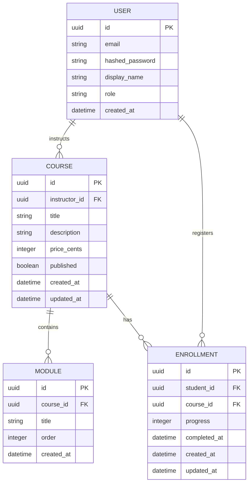
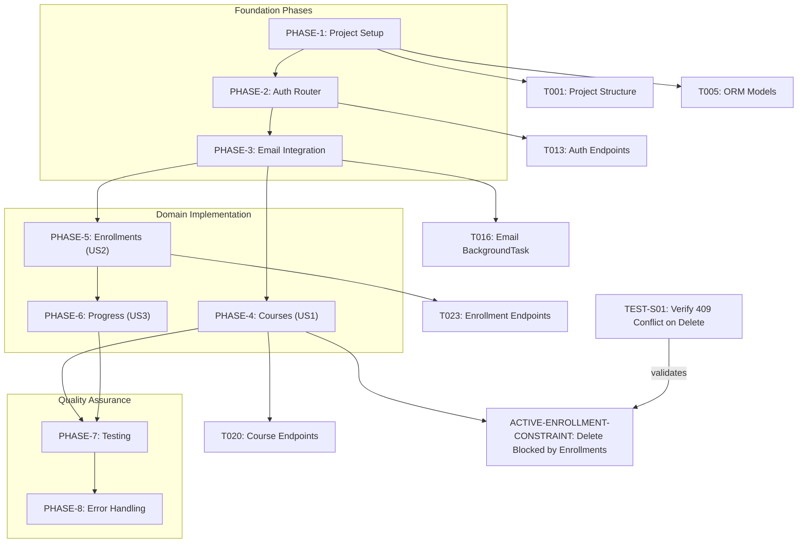
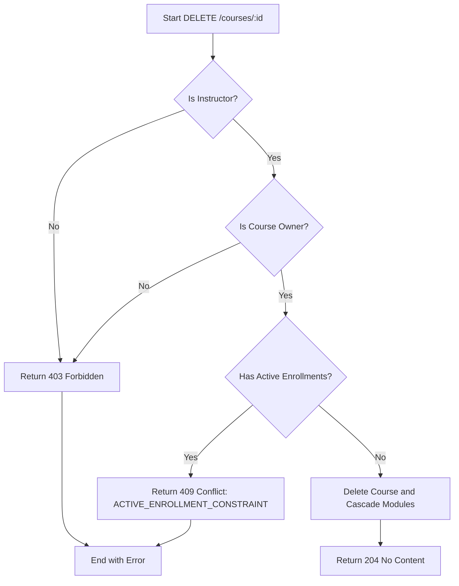
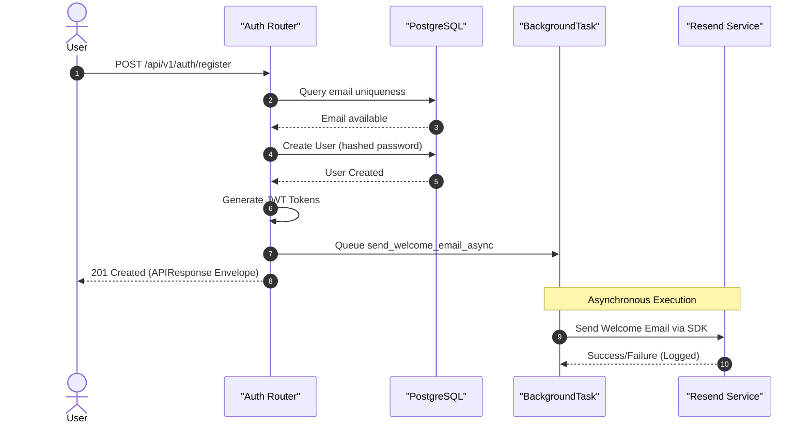

# CourseHub API - Technical Specification & Architecture Document

## 1. Executive Summary & Architecture Overview

### 1.1 Executive Brief
CourseHub API is a course management system built with FastAPI and PostgreSQL. It implements a role-based access control (RBAC) system for instructors (course CRUD and ownership) and students (enrollment and progress tracking). The architecture follows a phase-based execution strategy focusing on strict data isolation, asynchronous database operations, and a standardized API response envelope to ensure consistency and scalability.

### 1.2 Maturity Assessment
The specifications are exceptionally detailed, providing a granular task-based roadmap with clear test criteria for every phase. Despite a minor gap regarding the absence of a dedicated risk/uncertainty section, the structural completeness is near perfect. The project is READY for execution.

### 1.3 Technical Stack
* **Languages & Frameworks**: FastAPI, Pydantic v2
* **Database & ORM**: PostgreSQL, SQLAlchemy 2.0 async, asyncpg, Alembic
* **Security**: python-jose (JWT), passlib (bcrypt)
* **Testing**: pytest, pytest-asyncio, httpx
* **External Services**: Resend SDK (Email)

### 1.4 Architectural Constraints
* **Business Logic Coverage**: Target >= 80% coverage on all business logic.
* **Data Validation**: Enrollment progress values must be strictly between 0 and 100 inclusive.
* **Deletion Logic**: Course deletion is rejected if active enrollments exist (`ACTIVE-ENROLLMENT-CONSTRAINT`, 409 Conflict).
* **Integrity Constraints**: 
    * Course modules must maintain a unique constraint on `(course_id, order)`.
    * Enrollments must maintain a unique constraint on `(student_id, course_id)`.
* **Access Control**: 
    * Instructors can only manage/update courses they own (403 Forbidden if not owner).
    * Students can only access and update their own enrollments (403 Forbidden if not owner).
    * Public access to courses is restricted to those with `published = true` status.
* **API Standard**: All API responses must be wrapped in a standardized `APIResponse` envelope.
* **Token Lifecycle**: Access tokens expire in 15 minutes; Refresh tokens expire in 7 days.

### 1.5 Critical Dependencies
* **PostgreSQL**: Requires an asynchronous connection pool.
* **Environment**: `RESEND_API_KEY` must be configured for email dispatch.
* **Authentication**: JWT Access and Refresh flow for stateless session management.
* **Async Processing**: Resend SDK integrated via FastAPI `BackgroundTask`.
* **Schema Management**: Alembic migration sequence for versioning and cascading deletion of modules upon course deletion.
* **Relational Integrity**: Strict foreign key dependencies: `Enrollment` $\rightarrow$ `User` and `Course`.

## 2. Architecture Workflows & Visual Diagrams

### 2.1 Data Model (ER Diagram)

### 2.2 Implementation Roadmap & Traceability

### 2.3 Course Deletion Workflow

### 2.4 User Registration & Welcome Flow

## 3. Detailed Technical Specifications & Business Rules

### 3.1 Requirements Traceability
| Identifier | Requirement / Task Description | Source Phase | Status |
| :--- | :--- | :--- | :--- |
| PHASE-1 | Project Setup & Database Schema | Phase 1 | Ready |
| T001 | Create project structure (`app/`, `core/`, `models/`, etc.) | Phase 1 | Ready |
| T005 | Define ORM models (User, Course, Module, Enrollment) | Phase 1 | Ready |
| PHASE-2 | Auth Router & JWT Flow | Phase 2 | Ready |
| T013 | Create auth router endpoints (register, login, refresh) | Phase 2 | Ready |
| PHASE-3 | Resend Email Integration & BackgroundTask | Phase 3 | Ready |
| T016 | Integrate email into auth register endpoint via BackgroundTask | Phase 3 | Ready |
| PHASE-4 | Courses Router — Instructor Management (US1) | Phase 4 | Ready |
| T020 | Create courses router endpoints for Instructor management | Phase 4 | Ready |
| ACTIVE-ENROLLMENT-CONSTRAINT | Course cannot be deleted if it has active enrollments (409) | Phase 4 | Ready |
| PHASE-5 | Enrollments Router — Student Discovery & Enrollment (US2) | Phase 5 | Ready |
| T023 | Create enrollments router endpoints for Student discovery & enrollment | Phase 5 | Ready |
| PHASE-6 | Progress Tracking & Data Isolation (US3) | Phase 6 | Ready |
| PHASE-7 | Testing & Coverage | Phase 7 | Ready |
| TEST-S01 | Verify DELETE course with active enrollments returns 409 Conflict | Phase 7 | Ready |
| PHASE-8 | Response Envelope & Error Handling | Phase 8 | Ready |
| AC-01 | All responses wrapped in APIResponse envelope | Success Criteria | Ready |

### 3.2 Security Rules
* **Authentication**: Stateless JWT implementation. Access tokens (15m) and Refresh tokens (7d).
* **Authorization**: 
    * `get_current_user`: Validates token and identity.
    * `get_current_instructor`: Validates `role == "instructor"`.
    * `get_current_student`: Validates `role == "student"`.
* **Data Isolation**: 
    * All `GET` and `PUT` operations on enrollments must verify `student_id == current_user.id`.
    * Course updates must verify `instructor_id == current_user.id`.
* **Password Safety**: Use `bcrypt` for one-way cryptographic hashing of passwords.

### 3.3 Data Models
* **User**: `id (UUID)`, `email (unique)`, `hashed_password`, `display_name`, `role (Enum)`, `created_at`.
* **Course**: `id (UUID)`, `instructor_id (FK)`, `title`, `description`, `price_cents`, `published (bool)`, `created_at`, `updated_at`.
* **Module**: `id (UUID)`, `course_id (FK)`, `title`, `order (int)`, `created_at`. (Unique: `course_id`, `order`).
* **Enrollment**: `id (UUID)`, `student_id (FK)`, `course_id (FK)`, `progress (0-100)`, `completed_at (nullable)`, `created_at`, `updated_at`. (Unique: `student_id`, `course_id`).

## 4. Project Governance & Structural Gaps

### 4.1 Structural Gaps
| Gap ID | Missing Section | Priority | Remediation Advice |
| :--- | :--- | :--- | :--- |
| GAP-01 | Open Questions & Uncertainties | LOW | The document is highly detailed; however, a dedicated section for known risks or technical uncertainties should be added to track potential blockers. |

### 4.2 Remediation & Workflow
The project follows a strict dependency-ordered phase approach. Remediation of gaps (like GAP-01) will be handled during the "Polish" phase (Phase 8) or as part of the iterative testing cycle in Phase 7.

## 5. Technical & Domain Glossary (Terminology Reference)

| Term | Category | Context Anchor | Project Definition |
| :--- | :--- | :--- | :--- |
| API | TECHNICAL_STACK | Tasks: CourseHub API Implementation | The primary interface providing endpoint access to course management and enrollment logic. |
| ActiveEnrollmentConstraint | BUSINESS_DOMAIN | ACTIVE-ENROLLMENT-CONSTRAINT | A logic gate preventing the removal of a learning offering if student subscriptions are presently linked. |
| All | TECHNICAL_STACK | PHASE-7 | The total set of validated endpoints and logic units required to meet the target coverage percentage. |
| AsyncClient | TECHNICAL_STACK | PHASE-7 | The non-blocking HTTP request handler used within the test suite to simulate external calls. |
| AsyncSession | TECHNICAL_STACK | PHASE-1 | The asynchronous database connection handle used for transaction management and entity persistence. |
| BackgroundTask | TECHNICAL_STACK | T016 | A deferred execution mechanism used to trigger email dispatch after the primary response is returned. |
| BusinessRuleViolation | TECHNICAL_STACK | PHASE-8 | A specific exception type triggering a 409 status code when domain logic boundaries are breached. |
| CORS Standard | TECHNICAL_STACK | PHASE-8 | The security protocol governing cross-origin resource sharing for the web endpoints. |
| CRUD | TECHNICAL_STACK | Phase 4: Courses Router — Instructor Management (US1) | The four foundational persistent storage mutation primitives for managing educational content. |
| ConfigError | TECHNICAL_STACK | PHASE-3 | An exception raised when required environment variables for external services are missing. |
| CourseCreate | TECHNICAL_STACK | T020 | The data transfer object used for validating incoming payloads when initiating a new learning offering. |
| CourseResponse | TECHNICAL_STACK | T020 | The structured output schema containing the detailed attributes of a learning offering. |
| CourseUpdate | TECHNICAL_STACK | T020 | The validation schema for modifying existing attributes of a learning offering. |
| Cryptographic Hashing | TECHNICAL_STACK | PHASE-2 | The one-way transformation process used to store sensitive credentials securely using bcrypt. |
| DB | TECHNICAL_STACK | PHASE-1 | The PostgreSQL relational storage engine where all system state is persisted. |
| Dependencies | TECHNICAL_STACK | PHASE-2 | The FastAPI injection system used to provide database sessions and authenticated user contexts to routers. |
| EnrollmentCreate | TECHNICAL_STACK | T023 | The input schema for linking a student to a specific published learning offering. |
| EnrollmentResponse | TECHNICAL_STACK | T023 | The output schema detailing the current progress and completion status of a student's course link. |
| EnrollmentUpdate | TECHNICAL_STACK | T023 | The schema used to modify the completion percentage of a student's course link. |
| FK | TECHNICAL_STACK | T005 | The relational constraint ensuring referential integrity between related tables. |
| Feature | BUSINESS_DOMAIN | Tasks: CourseHub API Implementation | A high-level functional requirement delivering a specific set of capabilities to the end user. |
| HTTPException | TECHNICAL_STACK | PHASE-2 | The standard framework exception used to return specific status codes to the client. |
| ID | TECHNICAL_STACK | T005 | The unique identifier for each entity, implemented as a universally unique value. |
| ISOlation | BUSINESS_DOMAIN | PHASE-6 | The security boundary ensuring students can only access or modify their own progress data. |
| JWT | TECHNICAL_STACK | PHASE-2 | The signed token format used for stateless authentication and role verification. |
| MVP | BUSINESS_DOMAIN | MVP Scope (Phase 1 Delivery) | The smallest viable set of functional phases required for initial delivery. |
| Middleware | TECHNICAL_STACK | PHASE-8 | The interceptor layer used to wrap all successful responses in a consistent envelope. |
| ModuleCreate | TECHNICAL_STACK | T020 | The input schema for defining a sub-unit of a course including its sequence order. |
| ModuleResponse | TECHNICAL_STACK | T020 | The output schema for a course sub-unit, including its generated identifier. |
| NOT | TECHNICAL_STACK | T013 | The logical inversion applied to deferred operations, such as avoiding email dispatch during initial registration. |
| ORM | TECHNICAL_STACK | T005 | The mapping layer provided by SQLAlchemy 2.0 to interact with the database using Python objects. |
| Parallelization Opportunities | TECHNICAL_STACK | Dependency Graph | The architectural possibility of developing Domain phases 4, 5, and 6 simultaneously after the foundation is set. |
| PermissionError | TECHNICAL_STACK | PHASE-8 | An exception thrown when an authenticated user attempts an operation beyond their assigned role. |
| Raise | TECHNICAL_STACK | PHASE-2 | The mechanism of triggering an exception to interrupt the request flow and return an error response. |
| Reference | TECHNICAL_STACK | Tasks: CourseHub API Implementation | The external documentation links providing the underlying specifications and plans. |
| Return | TECHNICAL_STACK | T013 | The delivery of the final wrapped response payload to the requesting client. |
| SDK | TECHNICAL_STACK | PHASE-3 | The official Python library provided by the email service for programmatic message delivery. |
| SQLAlchemy 2.0 | TECHNICAL_STACK | PHASE-1 | The asynchronous relational mapping toolkit used for database interactions. |
| Target | TECHNICAL_STACK | PHASE-7 | The minimum acceptable threshold of 80% for business logic code coverage. |
| Test Criteria | TECHNICAL_STACK | PHASE-1 | The specific validation checkpoints used to confirm the successful completion of a task. |
| TokenResponse | TECHNICAL_STACK | T013 | The schema delivering the access and refresh credentials upon successful authentication. |
| UUID | TECHNICAL_STACK | T005 | The 128-bit unique identifier used for primary keys across all tables. |
| UserLogin | TECHNICAL_STACK | T013 | The input schema for verifying identity using email and password credentials. |
| UserRegister | TECHNICAL_STACK | T013 | The input schema for creating a new account, including email and credential validation. |
| UserResponse | TECHNICAL_STACK | T013 | The sanitized user profile schema returned after registration or login. |
| ValidationError | TECHNICAL_STACK | PHASE-8 | An exception raised by Pydantic when input data fails to match the defined schema. |
| ValueError | TECHNICAL_STACK | PHASE-8 | A standard exception used to signal invalid domain values, such as progress outside 0-100. |
| alembic init | TECHNICAL_STACK | PHASE-1 | The command used to set up the asynchronous migration environment for the database schema. |