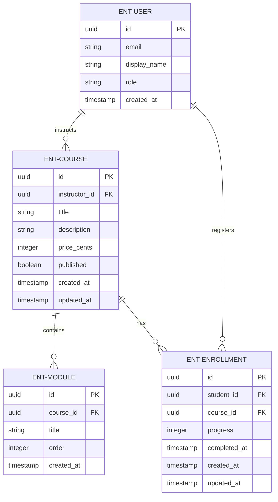
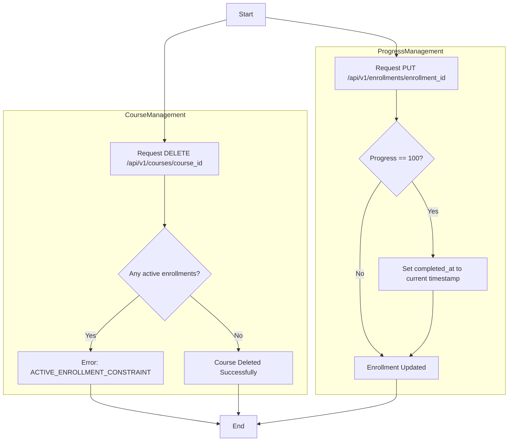
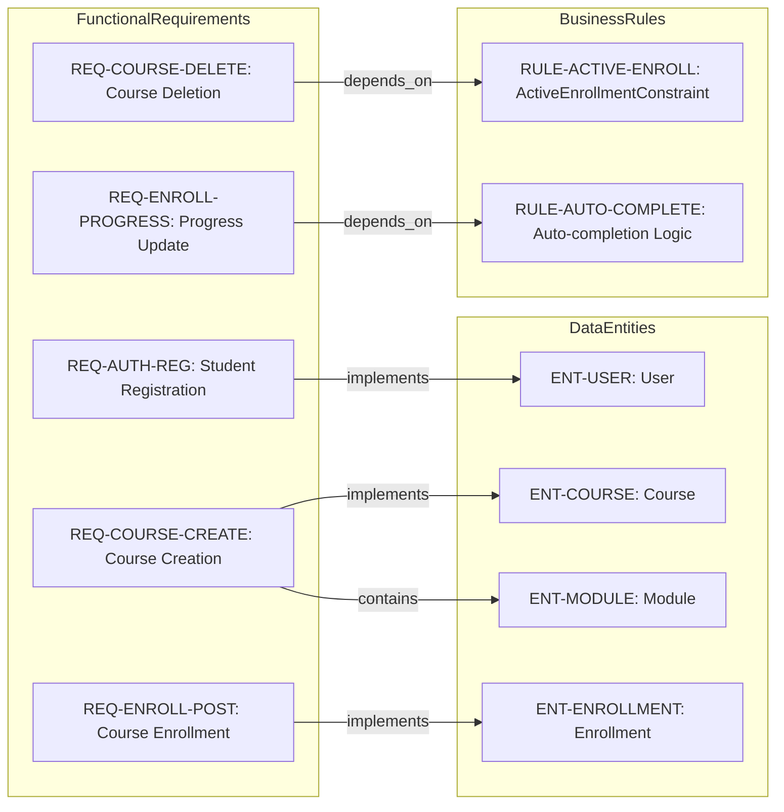
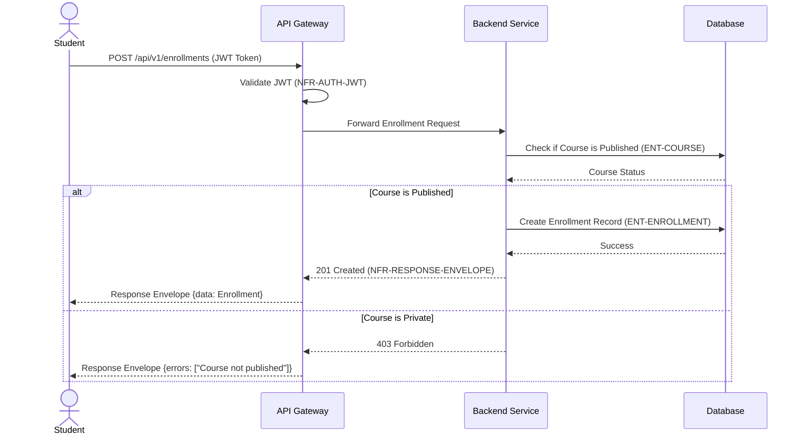

# CourseHub - Technical Specification & Architecture Document

## 1. Executive Summary & Architecture Overview

### 1.1 Executive Brief
CourseHub is a RESTful API providing a managed ecosystem for course creation and student enrollment. The platform implements a role-based access control system separating Instructor and Student capabilities, centered around a relational data pattern linking users to courses through enrollment entities. The architecture focuses on secure resource management and progress tracking via a standardized response envelope and JWT authentication.

### 1.2 Maturity Assessment
The specification is technically robust and logically consistent, with a high health index and no high-severity gaps. While the core API contracts and business rules are fully defined, there are missing high-level strategic definitions regarding project goals and out-of-scope boundaries. Despite these minor documentation omissions, the technical depth is sufficient for implementation. Status: READY.

### 1.3 Technical Stack
* **Authentication**: JWT (JSON Web Token)
* **Data Format**: JSON
* **Identifier Standard**: UUID
* **Password Security**: bcrypt

### 1.4 Architectural Constraints
* **Authentication**: JWT Bearer tokens required in Authorization header.
* **Response Format**: Mandatory consistent envelope containing 'data', 'meta', and 'errors' fields.
* **Course Deletion**: Forbidden if active enrollments exist (ActiveEnrollmentConstraint).
* **Progress Validation**: Values must be between 0 and 100 inclusive.
* **Auto-completion Logic**: `completed_at` timestamp must be automatically set when progress reaches 100.
* **Role Isolation**: Instructors restricted to managing only their own courses; Students restricted to accessing and updating only their own enrollments.

### 1.5 Critical Dependencies
* JWT Bearer Token validation mechanism.
* Strict foreign key dependence of Enrollment entity on User and Course entities.
* Referential integrity between Courses and their constituent Modules.
* Role-based authorization middleware for endpoint access (Student vs Instructor).
* System clock for auto-completion timestamp generation.

## 2. Architecture Workflows & Visual Diagrams

### 2.1 CourseHub Data Model


### 2.2 Course Deletion & Enrollment Workflow


### 2.3 Requirements Traceability Matrix


### 2.4 Course Enrollment Sequence


## 3. Detailed Technical Specifications & Business Rules

### 3.1 Requirements Traceability
| Identifier | Type | Description | Source Section |
| :--- | :--- | :--- | :--- |
| **NFR-AUTH-JWT** | Non-Functional | Authentication must use JWT Bearer tokens in the Authorization header. | API Overview |
| **NFR-RESPONSE-ENVELOPE** | Non-Functional | All responses must follow a consistent envelope including 'data', 'meta', and 'errors' fields. | Response Envelope |
| **REQ-AUTH-REG** | Functional | Allow students to self-register with email, password, and display name. | POST `/api/v1/auth/register` |
| **REQ-AUTH-LOGIN** | Functional | Allow authenticated users (student/instructor) to login via email and password. | POST `/api/v1/auth/login` |
| **REQ-COURSE-CREATE** | Functional | Instructors can create courses with modules, title, description, and pricing. | POST `/api/v1/courses` |
| **REQ-COURSE-DELETE** | Functional | Instructors can delete their own courses provided there are no active enrollments. | DELETE `/api/v1/courses/{course_id}` |
| **REQ-ENROLL-POST** | Functional | Students can enroll in published courses. | POST `/api/v1/enrollments` |
| **REQ-ENROLL-PROGRESS** | Functional | Students can update their course progress (0-100%). | PUT `/api/v1/enrollments/{enrollment_id}` |
| **ENT-USER** | Entity | User entity containing id, email, display_name, and role (student\|instructor). | User |
| **ENT-COURSE** | Entity | Course entity containing title, description, price, publishing status, and instructor reference. | Course |
| **ENT-MODULE** | Entity | Module entity belonging to a course with a specific display order. | Module |
| **ENT-ENROLLMENT** | Entity | Enrollment entity linking a student to a course with progress tracking. | Enrollment |
| **RULE-ACTIVE-ENROLL** | Constraint | ActiveEnrollmentConstraint: A course cannot be deleted if it has active enrollments. | DELETE `/api/v1/courses/{course_id}` |
| **RULE-AUTO-COMPLETE** | Constraint | If progress is set to 100 and completed_at is null, completed_at must be automatically set to current timestamp. | PUT `/api/v1/enrollments/{enrollment_id}` |

### 3.2 Security Rules
* **Authentication**: All protected endpoints require a `Authorization: Bearer <token>` header.
* **Authorization**: Role-based access control (RBAC) is enforced:
    * **Student**: Limited to self-registration, enrollment, and updating their own progress.
    * **Instructor**: Limited to creating, updating, and deleting courses they own.
* **Credential Storage**: Passwords must be stored using bcrypt cryptographic hashing; `hashed_password` must never be returned in API responses.

### 3.3 Data Models

#### User (ENT-USER)
```typescript
{
  "id": "uuid",
  "email": "string (unique, valid email)",
  "display_name": "string",
  "role": "student" | "instructor",
  "created_at": "ISO 8601 timestamp",
  "hashed_password": "bcrypt hash (not returned in responses)"
}
```

#### Course (ENT-COURSE)
```typescript
{
  "id": "uuid",
  "instructor_id": "uuid (FK → User)",
  "title": "string",
  "description": "string",
  "price_cents": "integer (>= 0)",
  "published": "boolean",
  "created_at": "ISO 8601 timestamp",
  "updated_at": "ISO 8601 timestamp",
  "modules": "array of Module"
}
```

#### Module (ENT-MODULE)
```typescript
{
  "id": "uuid",
  "course_id": "uuid (FK → Course)",
  "title": "string",
  "order": "integer (>= 1)",
  "created_at": "ISO 8601 timestamp"
}
```

#### Enrollment (ENT-ENROLLMENT)
```typescript
{
  "id": "uuid",
  "student_id": "uuid (FK → User)",
  "course_id": "uuid (FK → Course)",
  "progress": "integer (0-100)",
  "completed_at": "ISO 8601 timestamp | null",
  "created_at": "ISO 8601 timestamp",
  "updated_at": "ISO 8601 timestamp"
}
```

## 4. Project Governance & Structural Gaps

### 4.1 Structural Gaps
| Missing Section | Priority | Remediation Advice |
| :--- | :--- | :--- |
| Goals & Objectives | MEDIUM | Add a section defining the high-level goals of the CourseHub API. |
| Scope & Out-of-Scope | LOW | Define what the API does NOT handle (e.g., payment processing details). |
| Open Questions & Uncertainties | LOW | List any undecided technical details regarding token expiration or scaling. |

### 4.2 Remediation & Workflow
The identified gaps are primarily strategic rather than technical. The remediation workflow involves a stakeholder review to define the project's boundaries and high-level objectives, which will then be appended to the "Executive Summary" and a new "Project Scope" section.

## 5. Technical & Domain Glossary (Terminology Reference)

| Term | Category | Context Anchor | Project Definition |
| :--- | :--- | :--- | :--- |
| API | TECHNICAL_STACK | API Overview | The set of RESTful endpoints under version v1 used for managing education data. |
| ActiveEnrollmentConstraint | BUSINESS_DOMAIN | RULE-ACTIVE-ENROLL | A restriction preventing the removal of an educational offering when students are currently attached to it. |
| Authentication | TECHNICAL_STACK | NFR-AUTH-JWT | The security process ensuring identity verification via bearer tokens in the request header. |
| CORS Standard | TECHNICAL_STACK | API Overview | The implicit cross-origin resource sharing mechanism required for the frontend to communicate with the backend host. |
| Cryptographic Hashing | TECHNICAL_STACK | ENT-USER | The one-way transformation of passwords using the bcrypt algorithm to ensure credential privacy. |
| FK | TECHNICAL_STACK | ENT-COURSE | A relational pointer linking a child entity to a parent record's primary identifier. |
| Fixed-Point Numeric Constraint | TECHNICAL_STACK | ENT-COURSE | The representation of monetary values as integers in cents to avoid floating point precision errors. |
| JSON | TECHNICAL_STACK | NFR-RESPONSE-ENVELOPE | The lightweight data-interchange format used for all request and response payloads. |
| JWT | TECHNICAL_STACK | NFR-AUTH-JWT | The compact, URL-safe means of representing claims to be transferred between two parties. |
| Role | BUSINESS_DOMAIN | ENT-USER | The specific permission level assigned to a profile, namely student or instructor. |
| UUID | TECHNICAL_STACK | ENT-USER | The 128-bit universally unique identifier used as the primary key for all entities. |