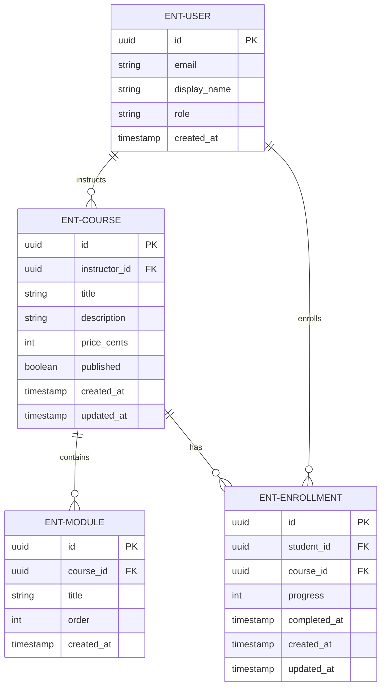
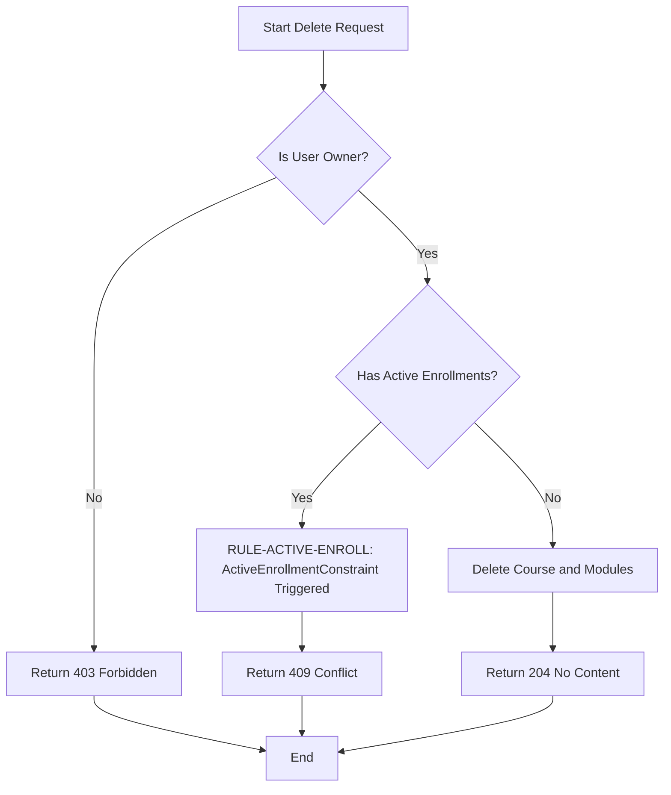
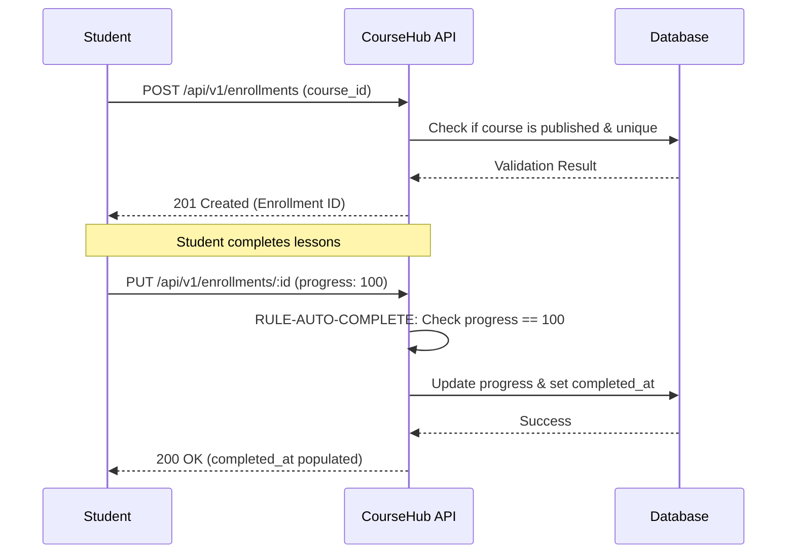
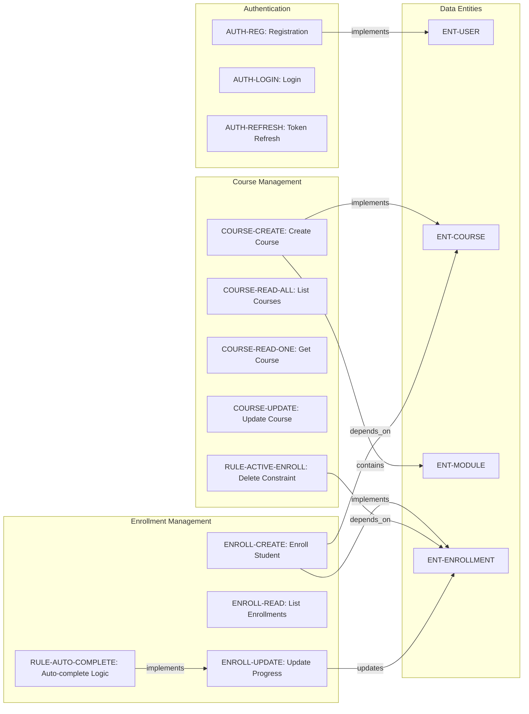

# CourseHub - Technical Specification & Architecture Document

## 1. Executive Summary & Architecture Overview

### 1.1 Executive Brief
CourseHub is a RESTful API platform designed for course management and student enrollment. It employs a JWT-based authentication system and provides distinct workflows for Instructors to manage courses and Students to track learning progress. The architecture focuses on a strict ownership-based access model and automated progress tracking within a structured course-module hierarchy.

### 1.2 Maturity Assessment
The project is technically cohesive but currently requires REFINEMENT. While the API contracts and entity relationships are well-defined, the lack of high-level business goals and an explicit scope definition creates a strategic gap. Specifically, the absence of a payment processing workflow despite the presence of 'price_cents' indicates a functional disconnect that must be addressed before full implementation.

### 1.3 Technical Stack
* **Authentication**: JWT (JSON Web Token)
* **Email Service**: Resend
* **Data Format**: JSON
* **Identifier Standard**: UUID
* **Password Security**: bcrypt

### 1.4 Architectural Constraints
* **Base URL**: `http://localhost:8000/api/v1`
* **Content-Type**: `application/json`
* **Token Expiry**: Access tokens expire in 15 minutes; Refresh tokens expire in 7 days.
* **Enrollment Logic**: Progress must be within the range 0-100 inclusive.
* **Deletion Logic**: Course deletion is rejected with a 409 Conflict if active enrollments exist.
* **Uniqueness**: Student/Course pair must be unique for enrollments.
* **Visibility**: Only published courses are accessible to students or the public.
* **Isolation**: Instructors can only manage/read courses they own; Students can only access/update their own enrollments.

### 1.5 Critical Dependencies
* **Resend**: Mandatory for asynchronous background email delivery.
* **JWT Bearer Token**: Mandatory for all protected routes.
* **Cascade Deletion**: Modules must be deleted upon successful course deletion.
* **Referential Integrity**: Enrollment depends strictly on User and Course entities.
* **ActiveEnrollmentConstraint**: Blocking gate for course deletion logic.

## 2. Architecture Workflows & Visual Diagrams

### 2.1 CourseHub Data Model


### 2.2 Course Deletion & Enrollment Workflow


### 2.3 Student Enrollment & Progress Update Sequence


### 2.4 Requirements Traceability Matrix


## 3. Detailed Technical Specifications & Business Rules

### 3.1 Requirements Traceability
| Identifier | Type | Requirement Description | Source Section |
| :--- | :--- | :--- | :--- |
| INFRA-BASEURL | NFR | Base URL is http://localhost:8000/api/v1 with application/json content type. | API Overview |
| AUTH-JWT | NFR | Authentication requires JWT Bearer tokens in the Authorization header. | API Overview |
| RESPONSE-ENVELOPE | NFR | All responses must follow a consistent envelope containing data, meta, and errors. | Response Envelope |
| AUTH-REG | FR | Students can self-register providing email, password, and display name. Triggers async welcome email via Resend. | POST `/api/v1/auth/register` |
| AUTH-LOGIN | FR | Public users (student or instructor) can login with email and password to receive access and refresh tokens. | POST `/api/v1/auth/login` |
| AUTH-REFRESH | FR | Public users can refresh their access token using a valid refresh token. Access token lasts 15m, refresh token lasts 7 days. | POST `/api/v1/auth/refresh` |
| COURSE-CREATE | FR | Instructors can create courses including title, description, price, published status, and a list of modules. | POST `/api/v1/courses` |
| COURSE-READ-ALL | FR | Instructors can list their own courses with pagination (skip/limit). | GET `/api/v1/courses` |
| COURSE-READ-ONE | FR | Courses are readable by public/students if published; owners can always read their courses. | GET `/api/v1/courses/{course_id}` |
| COURSE-UPDATE | FR | Course owners can update course details (title, description, price, published status). | PUT `/api/v1/courses/{course_id}` |
| RULE-ACTIVE-ENROLL | Constraint | ActiveEnrollmentConstraint: A course cannot be deleted if it has active enrollments (409 Conflict). | DELETE `/api/v1/courses/{course_id}` |
| ENROLL-CREATE | FR | Students can enroll in a published course. Enrollment must be unique per student/course pair. | POST `/api/v1/enrollments` |
| ENROLL-READ | FR | Students can list and retrieve their own enrollments. | GET `/api/v1/enrollments` |
| ENROLL-UPDATE | FR | Students can update their enrollment progress (0-100). | PUT `/api/v1/enrollments/{enrollment_id}` |
| RULE-AUTO-COMPLETE | FR | If progress is set to 100 and completed_at is null, completed_at is automatically set to current timestamp. | PUT `/api/v1/enrollments/{enrollment_id}` |
| ENT-USER | Entity | User: uuid, email, display_name, role (student\|instructor), created_at. | User |
| ENT-COURSE | Entity | Course: uuid, instructor_id, title, description, price_cents, published, timestamps, modules. | Course |
| ENT-MODULE | Entity | Module: uuid, course_id, title, order, created_at. | Module |
| ENT-ENROLLMENT | Entity | Enrollment: uuid, student_id, course_id, progress, completed_at, timestamps. | Enrollment |

### 3.2 Security Rules
* **Authentication**: All protected endpoints require a `Authorization: Bearer <token>` header.
* **Authorization**: 
    * **Instructor Role**: Required for `POST /courses`, `GET /courses` (own), `PUT /courses/{id}` (own), and `DELETE /courses/{id}` (own).
    * **Student Role**: Required for `POST /enrollments`, `GET /enrollments`, and `PUT /enrollments/{id}` (own).
* **Data Protection**: Hashed passwords (bcrypt) must never be returned in API responses.

### 3.3 Data Models
#### ENT-USER
```typescript
{
  "id": "uuid",
  "email": "string (unique, valid email)",
  "display_name": "string",
  "role": "student" | "instructor",
  "created_at": "ISO 8601 timestamp",
  "hashed_password": "bcrypt hash (not returned in responses)"
}
```
#### ENT-COURSE
```typescript
{
  "id": "uuid",
  "instructor_id": "uuid (FK → User)",
  "title": "string",
  "description": "string",
  "price_cents": "integer (>= 0)",
  "published": "boolean",
  "created_at": "ISO 8601 timestamp",
  "updated_at": "ISO 8601 timestamp",
  "modules": "array of Module"
}
```
#### ENT-MODULE
```typescript
{
  "id": "uuid",
  "course_id": "uuid (FK → Course)",
  "title": "string",
  "order": "integer (>= 1)",
  "created_at": "ISO 8601 timestamp"
}
```
#### ENT-ENROLLMENT
```typescript
{
  "id": "uuid",
  "student_id": "uuid (FK → User)",
  "course_id": "uuid (FK → Course)",
  "progress": "integer (0-100)",
  "completed_at": "ISO 8601 timestamp | null",
  "created_at": "ISO 8601 timestamp",
  "updated_at": "ISO 8601 timestamp"
}
```

## 4. Project Governance & Structural Gaps

### 4.1 Structural Gaps
| Gap | Priority | Remediation Advice |
| :--- | :--- | :--- |
| Goals & Objectives | HIGH | The document is purely technical. Business goals (e.g., target market, KPIs for the platform) are missing. |
| Scope & Out-of-Scope | MEDIUM | Define what the API is NOT doing (e.g., payment processing is implied by price_cents but not explicitly handled by endpoints). |
| Open Questions & Uncertainties | LOW | No known unknowns were listed in the document. |

### 4.2 Remediation & Workflow
To resolve the identified gaps, the project must undergo a refinement phase where business stakeholders define the target KPIs and the explicit boundaries of the API scope, particularly regarding the financial transaction layer for course purchases.

## 5. Technical & Domain Glossary (Terminology Reference)

| Term | Category | Context Anchor | Project Definition |
| :--- | :--- | :--- | :--- |
| API | TECHNICAL_STACK | INFRA-BASEURL | The set of endpoints hosted at localhost:8000/api/v1 using a specific content type for data exchange. |
| ActiveEnrollmentConstraint | BUSINESS_DOMAIN | RULE-ACTIVE-ENROLL | A restrictive logic that prevents the removal of a course if learners are currently associated with it. |
| Authentication | TECHNICAL_STACK | AUTH-JWT | The mechanism requiring bearer tokens in the authorization header to verify identity. |
| BackgroundTask | TECHNICAL_STACK | AUTH-REG | An asynchronous process used for sending welcome communications via an external provider without delaying the response. |
| Behavior | BUSINESS_DOMAIN | COURSE-READ-ONE | The conditional logic determining visibility based on ownership or publication status. |
| Business Rule | BUSINESS_DOMAIN | RULE-ACTIVE-ENROLL | A deterministic operational constraint that mandates a 409 conflict when specific state conditions are met. |
| CORS Standard | TECHNICAL_STACK | INFRA-BASEURL | The implicit protocol governing cross-origin resource sharing for the defined base URL. |
| Cryptographic Hashing | TECHNICAL_STACK | ENT-USER | The application of bcrypt to secure credentials so they are not returned in plain text. |
| Error Response | TECHNICAL_STACK | RESPONSE-ENVELOPE | A structured payload containing a code, a message, and an optional field reference during failure scenarios. |
| FK | TECHNICAL_STACK | ENT-COURSE | A relational link mapping a child entity to a parent identifier. |
| Fixed-Point Numeric Constraint | TECHNICAL_STACK | ENT-COURSE | The use of integers to represent currency values in cents to avoid floating point inaccuracies. |
| JSON | TECHNICAL_STACK | INFRA-BASEURL | The primary data exchange format specified in the content-type header. |
| JWT | TECHNICAL_STACK | AUTH-JWT | The token-based security standard used for access and refresh operations. |
| Module | BUSINESS_DOMAIN | ENT-MODULE | A structural subunit of a course characterized by a title and a specific sequence order. |
| NOT | BUSINESS_DOMAIN | AUTH-REG | A logical negation ensuring that side effects like emails do not obstruct the completion of a request. |
| Query Parameters | TECHNICAL_STACK | COURSE-READ-ALL | Optional URL modifiers used for pagination via skip and limit integers. |
| Request | TECHNICAL_STACK | AUTH-REG | The incoming data payload sent by the client to an endpoint. |
| Response | TECHNICAL_STACK | RESPONSE-ENVELOPE | The outgoing data payload wrapped in a consistent envelope including metadata and results. |
| Role | BUSINESS_DOMAIN | ENT-USER | A classification distinguishing between students and instructors to enforce access control. |
| UUID | TECHNICAL_STACK | ENT-USER | The globally unique identifier format used for all primary entity keys. |