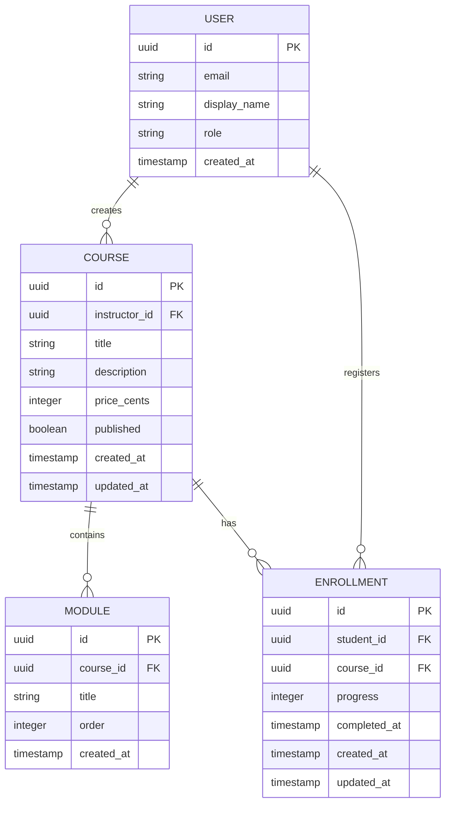
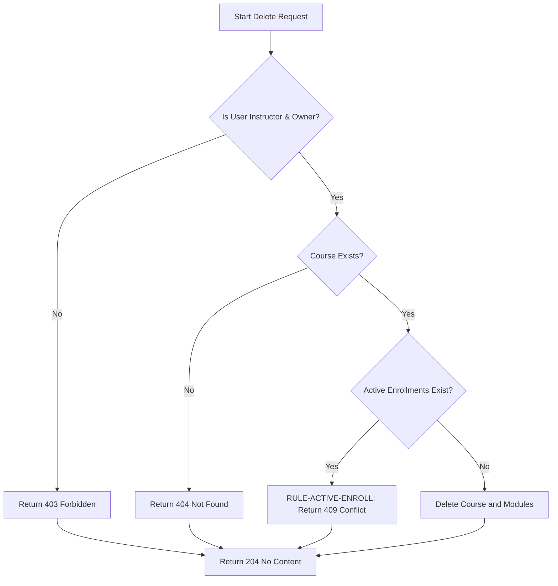
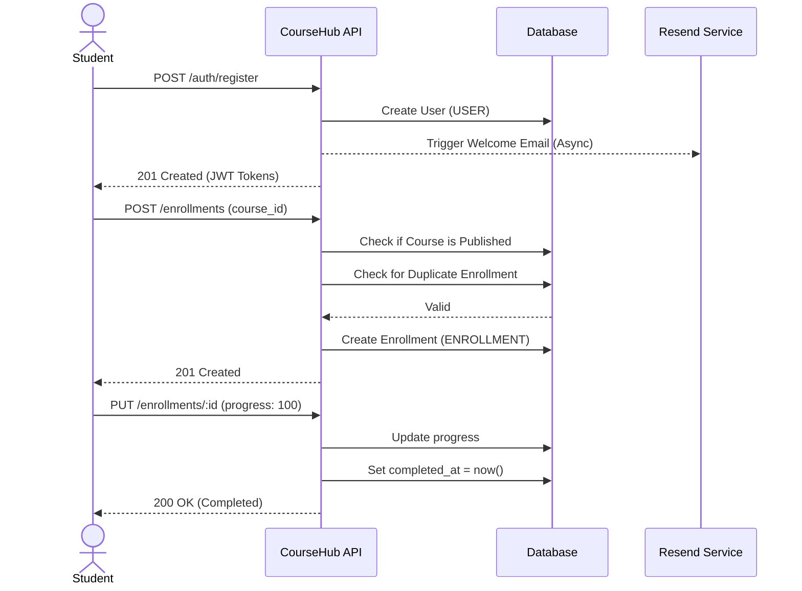
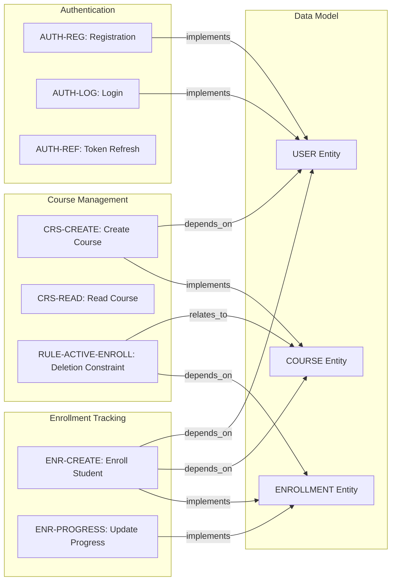

# CourseHub - Technical Specification & Architecture Document

## 1. Executive Summary & Architecture Overview

### 1.1 Executive Brief
CourseHub is a course management API providing secure authentication, course lifecycle management, and student enrollment tracking. It implements a role-based access control system (Student/Instructor) using JWT Bearer tokens and manages content distribution based on publication status. The system enforces strict data integrity via enrollment-based deletion guards and automated completion tracking.

### 1.2 Maturity Assessment
The project is in a REFINEMENT state. While the API contracts are comprehensive and the technical mappings are stable, there are critical structural gaps regarding high-level business goals and success metrics. The lack of an explicit scope definition (particularly regarding payment processing and content delivery) creates ambiguity for final implementation.

### 1.3 Technical Stack
* **Authentication**: JWT (JSON Web Tokens)
* **Email Service**: Resend
* **Data Format**: JSON
* **Identifier Standard**: UUID

### 1.4 Architectural Constraints
* **Base URL**: `http://localhost:8000/api/v1`
* **Content-Type**: `application/json`
* **Token Expiry**: Access token (15 minutes), Refresh token (7 days)
* **Monetary Values**: Course price must be strictly in cents (integer >= 0)
* **Ordering**: Module order must be an integer >= 1
* **Progress Tracking**: Enrollment progress must be between 0 and 100 inclusive
* **Deletion Guard**: Course deletion is rejected with 409 Conflict if active enrollments exist
* **Enrollment Logic**: Unique constraint on student-course pair; Course must be published to allow enrollment
* **Access Control**: 
    * Non-owners/Students can only access courses if `published == true`
    * Instructors can only manage, delete, or list courses they own
    * Students can only access and update their own enrollments

### 1.5 Critical Dependencies
* **Resend**: Async BackgroundTask for welcome emails.
* **JWT Bearer tokens**: Required for all protected Authorization headers.
* **Cascading Deletion**: Modules must be deleted upon successful course deletion.
* **Referential Integrity**: Enrollment has strict foreign key dependence on User and Course entities.
* **Automatic Trigger**: System must set `completed_at` timestamp when `progress == 100`.

## 2. Architecture Workflows & Visual Diagrams

### 2.1 CourseHub Data Model


### 2.2 Course Deletion Workflow


### 2.3 Student Enrollment & Progress Sequence


### 2.4 Requirements Traceability Map


## 3. Detailed Technical Specifications & Business Rules

### 3.1 Requirements Traceability
| ID | Type | Requirement Description | Source Section |
|:---|:---|:---|:---|
| **USER** | Entity | User entity containing id, email, display_name, role, and created_at. | User |
| **COURSE** | Entity | Course entity with title, description, price, publication status and associated modules. | Course |
| **MODULE** | Entity | Course module with title and ordering. | Module |
| **ENROLLMENT** | Entity | Enrollment record linking student to course with progress tracking. | Enrollment |
| **AUTH-REG** | Functional | Allow student self-registration via POST /api/v1/auth/register with async welcome email. | POST `/api/v1/auth/register` |
| **AUTH-LOG** | Functional | Allow user authentication via POST /api/v1/auth/login returning JWT tokens. | POST `/api/v1/auth/login` |
| **AUTH-REF** | Functional | Allow JWT access token refresh via POST /api/v1/auth/refresh. | POST `/api/v1/auth/refresh` |
| **CRS-CREATE** | Functional | Allow instructors to create courses and modules via POST /api/v1/courses. | POST `/api/v1/courses` |
| **CRS-READ** | Functional | Provide access to courses based on publication status and ownership via GET /api/v1/courses/{id}. | GET `/api/v1/courses/{course_id}` |
| **RULE-ACTIVE-ENROLL** | Constraint | ActiveEnrollmentConstraint: Courses with active enrollments cannot be deleted (409 Conflict). | DELETE `/api/v1/courses/{course_id}` |
| **ENR-CREATE** | Functional | Allow students to enroll in published courses via POST /api/v1/enrollments. | POST `/api/v1/enrollments` |
| **ENR-PROGRESS** | Functional | Allow students to update progress. Auto-set completed_at if progress reaches 100%. | PUT `/api/v1/enrollments/{enrollment_id}` |
| **NFR-ENVELOPE** | Non-Functional | All API responses must use a consistent envelope containing data, meta, and errors. | Response Envelope |
| **NFR-AUTH-JWT** | Non-Functional | Authentication must be handled via JWT Bearer tokens in the Authorization header. | API Overview |

### 3.2 Security Rules
* **Authentication**: All protected endpoints require a `Authorization: Bearer <token>` header.
* **Role-Based Access Control (RBAC)**:
    * **Instructor**: Can create, update, and delete their own courses.
    * **Student**: Can register, enroll in published courses, and update their own progress.
* **Visibility**: Courses are hidden from non-owners unless `published` is set to `true`.
* **Password Security**: Passwords must be stored using bcrypt cryptographic hashing and never returned in API responses.

### 3.3 Data Models

#### User
```typescript
{
  "id": "uuid",
  "email": "string (unique, valid email)",
  "display_name": "string",
  "role": "student" | "instructor",
  "created_at": "ISO 8601 timestamp",
  "hashed_password": "bcrypt hash (not returned in responses)"
}
```

#### Course
```typescript
{
  "id": "uuid",
  "instructor_id": "uuid (FK → User)",
  "title": "string",
  "description": "string",
  "price_cents": "integer (>= 0)",
  "published": "boolean",
  "created_at": "ISO 8601 timestamp",
  "updated_at": "ISO 8601 timestamp",
  "modules": "array of Module"
}
```

#### Module
```typescript
{
  "id": "uuid",
  "course_id": "uuid (FK → Course)",
  "title": "string",
  "order": "integer (>= 1)",
  "created_at": "ISO 8601 timestamp"
}
```

#### Enrollment
```typescript
{
  "id": "uuid",
  "student_id": "uuid (FK → User)",
  "course_id": "uuid (FK → Course)",
  "progress": "integer (0-100)",
  "completed_at": "ISO 8601 timestamp | null",
  "created_at": "ISO 8601 timestamp",
  "updated_at": "ISO 8601 timestamp"
}
```

## 4. Project Governance & Structural Gaps

### 4.1 Structural Gaps
| Gap | Priority | Remediation Advice |
|:---|:---|:---|
| **Goals & Objectives** | HIGH | The document is a technical contract. The high-level business goals and success metrics are missing and should be defined in a companion spec.md. |
| **Scope & Out-of-Scope** | MEDIUM | Explicitly define what the API does not handle (e.g., payment processing details, content delivery mechanisms). |
| **Open Questions & Uncertainties** | LOW | Add a section to track API versioning strategies or future endpoint additions. |

### 4.2 Remediation & Workflow
To resolve the identified gaps, the project lead should initiate a "Business Alignment" phase to define the product vision and scope. Once the `spec.md` is updated with business goals, the technical specifications should be cross-referenced to ensure all functional requirements map back to a specific business objective.

## 5. Technical & Domain Glossary (Terminology Reference)

| Term | Category | Context Anchor | Project Definition |
|:---|:---|:---|:---|
| API | TECHNICAL_STACK | API Overview | The set of v1 endpoints hosted at localhost:8000 providing programmatic access to educational resources. |
| ActiveEnrollmentConstraint | BUSINESS_DOMAIN | RULE-ACTIVE-ENROLL | A safety logic preventing the removal of a learning track if participants are currently registered. |
| Authentication | TECHNICAL_STACK | NFR-AUTH-JWT | The verification process utilizing bearer tokens transmitted via the security header. |
| BackgroundTask | TECHNICAL_STACK | AUTH-REG | An asynchronous operation for dispatching welcome communications that does not obstruct the primary response cycle. |
| Behavior | BUSINESS_DOMAIN | GET `/api/v1/courses/{course_id}` | The specific logic determining resource visibility based on publication status or ownership. |
| Business Rule | BUSINESS_DOMAIN | DELETE `/api/v1/courses/{course_id}` | A formal system constraint that dictates the outcome of a request based on domain-specific state. |
| CORS Standard | TECHNICAL_STACK | API Overview | The implicit cross-origin resource sharing policy governing browser-based interactions with the backend. |
| COURSE | BUSINESS_DOMAIN | COURSE | An educational entity consisting of a title, a price in cents, a visibility toggle, and a sequence of learning units. |
| Cryptographic Hashing | TECHNICAL_STACK | USER | The use of the bcrypt algorithm to secure passwords before storage. |
| ENROLLMENT | BUSINESS_DOMAIN | ENROLLMENT | A relational record linking a learner to a track with a completion percentage between 0 and 100. |
| Error Response | TECHNICAL_STACK | Response Envelope | A standardized object containing a failure code and a descriptive message when a request cannot be fulfilled. |
| FK | TECHNICAL_STACK | COURSE | A relational database pointer ensuring referential integrity between entities. |
| Fixed-Point Numeric Constraint | TECHNICAL_STACK | COURSE | The representation of monetary values as integers in the smallest currency unit to avoid floating-point inaccuracies. |
| JSON | TECHNICAL_STACK | API Overview | The primary data exchange format used for all request and response payloads. |
| JWT | TECHNICAL_STACK | NFR-AUTH-JWT | Compact and self-contained signed tokens used for secure identity propagation. |
| MODULE | BUSINESS_DOMAIN | MODULE | A structured component of a learning track identified by an integer sequence. |
| NOT | TECHNICAL_STACK | AUTH-REG | A logical negation operator applied to process flow, specifically regarding non-blocking operations. |
| OR | BUSINESS_DOMAIN | GET `/api/v1/courses/{course_id}` | A logical disjunction used to grant access if either publication status is true or the user is the creator. |
| Python | BUSINESS_DOMAIN | POST `/api/v1/courses` | The specific programming language subject being taught within the learning tracks. |
| Query Parameters | TECHNICAL_STACK | GET `/api/v1/courses` | Optional key-value pairs used for pagination through skip and limit variables. |
| Reference | TECHNICAL_STACK | API Contracts: CourseHub | The external mapping to the specification and planning markdown files. |
| Request | TECHNICAL_STACK | POST `/api/v1/auth/register` | The incoming data payload sent by the client to a specific endpoint. |
| Response | TECHNICAL_STACK | Response Envelope | The outgoing payload containing data and metadata returned by the server. |
| Role | BUSINESS_DOMAIN | USER | The classification of a user as either a student or an instructor, determining permission levels. |
| USER | BUSINESS_DOMAIN | USER | The core account entity holding identity, contact details, and authorization level. |
| UUID | TECHNICAL_STACK | USER | The 128-bit unique identifier used as the primary key for all system entities. |