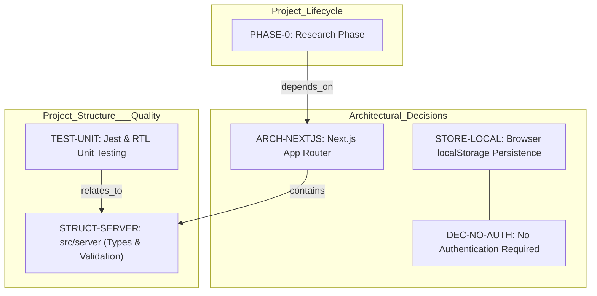
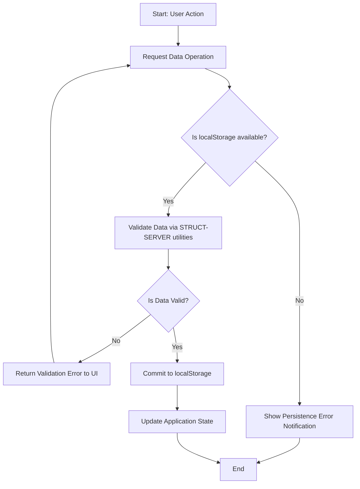

# Expense Tracker - Technical Specification & Architecture Document

## 1. Executive Summary & Architecture Overview

### 1.1 Executive Brief
The Expense Tracker is a single-user financial management application built on Next.js App Router. It employs a client-side persistence pattern using localStorage, bypassing the need for a backend database. The architecture leverages Server Components and a dedicated shared server-side directory for type safety and validation utilities.

### 1.2 Maturity Assessment
The project is currently in the **NEEDS_REFINEMENT** state. While the high-level framework and structural choices are defined, there is a critical lack of formal Data Models and Schemas, as well as undefined API contracts. The current state relies on a research phase (PHASE-0) to bridge these structural gaps before full execution can begin.

### 1.3 Technical Stack
* Next.js
* Jest
* React Testing Library

### 1.4 Architectural Constraints
* Data persistence restricted to browser localStorage.
* Strict use of App Router with Server Components.
* Shared types and validation utilities isolated in `src/server` directory.
* Zero authentication requirement for current version.

### 1.5 Critical Dependencies
* LocalStorage browser API for data persistence.
* Integration of `data-model.md` schemas into the system architecture.
* Completion of `research.md` technical decision record as a prerequisite for implementation.
* Validation logic synchronization between `src/server/validators.ts` and client-side components.

## 2. Architecture Workflows & Visual Diagrams

### 2.1 Technical Implementation Traceability

### 2.2 Data Persistence Workflow

## 3. Detailed Technical Specifications & Business Rules

### 3.1 Requirements Traceability
| Identifier | Type | Description | Source Section |
| :--- | :--- | :--- | :--- |
| ARCH-NEXTJS | Architecture Choice | Use Next.js App Router with Server Components where possible | Technical Context |
| STORE-LOCAL | Architecture Choice | Persistence handled entirely in the browser using localStorage | Summary |
| STRUCT-SERVER | Architecture Choice | Use `src/server` folder for shared types and validation utilities | Project Structure |
| TEST-UNIT | Task | Implement unit tests for validators and component behaviour using Jest and React Testing Library | Technical Context |
| DEC-NO-AUTH | Decision | No authentication required for this version | Technical Context |
| PHASE-0 | Phase | Research phase to resolve technical unknowns and record decisions via research.md | Complexity Tracking |

### 3.2 Security Rules
* **Authentication**: Explicitly disabled per `DEC-NO-AUTH`.
* **Data Validation**: All data entering the persistence layer must be validated via utilities located in `src/server/validators.ts`.

### 3.3 Data Models
* *Pending*: Data models are currently identified as a structural gap. Schemas are expected to be defined in `data-model.md` during Phase 1.

## 4. Project Governance & Structural Gaps

### 4.1 Structural Gaps
| Missing Section | Priority | Remediation Advice |
| :--- | :--- | :--- |
| Data Models & Schemas | HIGH | The plan mentions 'data-model.md' as a Phase 1 output; these schemas must be integrated into the graph once defined. |
| API Contracts & Flow | MEDIUM | While persistence is client-side, route handlers are mentioned as 'future-ready'. Define the contracts in expenses-api.md. |
| Security & Identity | LOW | Document explicitly states 'No authentication', but basic data validation rules in src/server/validators.ts should be documented here. |

### 4.2 Remediation & Workflow
The project will follow a phased approach starting with **PHASE-0 (Research)** to resolve technical unknowns. Once `research.md` is finalized, the team will move to define the data schemas in `data-model.md` to resolve the high-priority structural gap before proceeding to full-scale implementation.

## 5. Technical & Domain Glossary (Terminology Reference)

| Term | Category | Context Anchor | Project Definition |
| :--- | :--- | :--- | :--- |
| LocalStorage | TECHNICAL_STACK | STORE-LOCAL | The primary browser-based mechanism used for client-side data persistence to maintain application state without a backend database. |