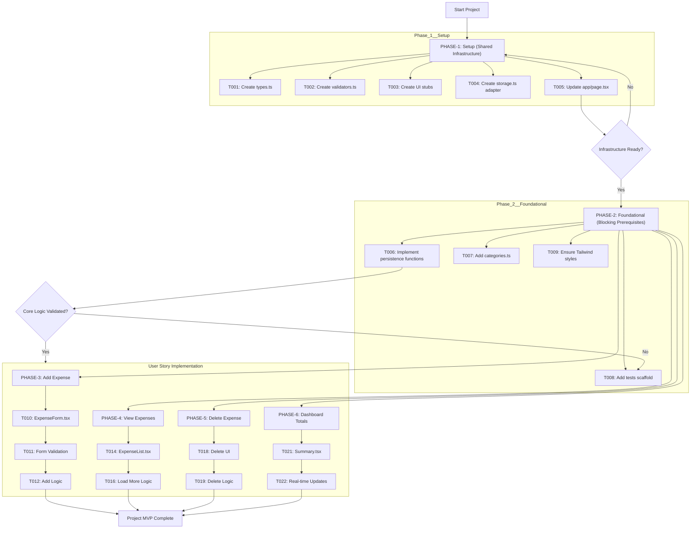
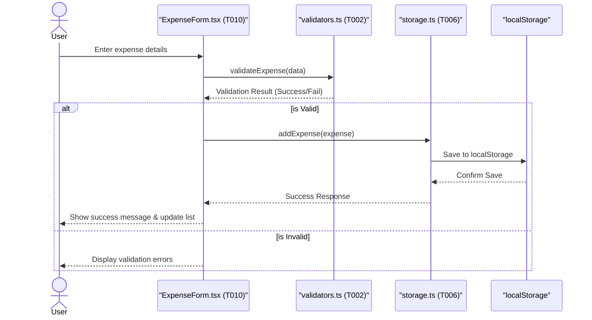
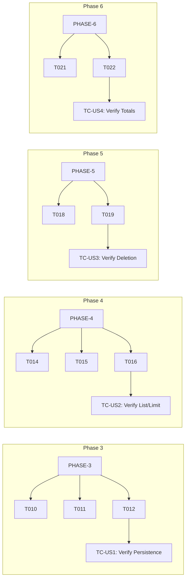

# Expense Tracker - Technical Specification & Architecture Document

## 1. Executive Summary & Architecture Overview

### 1.1 Executive Brief
The Expense Tracker is a React-based application featuring a client-side storage architecture. It utilizes a localStorage adapter for persistence, implementing core CRUD operations for expense tracking, a dashboard for financial aggregation, and a validated input system. The project follows a phased execution model moving from shared infrastructure to prioritized user stories.

### 1.2 Maturity Assessment
The specifications provide a comprehensive operational roadmap with a high degree of task granularity, making the project READY for execution. While the structural logic is sound, some REFINEMENT is needed regarding explicit acceptance criteria and the definition of hard security/performance bounds for localStorage and input sanitization, as noted in the structural gaps.

### 1.3 Technical Stack
* React
* TypeScript
* Tailwind
* localStorage

### 1.4 Architectural Constraints
* Expense list rendering limit: maximum 50 items per page.
* Rendering order: newest-first sequence.
* Data persistence: client-side via localStorage adapter.
* Input validation: strictly enforced via `src/server/validators.ts`.
* UI requirements: mandatory ARIA labels for accessibility.
* Lazy-loading: required for items beyond the initial 50-item limit.

### 1.5 Critical Dependencies
* **Sequential execution**: Phase 1 (Setup) $\rightarrow$ Phase 2 (Foundational) $\rightarrow$ User Stories (Phases 3-6).
* **Logic dependency**: `ExpenseForm.tsx` depends on `validators.ts` for input validation.
* **Persistence dependency**: Expense list and Summary components depend on `storage.ts` (load/save functions).
* **Data integrity**: `DeleteExpense(id)` must ensure consistent state updates across Summary and ExpenseList components.
* **Environment**: Tailwind global styles must be present in `app/globals.css`.

## 2. Architecture Workflows & Visual Diagrams

### 2.1 Implementation Roadmap
Visualizes the sequential phases and task dependencies for the Expense Tracker project, including the critical path from setup to user stories.

### 2.2 Expense Addition Sequence
Models the interaction flow for User Story 1: Adding an expense, involving the UI, validator, and storage adapter.

### 2.3 Task Traceability Matrix
Maps the relationship between project phases, specific technical tasks, and their corresponding test cases.

## 3. Detailed Technical Specifications & Business Rules

### 3.1 Requirements Traceability

| ID | Requirement / Task Description | Phase | Priority | Test Case |
| :--- | :--- | :--- | :--- | :--- |
| T001 | Create src/server/types.ts with Expense type | PHASE-1 | - | - |
| T002 | Create src/server/validators.ts with validateExpense helper | PHASE-1 | - | - |
| T003 | Create UI components folder and stubs: ExpenseForm.tsx, ExpenseList.tsx, Summary.tsx | PHASE-1 | - | - |
| T004 | Create src/server/storage.ts — localStorage adapter | PHASE-1 | - | - |
| T005 | Update app/page.tsx to import and render the new components | PHASE-1 | - | - |
| T006 | Implement src/server/storage.ts persistence functions (load/save/add/delete) | PHASE-2 | - | - |
| T007 | Add src/server/categories.ts with predefined categories | PHASE-2 | - | - |
| T008 | Add basic tests scaffold and validator unit test | PHASE-2 | - | - |
| T009 | Ensure Tailwind/global styles are present in app/globals.css | PHASE-2 | - | - |
| T010 | Implement app/components/ExpenseForm.tsx (client component) | PHASE-3 | P1 | TC-US1 |
| T011 | Use src/server/validators.ts in the form to validate input | PHASE-3 | P1 | TC-US1 |
| T012 | Implement add logic calling src/server/storage.ts (addExpense) | PHASE-3 | P1 | TC-US1 |
| T013 | Add unit tests for form validation in src/server/__tests__/validators.test.ts | PHASE-3 | P1 | - |
| T014 | Implement app/components/ExpenseList.tsx rendering newest-first (limit 50) | PHASE-4 | P1 | TC-US2 |
| T015 | Implement app/components/EmptyState.tsx | PHASE-4 | P1 | TC-US2 |
| T016 | Implement Load more button behavior in ExpenseList.tsx | PHASE-4 | P1 | TC-US2 |
| T017 | Implement client-side hydration from src/server/storage.ts | PHASE-4 | P1 | TC-US2 |
| T018 | Add delete controls and confirmation UI in app/components/ExpenseList.tsx | PHASE-5 | P1 | TC-US3 |
| T019 | Implement delete logic in src/server/storage.ts (deleteExpense(id)) | PHASE-5 | P1 | TC-US3 |
| T020 | Add integration test adding then deleting an expense | PHASE-5 | P1 | TC-US3 |
| T021 | Implement app/components/Summary.tsx for total and count | PHASE-6 | P2 | TC-US4 |
| T022 | Wire real-time updates between Summary.tsx and the list | PHASE-6 | P2 | TC-US4 |
| T023 | Add unit tests validating totals calculation | PHASE-6 | P2 | TC-US4 |
| T024 | Add ARIA labels and accessibility improvements | PHASE-7 | - | - |
| T025 | Update specs/001-expense-tracker/quickstart.md with run steps | PHASE-7 | - | - |
| T026 | Add documentation comments and inline TSDoc | PHASE-7 | - | - |
| T027 | Performance: ensure initial render limits to 50 items and lazy-load | PHASE-7 | - | - |
| DEP-01 | Phase 1 must complete before Phase 2 | - | - | - |
| DEP-02 | Phase 2 must complete before User Stories (Phases 3-6) | - | - | - |

### 3.2 Security Rules
* **Input Validation**: All user inputs must be processed through `src/server/validators.ts` before being committed to storage.
* **Data Sanitization**: (Gap identified) Input sanitization must be implemented to prevent XSS when rendering stored data in the UI.

### 3.3 Data Models
* **Expense Type**: Defined in `src/server/types.ts`.
* **Categories**: Predefined set of categories defined in `src/server/categories.ts`.
* **Persistence**: Key-value storage using the browser's `localStorage` API via the `storage.ts` adapter.

## 4. Project Governance & Structural Gaps

### 4.1 Structural Gaps
| Gap | Priority | Remediation Advice |
| :--- | :--- | :--- |
| Acceptance Criteria | MEDIUM | While independent tests are provided, a formal list of acceptance criteria for each User Story would improve quality assurance. |
| Checkboxes Checklist | LOW | Tasks are checked off, but a final deployment checklist is missing. |
| Security & Performance Constraints | MEDIUM | Define specific constraints for localStorage limits and input sanitization beyond basic validation. |
| Open Questions & Uncertainties | LOW | No open questions were listed in the source document. |

### 4.2 Remediation & Workflow
The project will follow the sequential phase dependency: `PHASE-1` $\rightarrow$ `PHASE-2` $\rightarrow$ `PHASE-3 to 6`. Each phase must be validated by its corresponding test cases (TC-US1 through TC-US4) before the project is considered MVP complete.

## 5. Technical & Domain Glossary (Terminology Reference)

| Term | Category | Context Anchor | Project Definition |
| :--- | :--- | :--- | :--- |
| ARIA | TECHNICAL_STACK | T024 | Standardized labels used to enhance accessibility for assistive technologies. |
| EmptyState | TECHNICAL_STACK | T015 | The specific visual component rendered when no financial records are available to display. |
| ExpenseForm | TECHNICAL_STACK | T010 | Client-side input interface for capturing and validating new financial entry data. |
| ExpenseList | TECHNICAL_STACK | T014 | A display component that renders records in descending chronological order with a maximum initial threshold of 50 entries. |
| LocalStorage | TECHNICAL_STACK | T004 | The browser-based persistence mechanism serving as the primary data store for the application. |
| UI | TECHNICAL_STACK | T003 | The collective set of React components forming the visual and interactive layer of the application. |