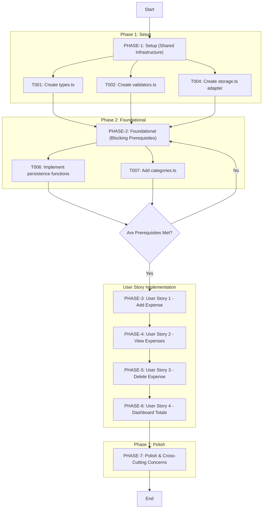
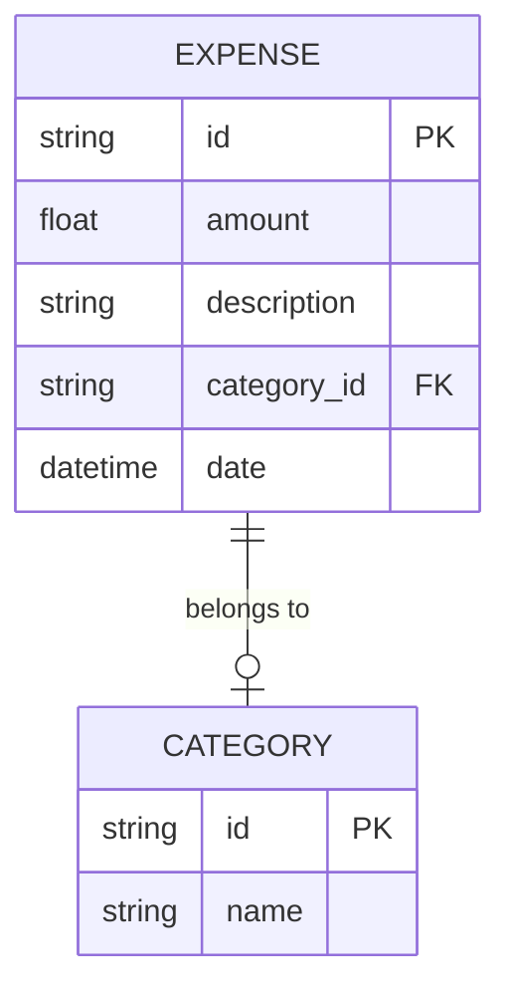

# Expense Tracker - Technical Specification & Architecture Document

## 1. Executive Summary & Architecture Overview

### 1.1 Executive Brief
Expense Tracker is a client-side application providing CRUD operations for expense management with a summary dashboard. The system utilizes a localStorage adapter for persistence and ensures data integrity via dedicated server-side validators. It features a newest-first listing paradigm with specific pagination limits and real-time total calculations for expenditure tracking.

### 1.2 Maturity Assessment
The project is technically robust with all core tasks marked as completed and a high structural integrity. However, the absence of explicit security constraints regarding input sanitization and the lack of formal acceptance criteria checklists represent moderate gaps. Despite these, the system is READY for execution as the implementation logic and test scaffolds are fully defined.

### 1.3 Technical Stack
* TypeScript
* Tailwind
* localStorage

### 1.4 Architectural Constraints
* ExpenseList must display items in newest-first order.
* Initial render limit strictly set to 50 items.
* Implementation of lazy-loading for items beyond the 50-count threshold.
* Mandatory input validation using `src/server/validators.ts` before persistence.
* All UI components must include ARIA labels for accessibility compliance.

### 1.5 Critical Dependencies
* `localStorage` adapter in `src/server/storage.ts` as the primary data persistence layer.
* Strict execution order: Phase 1 (Infrastructure) $\rightarrow$ Phase 2 (Foundational) $\rightarrow$ User Stories (Phases 3-6).
* Dependency of `ExpenseForm` on `src/server/validators.ts` for data integrity.
* Dependency of `ExpenseList` and `Summary` components on the persistence functions in `storage.ts`.
* Integration test gate for the add/delete cycle (`storage.integration.test.ts`).

## 2. Architecture Workflows & Visual Diagrams

### 2.1 Expense Tracker Implementation Roadmap
A high-level traceability and execution flow showing the dependencies between project phases and key tasks.


### 2.2 Expense Addition Sequence
Interaction flow for adding a new expense involving the UI, validator, and storage adapter.
```mermaid
sequenceDiagram
    actor User
    participant UI as "ExpenseForm (T010)"
    participant VAL as "validators.ts (T002 T011)"
    participant STORE as "storage.ts (T004 T012)"
    participant LS as "LocalStorage"

    User ->> UI: Enter expense details
    UI ->> VAL: validateExpense(data)
    VAL -->> UI: Validation Result (Success/Fail)
    
    alt is valid
        UI ->> STORE: addExpense(expense)
        STORE ->> LS: Save to LocalStorage
        LS -->> STORE: Confirm Save
        STORE -->> UI: Success Response
        UI ->> User: Show success & update list
    else is invalid
        UI ->> User: Display validation errors
```

### 2.3 Expense Tracker Data Model
Conceptual data model for the expense tracking system based on the identified types and storage requirements.


## 3. Detailed Technical Specifications & Business Rules

### 3.1 Requirements Traceability
| ID | Requirement / Task Description | Source Section | Status |
| :--- | :--- | :--- | :--- |
| PHASE-1 | Setup (Shared Infrastructure) | Phase 1: Setup | N/A |
| T001 | Create src/server/types.ts with Expense type | Phase 1: Setup | completed |
| T002 | Create src/server/validators.ts with validateExpense helper | Phase 1: Setup | completed |
| T003 | Create UI components folder and stubs: ExpenseForm, ExpenseList, Summary | Phase 1: Setup | completed |
| T004 | Create src/server/storage.ts — localStorage adapter | Phase 1: Setup | completed |
| T005 | Update app/page.tsx to import and render new components | Phase 1: Setup | completed |
| PHASE-2 | Foundational (Blocking Prerequisites) | Phase 2: Foundational | N/A |
| T006 | Implement persistence functions in src/server/storage.ts | Phase 2: Foundational | completed |
| T007 | Add src/server/categories.ts with predefined categories | Phase 2: Foundational | completed |
| T008 | Add basic tests scaffold and validator unit test | Phase 2: Foundational | completed |
| T009 | Ensure Tailwind/global styles are present and accessible | Phase 2: Foundational | completed |
| PHASE-3 | User Story 1 - Add an Expense | Phase 3: US1 | N/A |
| TC-US1 | Fill the form and verify the new expense appears in ExpenseList and persists after reload | Phase 3: US1 | N/A |
| T010 | Implement app/components/ExpenseForm.tsx (client component) | Phase 3: US1 | completed |
| T011 | Use src/server/validators.ts in the form to validate input | Phase 3: US1 | completed |
| T012 | Implement add logic calling src/server/storage.ts (addExpense) | Phase 3: US1 | completed |
| T013 | Add unit tests for form validation in src/server/__tests__/validators.test.ts | Phase 3: US1 | completed |
| PHASE-4 | User Story 2 - View Expenses | Phase 4: US2 | N/A |
| TC-US2 | Add multiple expenses and verify ExpenseList shows newest first, empty state, and load more | Phase 4: US2 | N/A |
| T014 | Implement app/components/ExpenseList.tsx (newest-first, limit 50) | Phase 4: US2 | completed |
| T015 | Implement app/components/EmptyState.tsx | Phase 4: US2 | completed |
| T016 | Implement 'Load more' button behavior in ExpenseList.tsx | Phase 4: US2 | completed |
| T017 | Implement client-side hydration from storage.ts on app start | Phase 4: US2 | completed |
| PHASE-5 | User Story 3 - Delete an Expense | Phase 5: US3 | N/A |
| TC-US3 | Add an expense, delete it via ExpenseList.tsx, and verify absence after reload | Phase 5: US3 | N/A |
| T018 | Add delete controls and confirmation UI in ExpenseList.tsx | Phase 5: US3 | completed |
| T019 | Implement delete logic in src/server/storage.ts (deleteExpense) | Phase 5: US3 | completed |
| T020 | Add integration test for add/delete cycle in storage.integration.test.ts | Phase 5: US3 | completed |
| PHASE-6 | User Story 4 - View Dashboard Totals | Phase 6: US4 | N/A |
| TC-US4 | Verify totals in Summary.tsx equal sum and count, and update on add/delete | Phase 6: US4 | N/A |
| T021 | Implement app/components/Summary.tsx to compute and render totals | Phase 6: US4 | completed |
| T022 | Wire real-time updates between Summary.tsx and the list | Phase 6: US4 | completed |
| T023 | Add unit tests validating totals calculation in totals.test.ts | Phase 6: US4 | completed |
| PHASE-7 | Polish & Cross-Cutting Concerns | Phase 7: Polish | N/A |
| T024 | Add ARIA labels and accessibility improvements to components | Phase 7: Polish | completed |
| T025 | Update quickstart.md with run & verification steps | Phase 7: Polish | completed |
| T026 | Add documentation comments and inline TSDoc for src/server/* | Phase 7: Polish | completed |
| T027 | Ensure initial render limits to 50 items and lazy-load older items | Phase 7: Polish | completed |
| DEP-1 | Phase 1 must complete before Phase 2 | Dependencies | N/A |
| DEP-2 | Phase 2 must complete before User Story implementation (Phases 3-6) | Dependencies | N/A |

### 3.2 Security Rules
* **Input Validation**: All data entering the persistence layer must be processed through `src/server/validators.ts` to ensure type safety and data integrity.
* **Data Persistence**: LocalStorage is used as the sole persistence mechanism; no external API calls are performed.

### 3.3 Data Models
* **Expense**: Defined in `src/server/types.ts`. Contains `id`, `amount`, `description`, `category_id`, and `date`.
* **Category**: Defined in `src/server/categories.ts`. Contains `id` and `name`.

## 4. Project Governance & Structural Gaps

### 4.1 Structural Gaps
| Gap | Priority | Remediation Advice |
| :--- | :--- | :--- |
| Acceptance Criteria | MEDIUM | While 'Independent Tests' are provided for each User Story, they are not formatted as explicit acceptance criteria checklists. |
| Checkboxes Checklist | LOW | The tasks are already checked, but a final overall project completion checklist is missing. |
| Security & Performance Constraints | MEDIUM | T027 mentions performance (lazy loading), but no formal security constraints (e.g., input sanitization) are listed. |
| Open Questions & Uncertainties | LOW | No open questions were identified in the source document. |

### 4.2 Remediation & Workflow
The identified gaps should be addressed by converting the `TC-US` test cases into a formal Acceptance Criteria matrix and adding a dedicated security section detailing the sanitization methods used within `validators.ts`.

## 5. Technical & Domain Glossary (Terminology Reference)

| Term | Category | Context Anchor | Project Definition |
| :--- | :--- | :--- | :--- |
| ARIA | TECHNICAL_STACK | T024 | Attributes used to enhance accessibility for assistive technologies within the interface components. |
| EmptyState | TECHNICAL_STACK | T015 | A specific visual component rendered when no data records are available to display in the main list. |
| ExpenseForm | TECHNICAL_STACK | T010 | A client-side input interface used to capture and validate new financial transaction data. |
| ExpenseList | TECHNICAL_STACK | T014 | A display component that renders financial records sorted by most recent first with a maximum initial threshold of 50 entries. |
| LocalStorage | TECHNICAL_STACK | T004 | The browser-based key-value storage mechanism used as the persistence layer for the application data. |
| UI | TECHNICAL_STACK | T003 | The set of frontend components and styles that constitute the visual and interactive layer of the application. |