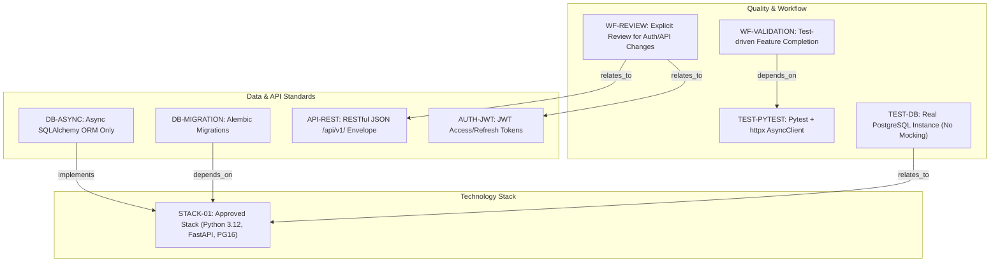
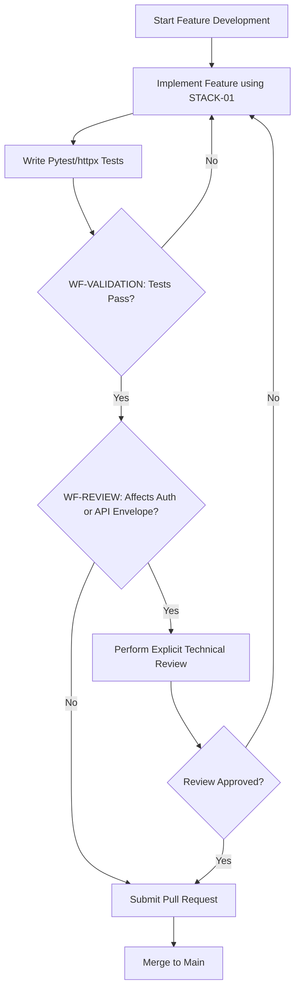
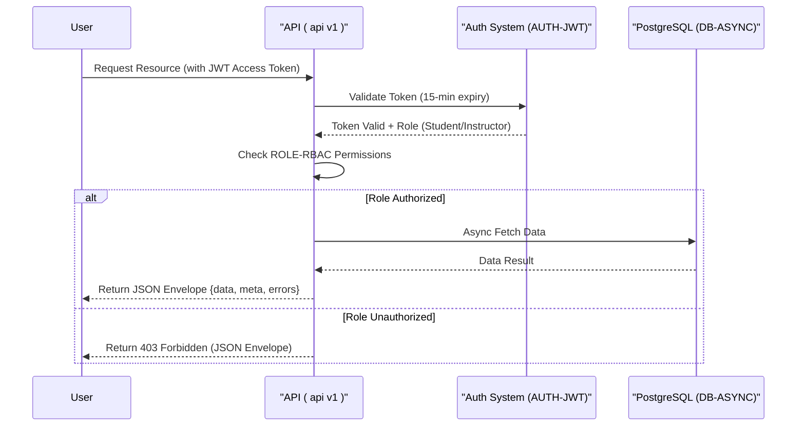

# Learning Platform API - Technical Specification & Architecture Document

## 1. Executive Summary & Architecture Overview

### 1.1 Executive Brief
The Learning Platform API is a high-performance backend designed for educational content management. Hosted on a Python 3.12/FastAPI stack with an asynchronous PostgreSQL 16 persistence layer, it implements a strict RESTful v1 contract. The system enforces a rigid role-based access model separating student progress tracking from instructor course management, utilizing JWT for secure session orchestration.

### 1.2 Maturity Assessment
The specifications exhibit high structural integrity with a health index of 100%, indicating all core technical pillars are defined. While a minor gap exists regarding the documentation of future technical debt or evolving patterns, the current framework is robust and logically consistent. The project is READY for execution.

### 1.3 Technical Stack
* Python 3.12
* FastAPI
* PostgreSQL 16
* SQLAlchemy 2.0
* Alembic
* Pydantic v2
* pytest
* httpx
* Resend

### 1.4 Architectural Constraints
* Business logic coverage >= 80%
* JWT access token expiry: 15 minutes
* JWT refresh token expiry: 7 days
* API Versioning: `/api/v1/` path
* Response Format: `{"data": ..., "meta": ..., "errors": []}`
* Database access: Strictly asynchronous SQLAlchemy ORM; Raw SQL prohibited
* Database Testing: Mandatory real PostgreSQL instance; Mocking of DB layer prohibited
* Role Isolation: Instructors only for course CRUD; Students only for enrollment and progress submission
* Review Gates: Explicit review required for authentication, authorization, and response envelope modifications

### 1.5 Critical Dependencies
* `RESEND_API_KEY` environment variable for email delivery
* Resend Python SDK for transactional emails
* Alembic for all schema migrations and state transitions
* Strong relational dependency between schema changes and API documentation updates
* Strict foreign key and state integrity for User-Course-Enrollment flows

## 2. Architecture Workflows & Visual Diagrams

### 2.1 Technical Constitution Traceability Map
Maps the relationships between technology standards, coding rules, and workflow constraints using exact identifiers.

### 2.2 Feature Implementation & Review Workflow
Models the development lifecycle from implementation to merge, incorporating the mandatory review and testing gates.

### 2.3 Authentication & Authorization Sequence
Illustrates the interaction between the User, API, and Auth system based on the JWT and RBAC rules.

## 3. Detailed Technical Specifications & Business Rules

### 3.1 Requirements Traceability

| Identifier | Requirement / Rule Description | Source Section |
| :--- | :--- | :--- |
| **STACK-01** | Approved stack: Python 3.12, FastAPI, PostgreSQL 16, SQLAlchemy 2.0 (async), Alembic, Pydantic v2. | I. Technology Standardization |
| **AUTH-JWT** | JWT authentication: 15-min expiry access tokens, 7-day expiry refresh tokens. | II. Authentication and Authorization |
| **ROLE-RBAC** | Two roles only: student (enroll/submit progress) and instructor (create/edit/delete courses). | II. Authentication and Authorization |
| **API-REST** | RESTful JSON API versioned under /api/v1/ with envelope: `{'data': ..., 'meta': ..., 'errors': []}`. | III. API Contract and Response Shape |
| **DB-ASYNC** | Asynchronous database access only via SQLAlchemy ORM; raw SQL prohibited. | IV. Data Access and Persistence |
| **DB-MIGRATION** | Schema changes must be managed exclusively via Alembic migrations. | IV. Data Access and Persistence |
| **TEST-PYTEST** | Use pytest with httpx AsyncClient; target 80% business logic coverage. | V. Quality and Testing |
| **TEST-DB** | Database tests must use a real PostgreSQL instance; no mocking of the database layer. | V. Quality and Testing |
| **TOOL-RESEND** | Email delivery via Resend Python SDK using `RESEND_API_KEY` env variable. | Additional Constraints |
| **WF-VALIDATION** | Features must be validated through tests before completion. | Development Workflow |
| **WF-REVIEW** | Explicit review required for changes to auth, authorization, or response envelopes. | Development Workflow |

### 3.2 Security Rules
* **Authentication**: Mandatory JWT implementation with strict expiration windows (15m access / 7d refresh).
* **Authorization**: RBAC enforcement where `Instructor` has full CRUD on courses and `Student` is limited to enrollment and progress submission.
* **Data Integrity**: Raw SQL is strictly prohibited to prevent injection and ensure ORM-level consistency.

### 3.3 Data Models
* **Persistence**: PostgreSQL 16.
* **Access Layer**: SQLAlchemy 2.0 Async.
* **Migration Strategy**: Alembic-driven versioning for all schema transitions.
* **Validation**: Pydantic v2 for all request/response data shaping.

## 4. Project Governance & Structural Gaps

### 4.1 Structural Gaps
| Gap | Priority | Remediation Advice |
| :--- | :--- | :--- |
| Open Questions & Uncertainties | LOW | The document is a formal ratification; add a section for evolving technical debt or undecided architectural patterns. |

### 4.2 Remediation & Workflow
* All deviations from the established constitution require documented justification and a formal review before merging.
* Schema or contract changes must be atomically coupled with their corresponding Alembic migrations and API documentation updates.

## 5. Technical & Domain Glossary (Terminology Reference)

| Term | Category | Context Anchor | Project Definition |
| :--- | :--- | :--- | :--- |
| API | TECHNICAL_STACK | API-REST | The RESTful interface versioned under /api/v1/ utilizing a standardized envelope for data, metadata, and errors. |
| AsyncClient | TECHNICAL_STACK | TEST-PYTEST | The httpx non-blocking request handler used within the test suite to validate endpoints. |
| JSON | TECHNICAL_STACK | API-REST | The mandatory lightweight data-interchange format for all system responses. |
| JWT | TECHNICAL_STACK | AUTH-JWT | The security token mechanism featuring a 15-minute short-term access window and a 7-day renewal period. |
| ORM | TECHNICAL_STACK | DB-ASYNC | The exclusive abstraction layer for database interactions, forbidding direct query execution. |
| PostgreSQL | TECHNICAL_STACK | STACK-01 | The relational database engine version 16 used for both production and non-mocked testing environments. |
| Python 3.12 | TECHNICAL_STACK | STACK-01 | The mandatory runtime environment for all implementation work. |
| SDK | TECHNICAL_STACK | TOOL-RESEND | The provided library for integrating transactional email delivery via the external provider. |
| SQL | TECHNICAL_STACK | DB-ASYNC | The structured query language which is strictly prohibited in its raw form for data access. |
| SQLAlchemy 2.0 | TECHNICAL_STACK | STACK-01 | The asynchronous toolkit used for object-relational mapping and database session management. |