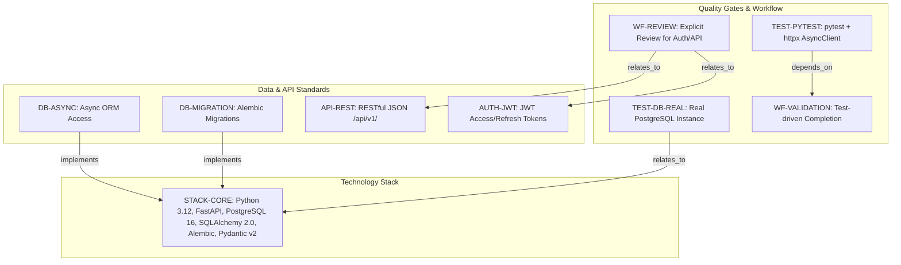
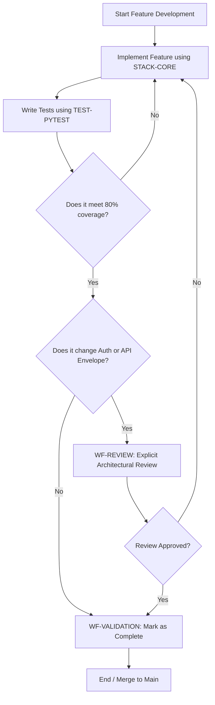
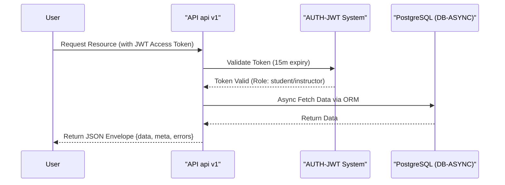

# Learning Platform API - Technical Specification & Architecture Document

## 1. Executive Summary & Architecture Overview

### 1.1 Executive Brief
The Learning Platform API is a high-performance educational backend built on a fully asynchronous Python 3.12 and FastAPI stack. It implements a strict RESTful architecture under `/api/v1/` with a standardized JSON envelope, utilizing PostgreSQL 16 for persistence. The system enforces a dual-role authorization model (student/instructor) and integrates the Resend SDK for transactional email notifications.

### 1.2 Maturity Assessment
The specifications exhibit high structural integrity and technical precision. All core pillars—stack, security, and quality gates—are explicitly defined. While a minor low-severity gap exists regarding the absence of an 'Open Questions' section, the technical constraints are exhaustive enough to consider the project READY for execution.

### 1.3 Technical Stack
* **Language**: Python 3.12
* **Framework**: FastAPI
* **Database**: PostgreSQL 16
* **ORM**: SQLAlchemy 2.0 (Async)
* **Migrations**: Alembic
* **Validation**: Pydantic v2
* **Email Service**: Resend Python SDK

### 1.4 Architectural Constraints
* **Database Access**: Mandatory asynchronous database access via ORM; Raw SQL is strictly prohibited.
* **Security**: JWT access token expiry set to 15 minutes; refresh token expiry set to 7 days.
* **API Standard**: Versioning under `/api/v1/` using a consistent `{data, meta, errors}` envelope.
* **Role Isolation**: Instructors are restricted to managing/deleting courses; Students are restricted to enrollment and progress submission.
* **Testing**: Database tests must use real PostgreSQL instances (zero mocking).
* **Quality Gate**: Business logic test coverage must be >= 80%.
* **Governance**: Explicit review is required for any changes affecting authentication, authorization, or response envelopes.
* **Schema Management**: Strict schema migration via Alembic.

### 1.5 Critical Dependencies
* `RESEND_API_KEY` environment variable.
* Resend Python SDK for transactional emails.
* PostgreSQL 16 runtime instance.
* `httpx AsyncClient` for API testing.
* Referential integrity between Alembic migrations and schema state.
* Dependency between feature completion and `pytest` validation.

## 2. Architecture Workflows & Visual Diagrams

### 2.1 Technical Constitution Traceability Map

### 2.2 Feature Implementation & Validation Workflow

### 2.3 Authentication & Authorization Sequence

## 3. Detailed Technical Specifications & Business Rules

### 3.1 Requirements Traceability
| Identifier | Type | Requirement / Rule Description | Source Section |
| :--- | :--- | :--- | :--- |
| **STACK-CORE** | Tool Configuration | Python 3.12, FastAPI, PostgreSQL 16, SQLAlchemy 2.0 (async), Alembic, Pydantic v2 | I. Technology Standardization |
| **AUTH-JWT** | Coding Standard | JWT access tokens (15m expiry) and refresh tokens (7d expiry) | II. Authentication and Authorization |
| **API-REST** | Coding Standard | RESTful JSON API, versioned under /api/v1/, standard envelope {data, meta, errors} | III. API Contract and Response Shape |
| **DB-ASYNC** | Rule | All database access must be asynchronous via ORM; Raw SQL is prohibited | IV. Data Access and Persistence |
| **DB-MIGRATION** | Rule | Schema changes must be handled exclusively through Alembic migrations | IV. Data Access and Persistence |
| **TEST-PYTEST** | Testing Gate | Use pytest with httpx AsyncClient; business logic coverage >= 80% | V. Quality and Testing |
| **TEST-DB-REAL** | Testing Gate | Database tests must use a real PostgreSQL instance (no mocking) | V. Quality and Testing |
| **EMAIL-RESEND** | Tool Configuration | Use Resend Python SDK with RESEND_API_KEY environment variable | Additional Constraints |
| **WF-VALIDATION** | Workflow Constraint | Features must be validated through tests before completion | Development Workflow |
| **WF-REVIEW** | Workflow Constraint | Changes to auth, authorization, or response envelopes require explicit review | Development Workflow |

### 3.2 Security Rules
* **Authentication**: Mandatory use of JWT. Access tokens expire in 15 minutes; Refresh tokens expire in 7 days.
* **Authorization**: 
    * `instructor`: Authorized to create, edit, and delete courses.
    * `student`: Authorized to enroll in courses and submit progress.
* **Validation**: Security-sensitive behaviors must be validated via integration-style tests.

### 3.3 Data Models
* **Persistence**: All data must be managed via SQLAlchemy 2.0 ORM.
* **Migrations**: All schema evolutions must be tracked via Alembic.
* **Validation**: Pydantic v2 is used for all request/response data validation.

## 4. Project Governance & Structural Gaps

### 4.1 Structural Gaps
| Missing Section | Priority | Remediation Advice |
| :--- | :--- | :--- |
| Open Questions & Uncertainties | LOW | Add a section for pending technical decisions or known trade-offs. |

### 4.2 Remediation & Workflow
* **Compliance**: This constitution supersedes ad hoc implementation choices.
* **Deviation Process**: Any deviation from the defined standards requires documented justification and a formal review before the code is merged.
* **Version Control**: Version 1.0.0 | Ratified: 2026-06-27.

## 5. Technical & Domain Glossary (Terminology Reference)

| Term | Category | Context Anchor | Project Definition |
| :--- | :--- | :--- | :--- |
| API | TECHNICAL_STACK | API-REST | A RESTful interface versioned under /api/v1/ that utilizes a consistent envelope comprising data, meta, and errors fields. |
| AsyncClient | TECHNICAL_STACK | TEST-PYTEST | The httpx non-blocking requester used within pytest to validate business logic and endpoints. |
| JSON | TECHNICAL_STACK | API-REST | The mandatory data interchange format for all network responses. |
| JWT | TECHNICAL_STACK | AUTH-JWT | Security tokens with a 15-minute validity period for access and a 7-day period for refreshing sessions. |
| ORM | TECHNICAL_STACK | DB-ASYNC | The exclusive mechanism for executing database queries to ensure all persistence logic remains asynchronous. |
| PostgreSQL | TECHNICAL_STACK | STACK-CORE | The relational database version 16 used for both production and non-mocked testing environments. |
| Python 3.12 | TECHNICAL_STACK | STACK-CORE | The mandatory runtime environment for all backend implementation and SDK integration. |
| SDK | TECHNICAL_STACK | EMAIL-RESEND | The official Python library utilized for transactional email delivery via an external service. |
| SQL | TECHNICAL_STACK | DB-ASYNC | The raw query language which is strictly forbidden for direct use in the codebase. |
| SQLAlchemy 2.0 | TECHNICAL_STACK | STACK-CORE | The asynchronous toolkit providing the interface for object-relational mapping and session management. |