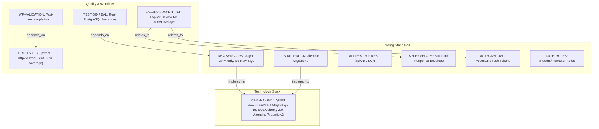
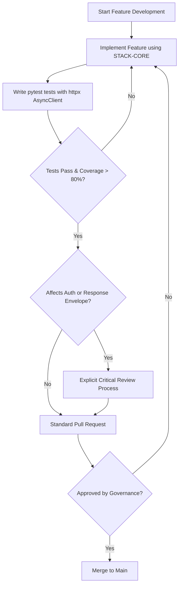
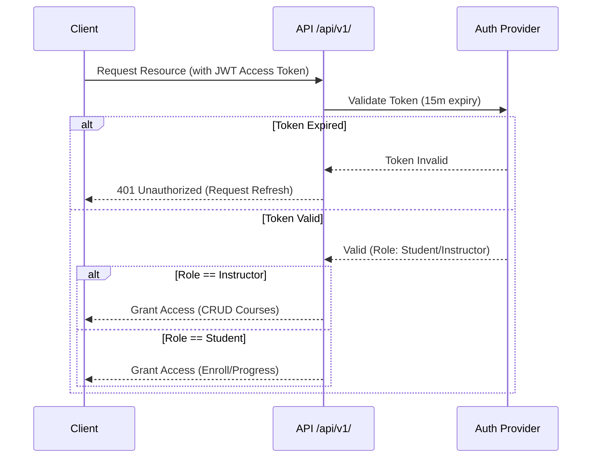

# Learning Platform API - Technical Specification & Architecture Document

## 1. Executive Summary & Architecture Overview

### 1.1 Executive Brief
The Learning Platform API is a highly standardized backend system designed for course management and student enrollment. It leverages an asynchronous Python stack to ensure high-performance data persistence via PostgreSQL. The architecture enforces strict RESTful contracts, a unified response envelope, and a dual-role RBAC model to isolate instructor and student capabilities.

### 1.2 Maturity Assessment
The specifications exhibit an exceptional level of technical rigor and prescriptive clarity, covering both implementation standards and quality gates. While a minor low-severity gap regarding future architectural uncertainties was noted, the core operational framework is complete. The project is READY for execution.

### 1.3 Technical Stack
* Python 3.12
* FastAPI
* PostgreSQL 16
* SQLAlchemy 2.0
* Alembic
* Pydantic v2
* pytest
* httpx
* Resend

### 1.4 Architectural Constraints
* Business logic coverage >= 80%
* Asynchronous database execution only; Raw SQL strictly prohibited
* API versioning mandatory under `/api/v1/`
* Strict response envelope: `{"data": ..., "meta": ..., "errors": []}`
* JWT Access Token expiry: 15 minutes
* JWT Refresh Token expiry: 7 days
* Instructors: exclusive authorization for course CRUD operations
* Students: authorized only for course enrollment and progress submission
* Database tests must use real PostgreSQL instances (no mocking)
* Mandatory explicit review for changes to auth, authorization, or response envelopes

### 1.5 Critical Dependencies
* `RESEND_API_KEY` environment variable
* Resend Python SDK for transactional email delivery
* Real PostgreSQL instance for integration testing
* Alembic for all schema migration workflows
* Tight coupling between DB tests and asynchronous ORM implementation

## 2. Architecture Workflows & Visual Diagrams

### 2.1 Technical Governance Traceability Map
Maps the relationships between technology standards, coding rules, and workflow constraints for the Learning Platform API.

### 2.2 Feature Implementation & Validation Workflow
The mandatory development lifecycle for implementing features according to the API Constitution.

### 2.3 Authentication & Authorization Sequence
Interaction flow for JWT-based authentication and role-based access control as defined in the constitution.

## 3. Detailed Technical Specifications & Business Rules

### 3.1 Requirements Traceability

| Identifier | Type | Requirement / Rule Description | Source Section |
| :--- | :--- | :--- | :--- |
| STACK-CORE | tool_configuration | Approved stack: Python 3.12, FastAPI, PostgreSQL 16, SQLAlchemy 2.0 (async), Alembic, Pydantic v2. | I. Technology Standardization |
| AUTH-JWT | rule | Authentication via JWT: Access tokens (15m expiry), Refresh tokens (7d expiry). | II. Authentication and Authorization |
| AUTH-ROLES | rule | Role-based access: Instructors (CRUD courses), Students (Enroll, submit progress). | II. Authentication and Authorization |
| API-REST-V1 | coding_standard | RESTful API versioned under /api/v1/ returning JSON. | III. API Contract and Response Shape |
| API-ENVELOPE | coding_standard | Response envelope format: `{"data": ..., "meta": ..., "errors": []}`. | III. API Contract and Response Shape |
| DB-ASYNC-ORM | coding_standard | All DB access must be asynchronous via ORM; Raw SQL prohibited. | IV. Data Access and Persistence |
| DB-MIGRATION | tool_configuration | Schema changes handled exclusively via Alembic migrations. | IV. Data Access and Persistence |
| TEST-PYTEST | testing_gate | Testing with pytest and httpx AsyncClient; 80% business logic coverage. | V. Quality and Testing |
| TEST-DB-REAL | testing_gate | Database tests must use real PostgreSQL instances (no mocking). | V. Quality and Testing |
| EMAIL-RESEND | tool_configuration | Transactional emails via Resend Python SDK using RESEND_API_KEY env var. | Additional Constraints |
| WF-VALIDATION | workflow_constraint | Features must be validated through tests before completion. | Development Workflow |
| WF-REVIEW-CRITICAL | workflow_constraint | Explicit review required for changes to auth, authorization, or response envelopes. | Development Workflow |

### 3.2 Security Rules
* **Authentication**: Mandatory JWT implementation with a strict 15-minute window for access tokens and 7-day window for refresh tokens (`AUTH-JWT`).
* **Authorization**: RBAC implementation restricting Course CRUD to the `Instructor` role and Enrollment/Progress to the `Student` role (`AUTH-ROLES`).
* **Validation**: All security-sensitive behaviors must be validated through integration-style tests.

### 3.3 Data Models
* **Persistence**: All data access must be performed through the SQLAlchemy 2.0 ORM using asynchronous execution (`DB-ASYNC-ORM`).
* **Schema Evolution**: All changes to the database schema must be versioned and applied via Alembic migrations (`DB-MIGRATION`).
* **Validation**: Pydantic v2 is the mandated tool for all data validation and serialization.

## 4. Project Governance & Structural Gaps

### 4.1 Structural Gaps
| Gap | Priority | Remediation Advice |
| :--- | :--- | :--- |
| Open Questions & Uncertainties | LOW | The document is quite prescriptive. Add a section for known unknowns or future architectural debates. |

### 4.2 Remediation & Workflow
* **Governance Supremacy**: This constitution supersedes all ad hoc implementation choices.
* **Deviation Process**: Any deviation from the defined standards requires documented justification and a formal review process before the code can be merged.
* **Validation Gate**: Features are only considered "complete" once they pass the `WF-VALIDATION` and `TEST-PYTEST` gates.

## 5. Technical & Domain Glossary (Terminology Reference)

| Term | Category | Context Anchor | Project Definition |
| :--- | :--- | :--- | :--- |
| API | TECHNICAL_STACK | API-REST-V1 | The RESTful interface versioned under /api/v1/ using a standardized data envelope for all responses. |
| AsyncClient | TECHNICAL_STACK | TEST-PYTEST | The httpx non-blocking request utility employed for validating business logic within the test suite. |
| CRUD | BUSINESS_DOMAIN | AUTH-ROLES | The four foundational persistent storage mutation primitives permitted for instructors regarding course management. |
| DB | TECHNICAL_STACK | DB-ASYNC-ORM | The persistent storage layer requiring non-blocking access and prohibiting direct query execution. |
| JSON | TECHNICAL_STACK | API-REST-V1 | The mandated lightweight data-interchange format for all system responses. |
| JWT | TECHNICAL_STACK | AUTH-JWT | The token-based security mechanism utilizing 15-minute short-lived access and 7-day refresh durations. |
| ORM | TECHNICAL_STACK | DB-ASYNC-ORM | The exclusive abstraction layer used for object-relational mapping to avoid manual query strings. |
| PostgreSQL | TECHNICAL_STACK | STACK-CORE | The approved version 16 relational database engine used across development and test environments. |
| Python 3.12 | TECHNICAL_STACK | STACK-CORE | The mandated runtime environment for all implementation work. |
| SDK | TECHNICAL_STACK | EMAIL-RESEND | The provided software development kit for integrating the external transactional email platform. |
| SQL | TECHNICAL_STACK | DB-ASYNC-ORM | The structured query language which is explicitly prohibited in raw form for data access. |
| SQLAlchemy 2.0 | TECHNICAL_STACK | STACK-CORE | The toolkit for database interaction requiring non-blocking execution and strict session management. |