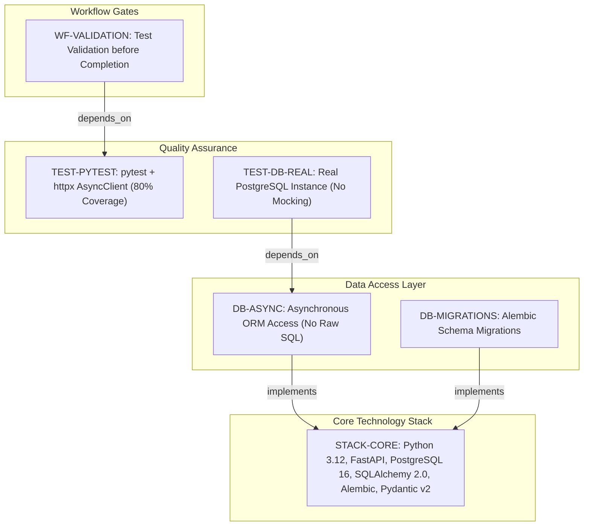
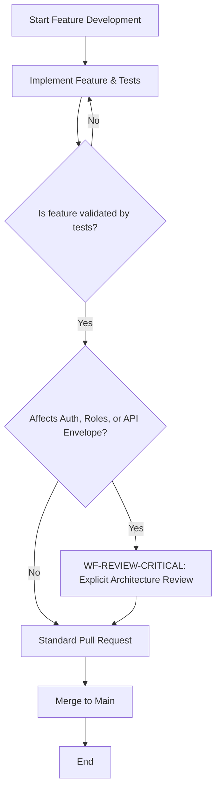
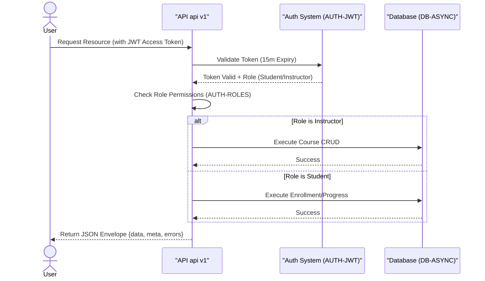

# Learning Platform API - Technical Specification & Architecture Document

## 1. Executive Summary & Architecture Overview

### 1.1 Executive Brief
The Learning Platform API is a RESTful backend designed for educational content management, featuring a strict role-based access control system for students and instructors. It leverages an asynchronous Python stack to manage course lifecycles, enrollments, and progress tracking, utilizing a standardized JSON envelope for all v1 API responses.

### 1.2 Maturity Assessment
The specifications are highly prescriptive and structurally sound, providing clear boundaries for both the data layer and the API contract. With a health index of 100 and no high or medium severity gaps, the documentation provides sufficient rigor for implementation. The only minor omission is the absence of a dedicated section for pending technical uncertainties, but this does not impede the current phase. Status: READY.

### 1.3 Technical Stack
* Python 3.12
* FastAPI
* PostgreSQL 16
* SQLAlchemy 2.0
* Alembic
* Pydantic v2
* pytest
* httpx
* Resend

### 1.4 Architectural Constraints
* Business logic coverage >= 80%
* JWT Access Token expiry: 15 minutes
* JWT Refresh Token expiry: 7 days
* API Versioning: /api/v1/
* Standard Response Envelope: `{"data": ..., "meta": ..., "errors": []}`
* Mandatory asynchronous database access via ORM; Raw SQL prohibited
* Database tests must use real PostgreSQL instances; mocking of DB layer is prohibited
* Instructors: exclusive rights to create, edit, and delete courses
* Students: exclusive rights to enroll and submit progress
* Explicit review required for changes to auth, authorization, or response envelopes

### 1.5 Critical Dependencies
* `RESEND_API_KEY` environment variable for email delivery
* Resend Python SDK for transactional emails
* Real PostgreSQL test instance for database validation
* Alembic migration scripts for all schema changes
* Strict dependency between User/Course entities for enrollment and progress submission

## 2. Architecture Workflows & Visual Diagrams

### 2.1 Technical Stack & Constraint Traceability

### 2.2 Development Workflow & Review Process

### 2.3 Authentication & Authorization Logic

## 3. Detailed Technical Specifications & Business Rules

### 3.1 Requirements Traceability
| Identifier | Type | Requirement / Rule Description | Source Section |
| :--- | :--- | :--- | :--- |
| STACK-CORE | tool_configuration | Approved stack: Python 3.12, FastAPI, PostgreSQL 16, SQLAlchemy 2.0 (async), Alembic, Pydantic v2. | I. Technology Standardization |
| AUTH-JWT | rule | JWT tokens: Access (15m expiry), Refresh (7d expiry). | II. Authentication and Authorization |
| AUTH-ROLES | rule | Roles: student (enroll, submit progress) and instructor (create, edit, delete courses). | II. Authentication and Authorization |
| API-REST-V1 | coding_standard | RESTful API, JSON return, versioned under /api/v1/ with a standard envelope {"data", "meta", "errors"}. | III. API Contract and Response Shape |
| DB-ASYNC | rule | All database access must be asynchronous via ORM; raw SQL is prohibited. | IV. Data Access and Persistence |
| DB-MIGRATIONS | tool_configuration | Schema changes must be handled through Alembic migrations. | IV. Data Access and Persistence |
| TEST-PYTEST | testing_gate | Use pytest with httpx AsyncClient; target 80%+ business logic coverage. | V. Quality and Testing |
| TEST-DB-REAL | testing_gate | Database tests must use a real PostgreSQL instance; no mocking of database layer. | V. Quality and Testing |
| MAIL-RESEND | tool_configuration | Use Resend Python SDK with RESEND_API_KEY env variable for emails. | Additional Constraints |
| WF-VALIDATION | workflow_constraint | Features must be validated through tests before completion. | Development Workflow |
| WF-REVIEW-CRITICAL | workflow_constraint | Changes to auth, authorization, or response envelopes require explicit review. | Development Workflow |

### 3.2 Security Rules
* **Authentication**: Mandatory use of JWT. Access tokens must expire in 15 minutes; Refresh tokens must expire in 7 days (`AUTH-JWT`).
* **Authorization**: Strict Role-Based Access Control (RBAC).
    * **Instructors**: Authorized for Course CRUD operations (`AUTH-ROLES`).
    * **Students**: Authorized for course enrollment and progress submission (`AUTH-ROLES`).
* **Validation**: Security-sensitive behaviors must be validated via integration-style tests.

### 3.3 Data Models
* **Persistence**: All data must be managed via SQLAlchemy 2.0 ORM.
* **Concurrency**: Asynchronous execution is mandatory for all database sessions (`DB-ASYNC`).
* **Evolution**: All schema modifications must be versioned and applied via Alembic migrations (`DB-MIGRATIONS`).

## 4. Project Governance & Structural Gaps

### 4.1 Structural Gaps
| Gap ID | Missing Section | Priority | Remediation Advice |
| :--- | :--- | :--- | :--- |
| GAP-01 | Open Questions & Uncertainties | LOW | The document is quite prescriptive; however, a section for pending technical decisions would improve agility. |

### 4.2 Remediation & Workflow
* **Compliance**: This constitution supersedes ad hoc implementation choices.
* **Deviation Process**: Any deviation from the defined standards requires documented justification and a formal review before the merge.
* **Review Gate**: Changes affecting `AUTH-JWT`, `AUTH-ROLES`, or `API-REST-V1` trigger the `WF-REVIEW-CRITICAL` workflow.

## 5. Technical & Domain Glossary (Terminology Reference)

| Term | Category | Context Anchor | Project Definition |
| :--- | :--- | :--- | :--- |
| API | TECHNICAL_STACK | API-REST-V1 | The RESTful interface versioned under /api/v1/ utilizing a standardized data, meta, and errors envelope. |
| AsyncClient | TECHNICAL_STACK | TEST-PYTEST | The httpx non-blocking request handler used for executing business logic validation tests. |
| JSON | TECHNICAL_STACK | API-REST-V1 | The required lightweight data-interchange format for all service responses. |
| JWT | TECHNICAL_STACK | AUTH-JWT | The token-based mechanism implementing 15-minute short-lived access and 7-day refresh windows. |
| ORM | TECHNICAL_STACK | DB-ASYNC | The exclusive abstraction layer for database interactions, prohibiting any direct string-based query execution. |
| PostgreSQL | TECHNICAL_STACK | STACK-CORE | The relational database engine version 16 serving as the persistent storage layer. |
| Python 3.12 | TECHNICAL_STACK | STACK-CORE | The mandatory runtime environment version for all implementation work. |
| SDK | TECHNICAL_STACK | MAIL-RESEND | The specialized library used to integrate the external transactional email delivery platform. |
| SQL | TECHNICAL_STACK | DB-ASYNC | The structured query language whose raw usage is strictly forbidden in favor of the mapped object layer. |
| SQLAlchemy 2.0 | TECHNICAL_STACK | STACK-CORE | The asynchronous data mapping library used to manage persistence and sessions. |