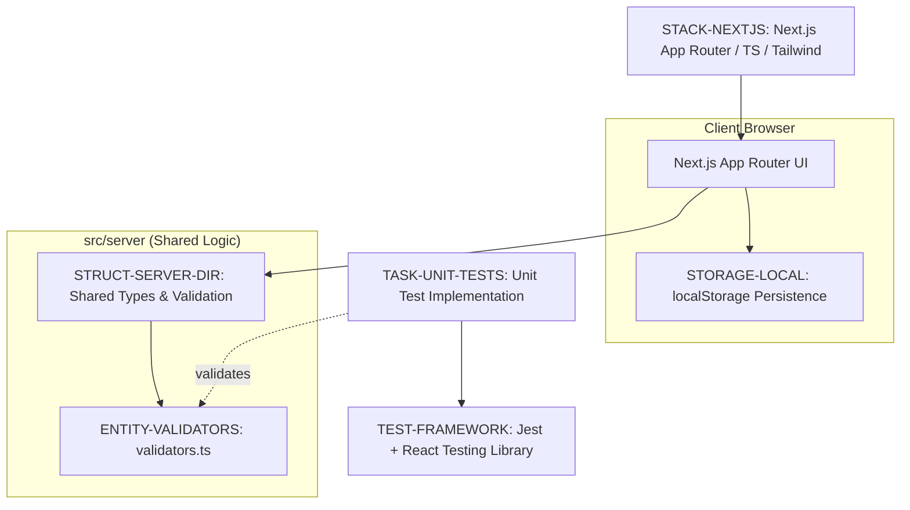

# Expense Tracker — Technical Documentation

## 1. Executive Summary
The Expense Tracker is a single-user web application designed for lightweight financial tracking, built using the Next.js App Router. The system implements a client-side data pattern leveraging `localStorage` for persistence, ensuring a fast, zero-latency user experience without the need for a remote database. To facilitate future backend scalability, the architecture strategically isolates shared TypeScript types and validation utilities within a dedicated `src/server` directory.

Currently, the project is in the **REFINEMENT** status. While the technical stack and high-level structure are well-defined, the system is not yet production-ready due to critical architectural omissions, specifically the lack of formal Data Models and Schemas and undefined API contracts for future route handlers.

## 2. Technical Stack & Architecture

### Technology Stack
- **Languages & Frameworks**:
    - **TypeScript**: Primary language for static typing across the application.
    - **Next.js (App Router)**: Core framework utilizing Server Components for optimized rendering.
    - **React**: UI library for building the component-based interface.
    - **Tailwind CSS**: Utility-first framework used to ensure a fully responsive UI.
    - **Node 18+**: Required runtime environment for execution.

### Quality Assurance
- **Jest & React Testing Library**: Used for mandatory unit and component behavior verification. All validators and core logic must pass these tests before merging.

### Architectural Constraints
- **Persistence**: Strictly limited to client-side `localStorage`.
- **Security**: Zero authentication requirement (No Auth).
- **Logic Isolation**: Shared types and validation utilities must be strictly isolated within the `src/server` directory to maintain a clean separation between UI and business logic.

## 3. Domain Model & Requirements

### Identified Entities & Components
The system is structured around the following primary functional elements:
- **ExpenseForm**: The primary interface component for capturing and validating new financial transaction data.
- **ExpenseList**: The presentation component responsible for rendering the collection of recorded financial outflows.

### System Relationships
The application maintains a strict dependency flow where the UI components interact with the `src/server` validation logic to ensure data integrity before persisting the state into the browser's local storage.

## 4. Glossary

| Term | Category | Definition | Anchor |
| :--- | :--- | :--- | :--- |
| **Branch** | TECHNICAL_STACK | The specific version control lineage identified as `feat/expense-tracker` for this feature set. | *Implementation Plan: Expense Tracker* |
| **CSS** | TECHNICAL_STACK | Styling implementation handled via the Tailwind utility framework to ensure responsive layouts. | *STACK-NEXTJS* |
| **Constraints** | TECHNICAL_STACK | The set of restrictive boundaries, including the total absence of identity verification mechanisms. | *Technical Context* |
| **Date** | TECHNICAL_STACK | The temporal marker set to 2026-06-22 for this planning iteration. | *Implementation Plan: Expense Tracker* |
| **ExpenseForm** | BUSINESS_DOMAIN | The user interface component responsible for capturing new financial transaction data. | *Project Structure* |
| **ExpenseList** | BUSINESS_DOMAIN | The user interface component that renders a collection of recorded financial outflows. | *Project Structure* |
| **ISO** | TECHNICAL_STACK | The international standard format adopted for the 2026-06-22 temporal string. | *Implementation Plan: Expense Tracker* |
| **JSON** | TECHNICAL_STACK | The serialized data exchange format used to store state within the browser's key-value memory. | *STORAGE-LOCAL* |
| **LocalStorage** | TECHNICAL_STACK | The browser-based persistent mechanism used to maintain data across sessions without a remote database. | *STORAGE-LOCAL* |
| **Node** | TECHNICAL_STACK | The runtime environment requiring version 18 or higher to execute the application. | *STACK-NEXTJS* |
| **Performance Goals** | TECHNICAL_STACK | Target metrics focused on minimizing bundle size and maximizing interface responsiveness. | *Technical Context* |
| **Primary Dependencies** | TECHNICAL_STACK | The core external libraries including React and the App Router framework. | *Technical Context* |
| **Project Type** | TECHNICAL_STACK | A frontend-centric web application with placeholder server-side route handlers for future scalability. | *Technical Context* |
| **Spec** | TECHNICAL_STACK | The reference documentation located at `specs/001-expense-tracker/spec.md`. | *Implementation Plan: Expense Tracker* |
| **Storage** | TECHNICAL_STACK | The client-side persistence layer restricted to the browser environment. | *STORAGE-LOCAL* |
| **Target Platform** | TECHNICAL_STACK | Modern web browsers capable of executing the specified runtime. | *Technical Context* |
| **Testing** | TECHNICAL_STACK | The quality assurance process utilizing a combined library for unit and component behavior verification. | *TEST-FRAMEWORK* |
| **TypeScript** | TECHNICAL_STACK | The statically typed superset of the primary language used for all source files. | *STACK-NEXTJS* |
| **UI** | BUSINESS_DOMAIN | The visual presentation layer that must remain lightweight and accessible. | *Technical Context* |

## 5. System Diagrams

### Expense Tracker Technical Architecture
High-level mapping of architecture choices, project structure, and the relationship between server-side utilities and client-side persistence.



### Implementation Lifecycle Workflow
The process flow from research to final merge, including the mandatory testing gate.

```mermaid
flowchart TD
    START[Start Implementation] --> PHASE-0["PHASE-0: Research & Decision Recording"]
    PHASE-0 --> DEV[Development of Components & Logic]
    DEV --> TEST_CHECK{?"Tests Implemented?"}
    
    TEST_CHECK -- "No" --> TASK-UNIT-TESTS["TASK-UNIT-TESTS: Implement Unit Tests"]
    TASK-UNIT-TESTS --> TEST_CHECK
    
    TEST_CHECK -- "Yes" --> MERGE_GATE{?"Meets Repo Guidelines?"}
    MERGE_GATE -- "No" --> DEV
    MERGE_GATE -- "Yes" --> END[Merge to Main]
```

## 6. Critical Dependencies
- **Browser LocalStorage API**: Essential for the primary data persistence layer.
- **Jest & React Testing Library**: Critical for QA gate validation and ensuring stability before merge.
- **Internal Logic Link**: Strong dependency between `src/server/validators.ts` and the frontend data entry forms.
- **Node 18+ Runtime**: Required for the build and execution environment.

## 7. Structural Gaps

| Gap | Priority | Description |
| :--- | :--- | :--- |
| **Data Models & Schemas** | HIGH | Complete absence of formal entity definitions and data structures. |
| **API Contracts & Flow** | MEDIUM | Undefined contracts for the proposed future-ready route handlers. |
| **Security & Identity** | LOW | Lack of identity management (consistent with current "No Auth" requirement). |

## 8. Metadata
- **Project Name**: Expense Tracker
- **Document Type**: Technical Specification / Plan
- **Last Updated**: 2026-06-22
- **Status**: Refinement