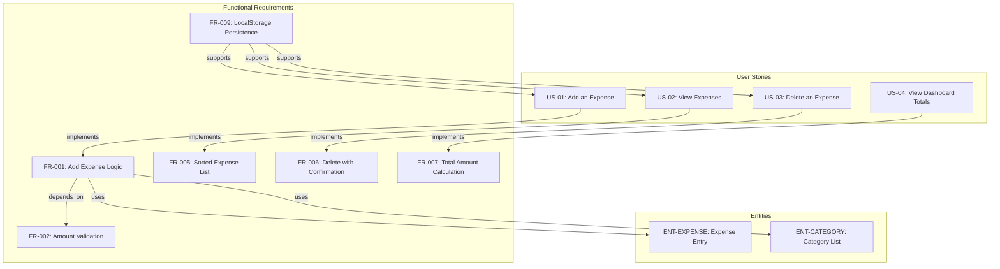
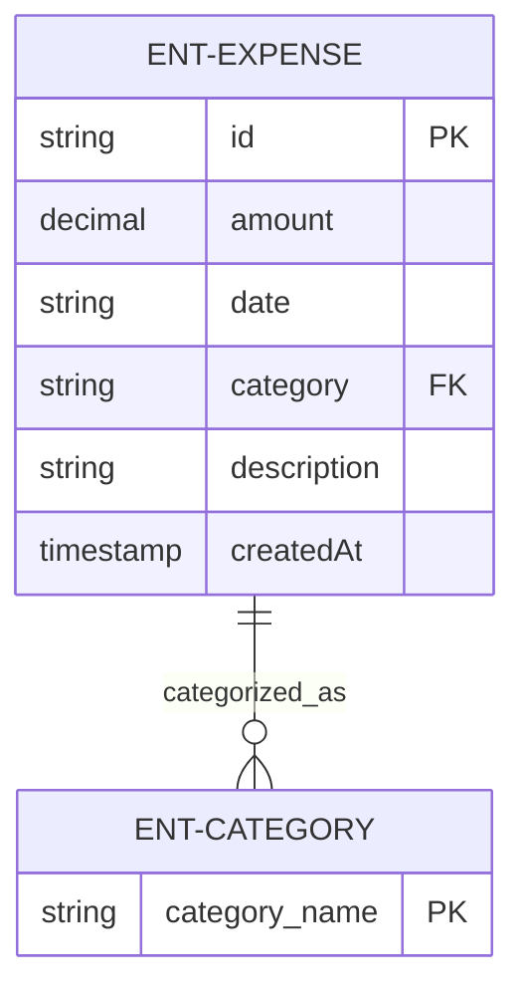
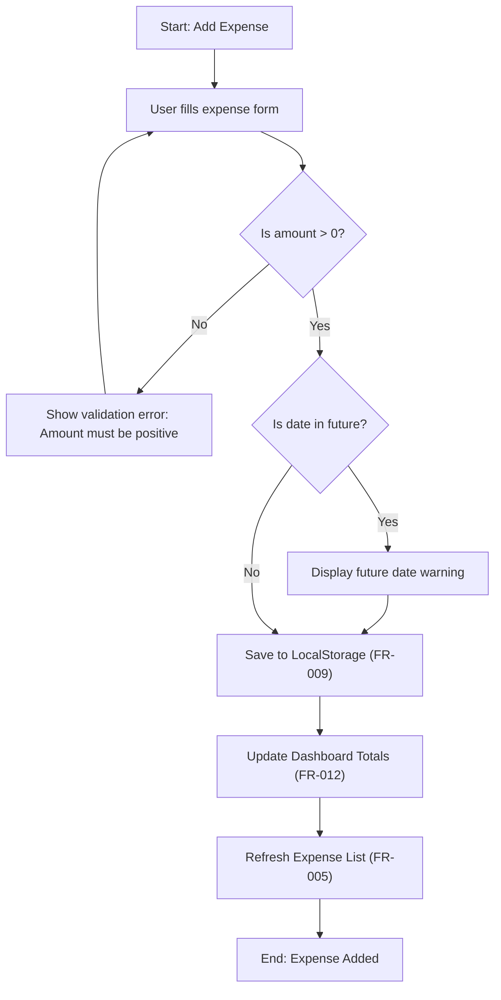
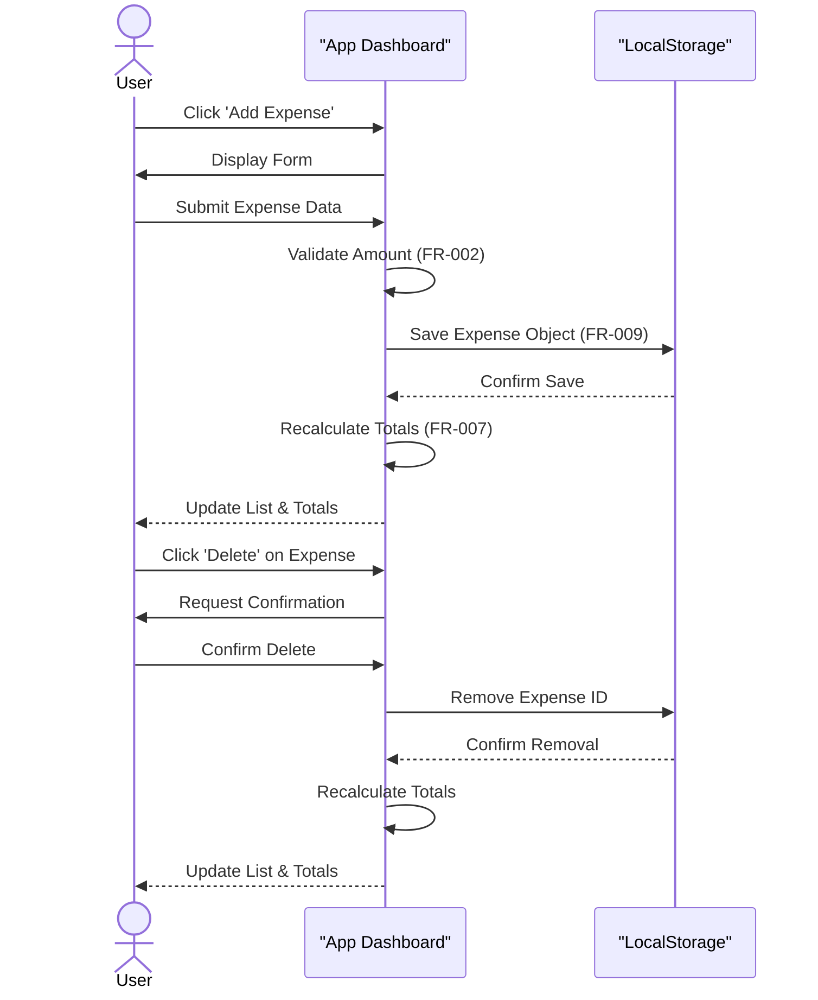

# Expense Tracker — Technical Documentation

## 1. Executive Summary
The Expense Tracker is a client-side personal finance application designed for single-user expense logging. The system implements a CRUD-lite pattern (Create, Read, Delete) to allow users to manage their spending without the need for a backend infrastructure, utilizing browser localStorage for data persistence. Key features include a summary dashboard providing real-time totals and a transaction history sorted in descending order by date.

From a maturity perspective, the specifications are high-quality and logically consistent, demonstrating a strong mapping between user stories and functional requirements. The project is currently READY for execution. While a formal "Scope & Out-of-Scope" section was not explicitly defined in the initial parsing, this gap is mitigated by the explicit functional exclusions regarding authentication and editing capabilities in version 1.

## 2. Technical Stack & Architecture

### Technology Stack
- **Persistence Layer**: Browser LocalStorage API (Synchronous key-value storage).

### Architectural Constraints
To ensure data integrity and system performance, the following constraints are enforced:
- **Data Validation**: Expense amounts must be positive numbers greater than 0, with a maximum allowable value of 999,999.99.
- **Data Organization**: Transaction history must be sorted in descending order (newest first), with the dashboard limiting the default display to the 50 most recent expenses.
- **Performance & Accessibility**: The system must maintain an interactive load time of less than 2 seconds and adhere to WCAG AA standards to ensure zero critical accessibility violations.
- **Operational Scope**: 
    - No backend or cloud synchronization is implemented.
    - No user authentication is required; the system operates on a single-user local session.
    - Version 1 explicitly excludes edit/update capabilities (users must delete and re-add entries to make changes).

## 3. Domain Model & Requirements

The system is built around two primary entities: the **Expense Entry (ENT-EXPENSE)** and the **Category List (ENT-CATEGORY)**. An expense is defined as a financial record containing a value, timestamp, classification, and optional notes, which is linked to a restricted set of category labels (e.g., Food, Transport).

### Functional Traceability
The system requirements are mapped as follows:
- **Expense Creation**: User Story US-01 is implemented via FR-001 (Add Expense Logic), which depends on FR-002 for amount validation and utilizes both the Expense and Category entities.
- **Expense Visualization**: User Story US-02 is realized through FR-005, ensuring a sorted list of transactions.
- **Expense Removal**: User Story US-03 is handled by FR-006, requiring a confirmation step before deletion.
- **Financial Analytics**: User Story US-04 is supported by FR-007, which manages the real-time calculation of total amounts.
- **Persistence**: All the above functionalities are underpinned by FR-009, which manages the LocalStorage interface.

## 4. Glossary

| Term | Category | Definition | Anchor |
| :--- | :--- | :--- | :--- |
| **AA** | TECHNICAL_STACK | The specific accessibility conformance level required for the user interface to ensure a minimal standard of inclusive design. | *Measurable Outcomes* |
| **Acceptance Scenarios** | TECHNICAL_STACK | The set of behavioral conditions that must be satisfied to verify the completion of a functional unit. | *User Story 1 - Add an Expense (Priority: P1)* |
| **Category** | BUSINESS_DOMAIN | A restricted set of labels used to classify spending, such as Food or Transport. | *ENT-CATEGORY* |
| **Expense** | BUSINESS_DOMAIN | A financial record consisting of a value, timestamp, classification, and optional notes. | *ENT-EXPENSE* |
| **FR** | TECHNICAL_STACK | The unique alphanumeric identifiers for mandatory system behaviors. | *Functional Requirements* |
| **Feature Branch** | TECHNICAL_STACK | The isolated development stream used for implementing the initial tracker version. | *Feature Specification: Expense Tracker* |
| **Fixed-Point Numeric Constraint** | TECHNICAL_STACK | The restriction limiting monetary values to a maximum of 999,999.99 with two decimal precision. | *Edge Cases* |
| **ISO** | TECHNICAL_STACK | The international standard format utilized for recording the date strings of entries. | *ENT-EXPENSE* |
| **Independent Test** | TECHNICAL_STACK | A verification method that validates a specific feature without relying on other system components. | *User Story 1 - Add an Expense (Priority: P1)* |
| **Input** | TECHNICAL_STACK | The raw user description providing the initial functional goals for the application. | *Feature Specification: Expense Tracker* |
| **LocalStorage** | TECHNICAL_STACK | The browser-based synchronous key-value storage mechanism used for data persistence. | *CON-01* |
| **NOT** | TECHNICAL_STACK | The logical negation operator used to explicitly define out-of-scope capabilities, such as editing. | *Functional Requirements* |
| **SC** | TECHNICAL_STACK | The unique alphanumeric identifiers for quantifiable performance and quality targets. | *Measurable Outcomes* |
| **Story** | TECHNICAL_STACK | A high-level description of a feature from the perspective of the end-user. | *User Story 1 - Add an Expense (Priority: P1)* |
| **USD** | BUSINESS_DOMAIN | The fixed currency unit utilized for all monetary calculations and displays. | *AS-01* |
| **WCAG** | TECHNICAL_STACK | The global accessibility guidelines used to evaluate the dashboard's inclusivity. | *Measurable Outcomes* |

## 5. System Diagrams

### Requirements Traceability Matrix
Maps User Stories to their implementing Functional Requirements and associated Entities to ensure full coverage.

### Expense Data Model
Entity Relationship Diagram for the Expense Tracker data structure stored in localStorage.

### Add Expense Workflow
Detailed logic flow for adding a new expense, including validation and persistence.

### Expense Management Sequence
Interaction between the User, the Application UI, and the LocalStorage persistence layer.

## 6. Critical Dependencies
- **Browser LocalStorage API**: Essential for all data persistence; failure of this API renders the application non-functional.
- **Relational Binding**: Strict dependency between the `Expense` entity and the predefined `Category` list to ensure data consistency.
- **Real-time Calculation Triggers**: The dashboard totals depend on immediate triggers following any addition or deletion of an expense.
- **WCAG AA Compliance**: The UI deployment is gated by the achievement of accessibility standards.

## 7. Structural Gaps
- **Scope & Out-of-Scope (Priority: MEDIUM)**: A formal section explicitly defining the boundaries of the project is missing. While functional exclusions (e.g., no editing, no auth) are mentioned in the requirements, a dedicated scope document is recommended for future iterations.

## 8. Metadata
- **Project Name**: Expense Tracker
- **Document Type**: Technical Specification
- **Status**: Ready for Execution
- **Persistence Strategy**: LocalStorage Only