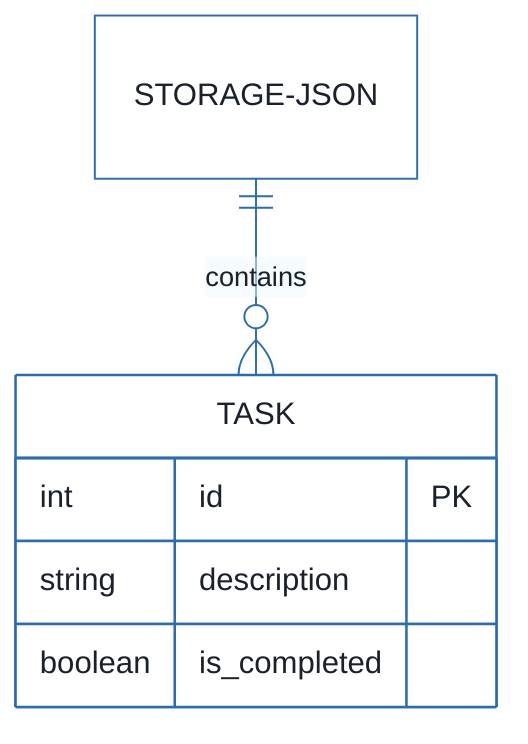
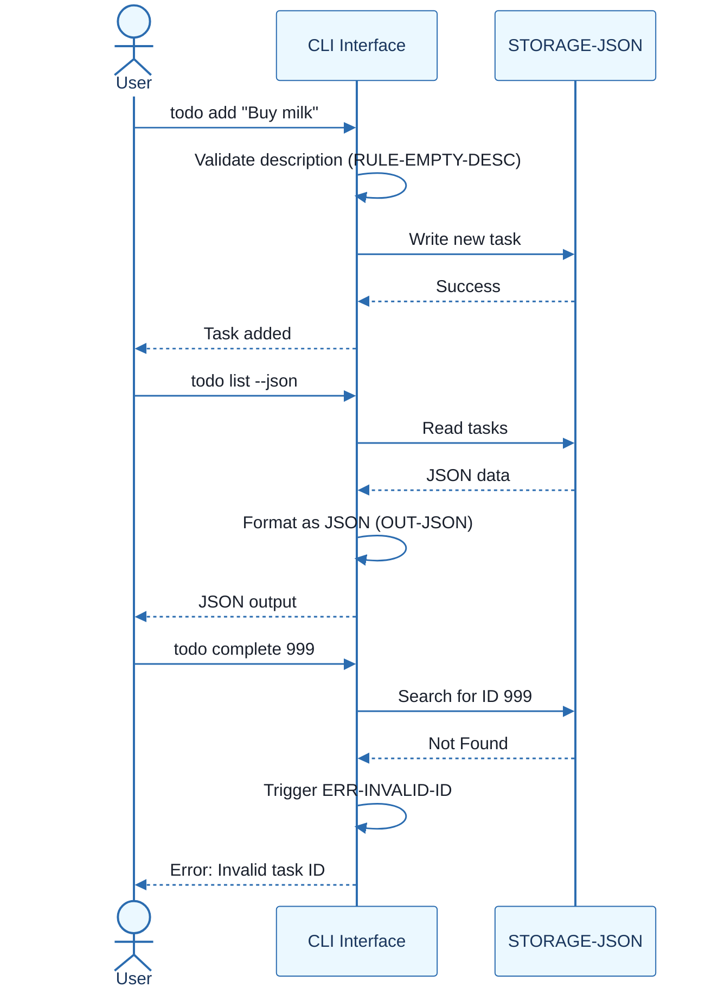
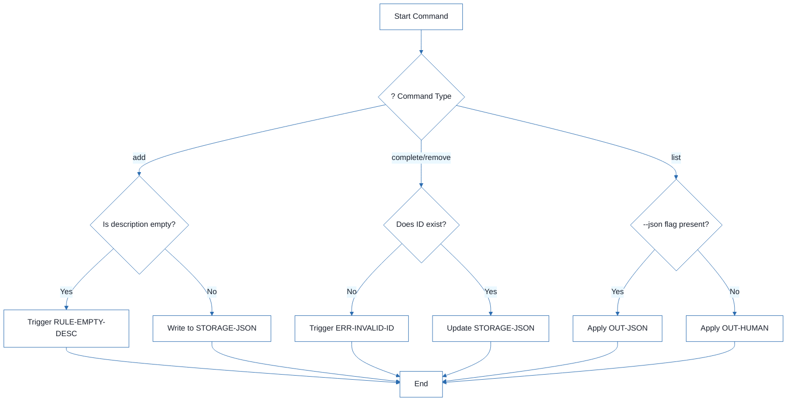

# CLI To-Do List Manager - Technical Specification & Architecture Document

## 1. Executive Summary & Architecture Overview

### 1.1 Executive Brief
A command-line interface (CLI) application designed to manage a task list persisted via a local JSON file. The system provides core CRUD operations (add, list, complete, remove, clear) with a specific focus on data integrity, input validation, and dual-mode output (human-readable and standard JSON).

### 1.2 Maturity Assessment
The project provides a clear functional contract for CLI commands, but is currently in REFINEMENT status. While completeness is high, the lack of a defined JSON schema for the storage file and the absence of a formal testing suite for edge cases (specifically for malformed JSON handling) represent significant structural gaps that must be addressed before implementation.

### 1.3 Technical Stack
*   **Storage Format**: JSON
*   **Persistence Layer**: Flat-file system (`~/.todos.json`)

### 1.4 Architectural Constraints
*   Descriptions consisting only of whitespace or empty strings must be rejected prior to file system write operations.
*   Malformed storage files must trigger a user-friendly error message and return a non-zero exit code.
*   Invalid task IDs must trigger a clear, user-friendly error message.
*   JSON output mode must be standard-compliant and accurately reflect the current state of the storage file.
*   Human-readable output must explicitly include Task ID, description, and completion status.

### 1.5 Critical Dependencies
*   File system access to `~/.todos.json` for state persistence.
*   Strict dependency between `CMD-ADD`/`CMD-LIST` and the JSON storage backend.
*   Logical coupling between `CMD-COMPLETE`/`CMD-REMOVE` and the ID validation mechanism.
*   Standard JSON parser for output and storage synchronization.

## 2. Architecture Workflows

```mermaid
%%{init: {
  'theme': 'base',
  'themeVariables': {
    'primaryColor': '#1A365D',
    'primaryTextColor': '#1A202C',
    'primaryBorderColor': '#2B6CB0',
    'lineColor': '#2B6CB0',
    'secondaryColor': '#EBF8FF',
    'tertiaryColor': '#EBF8FF',
    'background': '#FFFFFF',
    'mainBkg': '#FFFFFF',
    'secondBkg': '#EBF8FF',
    'tertiaryBkg': '#F7FAFC',
    'secondaryTextColor': '#4A5568',
    'fontSize': '16px',
    'fontFamily': 'Inter, system-ui, sans-serif',
    'nodePadding': '15px',
    'borderRadius': '8px',
    'edgeLabelBackground': '#EBF8FF',
    'clusterBkg': '#F7FAFC',
    'clusterBorder': '#2B6CB0',
    'defaultLinkColor': '#2B6CB0',
    'titleColor': '#1A365D',
    'actorBorder': '#2B6CB0',
    'actorBkg': '#EBF8FF',
    'actorTextColor': '#1A365D',
    'actorLineColor': '#2B6CB0',
    'signalColor': '#2B6CB0',
    'signalTextColor': '#1A202C',
    'labelBoxBorderColor': '#2B6CB0',
    'labelBoxBkgColor': '#EBF8FF',
    'labelTextColor': '#1A202C',
    'loopTextColor': '#1A202C',
    'arrowHeadColor': '#2B6CB0',
    'sequenceNumberColor': '#1A365D',
    'sequenceActorBorder': '#2B6CB0',
    'sequenceActorBkg': '#EBF8FF',
    'sequenceArrowColor': '#2B6CB0',
    'noteBkgColor': '#FFF5EB',
    'noteBorderColor': '#DD6B20',
    'noteTextColor': '#1A202C'
  }
}}%%
flowchart TD
    subgraph Commands
        CMD-ADD["CMD-ADD: todo add"]
        CMD-LIST["CMD-LIST: todo list"]
        CMD-COMPLETE["CMD-COMPLETE: todo complete"]
        CMD-REMOVE["CMD-REMOVE: todo remove"]
        CMD-CLEAR["CMD-CLEAR: todo clear"]
    end
    subgraph Constraints_and_Criteria
        RULE-EMPTY-DESC["RULE-EMPTY-DESC: No empty desc"]
        OUT-HUMAN["OUT-HUMAN: Human-readable output"]
        OUT-JSON["OUT-JSON: JSON output"]
        ERR-INVALID-ID["ERR-INVALID-ID: Invalid ID error"]
    end
    subgraph Infrastructure
        STORAGE-JSON["STORAGE-JSON: ~/.todos.json"]
    end
    CMD-ADD -->|"implements"| RULE-EMPTY-DESC
    CMD-ADD -->|"depends_on"| STORAGE-JSON
    CMD-LIST -->|"implements"| OUT-HUMAN
    CMD-LIST -->|"implements"| OUT-JSON
    CMD-LIST -->|"depends_on"| STORAGE-JSON
    CMD-COMPLETE -->|"relates_to"| ERR-INVALID-ID
    CMD-REMOVE -->|"relates_to"| ERR-INVALID-ID
```







```mermaid
%%{init: {
  'theme': 'base',
  'themeVariables': {
    'primaryColor': '#1A365D',
    'primaryTextColor': '#1A202C',
    'primaryBorderColor': '#2B6CB0',
    'lineColor': '#2B6CB0',
    'secondaryColor': '#EBF8FF',
    'tertiaryColor': '#EBF8FF',
    'background': '#FFFFFF',
    'mainBkg': '#FFFFFF',
    'secondBkg': '#EBF8FF',
    'tertiaryBkg': '#F7FAFC',
    'secondaryTextColor': '#4A5568',
    'fontSize': '16px',
    'fontFamily': 'Inter, system-ui, sans-serif',
    'nodePadding': '15px',
    'borderRadius': '8px',
    'edgeLabelBackground': '#EBF8FF',
    'clusterBkg': '#F7FAFC',
    'clusterBorder': '#2B6CB0',
    'defaultLinkColor': '#2B6CB0',
    'titleColor': '#1A365D',
    'actorBorder': '#2B6CB0',
    'actorBkg': '#EBF8FF',
    'actorTextColor': '#1A365D',
    'actorLineColor': '#2B6CB0',
    'signalColor': '#2B6CB0',
    'signalTextColor': '#1A202C',
    'labelBoxBorderColor': '#2B6CB0',
    'labelBoxBkgColor': '#EBF8FF',
    'labelTextColor': '#1A202C',
    'loopTextColor': '#1A202C',
    'arrowHeadColor': '#2B6CB0',
    'sequenceNumberColor': '#1A365D',
    'sequenceActorBorder': '#2B6CB0',
    'sequenceActorBkg': '#EBF8FF',
    'sequenceArrowColor': '#2B6CB0',
    'noteBkgColor': '#FFF5EB',
    'noteBorderColor': '#DD6B20',
    'noteTextColor': '#1A202C'
  }
}}%%
flowchart TD
    START["Start Command"]
    CMD_TYPE{"? Command Type"}
    START --> CMD_TYPE
    CMD_TYPE -- "add" --> VAL_DESC{"Is description empty?"}
    VAL_DESC -- "Yes" --> ERR_EMPTY["Trigger RULE-EMPTY-DESC"]
    VAL_DESC -- "No" --> WRITE_JSON["Write to STORAGE-JSON"]
    ERR_EMPTY --> END["End"]
    WRITE_JSON --> END
    CMD_TYPE -- "complete/remove" --> VAL_ID{"Does ID exist?"}
    VAL_ID -- "No" --> ERR_ID["Trigger ERR-INVALID-ID"]
    VAL_ID -- "Yes" --> MOD_JSON["Update STORAGE-JSON"]
    ERR_ID --> END
    MOD_JSON --> END
    CMD_TYPE -- "list" --> FMT_CHECK{"--json flag present?"}
    FMT_CHECK -- "Yes" --> OUT_J["Apply OUT-JSON"]
    FMT_CHECK -- "No" --> OUT_H["Apply OUT-HUMAN"]
    OUT_J --> END
    OUT_H --> END
``` & Visual Diagrams

### 2.1 CLI To-Do Manager Data Model
```mermaid
%%{init: {
  'theme': 'base',
  'themeVariables': {
    'primaryColor': '#1A365D',
    'primaryTextColor': '#1A202C',
    'primaryBorderColor': '#2B6CB0',
    'lineColor': '#2B6CB0',
    'secondaryColor': '#EBF8FF',
    'tertiaryColor': '#EBF8FF',
    'background': '#FFFFFF',
    'mainBkg': '#FFFFFF',
    'secondBkg': '#EBF8FF',
    'tertiaryBkg': '#F7FAFC',
    'secondaryTextColor': '#4A5568',
    'fontSize': '16px',
    'fontFamily': 'Inter, system-ui, sans-serif',
    'nodePadding': '15px',
    'borderRadius': '8px',
    'edgeLabelBackground': '#EBF8FF',
    'clusterBkg': '#F7FAFC',
    'clusterBorder': '#2B6CB0',
    'defaultLinkColor': '#2B6CB0',
    'titleColor': '#1A365D',
    'actorBorder': '#2B6CB0',
    'actorBkg': '#EBF8FF',
    'actorTextColor': '#1A365D',
    'actorLineColor': '#2B6CB0',
    'signalColor': '#2B6CB0',
    'signalTextColor': '#1A202C',
    'labelBoxBorderColor': '#2B6CB0',
    'labelBoxBkgColor': '#EBF8FF',
    'labelTextColor': '#1A202C',
    'loopTextColor': '#1A202C',
    'arrowHeadColor': '#2B6CB0',
    'sequenceNumberColor': '#1A365D',
    'sequenceActorBorder': '#2B6CB0',
    'sequenceActorBkg': '#EBF8FF',
    'sequenceArrowColor': '#2B6CB0',
    'noteBkgColor': '#FFF5EB',
    'noteBorderColor': '#DD6B20',
    'noteTextColor': '#1A202C'
  }
}}%%
erDiagram
    STORAGE-JSON ||--o{ TASK : "contains"
    TASK {
        int id PK
        string description
        boolean is_completed
    }
```

### 2.2 Command Execution Sequence


### 2.3 Requirements Traceability Matrix


### 2.4 Command Logic Workflow


## 3. Detailed Technical Specifications & Business Rules

### 3.1 Requirements Traceability
| Identifier | Type | Requirement / Rule Description | Source Section |
| :--- | :--- | :--- | :--- |
| `CMD-ADD` | Task | Implement `todo add <description>` command | `todo add <description>` |
| `RULE-EMPTY-DESC` | Constraint | Reject empty or whitespace-only descriptions before file write | `todo add <description>` |
| `STORAGE-JSON` | Dependency | Storage file at `~/.todos.json` | `todo add <description>` |
| `CMD-LIST` | Task | Implement `todo list [--json]` command | `todo list [--json]` |
| `OUT-HUMAN` | Acceptance Criterion | Human-readable output must show ID, description, and status | Output Rules |
| `OUT-JSON` | Acceptance Criterion | JSON output must be standard-compliant and reflect current list | Output Rules |
| `CMD-COMPLETE` | Task | Implement `todo complete <id>` command | `todo complete <id>` |
| `CMD-REMOVE` | Task | Implement `todo remove <id>` command | `todo remove <id>` |
| `CMD-CLEAR` | Task | Implement `todo clear` command | `todo clear` |
| `ERR-INVALID-ID` | Constraint | Invalid IDs must produce clear user-friendly error messages | Error Rules |
| `ERR-MALFORMED-FILE` | Constraint | Malformed storage files must result in error message and non-zero exit code | Error Rules |

### 3.2 Security Rules
*   **Input Validation**: All inputs for `CMD-ADD` must be sanitized to prevent empty or whitespace-only entries from being persisted.
*   **Error Handling**: System must ensure that malformed storage files do not cause application crashes but instead trigger a controlled exit with a non-zero code.

### 3.3 Data Models
The system utilizes a flat-file JSON database located at `~/.todos.json`.
*   **Entity**: Task
    *   `id`: Unique identifier (Integer/String).
    *   `description`: Textual content of the task.
    *   `is_completed`: Boolean flag indicating completion status.

## 4. Project Governance & Structural Gaps

### 4.1 Structural Gaps
| Gap | Priority | Remediation Advice |
| :--- | :--- | :--- |
| Dependencies & Integration Points | LOW | Specify if external libraries (like 'clap' for Rust or 'commander' for JS) are required. |
| Testing & Validation | HIGH | Define a test suite for each command, including edge cases for malformed JSON. |
| Implementation Notes & References | MEDIUM | Add details on the expected JSON schema for `~/.todos.json`. |
| Open Questions & Uncertainties | LOW | Clarify if the ID is an integer, UUID, or user-defined string. |

### 4.2 Remediation & Workflow
1.  **Schema Definition**: Define the exact JSON structure to resolve `Open Questions`.
2.  **Test Suite Design**: Create a matrix of test cases covering `ERR-INVALID-ID` and `ERR-MALFORMED-FILE`.
3.  **Library Selection**: Select the CLI parsing framework based on the chosen language.

## 5. Technical & Domain Glossary (Terminology Reference)

| Term | Category | Context Anchor | Project Definition |
| :--- | :--- | :--- | :--- |
| ID | BUSINESS_DOMAIN | ERR-INVALID-ID | The unique alphanumeric reference used to target a specific entry for completion or deletion within the persistent storage. |
| JSON | TECHNICAL_STACK | STORAGE-JSON | The lightweight data-interchange format used for the flat-file database located at ~/.todos.json and for optional machine-readable output. |
| todo clear | BUSINESS_DOMAIN | CMD-CLEAR | The operation that purges all entries marked as finished while preserving those still pending. |