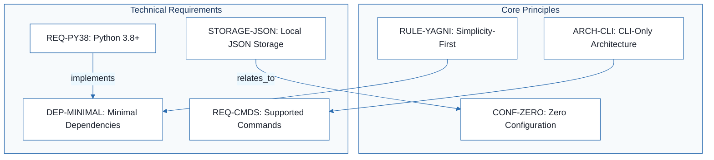
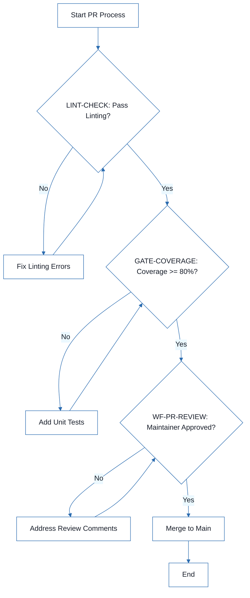
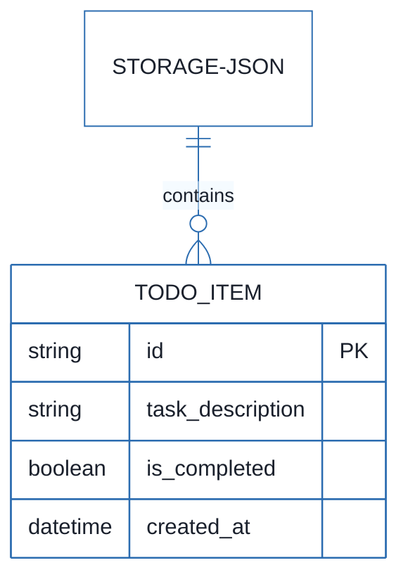
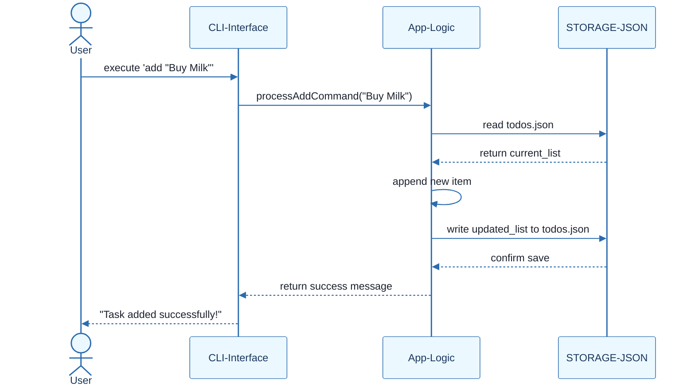

# To-Do List Manager - Technical Specification & Architecture Document

## 1. Executive Summary & Architecture Overview

### 1.1 Executive Brief
The To-Do List Manager is a minimal CLI application designed for local task management. It utilizes a zero-configuration architecture, relying exclusively on the Python standard library for logic and a local JSON file (`~/.todos.json`) for persistent data storage. The project prioritizes simplicity and the YAGNI principle, eliminating all external server, network, or GUI dependencies.

### 1.2 Maturity Assessment
The project is READY for execution. While there are minor structural gaps regarding a formal testing strategy and a dedicated tracking section for uncertainties, the core technical requirements and quality gates are explicitly defined and sufficient for a project of this minimal scope.

### 1.3 Technical Stack
* Python 3.8+
* pylint
* flake8

### 1.4 Architectural Constraints
* CLI-only architecture: No web UI, no server, no GUI components.
* Storage: Local JSON file at `~/.todos.json`.
* Zero configuration: No setup, config files, or environment variables.
* Dependency limit: Python standard library exclusively.
* Test coverage >= 80%.
* Mandatory linting pass via pylint or flake8.
* Mandatory docstrings for all functions.
* PR Gate: Required review and passing tests.

### 1.5 Critical Dependencies
* Local filesystem access for `~/.todos.json`.
* Python 3.8+ runtime.
* PR review workflow dependency on `GATE-COVERAGE` (80% threshold).
* PR review workflow dependency on `LINT-CHECK`.

## 2. Architecture Workflows







```mermaid
%%{init: {
  'theme': 'base',
  'themeVariables': {
    'primaryColor': '#1A365D',
    'primaryTextColor': '#1A202C',
    'primaryBorderColor': '#2B6CB0',
    'lineColor': '#2B6CB0',
    'secondaryColor': '#EBF8FF',
    'tertiaryColor': '#EBF8FF',
    'background': '#FFFFFF',
    'mainBkg': '#FFFFFF',
    'secondBkg': '#EBF8FF',
    'tertiaryBkg': '#F7FAFC',
    'secondaryTextColor': '#4A5568',
    'fontSize': '16px',
    'fontFamily': 'Inter, system-ui, sans-serif',
    'nodePadding': '15px',
    'borderRadius': '8px',
    'edgeLabelBackground': '#EBF8FF',
    'clusterBkg': '#F7FAFC',
    'clusterBorder': '#2B6CB0',
    'defaultLinkColor': '#2B6CB0',
    'titleColor': '#1A365D',
    'actorBorder': '#2B6CB0',
    'actorBkg': '#EBF8FF',
    'actorTextColor': '#1A365D',
    'actorLineColor': '#2B6CB0',
    'signalColor': '#2B6CB0',
    'signalTextColor': '#1A202C',
    'labelBoxBorderColor': '#2B6CB0',
    'labelBoxBkgColor': '#EBF8FF',
    'labelTextColor': '#1A202C',
    'loopTextColor': '#1A202C',
    'arrowHeadColor': '#2B6CB0',
    'sequenceNumberColor': '#1A365D',
    'sequenceActorBorder': '#2B6CB0',
    'sequenceActorBkg': '#EBF8FF',
    'sequenceArrowColor': '#2B6CB0',
    'noteBkgColor': '#FFF5EB',
    'noteBorderColor': '#DD6B20',
    'noteTextColor': '#1A202C'
  }
}}%%
sequenceDiagram
    actor User
    participant CLI as CLI-Interface
    participant Logic as App-Logic
    participant Storage as STORAGE-JSON
    User->>CLI: execute 'add "Buy Milk"'
    CLI->>Logic: processAddCommand("Buy Milk")
    Logic->>Storage: read todos.json
    Storage-->>Logic: return current_list
    Logic->>Logic: append new item
    Logic->>Storage: write updated_list to todos.json
    Storage-->>Logic: confirm save
    Logic-->>CLI: return success message
    CLI-->>User: "Task added successfully!"
``` & Visual Diagrams

### 2.1 Technical Requirements Traceability
```mermaid
%%{init: {
  'theme': 'base',
  'themeVariables': {
    'primaryColor': '#1A365D',
    'primaryTextColor': '#1A202C',
    'primaryBorderColor': '#2B6CB0',
    'lineColor': '#2B6CB0',
    'secondaryColor': '#EBF8FF',
    'tertiaryColor': '#EBF8FF',
    'background': '#FFFFFF',
    'mainBkg': '#FFFFFF',
    'secondBkg': '#EBF8FF',
    'tertiaryBkg': '#F7FAFC',
    'secondaryTextColor': '#4A5568',
    'fontSize': '16px',
    'fontFamily': 'Inter, system-ui, sans-serif',
    'nodePadding': '15px',
    'borderRadius': '8px',
    'edgeLabelBackground': '#EBF8FF',
    'clusterBkg': '#F7FAFC',
    'clusterBorder': '#2B6CB0',
    'defaultLinkColor': '#2B6CB0',
    'titleColor': '#1A365D',
    'actorBorder': '#2B6CB0',
    'actorBkg': '#EBF8FF',
    'actorTextColor': '#1A365D',
    'actorLineColor': '#2B6CB0',
    'signalColor': '#2B6CB0',
    'signalTextColor': '#1A202C',
    'labelBoxBorderColor': '#2B6CB0',
    'labelBoxBkgColor': '#EBF8FF',
    'labelTextColor': '#1A202C',
    'loopTextColor': '#1A202C',
    'arrowHeadColor': '#2B6CB0',
    'sequenceNumberColor': '#1A365D',
    'sequenceActorBorder': '#2B6CB0',
    'sequenceActorBkg': '#EBF8FF',
    'sequenceArrowColor': '#2B6CB0',
    'noteBkgColor': '#FFF5EB',
    'noteBorderColor': '#DD6B20',
    'noteTextColor': '#1A202C'
  }
}}%%
flowchart TD
    subgraph Principles [Core Principles]
        RULE-YAGNI["RULE-YAGNI: Simplicity-First"]
        ARCH-CLI["ARCH-CLI: CLI-Only Architecture"]
        CONF-ZERO["CONF-ZERO: Zero Configuration"]
    end
    subgraph Technical [Technical Requirements]
        REQ-PY38["REQ-PY38: Python 3.8+"]
        REQ-CMDS["REQ-CMDS: Supported Commands"]
        STORAGE-JSON["STORAGE-JSON: Local JSON Storage"]
        DEP-MINIMAL["DEP-MINIMAL: Minimal Dependencies"]
    end
    STORAGE-JSON -->|"relates_to"| CONF-ZERO
    REQ-PY38 -->|"implements"| DEP-MINIMAL
    ARCH-CLI --> REQ-CMDS
    RULE-YAGNI --> DEP-MINIMAL
```

### 2.2 Development Workflow & Quality Gates


### 2.3 Data Storage Model


### 2.4 CLI Command Interaction


## 3. Detailed Technical Specifications & Business Rules

### 3.1 Requirements Traceability

| Identifier | Type | Requirement / Rule Description | Source Section |
| :--- | :--- | :--- | :--- |
| RULE-YAGNI | rule | Apply YAGNI (You Aren't Gonna Need It) and resist feature creep. | I. Simplicity-First |
| ARCH-CLI | requirement | CLI-only architecture: No web UI, no server, no GUI components. | II. CLI-Only Architecture |
| STORAGE-JSON | tool_configuration | Data stored in local JSON file at `~/.todos.json` with no external dependencies. | III. JSON Local Storage |
| CONF-ZERO | requirement | Zero configuration: No setup, config files, or env vars required beyond Python. | IV. Zero Configuration |
| DEP-MINIMAL | coding_standard | Use Python standard library exclusively; third-party packages only for critical functionality. | V. Minimal Dependencies |
| REQ-PY38 | requirement | Language: Python 3.8+ (standard library only). | Technical Requirements |
| REQ-CMDS | requirement | Supported commands: add, list, complete, remove, clear. | Technical Requirements |
| LINT-CHECK | tool_configuration | Code must pass linting with pylint or flake8. | Development Workflow |
| STD-DOCS | coding_standard | All functions must have docstrings. | Development Workflow |
| GATE-COVERAGE | testing_gate | Test coverage must be 80% or higher. | Development Workflow |
| WF-PR-REVIEW | workflow_constraint | Pull requests require review and passing tests. | Development Workflow |

### 3.2 Security Rules
* **Local Data Isolation**: Data is stored in the user's home directory (`~/.todos.json`), ensuring that task lists are isolated per OS user.
* **Zero Network Surface**: By prohibiting network dependencies and server components, the application eliminates remote attack vectors.

### 3.3 Data Models
* **Persistence Format**: JSON.
* **Storage Location**: `~/.todos.json`.
* **Schema**: A collection of task objects containing a unique identifier, task description, completion status, and creation timestamp.

## 4. Project Governance & Structural Gaps

### 4.1 Structural Gaps

| Missing Section | Priority | Remediation Advice |
| :--- | :--- | :--- |
| Open Questions & Uncertainties | LOW | Add a section to track unresolved technical decisions or future architectural questions. |
| Testing Discipline & Gates | MEDIUM | While coverage is mentioned, a dedicated section for testing strategy (unit vs integration) is missing. |

### 4.2 Remediation & Workflow
The project follows a strict governance model where the Constitution supersedes all other practices. Amendments require a Pull Request with detailed justification, review by the project maintainer, and a version increment of the constitution document.

## 5. Technical & Domain Glossary (Terminology Reference)

| Term | Category | Context Anchor | Project Definition |
| :--- | :--- | :--- | :--- |
| GUI | TECHNICAL_STACK | ARCH-CLI | Visual window-based interaction elements strictly forbidden in this architecture. |
| JSON | TECHNICAL_STACK | STORAGE-JSON | The primary lightweight data interchange format used for local persistence in the home directory. |
| Python 3.8 | TECHNICAL_STACK | REQ-PY38 | The minimum required runtime environment version utilizing only the built-in standard library. |
| UI | TECHNICAL_STACK | ARCH-CLI | Any graphical or web-based presentation layer explicitly excluded from the system. |
| YAGNI | BUSINESS_DOMAIN | RULE-YAGNI | A development philosophy prohibiting the implementation of features until they are actually required. |