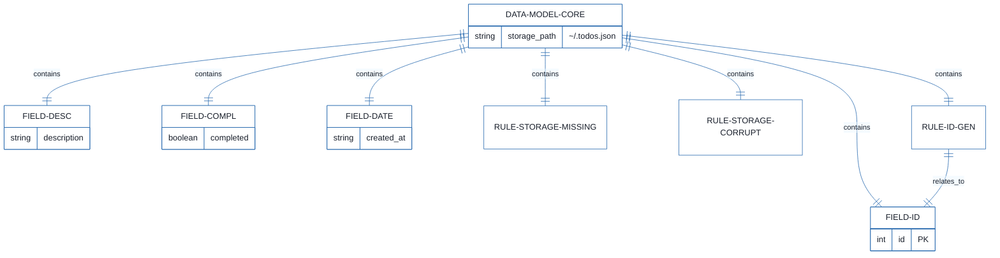
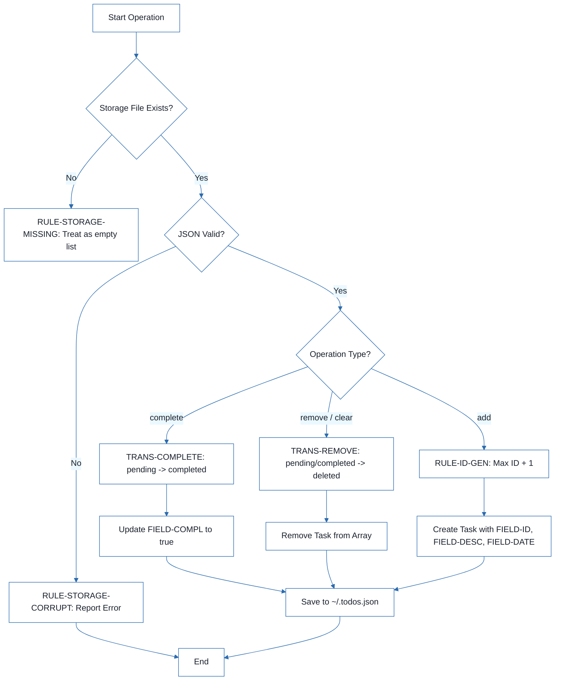
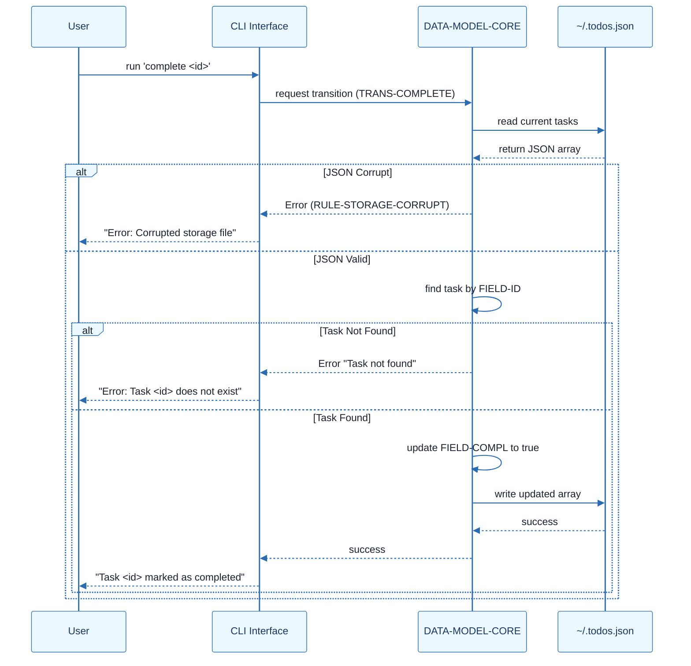

# CLI To-Do List Manager - Technical Specification & Architecture Document

## 1. Executive Summary & Architecture Overview

### 1.1 Executive Brief
This project defines a data model for a CLI To-Do List Manager utilizing a local JSON file (`~/.todos.json`) for persistence. It implements a sequential ID-based task system with strict validation on field types and state transitions (pending, completed, deleted). The architecture focuses on data integrity, ensuring immutability of creation timestamps and strict sequential ID generation.

### 1.2 Maturity Assessment
The specification provides a solid foundation for the data schema but is currently in REFINEMENT. While the field definitions are precise, there is a critical lack of formal Acceptance Criteria and a Testing & Validation strategy, particularly regarding boundary values and corruption recovery. The absence of defined external dependencies for ISO 8601 validation also requires clarification before full implementation.

### 1.3 Technical Stack
*   **Storage Format**: JSON
*   **Timestamp Standard**: ISO 8601 UTC
*   **Persistence Layer**: Local Filesystem (`~/.todos.json`)

### 1.4 Architectural Constraints
*   **ID Generation**: IDs must be strictly > 0, unique, and sequential (Highest current ID + 1).
*   **Data Integrity**: `created_at` timestamps must be immutable after the initial creation.
*   **Storage Fallback**: A missing storage file must be interpreted as an empty task list.
*   **Error Handling**: Corrupted JSON files must be reported as a user error and halt operation.
*   **Field Validation**: Descriptions must be trimmed and contain non-whitespace content.

### 1.5 Critical Dependencies
*   Local filesystem access for `~/.todos.json`.
*   JSON parsing engine for data serialization/deserialization.
*   ISO 8601 compliant timestamp generator.
*   Referential integrity between Task ID and state transition commands (`complete`/`remove`).

## 2. Architecture Workflows

```mermaid
%%{init: {
  'theme': 'base',
  'themeVariables': {
    'primaryColor': '#1A365D',
    'primaryTextColor': '#1A202C',
    'primaryBorderColor': '#2B6CB0',
    'lineColor': '#2B6CB0',
    'secondaryColor': '#EBF8FF',
    'tertiaryColor': '#EBF8FF',
    'background': '#FFFFFF',
    'mainBkg': '#FFFFFF',
    'secondBkg': '#EBF8FF',
    'tertiaryBkg': '#F7FAFC',
    'secondaryTextColor': '#4A5568',
    'fontSize': '16px',
    'fontFamily': 'Inter, system-ui, sans-serif',
    'nodePadding': '15px',
    'borderRadius': '8px',
    'edgeLabelBackground': '#EBF8FF',
    'clusterBkg': '#F7FAFC',
    'clusterBorder': '#2B6CB0',
    'defaultLinkColor': '#2B6CB0',
    'titleColor': '#1A365D',
    'actorBorder': '#2B6CB0',
    'actorBkg': '#EBF8FF',
    'actorTextColor': '#1A365D',
    'actorLineColor': '#2B6CB0',
    'signalColor': '#2B6CB0',
    'signalTextColor': '#1A202C',
    'labelBoxBorderColor': '#2B6CB0',
    'labelBoxBkgColor': '#EBF8FF',
    'labelTextColor': '#1A202C',
    'loopTextColor': '#1A202C',
    'arrowHeadColor': '#2B6CB0',
    'sequenceNumberColor': '#1A365D',
    'sequenceActorBorder': '#2B6CB0',
    'sequenceActorBkg': '#EBF8FF',
    'sequenceArrowColor': '#2B6CB0',
    'noteBkgColor': '#FFF5EB',
    'noteBorderColor': '#DD6B20',
    'noteTextColor': '#1A202C'
  }
}}%%
flowchart TD
    subgraph Core_Model [Core Specification]
        DATA-MODEL-CORE["DATA-MODEL-CORE: Implement Task data model"]
    end
    subgraph Constraints [Field & Operational Constraints]
        FIELD-ID["FIELD-ID: Integer, unique, positive"]
        FIELD-DESC["FIELD-DESC: String, non-empty"]
        FIELD-COMPL["FIELD-COMPL: Boolean, default false"]
        FIELD-DATE["FIELD-DATE: ISO 8601, immutable"]
        RULE-STORAGE-MISSING["RULE-STORAGE-MISSING: Handle missing file"]
        RULE-STORAGE-CORRUPT["RULE-STORAGE-CORRUPT: Handle corrupt JSON"]
        RULE-ID-GEN["RULE-ID-GEN: ID Generation Logic"]
    end
    subgraph Transitions [State Transitions]
        TRANS-COMPLETE["TRANS-COMPLETE: pending -> completed"]
        TRANS-REMOVE["TRANS-REMOVE: pending/completed -> deleted"]
    end
    DATA-MODEL-CORE --> FIELD-ID
    DATA-MODEL-CORE --> FIELD-DESC
    DATA-MODEL-CORE --> FIELD-COMPL
    DATA-MODEL-CORE --> FIELD-DATE
    DATA-MODEL-CORE --> RULE-STORAGE-MISSING
    DATA-MODEL-CORE --> RULE-STORAGE-CORRUPT
    DATA-MODEL-CORE --> RULE-ID-GEN
    TRANS-COMPLETE -->|"implements"| FIELD-COMPL
    RULE-ID-GEN -->|"relates_to"| FIELD-ID
```







```mermaid
%%{init: {
  'theme': 'base',
  'themeVariables': {
    'primaryColor': '#1A365D',
    'primaryTextColor': '#1A202C',
    'primaryBorderColor': '#2B6CB0',
    'lineColor': '#2B6CB0',
    'secondaryColor': '#EBF8FF',
    'tertiaryColor': '#EBF8FF',
    'background': '#FFFFFF',
    'mainBkg': '#FFFFFF',
    'secondBkg': '#EBF8FF',
    'tertiaryBkg': '#F7FAFC',
    'secondaryTextColor': '#4A5568',
    'fontSize': '16px',
    'fontFamily': 'Inter, system-ui, sans-serif',
    'nodePadding': '15px',
    'borderRadius': '8px',
    'edgeLabelBackground': '#EBF8FF',
    'clusterBkg': '#F7FAFC',
    'clusterBorder': '#2B6CB0',
    'defaultLinkColor': '#2B6CB0',
    'titleColor': '#1A365D',
    'actorBorder': '#2B6CB0',
    'actorBkg': '#EBF8FF',
    'actorTextColor': '#1A365D',
    'actorLineColor': '#2B6CB0',
    'signalColor': '#2B6CB0',
    'signalTextColor': '#1A202C',
    'labelBoxBorderColor': '#2B6CB0',
    'labelBoxBkgColor': '#EBF8FF',
    'labelTextColor': '#1A202C',
    'loopTextColor': '#1A202C',
    'arrowHeadColor': '#2B6CB0',
    'sequenceNumberColor': '#1A365D',
    'sequenceActorBorder': '#2B6CB0',
    'sequenceActorBkg': '#EBF8FF',
    'sequenceArrowColor': '#2B6CB0',
    'noteBkgColor': '#FFF5EB',
    'noteBorderColor': '#DD6B20',
    'noteTextColor': '#1A202C'
  }
}}%%
sequenceDiagram
    participant User
    participant CLI as CLI Interface
    participant Model as DATA-MODEL-CORE
    participant Storage as ~/.todos.json
    User->>CLI: run 'complete <id>'
    CLI->>Model: request transition (TRANS-COMPLETE)
    Model->>Storage: read current tasks
    Storage-->>Model: return JSON array
    alt JSON Corrupt
        Model-->>CLI: Error (RULE-STORAGE-CORRUPT)
        CLI-->>User: "Error: Corrupted storage file"
    else JSON Valid
        Model->>Model: find task by FIELD-ID
        alt Task Not Found
            Model-->>CLI: Error "Task not found"
            CLI-->>User: "Error: Task <id> does not exist"
        else Task Found
            Model->>Model: update FIELD-COMPL to true
            Model->>Storage: write updated array
            Storage-->>Model: success
            Model-->>CLI: success
            CLI-->>User: "Task <id> marked as completed"
        end
    end
``` & Visual Diagrams

### 2.1 CLI To-Do Manager Data Model
```mermaid
%%{init: {
  'theme': 'base',
  'themeVariables': {
    'primaryColor': '#1A365D',
    'primaryTextColor': '#1A202C',
    'primaryBorderColor': '#2B6CB0',
    'lineColor': '#2B6CB0',
    'secondaryColor': '#EBF8FF',
    'tertiaryColor': '#EBF8FF',
    'background': '#FFFFFF',
    'mainBkg': '#FFFFFF',
    'secondBkg': '#EBF8FF',
    'tertiaryBkg': '#F7FAFC',
    'secondaryTextColor': '#4A5568',
    'fontSize': '16px',
    'fontFamily': 'Inter, system-ui, sans-serif',
    'nodePadding': '15px',
    'borderRadius': '8px',
    'edgeLabelBackground': '#EBF8FF',
    'clusterBkg': '#F7FAFC',
    'clusterBorder': '#2B6CB0',
    'defaultLinkColor': '#2B6CB0',
    'titleColor': '#1A365D',
    'actorBorder': '#2B6CB0',
    'actorBkg': '#EBF8FF',
    'actorTextColor': '#1A365D',
    'actorLineColor': '#2B6CB0',
    'signalColor': '#2B6CB0',
    'signalTextColor': '#1A202C',
    'labelBoxBorderColor': '#2B6CB0',
    'labelBoxBkgColor': '#EBF8FF',
    'labelTextColor': '#1A202C',
    'loopTextColor': '#1A202C',
    'arrowHeadColor': '#2B6CB0',
    'sequenceNumberColor': '#1A365D',
    'sequenceActorBorder': '#2B6CB0',
    'sequenceActorBkg': '#EBF8FF',
    'sequenceArrowColor': '#2B6CB0',
    'noteBkgColor': '#FFF5EB',
    'noteBorderColor': '#DD6B20',
    'noteTextColor': '#1A202C'
  }
}}%%
erDiagram
    DATA-MODEL-CORE ||--|| FIELD-ID : "contains"
    DATA-MODEL-CORE ||--|| FIELD-DESC : "contains"
    DATA-MODEL-CORE ||--|| FIELD-COMPL : "contains"
    DATA-MODEL-CORE ||--|| FIELD-DATE : "contains"
    DATA-MODEL-CORE ||--|| RULE-STORAGE-MISSING : "contains"
    DATA-MODEL-CORE ||--|| RULE-STORAGE-CORRUPT : "contains"
    DATA-MODEL-CORE ||--|| RULE-ID-GEN : "contains"
    RULE-ID-GEN ||--|| FIELD-ID : "relates_to"
    DATA-MODEL-CORE {
        string storage_path "~/.todos.json"
    }
    FIELD-ID {
        int id PK
    }
    FIELD-DESC {
        string description
    }
    FIELD-COMPL {
        boolean completed
    }
    FIELD-DATE {
        string created_at
    }
```

### 2.2 Task State Transition Workflow


### 2.3 Data Model Traceability Map


### 2.4 Task Lifecycle Sequence


## 3. Detailed Technical Specifications & Business Rules

### 3.1 Requirements Traceability
| Identifier | Type | Description | Source Section |
| :--- | :--- | :--- | :--- |
| DATA-MODEL-CORE | Task | Implement the Task data model stored in ~/.todos.json | Task |
| FIELD-ID | Constraint | id: Integer, unique, sequential, positive, required (> 0, no duplicates) | Fields |
| FIELD-DESC | Constraint | description: String, required, trimmed, non-empty | Fields |
| FIELD-COMPL | Constraint | completed: Boolean, required, defaults to false | Fields |
| FIELD-DATE | Constraint | created_at: ISO 8601 UTC timestamp, required, immutable | Fields |
| RULE-STORAGE-MISSING | Constraint | Missing storage file must be treated as an empty task list | Operational Rules |
| RULE-STORAGE-CORRUPT | Constraint | Corrupted JSON must be reported as an error to the user | Operational Rules |
| RULE-ID-GEN | Constraint | IDs assigned from highest current ID + 1 | Operational Rules |
| TRANS-COMPLETE | Sub-task | Transition pending -> completed via 'complete <id>' | State Transitions |
| TRANS-REMOVE | Sub-task | Transition pending/completed -> deleted via 'remove <id>' or 'clear' | State Transitions |

### 3.2 Security Rules
*   **Data Integrity**: The `created_at` field must be immutable. Any update operation must preserve the original timestamp.
*   **Input Validation**: The `description` field must be trimmed of whitespace; empty strings or strings containing only whitespace are prohibited.
*   **Type Safety**: Strict enforcement of types: `id` (Integer), `description` (String), `completed` (Boolean), `created_at` (String/ISO 8601).

### 3.3 Data Models
**Storage Entity: Task**
*   **Storage Path**: `~/.todos.json`
*   **Structure**: JSON Array of Objects.

**Field Definitions**:
*   `id`: Primary Key. Positive integer.
*   `description`: Task content. Non-empty string.
*   `completed`: Status flag. Boolean.
*   `created_at`: Creation date. ISO 8601 UTC string.

## 4. Project Governance & Structural Gaps

### 4.1 Structural Gaps
| Missing Section | Priority | Remediation Advice |
| :--- | :--- | :--- |
| Dependencies & Integration Points | LOW | Define if any external libraries are needed for JSON parsing or ISO 8601 validation. |
| Acceptance Criteria | HIGH | Define specific testable outcomes for the data model (e.g., 'Verify that a task cannot be created without a description'). |
| Checkboxes Checklist | MEDIUM | Create a checklist for implementation (e.g., [ ] Implement JSON read/write, [ ] Implement ID increment logic). |
| Testing & Validation | HIGH | Define test cases for corrupted JSON files and boundary values for IDs. |
| Open Questions & Uncertainties | LOW | Check if there are limits on the number of tasks or file size. |

### 4.2 Remediation & Workflow
The project is currently in the **Refinement** phase. The immediate priority is to address the **HIGH** priority gaps by defining a formal Testing & Validation suite and a set of Acceptance Criteria to ensure the data model behaves as expected under edge cases (e.g., file corruption, ID collisions).

## 5. Technical & Domain Glossary (Terminology Reference)

| Term | Category | Context Anchor | Project Definition |
| :--- | :--- | :--- | :--- |
| ID | BUSINESS_DOMAIN | FIELD-ID | A positive, sequential, and unique integer used as the primary key for each entry, calculated by incrementing the maximum existing value by one. |
| JSON | TECHNICAL_STACK | RULE-STORAGE-CORRUPT | The lightweight data-interchange format used for the persistent storage file located at ~/.todos.json. |
| UTC | TECHNICAL_STACK | FIELD-DATE | The time standard used for the immutable creation timestamp, formatted according to ISO 8601. |
| complete \<id\> | BUSINESS_DOMAIN | TRANS-COMPLETE | The operational command that triggers a state transition from pending to a finished status for a specific record. |
| remove \<id\> | BUSINESS_DOMAIN | TRANS-REMOVE | The operational command that triggers a state transition from any active status to a deleted state for a specific record. |