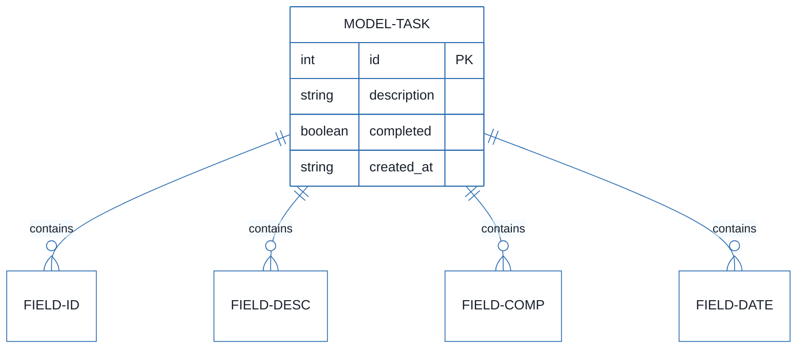
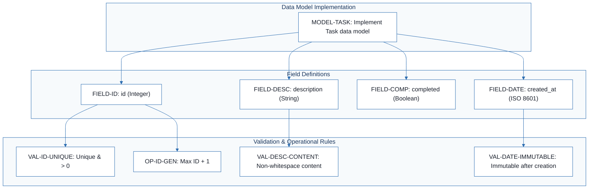
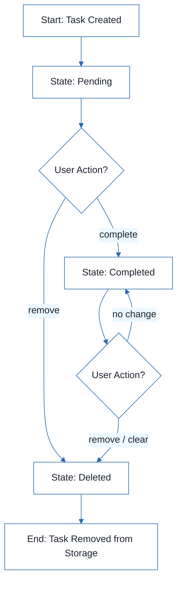
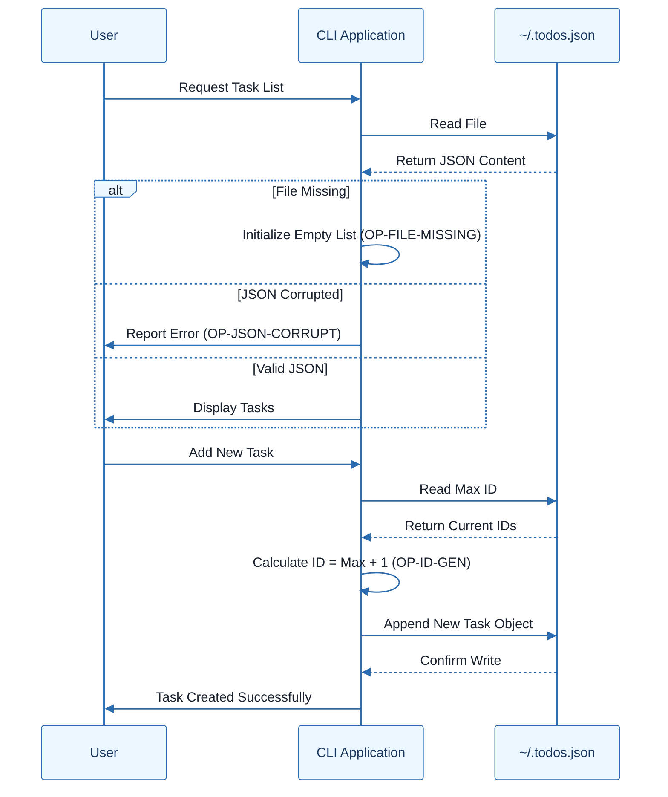

# CLI To-Do List Manager - Technical Specification & Architecture Document

## 1. Executive Summary & Architecture Overview

### 1.1 Executive Brief
This project defines a data model for a CLI-based To-Do List Manager. It implements a persistent storage pattern using a local JSON file (`~/.todos.json`) to manage task entities. The system focuses on strict field validation, sequential ID generation, and a deterministic state machine for task lifecycle transitions (pending, completed, deleted).

### 1.2 Maturity Assessment
The specification provides a solid foundation for the data schema but is currently in REFINEMENT. While the field definitions are precise, the project lacks critical high-severity components including explicit Acceptance Criteria and a Testing & Validation strategy for edge cases like JSON corruption and ID collisions.

### 1.3 Technical Stack
*   **Storage Format**: JSON
*   **Timestamp Standard**: ISO 8601 UTC
*   **Storage Path**: `~/.todos.json`

### 1.4 Architectural Constraints
*   Storage location fixed to `~/.todos.json`.
*   ID generation must follow the "highest current ID + 1" logic.
*   `created_at` timestamps must be immutable after the initial write operation.
*   Corrupted JSON files must trigger a user-facing error rather than a silent failure.
*   Missing storage files must be interpreted as an empty task list.

### 1.5 Critical Dependencies
*   Local File System API for `~/.todos.json` access.
*   JSON Parser/Serializer for data persistence.
*   ISO 8601 compliant timestamp generator.
*   State transition dependency: State transitions depend on the underlying Task data model.

## 2. Architecture Workflows







```mermaid
%%{init: {
  'theme': 'base',
  'themeVariables': {
    'primaryColor': '#1A365D',
    'primaryTextColor': '#1A202C',
    'primaryBorderColor': '#2B6CB0',
    'lineColor': '#2B6CB0',
    'secondaryColor': '#EBF8FF',
    'tertiaryColor': '#EBF8FF',
    'background': '#FFFFFF',
    'mainBkg': '#FFFFFF',
    'secondBkg': '#EBF8FF',
    'tertiaryBkg': '#F7FAFC',
    'secondaryTextColor': '#4A5568',
    'fontSize': '16px',
    'fontFamily': 'Inter, system-ui, sans-serif',
    'nodePadding': '15px',
    'borderRadius': '8px',
    'edgeLabelBackground': '#EBF8FF',
    'clusterBkg': '#F7FAFC',
    'clusterBorder': '#2B6CB0',
    'defaultLinkColor': '#2B6CB0',
    'titleColor': '#1A365D',
    'actorBorder': '#2B6CB0',
    'actorBkg': '#EBF8FF',
    'actorTextColor': '#1A365D',
    'actorLineColor': '#2B6CB0',
    'signalColor': '#2B6CB0',
    'signalTextColor': '#1A202C',
    'labelBoxBorderColor': '#2B6CB0',
    'labelBoxBkgColor': '#EBF8FF',
    'labelTextColor': '#1A202C',
    'loopTextColor': '#1A202C',
    'arrowHeadColor': '#2B6CB0',
    'sequenceNumberColor': '#1A365D',
    'sequenceActorBorder': '#2B6CB0',
    'sequenceActorBkg': '#EBF8FF',
    'sequenceArrowColor': '#2B6CB0',
    'noteBkgColor': '#FFF5EB',
    'noteBorderColor': '#DD6B20',
    'noteTextColor': '#1A202C'
  }
}}%%
sequenceDiagram
    participant User
    participant App as CLI Application
    participant Storage as ~/.todos.json
    User->>App: Request Task List
    App->>Storage: Read File
    Storage-->>App: Return JSON Content
    alt File Missing
        App->>App: Initialize Empty List (OP-FILE-MISSING)
    else JSON Corrupted
        App->>User: Report Error (OP-JSON-CORRUPT)
    else Valid JSON
        App->>User: Display Tasks
    end
    User->>App: Add New Task
    App->>Storage: Read Max ID
    Storage-->>App: Return Current IDs
    App->>App: Calculate ID = Max + 1 (OP-ID-GEN)
    App->>Storage: Append New Task Object
    Storage-->>App: Confirm Write
    App->>User: Task Created Successfully
``` & Visual Diagrams

### 2.1 Task Data Model ER Diagram
```mermaid
%%{init: {
  'theme': 'base',
  'themeVariables': {
    'primaryColor': '#1A365D',
    'primaryTextColor': '#1A202C',
    'primaryBorderColor': '#2B6CB0',
    'lineColor': '#2B6CB0',
    'secondaryColor': '#EBF8FF',
    'tertiaryColor': '#EBF8FF',
    'background': '#FFFFFF',
    'mainBkg': '#FFFFFF',
    'secondBkg': '#EBF8FF',
    'tertiaryBkg': '#F7FAFC',
    'secondaryTextColor': '#4A5568',
    'fontSize': '16px',
    'fontFamily': 'Inter, system-ui, sans-serif',
    'nodePadding': '15px',
    'borderRadius': '8px',
    'edgeLabelBackground': '#EBF8FF',
    'clusterBkg': '#F7FAFC',
    'clusterBorder': '#2B6CB0',
    'defaultLinkColor': '#2B6CB0',
    'titleColor': '#1A365D',
    'actorBorder': '#2B6CB0',
    'actorBkg': '#EBF8FF',
    'actorTextColor': '#1A365D',
    'actorLineColor': '#2B6CB0',
    'signalColor': '#2B6CB0',
    'signalTextColor': '#1A202C',
    'labelBoxBorderColor': '#2B6CB0',
    'labelBoxBkgColor': '#EBF8FF',
    'labelTextColor': '#1A202C',
    'loopTextColor': '#1A202C',
    'arrowHeadColor': '#2B6CB0',
    'sequenceNumberColor': '#1A365D',
    'sequenceActorBorder': '#2B6CB0',
    'sequenceActorBkg': '#EBF8FF',
    'sequenceArrowColor': '#2B6CB0',
    'noteBkgColor': '#FFF5EB',
    'noteBorderColor': '#DD6B20',
    'noteTextColor': '#1A202C'
  }
}}%%
erDiagram
    MODEL-TASK {
        int id PK
        string description
        boolean completed
        string created_at
    }
    MODEL-TASK ||--o{ FIELD-ID : "contains"
    MODEL-TASK ||--o{ FIELD-DESC : "contains"
    MODEL-TASK ||--o{ FIELD-COMP : "contains"
    MODEL-TASK ||--o{ FIELD-DATE : "contains"
```

### 2.2 Data Model Implementation Traceability


### 2.3 Task State Transition Workflow


### 2.4 Storage Access Sequence


## 3. Detailed Technical Specifications & Business Rules

### 3.1 Requirements Traceability
| Identifier | Requirement / Component | Description | Source Section |
| :--- | :--- | :--- | :--- |
| MODEL-TASK | Task Data Model | Implement the Task data model stored in ~/.todos.json | Task |
| FIELD-ID | Field: id | Implement id: Integer, unique, sequential, positive, required | Fields |
| FIELD-DESC | Field: description | Implement description: String, required, trimmed, non-empty | Fields |
| FIELD-COMP | Field: completed | Implement completed: Boolean, required, default false | Fields |
| FIELD-DATE | Field: created_at | Implement created_at: ISO 8601 UTC timestamp, required, immutable | Fields |
| VAL-ID-UNIQUE | Validation: ID Unique | id must be > 0 and must not duplicate existing IDs | Validation Rules |
| VAL-DESC-CONTENT | Validation: Description | description must contain non-whitespace content after trimming | Validation Rules |
| VAL-DATE-IMMUTABLE | Validation: Date Immutable | created_at must be present at write and immutable during updates | Validation Rules |
| OP-FILE-MISSING | Operational: File Missing | Missing storage file must be treated as an empty task list | Operational Rules |
| OP-JSON-CORRUPT | Operational: JSON Corrupt | Corrupted JSON must be reported as an error to the user | Operational Rules |
| OP-ID-GEN | Operational: ID Generation | IDs assigned from highest current ID + 1 | Operational Rules |
| STATE-TRANSITION | State Transitions | Implement state transitions: pending->completed, pending->deleted, completed->deleted | State Transitions |

### 3.2 Security Rules
*   **Data Integrity**: All writes to `~/.todos.json` must ensure the JSON structure remains valid.
*   **Input Sanitization**: The `description` field must be trimmed of leading and trailing whitespace to prevent empty-string entries.
*   **Immutability**: The `created_at` field must be protected against updates once the record is persisted.

### 3.3 Data Models
**Entity: Task**
*   `id` (Integer): Primary Key, Unique, Positive.
*   `description` (String): Required, Non-empty.
*   `completed` (Boolean): Default `false`.
*   `created_at` (String): ISO 8601 UTC Timestamp.

**Storage Format Example**:
```json
[
  {
    "id": 1,
    "description": "Buy groceries",
    "completed": false,
    "created_at": "2026-08-04T12:00:00Z"
  }
]
```

## 4. Project Governance & Structural Gaps

### 4.1 Structural Gaps
| Gap | Priority | Remediation Advice |
| :--- | :--- | :--- |
| Dependencies & Integration Points | LOW | Define if this model depends on specific JSON libraries or OS file system APIs. |
| Acceptance Criteria | HIGH | Define explicit testable criteria for the data model (e.g., 'Verify that a task cannot be saved with an empty description'). |
| Checkboxes Checklist | MEDIUM | Create a checklist for the implementation of each field and validation rule. |
| Testing & Validation | HIGH | Define test cases for corrupted JSON and ID collision scenarios. |
| Open Questions & Uncertainties | LOW | Check if there are limits on the number of tasks or file size. |

### 4.2 Remediation & Workflow
The project is currently in the **Refinement** phase. The immediate priority is to address the **HIGH** priority gaps by defining a comprehensive Testing & Validation suite and explicit Acceptance Criteria to ensure the data model's robustness against corruption and invalid inputs.

## 5. Technical & Domain Glossary (Terminology Reference)

| Term | Category | Context Anchor | Project Definition |
| :--- | :--- | :--- | :--- |
| ID | BUSINESS_DOMAIN | FIELD-ID | A positive, sequential, and unique integer used to distinguish each entry, calculated as the maximum existing value plus one. |
| JSON | TECHNICAL_STACK | Storage Model | The structured text format used for the persistent storage file located at ~/.todos.json, containing an array of objects. |
| UTC | TECHNICAL_STACK | FIELD-DATE | The time standard used for the immutable creation timestamp, formatted according to ISO 8601. |
| complete \<id\> | BUSINESS_DOMAIN | STATE-TRANSITION | The operational command that triggers a state change from pending to a finished status for a specific record. |
| remove \<id\> | BUSINESS_DOMAIN | STATE-TRANSITION | The operational command that transitions a record from either pending or finished status to a deleted state. |