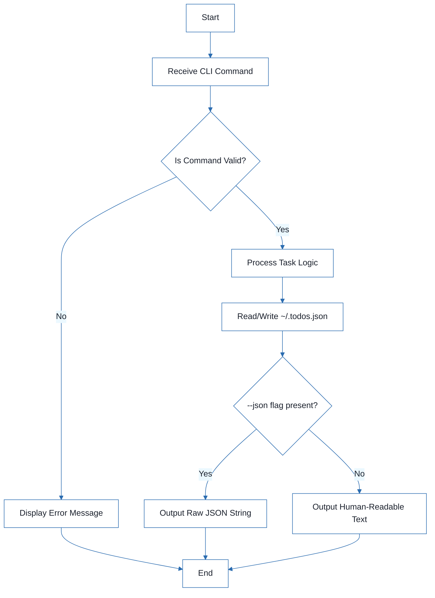
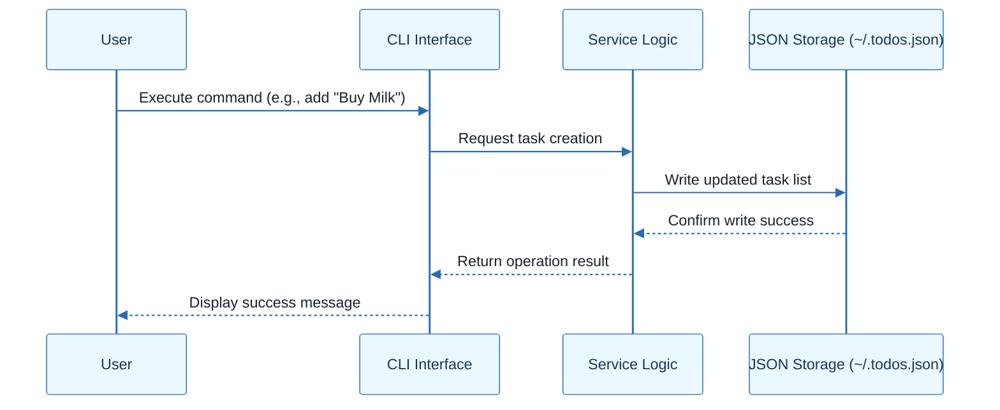
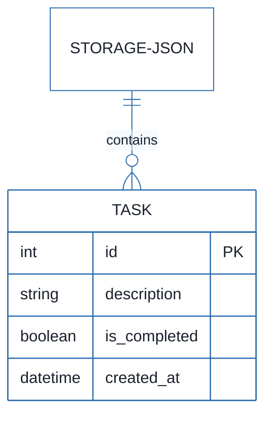

# CLI To-Do List Manager - Technical Specification & Architecture Document

## 1. Executive Summary & Architecture Overview

### 1.1 Executive Brief
A minimal Python-based CLI application for task management featuring local JSON persistence. The system provides core CRUD operations (add, list, complete, remove, clear) with dual-mode output (human-readable and JSON) for scripting. It is designed as a zero-configuration, offline-only tool targeting cross-platform compatibility.

### 1.2 Maturity Assessment
The project is in a REFINEMENT state. While the core technical constraints and scope are well-defined, there is a high-severity gap regarding the absence of explicit Acceptance Criteria for CLI commands. Additionally, the lack of a detailed validation plan and a concrete task checklist prevents immediate execution without further specification of pass/fail boundaries.

### 1.3 Technical Stack
* Python 3.8+
* unittest
* pylint
* flake8

### 1.4 Architectural Constraints
* Standard-library-only implementation.
* Offline-only, single-user, zero-configuration.
* Operation latency threshold: < 2 seconds.
* Data capacity: 1000+ tasks per JSON file.
* Storage path: `~/.todos.json`.

### 1.5 Critical Dependencies
* Python Standard Library.
* Local filesystem access for `~/.todos.json`.
* Cross-platform compatibility (Windows, macOS, Linux).
* Strict dependency on JSON format for data persistence.

## 2. Architecture Workflows

```mermaid
%%{init: {
  'theme': 'base',
  'themeVariables': {
    'primaryColor': '#1A365D',
    'primaryTextColor': '#1A202C',
    'primaryBorderColor': '#2B6CB0',
    'lineColor': '#2B6CB0',
    'secondaryColor': '#EBF8FF',
    'tertiaryColor': '#EBF8FF',
    'background': '#FFFFFF',
    'mainBkg': '#FFFFFF',
    'secondBkg': '#EBF8FF',
    'tertiaryBkg': '#F7FAFC',
    'secondaryTextColor': '#4A5568',
    'fontSize': '16px',
    'fontFamily': 'Inter, system-ui, sans-serif',
    'nodePadding': '15px',
    'borderRadius': '8px',
    'edgeLabelBackground': '#EBF8FF',
    'clusterBkg': '#F7FAFC',
    'clusterBorder': '#2B6CB0',
    'defaultLinkColor': '#2B6CB0',
    'titleColor': '#1A365D',
    'actorBorder': '#2B6CB0',
    'actorBkg': '#EBF8FF',
    'actorTextColor': '#1A365D',
    'actorLineColor': '#2B6CB0',
    'signalColor': '#2B6CB0',
    'signalTextColor': '#1A202C',
    'labelBoxBorderColor': '#2B6CB0',
    'labelBoxBkgColor': '#EBF8FF',
    'labelTextColor': '#1A202C',
    'loopTextColor': '#1A202C',
    'arrowHeadColor': '#2B6CB0',
    'sequenceNumberColor': '#1A365D',
    'sequenceActorBorder': '#2B6CB0',
    'sequenceActorBkg': '#EBF8FF',
    'sequenceArrowColor': '#2B6CB0',
    'noteBkgColor': '#FFF5EB',
    'noteBorderColor': '#DD6B20',
    'noteTextColor': '#1A202C'
  }
}}%%
flowchart TD
    subgraph Core_Implementation [Core Implementation]
        CLI-CORE["CLI-CORE: Build minimal Python CLI for task management"]
    end
    subgraph Tech_Stack [Technical Stack]
        LANG-PY38["LANG-PY38: Python 3.8+"]
        DEP-STDLIB["DEP-STDLIB: Python Standard Library Only"]
    end
    subgraph Constraints [Operational Constraints]
        STORAGE-JSON["STORAGE-JSON: Local JSON storage (~/.todos.json)"]
        CONST-OFFLINE["CONST-OFFLINE: Offline, Single-user, Zero-config"]
    end
    subgraph Performance [Performance & Scale]
        PERF-LATENCY["PERF-LATENCY: Operations < 2 seconds"]
        SCALE-LIMIT["SCALE-LIMIT: Support 1000+ tasks"]
    end
    CLI-CORE -->|"depends_on"| LANG-PY38
    CLI-CORE -->|"depends_on"| DEP-STDLIB
    CLI-CORE -->|"implements"| STORAGE-JSON
    CLI-CORE -->|"relates_to"| PERF-LATENCY
    CLI-CORE -->|"relates_to"| SCALE-LIMIT
    CLI-CORE -->|"depends_on"| CONST-OFFLINE
```







```mermaid
%%{init: {
  'theme': 'base',
  'themeVariables': {
    'primaryColor': '#1A365D',
    'primaryTextColor': '#1A202C',
    'primaryBorderColor': '#2B6CB0',
    'lineColor': '#2B6CB0',
    'secondaryColor': '#EBF8FF',
    'tertiaryColor': '#EBF8FF',
    'background': '#FFFFFF',
    'mainBkg': '#FFFFFF',
    'secondBkg': '#EBF8FF',
    'tertiaryBkg': '#F7FAFC',
    'secondaryTextColor': '#4A5568',
    'fontSize': '16px',
    'fontFamily': 'Inter, system-ui, sans-serif',
    'nodePadding': '15px',
    'borderRadius': '8px',
    'edgeLabelBackground': '#EBF8FF',
    'clusterBkg': '#F7FAFC',
    'clusterBorder': '#2B6CB0',
    'defaultLinkColor': '#2B6CB0',
    'titleColor': '#1A365D',
    'actorBorder': '#2B6CB0',
    'actorBkg': '#EBF8FF',
    'actorTextColor': '#1A365D',
    'actorLineColor': '#2B6CB0',
    'signalColor': '#2B6CB0',
    'signalTextColor': '#1A202C',
    'labelBoxBorderColor': '#2B6CB0',
    'labelBoxBkgColor': '#EBF8FF',
    'labelTextColor': '#1A202C',
    'loopTextColor': '#1A202C',
    'arrowHeadColor': '#2B6CB0',
    'sequenceNumberColor': '#1A365D',
    'sequenceActorBorder': '#2B6CB0',
    'sequenceActorBkg': '#EBF8FF',
    'sequenceArrowColor': '#2B6CB0',
    'noteBkgColor': '#FFF5EB',
    'noteBorderColor': '#DD6B20',
    'noteTextColor': '#1A202C'
  }
}}%%
erDiagram
    TASK {
        int id PK
        string description
        boolean is_completed
        datetime created_at
    }
    STORAGE-JSON ||--o{ TASK : "contains"
``` & Visual Diagrams

### 2.1 Technical Traceability
```mermaid
%%{init: {
  'theme': 'base',
  'themeVariables': {
    'primaryColor': '#1A365D',
    'primaryTextColor': '#1A202C',
    'primaryBorderColor': '#2B6CB0',
    'lineColor': '#2B6CB0',
    'secondaryColor': '#EBF8FF',
    'tertiaryColor': '#EBF8FF',
    'background': '#FFFFFF',
    'mainBkg': '#FFFFFF',
    'secondBkg': '#EBF8FF',
    'tertiaryBkg': '#F7FAFC',
    'secondaryTextColor': '#4A5568',
    'fontSize': '16px',
    'fontFamily': 'Inter, system-ui, sans-serif',
    'nodePadding': '15px',
    'borderRadius': '8px',
    'edgeLabelBackground': '#EBF8FF',
    'clusterBkg': '#F7FAFC',
    'clusterBorder': '#2B6CB0',
    'defaultLinkColor': '#2B6CB0',
    'titleColor': '#1A365D',
    'actorBorder': '#2B6CB0',
    'actorBkg': '#EBF8FF',
    'actorTextColor': '#1A365D',
    'actorLineColor': '#2B6CB0',
    'signalColor': '#2B6CB0',
    'signalTextColor': '#1A202C',
    'labelBoxBorderColor': '#2B6CB0',
    'labelBoxBkgColor': '#EBF8FF',
    'labelTextColor': '#1A202C',
    'loopTextColor': '#1A202C',
    'arrowHeadColor': '#2B6CB0',
    'sequenceNumberColor': '#1A365D',
    'sequenceActorBorder': '#2B6CB0',
    'sequenceActorBkg': '#EBF8FF',
    'sequenceArrowColor': '#2B6CB0',
    'noteBkgColor': '#FFF5EB',
    'noteBorderColor': '#DD6B20',
    'noteTextColor': '#1A202C'
  }
}}%%
flowchart TD
    subgraph Core_Implementation [Core Implementation]
        CLI-CORE["CLI-CORE: Build minimal Python CLI for task management"]
    end
    subgraph Tech_Stack [Technical Stack]
        LANG-PY38["LANG-PY38: Python 3.8+"]
        DEP-STDLIB["DEP-STDLIB: Python Standard Library Only"]
    end
    subgraph Constraints [Operational Constraints]
        STORAGE-JSON["STORAGE-JSON: Local JSON storage (~/.todos.json)"]
        CONST-OFFLINE["CONST-OFFLINE: Offline, Single-user, Zero-config"]
    end
    subgraph Performance [Performance & Scale]
        PERF-LATENCY["PERF-LATENCY: Operations < 2 seconds"]
        SCALE-LIMIT["SCALE-LIMIT: Support 1000+ tasks"]
    end
    CLI-CORE -->|"depends_on"| LANG-PY38
    CLI-CORE -->|"depends_on"| DEP-STDLIB
    CLI-CORE -->|"implements"| STORAGE-JSON
    CLI-CORE -->|"relates_to"| PERF-LATENCY
    CLI-CORE -->|"relates_to"| SCALE-LIMIT
    CLI-CORE -->|"depends_on"| CONST-OFFLINE
```

### 2.2 CLI Command Execution Workflow


### 2.3 CLI Interaction Sequence


### 2.4 Task Data Model


## 3. Detailed Technical Specifications & Business Rules

### 3.1 Requirements Traceability
| Identifier | Type | Requirement Description | Source Section |
| :--- | :--- | :--- | :--- |
| CLI-CORE | Task | Build a minimal Python CLI to add, list, complete, remove, and clear tasks | Summary |
| LANG-PY38 | Constraint | Language/Version: Python 3.8+ | Technical Context |
| DEP-STDLIB | Dependency | Primary Dependencies: Python standard library only | Technical Context |
| STORAGE-JSON | Constraint | Local JSON file storage at ~/.todos.json | Technical Context |
| PERF-LATENCY | Constraint | Operations (add, list, complete, remove, clear) must complete in under 2 seconds | Technical Context |
| SCALE-LIMIT | Constraint | Support for 1000+ tasks in one JSON file | Technical Context |
| TEST-COVERAGE | Test Case | unittest with CLI/integration coverage; linting with pylint or flake8 | Technical Context |
| CONST-OFFLINE | Constraint | Offline-only, single-user, zero-configuration implementation | Technical Context |

### 3.2 Security Rules
* **Access Control**: Single-user local access only.
* **Data Integrity**: Persistence via JSON file; no external network calls allowed (Offline-only).
* **Configuration**: Zero-configuration required; application must operate out-of-the-box.

### 3.3 Data Models
* **Persistence Layer**: JSON file located at `~/.todos.json`.
* **Task Entity**:
    * `id` (Integer, Primary Key)
    * `description` (String)
    * `is_completed` (Boolean)
    * `created_at` (DateTime)

## 4. Project Governance & Structural Gaps

### 4.1 Structural Gaps
| Missing Section | Priority | Remediation Advice |
| :--- | :--- | :--- |
| Acceptance Criteria | HIGH | Define specific pass/fail criteria for each CLI command (add, list, etc.). |
| Testing & Validation | MEDIUM | Expand the 'Testing' mention in Technical Context into a full validation plan. |
| Checkboxes Checklist | MEDIUM | Convert the implementation plan into a concrete checklist of tasks. |
| Dependencies & Integration Points | LOW | The document mentions 'standard library only', but a formal integration points section is missing. |
| Open Questions & Uncertainties | LOW | Identify any potential edge cases for the JSON storage or CLI parsing. |

### 4.2 Remediation & Workflow
The project must transition from the REFINEMENT state to the DESIGN state by addressing the HIGH priority gap (Acceptance Criteria). Once criteria are defined, a concrete task checklist should be generated to guide the implementation of the `src/todo_manager/` package.

## 5. Technical & Domain Glossary (Terminology Reference)

| Term | Category | Context Anchor | Project Definition |
| :--- | :--- | :--- | :--- |
| Branch | TECHNICAL_STACK | Implementation Plan: CLI To-Do List Manager | The specific version control pointer 001-cli-todo-manager used for this feature development. |
| Constraints | TECHNICAL_STACK | CONST-OFFLINE | The set of operational boundaries including offline-only access, single-user limitation, and zero-configuration requirements. |
| Date | TECHNICAL_STACK | Implementation Plan: CLI To-Do List Manager | The temporal marker 2026-08-04 associated with the plan creation. |
| GATE | TECHNICAL_STACK | Constitution Check | A mandatory validation checkpoint that must be cleared before proceeding to research or design phases. |
| JSON | TECHNICAL_STACK | STORAGE-JSON | The lightweight data-interchange format used for local persistence in the home directory and as an optional output flag for scripting. |
| Performance Goals | TECHNICAL_STACK | PERF-LATENCY | The requirement that all primary mutations and queries execute in under 2 seconds. |
| Primary Dependencies | TECHNICAL_STACK | DEP-STDLIB | The restriction to use only the built-in modules provided by the runtime environment. |
| Project Type | TECHNICAL_STACK | Technical Context | A command-line interface application. |
| Python 3.8 | TECHNICAL_STACK | LANG-PY38 | The minimum required runtime version for the implementation. |
| Spec | TECHNICAL_STACK | Implementation Plan: CLI To-Do List Manager | The reference document spec.md containing the detailed feature requirements. |
| Storage | TECHNICAL_STACK | STORAGE-JSON | The persistence mechanism utilizing a local file located at ~/.todos.json. |
| Target Platform | TECHNICAL_STACK | Technical Context | Cross-platform compatibility across Windows, macOS, and Linux environments. |
| Testing | TECHNICAL_STACK | TEST-COVERAGE | The validation strategy employing the built-in unit testing framework and static analysis tools like pylint or flake8. |