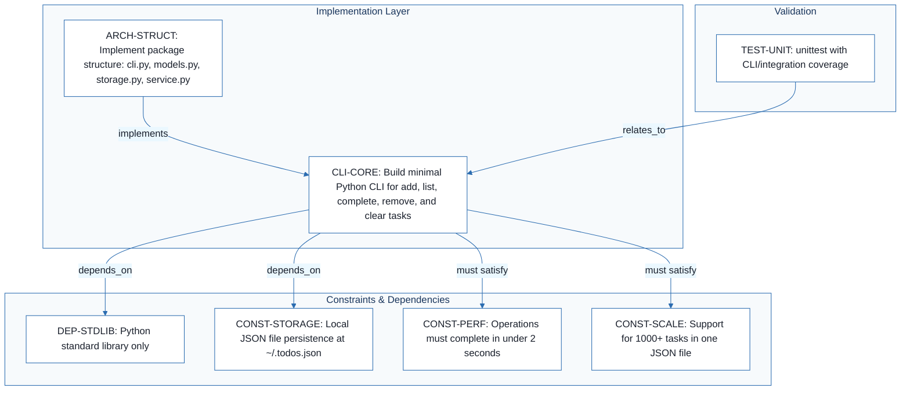
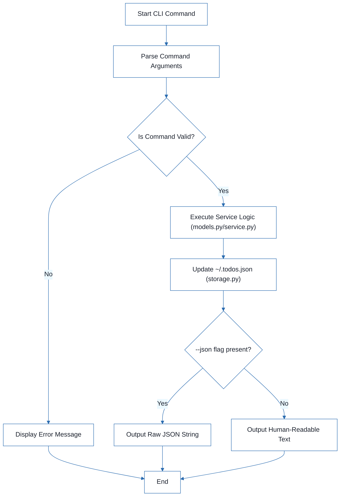
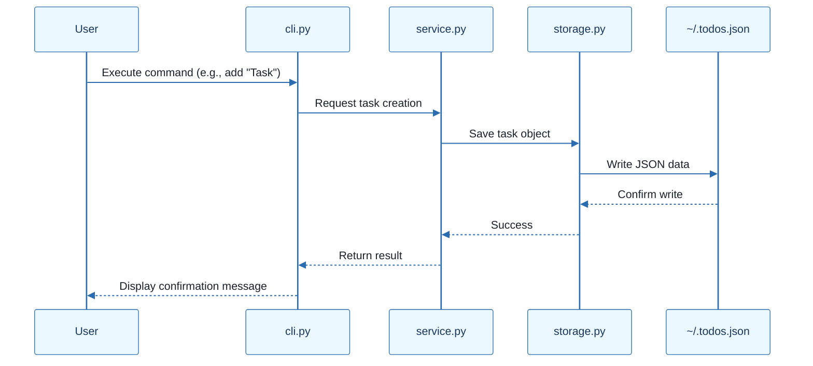
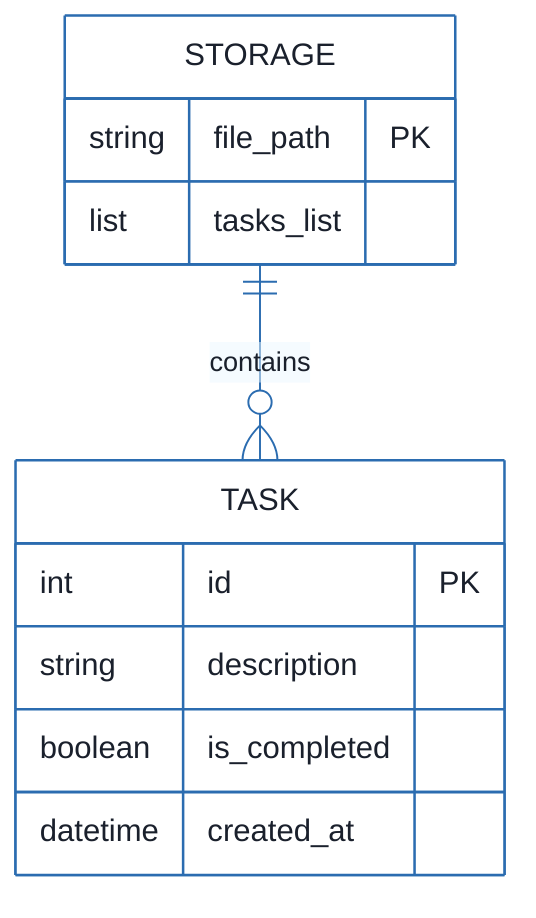

# CLI To-Do List Manager - Technical Specification & Architecture Document

## 1. Executive Summary & Architecture Overview

### 1.1 Executive Brief
A Python-based CLI To-Do Manager designed for local task orchestration. The application implements a single-user, offline-only pattern using a local JSON file (`~/.todos.json`) for persistence. It provides core CRUD operations with a focus on zero-configuration and standard library reliance, supporting both human-readable and machine-readable JSON output.

### 1.2 Maturity Assessment
The specifications are logically consistent but currently in a state of REFINEMENT. While the core technical constraints and stack are well-defined, there is a significant high-severity gap regarding explicit Acceptance Criteria for command validation. Additionally, the lack of granular test scenarios and an operational checklist prevents a full transition to an execution-ready state.

### 1.3 Technical Stack
* **Languages & Frameworks**: Python 3.8+
* **Testing Tools**: unittest, pylint, flake8
* **Data Format**: JSON

### 1.4 Architectural Constraints
* **Standard Library Only**: No external dependencies allowed.
* **Performance**: All operations must complete in under 2 seconds.
* **Data Scale**: Support for 1000+ tasks within a single JSON file.
* **Storage**: Local JSON persistence strictly at `~/.todos.json`.
* **Environment**: Offline-only, single-user, zero-configuration.
* **Compatibility**: Cross-platform support for Windows, macOS, and Linux.

### 1.5 Critical Dependencies
* **Python Standard Library**: Exclusive runtime dependency.
* **Local Filesystem**: Required access for `~/.todos.json` read/write operations.
* **Data Integrity**: Foreign key-like integrity between CLI command parsing and JSON data models.
* **Integration Gate**: Required pass of Simplicity-First and Zero-Configuration principles before Phase 0.

## 2. Architecture Workflows







```mermaid
%%{init: {
  'theme': 'base',
  'themeVariables': {
    'primaryColor': '#1A365D',
    'primaryTextColor': '#1A202C',
    'primaryBorderColor': '#2B6CB0',
    'lineColor': '#2B6CB0',
    'secondaryColor': '#EBF8FF',
    'tertiaryColor': '#EBF8FF',
    'background': '#FFFFFF',
    'mainBkg': '#FFFFFF',
    'secondBkg': '#EBF8FF',
    'tertiaryBkg': '#F7FAFC',
    'secondaryTextColor': '#4A5568',
    'fontSize': '16px',
    'fontFamily': 'Inter, system-ui, sans-serif',
    'nodePadding': '15px',
    'borderRadius': '8px',
    'edgeLabelBackground': '#EBF8FF',
    'clusterBkg': '#F7FAFC',
    'clusterBorder': '#2B6CB0',
    'defaultLinkColor': '#2B6CB0',
    'titleColor': '#1A365D',
    'actorBorder': '#2B6CB0',
    'actorBkg': '#EBF8FF',
    'actorTextColor': '#1A365D',
    'actorLineColor': '#2B6CB0',
    'signalColor': '#2B6CB0',
    'signalTextColor': '#1A202C',
    'labelBoxBorderColor': '#2B6CB0',
    'labelBoxBkgColor': '#EBF8FF',
    'labelTextColor': '#1A202C',
    'loopTextColor': '#1A202C',
    'arrowHeadColor': '#2B6CB0',
    'sequenceNumberColor': '#1A365D',
    'sequenceActorBorder': '#2B6CB0',
    'sequenceActorBkg': '#EBF8FF',
    'sequenceArrowColor': '#2B6CB0',
    'noteBkgColor': '#FFF5EB',
    'noteBorderColor': '#DD6B20',
    'noteTextColor': '#1A202C'
  }
}}%%
erDiagram
    TASK {
        int id PK
        string description
        boolean is_completed
        datetime created_at
    }
    STORAGE {
        string file_path PK
        list tasks_list
    }
    STORAGE ||--o{ TASK : "contains"
``` & Visual Diagrams

### 2.1 System Architecture & Dependency Traceability
```mermaid
%%{init: {
  'theme': 'base',
  'themeVariables': {
    'primaryColor': '#1A365D',
    'primaryTextColor': '#1A202C',
    'primaryBorderColor': '#2B6CB0',
    'lineColor': '#2B6CB0',
    'secondaryColor': '#EBF8FF',
    'tertiaryColor': '#EBF8FF',
    'background': '#FFFFFF',
    'mainBkg': '#FFFFFF',
    'secondBkg': '#EBF8FF',
    'tertiaryBkg': '#F7FAFC',
    'secondaryTextColor': '#4A5568',
    'fontSize': '16px',
    'fontFamily': 'Inter, system-ui, sans-serif',
    'nodePadding': '15px',
    'borderRadius': '8px',
    'edgeLabelBackground': '#EBF8FF',
    'clusterBkg': '#F7FAFC',
    'clusterBorder': '#2B6CB0',
    'defaultLinkColor': '#2B6CB0',
    'titleColor': '#1A365D',
    'actorBorder': '#2B6CB0',
    'actorBkg': '#EBF8FF',
    'actorTextColor': '#1A365D',
    'actorLineColor': '#2B6CB0',
    'signalColor': '#2B6CB0',
    'signalTextColor': '#1A202C',
    'labelBoxBorderColor': '#2B6CB0',
    'labelBoxBkgColor': '#EBF8FF',
    'labelTextColor': '#1A202C',
    'loopTextColor': '#1A202C',
    'arrowHeadColor': '#2B6CB0',
    'sequenceNumberColor': '#1A365D',
    'sequenceActorBorder': '#2B6CB0',
    'sequenceActorBkg': '#EBF8FF',
    'sequenceArrowColor': '#2B6CB0',
    'noteBkgColor': '#FFF5EB',
    'noteBorderColor': '#DD6B20',
    'noteTextColor': '#1A202C'
  }
}}%%
flowchart TD
    subgraph "Implementation Layer"
        ARCH-STRUCT["ARCH-STRUCT: Implement package structure: cli.py, models.py, storage.py, service.py"]
        CLI-CORE["CLI-CORE: Build minimal Python CLI for add, list, complete, remove, and clear tasks"]
    end
    subgraph "Constraints & Dependencies"
        DEP-STDLIB["DEP-STDLIB: Python standard library only"]
        CONST-STORAGE["CONST-STORAGE: Local JSON file persistence at ~/.todos.json"]
        CONST-PERF["CONST-PERF: Operations must complete in under 2 seconds"]
        CONST-SCALE["CONST-SCALE: Support for 1000+ tasks in one JSON file"]
    end
    subgraph "Validation"
        TEST-UNIT["TEST-UNIT: unittest with CLI/integration coverage"]
    end
    ARCH-STRUCT -->|"implements"| CLI-CORE
    CLI-CORE -->|"depends_on"| DEP-STDLIB
    CLI-CORE -->|"depends_on"| CONST-STORAGE
    CLI-CORE -->|"must satisfy"| CONST-PERF
    CLI-CORE -->|"must satisfy"| CONST-SCALE
    TEST-UNIT -->|"relates_to"| CLI-CORE
```

### 2.2 CLI Task Management Workflow


### 2.3 CLI Command Execution Sequence


### 2.4 Task Data Model


## 3. Detailed Technical Specifications & Business Rules

### 3.1 Requirements Traceability
| Identifier | Requirement / Task Description | Source Section |
| :--- | :--- | :--- |
| CLI-CORE | Build minimal Python CLI for add, list, complete, remove, and clear tasks | Summary |
| DEP-STDLIB | Python standard library only (no external dependencies) | Technical Context |
| CONST-STORAGE | Local JSON file persistence at ~/.todos.json | Technical Context |
| CONST-PERF | Operations must complete in under 2 seconds | Technical Context |
| CONST-SCALE | Support for 1000+ tasks in one JSON file | Technical Context |
| ARCH-STRUCT | Implement package structure: cli.py, models.py, storage.py, service.py | Source Code (repository root) |
| TEST-UNIT | unittest with CLI/integration coverage | Technical Context |

### 3.2 Security Rules
* **Access Control**: Single-user local access only.
* **Data Isolation**: Persistence is restricted to the user's home directory (`~/.todos.json`).
* **Input Validation**: CLI arguments must be parsed and validated before being passed to the service layer to prevent injection or corruption of the JSON store.

### 3.3 Data Models
* **Task Entity**:
    * `id` (Integer, PK): Unique identifier.
    * `description` (String): Text content of the task.
    * `is_completed` (Boolean): Completion status.
    * `created_at` (DateTime): Timestamp of creation.
* **Storage Entity**:
    * `file_path` (String, PK): Path to the JSON file.
    * `tasks_list` (List): Collection of Task entities.

## 4. Project Governance & Structural Gaps

### 4.1 Structural Gaps
| Missing Section | Priority | Remediation Advice |
| :--- | :--- | :--- |
| Acceptance Criteria | HIGH | Define specific 'Pass/Fail' criteria for each command (add, list, etc.) |
| Checkboxes Checklist | MEDIUM | Create a step-by-step operational checklist for implementation |
| Testing & Validation | MEDIUM | Detail specific test scenarios beyond the general use of unittest |
| Open Questions & Uncertainties | LOW | Identify potential risks or undecided implementation details |

### 4.2 Remediation & Workflow
The project is currently in the **Refinement** phase. To move to **Execution-Ready**, the following workflow is required:
1. Define granular Acceptance Criteria for all CLI commands.
2. Expand the `TEST-UNIT` requirement into a detailed test matrix.
3. Establish a step-by-step implementation checklist.
4. Re-verify the "Constitution Check" after the design phase.

## 5. Technical & Domain Glossary (Terminology Reference)

| Term | Category | Context Anchor | Project Definition |
| :--- | :--- | :--- | :--- |
| Branch | TECHNICAL_STACK | Implementation Plan: CLI To-Do List Manager | The specific version control pointer `001-cli-todo-manager` used for this feature development. |
| Constraints | TECHNICAL_STACK | Technical Context | Mandatory architectural boundaries including offline-only operation, single-user access, and zero-configuration requirements. |
| Date | TECHNICAL_STACK | Implementation Plan: CLI To-Do List Manager | The temporal marker 2026-08-04 associated with the planning phase. |
| GATE | BUSINESS_DOMAIN | Constitution Check | A mandatory validation checkpoint that must be cleared before Phase 0 research and again after Phase 1 design. |
| JSON | TECHNICAL_STACK | CONST-STORAGE | The lightweight data-interchange format used for persistence at `~/.todos.json` and for scripting output. |
| Performance Goals | TECHNICAL_STACK | CONST-PERF | The latency requirement specifying that all primary operations must execute in under 2 seconds. |
| Primary Dependencies | TECHNICAL_STACK | DEP-STDLIB | The exclusive reliance on the built-in modules provided by the language runtime, prohibiting third-party libraries. |
| Project Type | TECHNICAL_STACK | Technical Context | A command-line interface application. |
| Python 3.8 | TECHNICAL_STACK | Technical Context | The minimum required runtime environment version for execution. |
| Spec | TECHNICAL_STACK | Implementation Plan: CLI To-Do List Manager | The reference document located at `spec.md` defining the feature requirements. |
| Storage | TECHNICAL_STACK | CONST-STORAGE | The local file-based persistence mechanism situated in the user home directory. |
| Target Platform | TECHNICAL_STACK | Technical Context | Cross-platform compatibility covering Windows, macOS, and Linux operating systems. |
| Testing | TECHNICAL_STACK | TEST-UNIT | The validation strategy employing `unittest` for coverage and `pylint` or `flake8` for static analysis. |