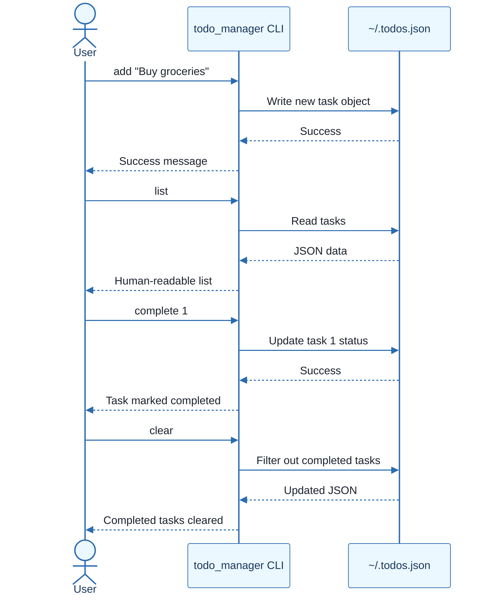
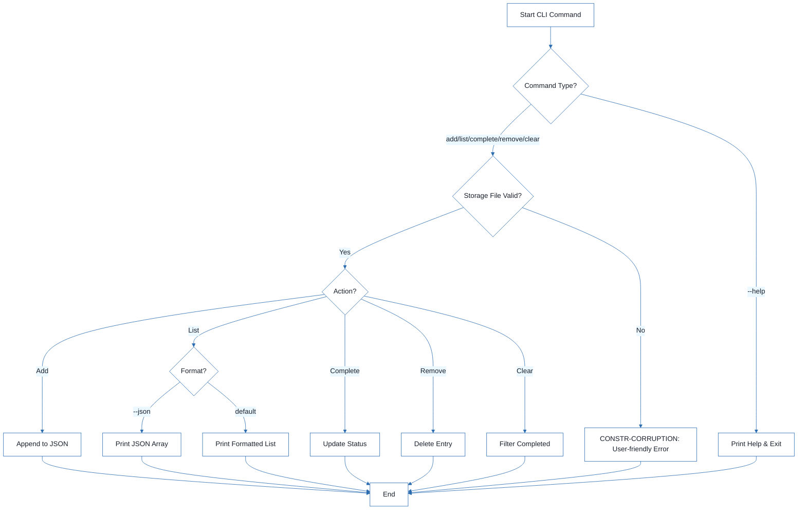
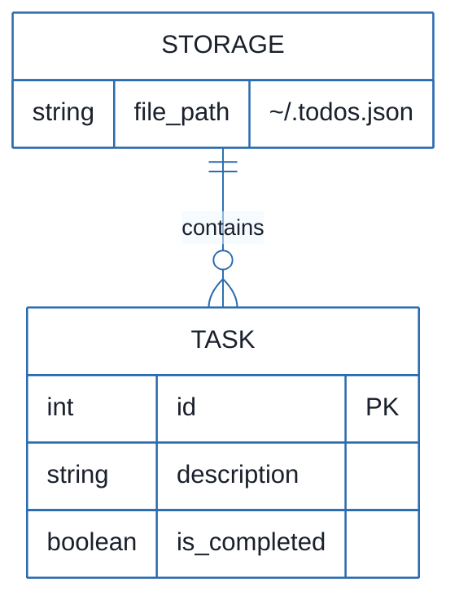

# CLI Todo Manager - Technical Specification & Architecture Document

## 1. Executive Summary & Architecture Overview

### 1.1 Executive Brief
The CLI Todo Manager is a Python-based command-line utility designed for task lifecycle management. It utilizes a local JSON file (`~/.todos.json`) as its primary data store to persist task IDs, descriptions, and completion statuses. The system provides core CRUD operations and bulk cleanup capabilities via a modular CLI interface.

### 1.2 Maturity Assessment
The project is READY for execution. While there are minor structural gaps regarding the absence of a formal checklist and explicit performance targets for large datasets, the functional specifications and test scenarios are comprehensive and logically mapped, ensuring a stable baseline for implementation.

### 1.3 Technical Stack
* Python 3.8+

### 1.4 Architectural Constraints
* **Storage**: Local persistence via `~/.todos.json`.
* **Data Integrity**: Stop execution with user-friendly error on storage corruption; prohibit automatic overwriting of corrupted files.
* **Output Formats**: Support for both human-readable and valid JSON array formats.
* **File System**: Mandatory write access to the user's home directory.

### 1.5 Critical Dependencies
* Python 3.8 runtime.
* Home directory write permissions for `~/.todos.json`.
* Referential integrity between CLI commands and `data-model.md` task shapes.
* Command behavior alignment with `contracts/commands.md`.

## 2. Architecture Workflows

```mermaid
%%{init: {
  'theme': 'base',
  'themeVariables': {
    'primaryColor': '#1A365D',
    'primaryTextColor': '#1A202C',
    'primaryBorderColor': '#2B6CB0',
    'lineColor': '#2B6CB0',
    'secondaryColor': '#EBF8FF',
    'tertiaryColor': '#EBF8FF',
    'background': '#FFFFFF',
    'mainBkg': '#FFFFFF',
    'secondBkg': '#EBF8FF',
    'tertiaryBkg': '#F7FAFC',
    'secondaryTextColor': '#4A5568',
    'fontSize': '16px',
    'fontFamily': 'Inter, system-ui, sans-serif',
    'nodePadding': '15px',
    'borderRadius': '8px',
    'edgeLabelBackground': '#EBF8FF',
    'clusterBkg': '#F7FAFC',
    'clusterBorder': '#2B6CB0',
    'defaultLinkColor': '#2B6CB0',
    'titleColor': '#1A365D',
    'actorBorder': '#2B6CB0',
    'actorBkg': '#EBF8FF',
    'actorTextColor': '#1A365D',
    'actorLineColor': '#2B6CB0',
    'signalColor': '#2B6CB0',
    'signalTextColor': '#1A202C',
    'labelBoxBorderColor': '#2B6CB0',
    'labelBoxBkgColor': '#EBF8FF',
    'labelTextColor': '#1A202C',
    'loopTextColor': '#1A202C',
    'arrowHeadColor': '#2B6CB0',
    'sequenceNumberColor': '#1A365D',
    'sequenceActorBorder': '#2B6CB0',
    'sequenceActorBkg': '#EBF8FF',
    'sequenceArrowColor': '#2B6CB0',
    'noteBkgColor': '#FFF5EB',
    'noteBorderColor': '#DD6B20',
    'noteTextColor': '#1A202C'
  }
}}%%
flowchart TD
    subgraph Dependencies
        DEP-HOME-WRITE["DEP-HOME-WRITE: Write access to home directory"]
    end
    subgraph TestCases [Test Cases]
        TC-HELP["TC-HELP: Help Command"]
        TC-ADD["TC-ADD: Add Task"]
        TC-LIST-HUMAN["TC-LIST-HUMAN: List Human-Readable"]
        TC-LIST-JSON["TC-LIST-JSON: List JSON"]
        TC-COMPLETE["TC-COMPLETE: Complete Task"]
        TC-REMOVE["TC-REMOVE: Remove Task"]
        TC-CLEAR["TC-CLEAR: Clear Completed"]
    end
    subgraph AcceptanceCriteria [Acceptance Criteria]
        AC-HELP-OUT["AC-HELP-OUT: Prints subcommands & exits"]
        AC-ADD-OUT["AC-ADD-OUT: Stored in ~/.todos.json"]
        AC-LIST-HUMAN-OUT["AC-LIST-HUMAN-OUT: ID, desc, and status shown"]
        AC-LIST-JSON-OUT["AC-LIST-JSON-OUT: Valid JSON array printed"]
        AC-COMPLETE-OUT["AC-COMPLETE-OUT: Marked completed in storage"]
        AC-REMOVE-OUT["AC-REMOVE-OUT: Deleted from storage"]
        AC-CLEAR-OUT["AC-CLEAR-OUT: Only pending tasks remain"]
    end
    TC-HELP -->|"implements"| AC-HELP-OUT
    TC-ADD -->|"implements"| AC-ADD-OUT
    TC-LIST-HUMAN -->|"implements"| AC-LIST-HUMAN-OUT
    TC-LIST-JSON -->|"implements"| AC-LIST-JSON-OUT
    TC-COMPLETE -->|"implements"| AC-COMPLETE-OUT
    TC-REMOVE -->|"implements"| AC-REMOVE-OUT
    TC-CLEAR -->|"implements"| AC-CLEAR-OUT
    TC-ADD -->|"depends_on"| DEP-HOME-WRITE
```







```mermaid
%%{init: {
  'theme': 'base',
  'themeVariables': {
    'primaryColor': '#1A365D',
    'primaryTextColor': '#1A202C',
    'primaryBorderColor': '#2B6CB0',
    'lineColor': '#2B6CB0',
    'secondaryColor': '#EBF8FF',
    'tertiaryColor': '#EBF8FF',
    'background': '#FFFFFF',
    'mainBkg': '#FFFFFF',
    'secondBkg': '#EBF8FF',
    'tertiaryBkg': '#F7FAFC',
    'secondaryTextColor': '#4A5568',
    'fontSize': '16px',
    'fontFamily': 'Inter, system-ui, sans-serif',
    'nodePadding': '15px',
    'borderRadius': '8px',
    'edgeLabelBackground': '#EBF8FF',
    'clusterBkg': '#F7FAFC',
    'clusterBorder': '#2B6CB0',
    'defaultLinkColor': '#2B6CB0',
    'titleColor': '#1A365D',
    'actorBorder': '#2B6CB0',
    'actorBkg': '#EBF8FF',
    'actorTextColor': '#1A365D',
    'actorLineColor': '#2B6CB0',
    'signalColor': '#2B6CB0',
    'signalTextColor': '#1A202C',
    'labelBoxBorderColor': '#2B6CB0',
    'labelBoxBkgColor': '#EBF8FF',
    'labelTextColor': '#1A202C',
    'loopTextColor': '#1A202C',
    'arrowHeadColor': '#2B6CB0',
    'sequenceNumberColor': '#1A365D',
    'sequenceActorBorder': '#2B6CB0',
    'sequenceActorBkg': '#EBF8FF',
    'sequenceArrowColor': '#2B6CB0',
    'noteBkgColor': '#FFF5EB',
    'noteBorderColor': '#DD6B20',
    'noteTextColor': '#1A202C'
  }
}}%%
erDiagram
    STORAGE ||--o{ TASK : contains
    STORAGE {
        string file_path "~/.todos.json"
    }
    TASK {
        int id PK
        string description
        boolean is_completed
    }
``` & Visual Diagrams

### 2.1 CLI Todo Manager Traceability Map
Maps test cases to their respective acceptance criteria and system dependencies for full traceability.

```mermaid
%%{init: {
  'theme': 'base',
  'themeVariables': {
    'primaryColor': '#1A365D',
    'primaryTextColor': '#1A202C',
    'primaryBorderColor': '#2B6CB0',
    'lineColor': '#2B6CB0',
    'secondaryColor': '#EBF8FF',
    'tertiaryColor': '#EBF8FF',
    'background': '#FFFFFF',
    'mainBkg': '#FFFFFF',
    'secondBkg': '#EBF8FF',
    'tertiaryBkg': '#F7FAFC',
    'secondaryTextColor': '#4A5568',
    'fontSize': '16px',
    'fontFamily': 'Inter, system-ui, sans-serif',
    'nodePadding': '15px',
    'borderRadius': '8px',
    'edgeLabelBackground': '#EBF8FF',
    'clusterBkg': '#F7FAFC',
    'clusterBorder': '#2B6CB0',
    'defaultLinkColor': '#2B6CB0',
    'titleColor': '#1A365D',
    'actorBorder': '#2B6CB0',
    'actorBkg': '#EBF8FF',
    'actorTextColor': '#1A365D',
    'actorLineColor': '#2B6CB0',
    'signalColor': '#2B6CB0',
    'signalTextColor': '#1A202C',
    'labelBoxBorderColor': '#2B6CB0',
    'labelBoxBkgColor': '#EBF8FF',
    'labelTextColor': '#1A202C',
    'loopTextColor': '#1A202C',
    'arrowHeadColor': '#2B6CB0',
    'sequenceNumberColor': '#1A365D',
    'sequenceActorBorder': '#2B6CB0',
    'sequenceActorBkg': '#EBF8FF',
    'sequenceArrowColor': '#2B6CB0',
    'noteBkgColor': '#FFF5EB',
    'noteBorderColor': '#DD6B20',
    'noteTextColor': '#1A202C'
  }
}}%%
flowchart TD
    subgraph Dependencies
        DEP-HOME-WRITE["DEP-HOME-WRITE: Write access to home directory"]
    end
    subgraph TestCases [Test Cases]
        TC-HELP["TC-HELP: Help Command"]
        TC-ADD["TC-ADD: Add Task"]
        TC-LIST-HUMAN["TC-LIST-HUMAN: List Human-Readable"]
        TC-LIST-JSON["TC-LIST-JSON: List JSON"]
        TC-COMPLETE["TC-COMPLETE: Complete Task"]
        TC-REMOVE["TC-REMOVE: Remove Task"]
        TC-CLEAR["TC-CLEAR: Clear Completed"]
    end
    subgraph AcceptanceCriteria [Acceptance Criteria]
        AC-HELP-OUT["AC-HELP-OUT: Prints subcommands & exits"]
        AC-ADD-OUT["AC-ADD-OUT: Stored in ~/.todos.json"]
        AC-LIST-HUMAN-OUT["AC-LIST-HUMAN-OUT: ID, desc, and status shown"]
        AC-LIST-JSON-OUT["AC-LIST-JSON-OUT: Valid JSON array printed"]
        AC-COMPLETE-OUT["AC-COMPLETE-OUT: Marked completed in storage"]
        AC-REMOVE-OUT["AC-REMOVE-OUT: Deleted from storage"]
        AC-CLEAR-OUT["AC-CLEAR-OUT: Only pending tasks remain"]
    end
    TC-HELP -->|"implements"| AC-HELP-OUT
    TC-ADD -->|"implements"| AC-ADD-OUT
    TC-LIST-HUMAN -->|"implements"| AC-LIST-HUMAN-OUT
    TC-LIST-JSON -->|"implements"| AC-LIST-JSON-OUT
    TC-COMPLETE -->|"implements"| AC-COMPLETE-OUT
    TC-REMOVE -->|"implements"| AC-REMOVE-OUT
    TC-CLEAR -->|"implements"| AC-CLEAR-OUT
    TC-ADD -->|"depends_on"| DEP-HOME-WRITE
```

### 2.2 CLI Command Interaction Sequence
Models the interaction between the User, the CLI Application, and the JSON storage file for core operations.


### 2.3 CLI Execution Workflow
Represents the internal logic flow of the CLI, including error handling for file corruption.


### 2.4 Todo Data Model
Represents the structure of the task storage as implied by the validation guide and acceptance criteria.



## 3. Detailed Technical Specifications & Business Rules

### 3.1 Requirements Traceability

| Identifier | Type | Description | Acceptance Criterion / Dependency |
| :--- | :--- | :--- | :--- |
| DEP-PY38 | dependency | Python 3.8 or newer | N/A |
| DEP-HOME-WRITE | dependency | Write access to home directory | N/A |
| TC-HELP | test_case | Confirm command help is available: `python -m todo_manager --help` | AC-HELP-OUT |
| AC-HELP-OUT | acceptance_criterion | CLI prints available subcommands and exits successfully | N/A |
| TC-ADD | test_case | Add a task: `python -m todo_manager add "Buy groceries"` | AC-ADD-OUT |
| AC-ADD-OUT | acceptance_criterion | Task stored in `~/.todos.json` and success message shown | N/A |
| TC-LIST-HUMAN | test_case | List tasks in human-readable mode: `python -m todo_manager list` | AC-LIST-HUMAN-OUT |
| AC-LIST-HUMAN-OUT | acceptance_criterion | Task appears with ID, description, and status | N/A |
| TC-LIST-JSON | test_case | List tasks as JSON: `python -m todo_manager list --json` | AC-LIST-JSON-OUT |
| AC-LIST-JSON-OUT | acceptance_criterion | CLI prints valid JSON containing the tasks array | N/A |
| TC-COMPLETE | test_case | Complete a task: `python -m todo_manager complete 1` | AC-COMPLETE-OUT |
| AC-COMPLETE-OUT | acceptance_criterion | Task marked completed and updated in listings | N/A |
| TC-REMOVE | test_case | Remove a task: `python -m todo_manager remove 1` | AC-REMOVE-OUT |
| AC-REMOVE-OUT | acceptance_criterion | Task is deleted from storage | N/A |
| TC-CLEAR | test_case | Clear completed tasks: `python -m todo_manager clear` | AC-CLEAR-OUT |
| AC-CLEAR-OUT | acceptance_criterion | All completed tasks removed, pending tasks remain | N/A |
| CONSTR-CORRUPTION | constraint | If storage file is corrupted, CLI should stop with user-friendly error instead of overwriting | N/A |

### 3.2 Security Rules
* **File System Access**: The application must strictly operate within the user's home directory for storage (`~/.todos.json`).
* **Error Handling**: In the event of file corruption, the system must fail-safe by stopping execution and notifying the user, preventing data loss via accidental overwrites.

### 3.3 Data Models
* **Storage Format**: JSON array of objects.
* **Task Object**:
    * `id` (Integer): Unique identifier.
    * `description` (String): Task text.
    * `is_completed` (Boolean): Completion status.

## 4. Project Governance & Structural Gaps

### 4.1 Structural Gaps

| Gap | Priority | Remediation Advice |
| :--- | :--- | :--- |
| Acceptance Criteria | LOW | The document contains 'Expected outcomes' within the test cases, but a dedicated high-level Acceptance Criteria section is missing. |
| Checkboxes Checklist | MEDIUM | Convert the 'Validate the CLI' steps into a formal checklist for execution tracking. |
| Security & Performance Constraints | LOW | Define performance targets for large todo lists or security constraints for the JSON file. |
| Open Questions & Uncertainties | LOW | No open questions were identified in the source. |

### 4.2 Remediation & Workflow
The identified gaps are primarily documentation-related and do not impede the current implementation phase. It is recommended to implement the "Checkboxes Checklist" during the QA phase to ensure 100% test coverage of the defined `TC-` identifiers.

## 5. Technical & Domain Glossary (Terminology Reference)

| Term | Category | Context Anchor | Project Definition |
| :--- | :--- | :--- | :--- |
| ID | BUSINESS_DOMAIN | AC-LIST-HUMAN-OUT | A unique numeric reference assigned to each entry to enable targeted mutation or deletion. |
| JSON | TECHNICAL_STACK | AC-LIST-JSON-OUT | The structured data interchange format used for both persistent storage in the home directory and machine-readable output. |
| Python 3.8 | TECHNICAL_STACK | DEP-PY38 | The minimum required runtime environment version for executing the command line interface. |