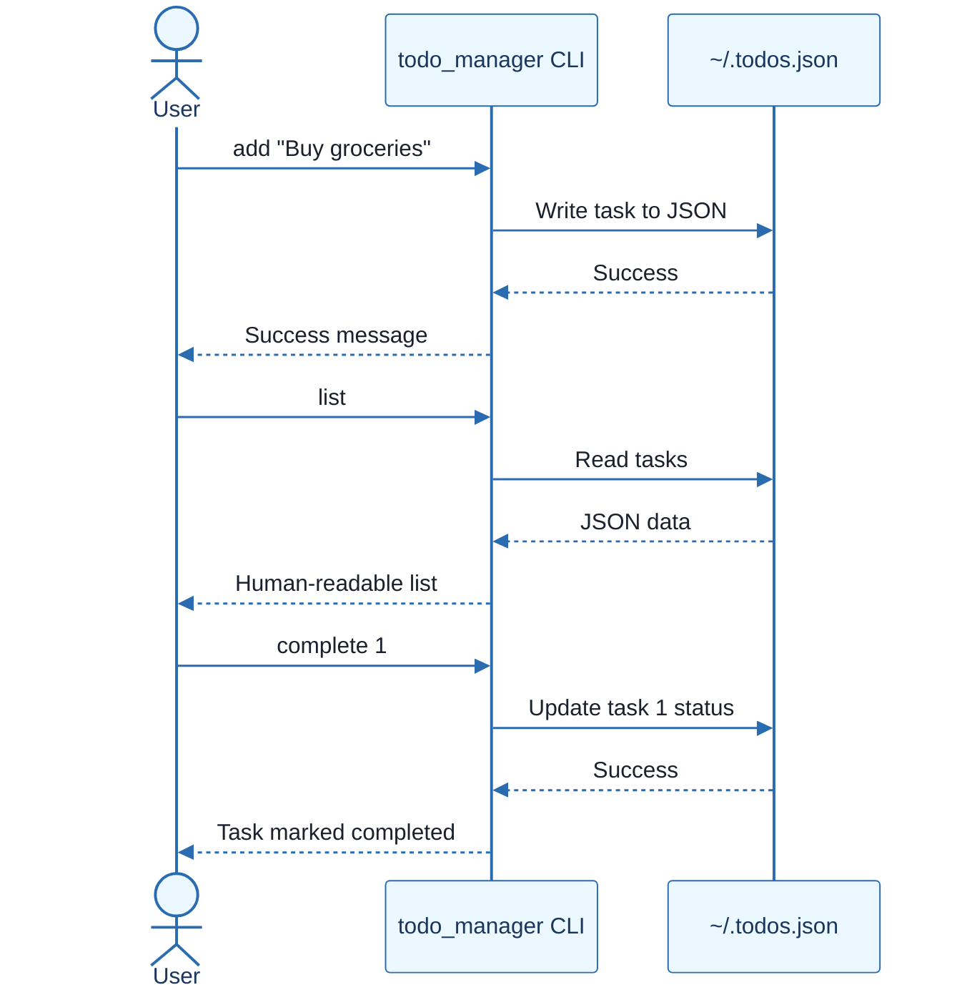
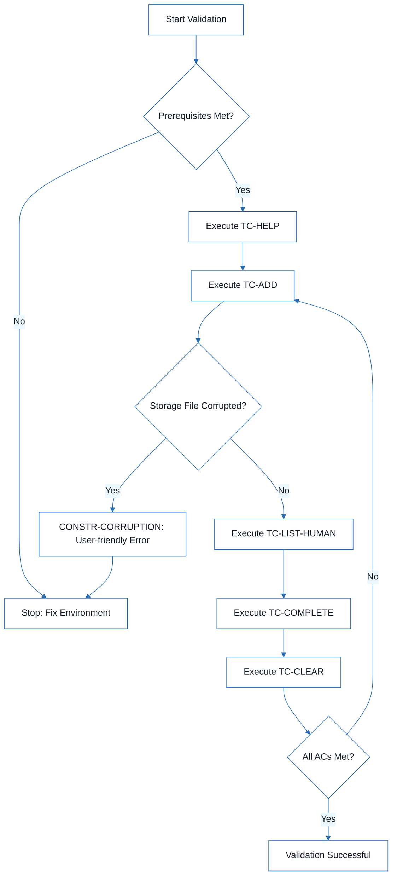
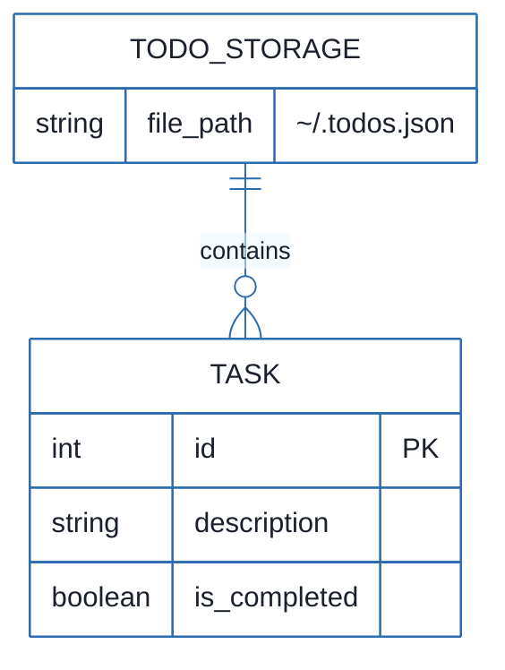

# CLI Todo Manager - Technical Specification & Architecture Document

## 1. Executive Summary & Architecture Overview

### 1.1 Executive Brief
The CLI Todo Manager is a Python-based command-line utility designed for task lifecycle management. It utilizes a local JSON file (`~/.todos.json`) as its primary data store to persist task IDs, descriptions, and completion statuses, providing both human-readable and JSON output formats.

### 1.2 Maturity Assessment
The project is READY for execution. While there are minor structural gaps regarding formal high-level acceptance criteria and a tracking checklist, the functional requirements and test scenarios are explicitly defined and mapped, ensuring a clear path to operational validation.

### 1.3 Technical Stack
* Python 3.8+

### 1.4 Architectural Constraints
* **Storage**: Local persistence via `~/.todos.json`.
* **Data Integrity**: CLI must terminate with a user-friendly error upon detecting storage corruption to prevent accidental overwriting.
* **Output Modes**: Support for both human-readable and valid JSON array formats.
* **File System**: Mandatory write access to the user's home directory.

### 1.5 Critical Dependencies
* Python 3.8 runtime.
* Home directory write permissions for `~/.todos.json`.
* Referential integrity between task IDs and storage entries for 'complete' and 'remove' operations.
* External specification alignment with `data-model.md` and `contracts/commands.md`.

## 2. Architecture Workflows

```mermaid
%%{init: {
  'theme': 'base',
  'themeVariables': {
    'primaryColor': '#1A365D',
    'primaryTextColor': '#1A202C',
    'primaryBorderColor': '#2B6CB0',
    'lineColor': '#2B6CB0',
    'secondaryColor': '#EBF8FF',
    'tertiaryColor': '#EBF8FF',
    'background': '#FFFFFF',
    'mainBkg': '#FFFFFF',
    'secondBkg': '#EBF8FF',
    'tertiaryBkg': '#F7FAFC',
    'secondaryTextColor': '#4A5568',
    'fontSize': '16px',
    'fontFamily': 'Inter, system-ui, sans-serif',
    'nodePadding': '15px',
    'borderRadius': '8px',
    'edgeLabelBackground': '#EBF8FF',
    'clusterBkg': '#F7FAFC',
    'clusterBorder': '#2B6CB0',
    'defaultLinkColor': '#2B6CB0',
    'titleColor': '#1A365D',
    'actorBorder': '#2B6CB0',
    'actorBkg': '#EBF8FF',
    'actorTextColor': '#1A365D',
    'actorLineColor': '#2B6CB0',
    'signalColor': '#2B6CB0',
    'signalTextColor': '#1A202C',
    'labelBoxBorderColor': '#2B6CB0',
    'labelBoxBkgColor': '#EBF8FF',
    'labelTextColor': '#1A202C',
    'loopTextColor': '#1A202C',
    'arrowHeadColor': '#2B6CB0',
    'sequenceNumberColor': '#1A365D',
    'sequenceActorBorder': '#2B6CB0',
    'sequenceActorBkg': '#EBF8FF',
    'sequenceArrowColor': '#2B6CB0',
    'noteBkgColor': '#FFF5EB',
    'noteBorderColor': '#DD6B20',
    'noteTextColor': '#1A202C'
  }
}}%%
flowchart TD
    subgraph Dependencies
        DEP-PY38["DEP-PY38: Python 3.8 or newer"]
        DEP-HOME-WRITE["DEP-HOME-WRITE: Write access to home directory"]
    end
    subgraph TestCases [Test Cases]
        TC-HELP["TC-HELP: Help Command"]
        TC-ADD["TC-ADD: Add Task"]
        TC-LIST-HUMAN["TC-LIST-HUMAN: List Human-Readable"]
        TC-LIST-JSON["TC-LIST-JSON: List JSON"]
        TC-COMPLETE["TC-COMPLETE: Complete Task"]
        TC-REMOVE["TC-REMOVE: Remove Task"]
        TC-CLEAR["TC-CLEAR: Clear Completed"]
    end
    subgraph AcceptanceCriteria [Acceptance Criteria]
        AC-HELP["AC-HELP: Prints subcommands & exits"]
        AC-ADD["AC-ADD: Stored in ~/.todos.json"]
        AC-LIST-HUMAN["AC-LIST-HUMAN: ID, Desc, Status shown"]
        AC-LIST-JSON["AC-LIST-JSON: Valid JSON array"]
        AC-COMPLETE["AC-COMPLETE: Status updated to completed"]
        AC-REMOVE["AC-REMOVE: Deleted from storage"]
        AC-CLEAR["AC-CLEAR: Only pending tasks remain"]
    end
    TC-HELP -->|"implements"| AC-HELP
    TC-ADD -->|"implements"| AC-ADD
    TC-LIST-HUMAN -->|"implements"| AC-LIST-HUMAN
    TC-LIST-JSON -->|"implements"| AC-LIST-JSON
    TC-COMPLETE -->|"implements"| AC-COMPLETE
    TC-REMOVE -->|"implements"| AC-REMOVE
    TC-CLEAR -->|"implements"| AC-CLEAR
    TC-ADD -->|"depends_on"| DEP-HOME-WRITE
```







```mermaid
%%{init: {
  'theme': 'base',
  'themeVariables': {
    'primaryColor': '#1A365D',
    'primaryTextColor': '#1A202C',
    'primaryBorderColor': '#2B6CB0',
    'lineColor': '#2B6CB0',
    'secondaryColor': '#EBF8FF',
    'tertiaryColor': '#EBF8FF',
    'background': '#FFFFFF',
    'mainBkg': '#FFFFFF',
    'secondBkg': '#EBF8FF',
    'tertiaryBkg': '#F7FAFC',
    'secondaryTextColor': '#4A5568',
    'fontSize': '16px',
    'fontFamily': 'Inter, system-ui, sans-serif',
    'nodePadding': '15px',
    'borderRadius': '8px',
    'edgeLabelBackground': '#EBF8FF',
    'clusterBkg': '#F7FAFC',
    'clusterBorder': '#2B6CB0',
    'defaultLinkColor': '#2B6CB0',
    'titleColor': '#1A365D',
    'actorBorder': '#2B6CB0',
    'actorBkg': '#EBF8FF',
    'actorTextColor': '#1A365D',
    'actorLineColor': '#2B6CB0',
    'signalColor': '#2B6CB0',
    'signalTextColor': '#1A202C',
    'labelBoxBorderColor': '#2B6CB0',
    'labelBoxBkgColor': '#EBF8FF',
    'labelTextColor': '#1A202C',
    'loopTextColor': '#1A202C',
    'arrowHeadColor': '#2B6CB0',
    'sequenceNumberColor': '#1A365D',
    'sequenceActorBorder': '#2B6CB0',
    'sequenceActorBkg': '#EBF8FF',
    'sequenceArrowColor': '#2B6CB0',
    'noteBkgColor': '#FFF5EB',
    'noteBorderColor': '#DD6B20',
    'noteTextColor': '#1A202C'
  }
}}%%
erDiagram
    TODO_STORAGE ||--o{ TASK : contains
    TASK {
        int id PK
        string description
        boolean is_completed
    }
    TODO_STORAGE {
        string file_path "~/.todos.json"
    }
``` & Visual Diagrams

### 2.1 CLI Todo Manager Traceability Matrix
Maps test cases to their respective acceptance criteria and system dependencies to ensure full validation coverage.

```mermaid
%%{init: {
  'theme': 'base',
  'themeVariables': {
    'primaryColor': '#1A365D',
    'primaryTextColor': '#1A202C',
    'primaryBorderColor': '#2B6CB0',
    'lineColor': '#2B6CB0',
    'secondaryColor': '#EBF8FF',
    'tertiaryColor': '#EBF8FF',
    'background': '#FFFFFF',
    'mainBkg': '#FFFFFF',
    'secondBkg': '#EBF8FF',
    'tertiaryBkg': '#F7FAFC',
    'secondaryTextColor': '#4A5568',
    'fontSize': '16px',
    'fontFamily': 'Inter, system-ui, sans-serif',
    'nodePadding': '15px',
    'borderRadius': '8px',
    'edgeLabelBackground': '#EBF8FF',
    'clusterBkg': '#F7FAFC',
    'clusterBorder': '#2B6CB0',
    'defaultLinkColor': '#2B6CB0',
    'titleColor': '#1A365D',
    'actorBorder': '#2B6CB0',
    'actorBkg': '#EBF8FF',
    'actorTextColor': '#1A365D',
    'actorLineColor': '#2B6CB0',
    'signalColor': '#2B6CB0',
    'signalTextColor': '#1A202C',
    'labelBoxBorderColor': '#2B6CB0',
    'labelBoxBkgColor': '#EBF8FF',
    'labelTextColor': '#1A202C',
    'loopTextColor': '#1A202C',
    'arrowHeadColor': '#2B6CB0',
    'sequenceNumberColor': '#1A365D',
    'sequenceActorBorder': '#2B6CB0',
    'sequenceActorBkg': '#EBF8FF',
    'sequenceArrowColor': '#2B6CB0',
    'noteBkgColor': '#FFF5EB',
    'noteBorderColor': '#DD6B20',
    'noteTextColor': '#1A202C'
  }
}}%%
flowchart TD
    subgraph Dependencies
        DEP-PY38["DEP-PY38: Python 3.8 or newer"]
        DEP-HOME-WRITE["DEP-HOME-WRITE: Write access to home directory"]
    end
    subgraph TestCases [Test Cases]
        TC-HELP["TC-HELP: Help Command"]
        TC-ADD["TC-ADD: Add Task"]
        TC-LIST-HUMAN["TC-LIST-HUMAN: List Human-Readable"]
        TC-LIST-JSON["TC-LIST-JSON: List JSON"]
        TC-COMPLETE["TC-COMPLETE: Complete Task"]
        TC-REMOVE["TC-REMOVE: Remove Task"]
        TC-CLEAR["TC-CLEAR: Clear Completed"]
    end
    subgraph AcceptanceCriteria [Acceptance Criteria]
        AC-HELP["AC-HELP: Prints subcommands & exits"]
        AC-ADD["AC-ADD: Stored in ~/.todos.json"]
        AC-LIST-HUMAN["AC-LIST-HUMAN: ID, Desc, Status shown"]
        AC-LIST-JSON["AC-LIST-JSON: Valid JSON array"]
        AC-COMPLETE["AC-COMPLETE: Status updated to completed"]
        AC-REMOVE["AC-REMOVE: Deleted from storage"]
        AC-CLEAR["AC-CLEAR: Only pending tasks remain"]
    end
    TC-HELP -->|"implements"| AC-HELP
    TC-ADD -->|"implements"| AC-ADD
    TC-LIST-HUMAN -->|"implements"| AC-LIST-HUMAN
    TC-LIST-JSON -->|"implements"| AC-LIST-JSON
    TC-COMPLETE -->|"implements"| AC-COMPLETE
    TC-REMOVE -->|"implements"| AC-REMOVE
    TC-CLEAR -->|"implements"| AC-CLEAR
    TC-ADD -->|"depends_on"| DEP-HOME-WRITE
```

### 2.2 CLI Command Interaction Sequence
Models the interaction between the User, the CLI Application, and the JSON storage file for core operations.


### 2.3 CLI Validation Workflow
The operational logic for validating the CLI, including error handling for file corruption.


### 2.4 Todo Data Model
Represents the structure of the tasks stored in the JSON file as implied by the validation guide.



## 3. Detailed Technical Specifications & Business Rules

### 3.1 Requirements Traceability

| Identifier | Type | Description | Acceptance Criterion / Dependency |
| :--- | :--- | :--- | :--- |
| DEP-PY38 | Dependency | Python 3.8 or newer | N/A |
| DEP-HOME-WRITE | Dependency | Write access to home directory | N/A |
| TC-HELP | Test Case | Confirm the command help is available: `python -m todo_manager --help` | AC-HELP |
| AC-HELP | Acceptance | CLI prints available subcommands and exits successfully | N/A |
| TC-ADD | Test Case | Add a task: `python -m todo_manager add "Buy groceries"` | AC-ADD |
| AC-ADD | Acceptance | Task is stored in `~/.todos.json` and success message is shown | N/A |
| TC-LIST-HUMAN | Test Case | List tasks in human-readable mode: `python -m todo_manager list` | AC-LIST-HUMAN |
| AC-LIST-HUMAN | Acceptance | Task appears with ID, description, and pending/completed status | N/A |
| TC-LIST-JSON | Test Case | List tasks as JSON: `python -m todo_manager list --json` | AC-LIST-JSON |
| AC-LIST-JSON | Acceptance | CLI prints valid JSON containing the tasks array | N/A |
| TC-COMPLETE | Test Case | Complete a task: `python -m todo_manager complete 1` | AC-COMPLETE |
| AC-COMPLETE | Acceptance | Task is marked completed and later listings show updated status | N/A |
| TC-REMOVE | Test Case | Remove a task: `python -m todo_manager remove 1` | AC-REMOVE |
| AC-REMOVE | Acceptance | Task is deleted from storage | N/A |
| TC-CLEAR | Test Case | Clear completed tasks: `python -m todo_manager clear` | AC-CLEAR |
| AC-CLEAR | Acceptance | All completed tasks are removed and pending tasks remain | N/A |
| CONSTR-CORRUPTION | Constraint | If storage file is corrupted, CLI should stop with user-friendly error instead of overwriting | N/A |

### 3.2 Security Rules
* **File System Access**: The application requires explicit write permissions to the user's home directory to maintain the `~/.todos.json` file.
* **Data Integrity**: To prevent data loss, the system must implement a "fail-fast" mechanism upon detecting JSON corruption (CONSTR-CORRUPTION).

### 3.3 Data Models
* **Storage Format**: JSON.
* **Storage Path**: `~/.todos.json`.
* **Task Entity**:
    * `id` (Integer): Unique identifier.
    * `description` (String): Task text.
    * `is_completed` (Boolean): Completion status.

## 4. Project Governance & Structural Gaps

### 4.1 Structural Gaps

| Gap | Priority | Remediation Advice |
| :--- | :--- | :--- |
| Acceptance Criteria | LOW | The document contains 'Expected outcomes' within the test cases, but no high-level business acceptance criteria section. |
| Checkboxes Checklist | MEDIUM | Convert the 'Validate the CLI' steps into a formal checklist for execution tracking. |
| Security & Performance Constraints | LOW | Define performance expectations for large todo lists or security constraints for the JSON file. |
| Open Questions & Uncertainties | LOW | None needed unless specific edge cases are identified during validation. |

### 4.2 Remediation & Workflow
The identified gaps are primarily documentation-related and do not block the current execution phase. Remediation should focus on converting the existing test cases into a formal validation checklist to improve tracking during the QA phase.

## 5. Technical & Domain Glossary (Terminology Reference)

| Term | Category | Context Anchor | Project Definition |
| :--- | :--- | :--- | :--- |
| ID | BUSINESS_DOMAIN | AC-LIST-HUMAN | A unique numeric reference used to target a specific entry for completion or removal operations. |
| JSON | TECHNICAL_STACK | AC-LIST-JSON | The structured data format used for both persistent storage in the home directory and machine-readable output. |
| Python 3.8 | TECHNICAL_STACK | DEP-PY38 | The minimum required runtime environment version for executing the command line interface. |