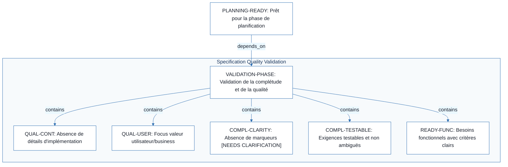
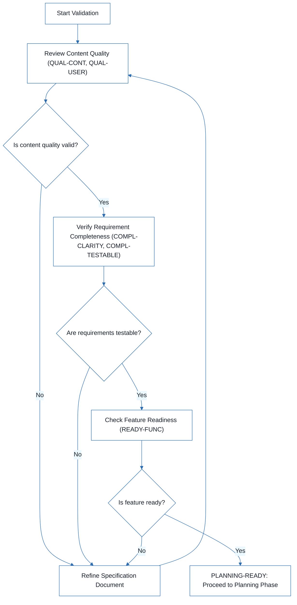

# CLI To-Do List Manager - Technical Specification & Architecture Document

## 1. Executive Summary & Architecture Overview

### 1.1 Executive Brief
The project is a CLI To-Do List Manager currently in a pre-planning validation phase. The provided documentation is a quality checklist designed to ensure that business requirements are testable, technology-agnostic, and free of ambiguity before technical implementation begins. It serves as a governance gate rather than a technical specification.

### 1.2 Maturity Assessment
The project is currently in a state of REFINEMENT. While the quality checklist indicates that business-level requirements are complete, the technical architecture is entirely absent. The presence of high-severity structural gaps regarding security, performance constraints, and concrete testing plans indicates that while the 'what' is defined, the 'how' is not yet specified, preventing immediate execution.

### 1.3 Technical Stack
*   *No technical stack defined (Project is currently technology-agnostic).*

### 1.4 Architectural Constraints
*   Strict separation of business requirements from implementation details.
*   Mandatory removal of all `[NEEDS CLARIFICATION]` markers prior to planning.
*   All success criteria must be measurable and technology-agnostic.
*   Requirement for 100% coverage of functional requirements by clear acceptance criteria.

### 1.5 Critical Dependencies
*   Reference to the external specification file `[spec.md]` for detailed functional requirements.
*   Logical dependency of the Planning Phase on the successful completion of the Validation Phase.

## 2. Architecture Workflows



```mermaid
%%{init: {
  'theme': 'base',
  'themeVariables': {
    'primaryColor': '#1A365D',
    'primaryTextColor': '#1A202C',
    'primaryBorderColor': '#2B6CB0',
    'lineColor': '#2B6CB0',
    'secondaryColor': '#EBF8FF',
    'tertiaryColor': '#EBF8FF',
    'background': '#FFFFFF',
    'mainBkg': '#FFFFFF',
    'secondBkg': '#EBF8FF',
    'tertiaryBkg': '#F7FAFC',
    'secondaryTextColor': '#4A5568',
    'fontSize': '16px',
    'fontFamily': 'Inter, system-ui, sans-serif',
    'nodePadding': '15px',
    'borderRadius': '8px',
    'edgeLabelBackground': '#EBF8FF',
    'clusterBkg': '#F7FAFC',
    'clusterBorder': '#2B6CB0',
    'defaultLinkColor': '#2B6CB0',
    'titleColor': '#1A365D',
    'actorBorder': '#2B6CB0',
    'actorBkg': '#EBF8FF',
    'actorTextColor': '#1A365D',
    'actorLineColor': '#2B6CB0',
    'signalColor': '#2B6CB0',
    'signalTextColor': '#1A202C',
    'labelBoxBorderColor': '#2B6CB0',
    'labelBoxBkgColor': '#EBF8FF',
    'labelTextColor': '#1A202C',
    'loopTextColor': '#1A202C',
    'arrowHeadColor': '#2B6CB0',
    'sequenceNumberColor': '#1A365D',
    'sequenceActorBorder': '#2B6CB0',
    'sequenceActorBkg': '#EBF8FF',
    'sequenceArrowColor': '#2B6CB0',
    'noteBkgColor': '#FFF5EB',
    'noteBorderColor': '#DD6B20',
    'noteTextColor': '#1A202C'
  }
}}%%
flowchart TD
    START["Start Validation"]
    STEP1["Review Content Quality (QUAL-CONT, QUAL-USER)"]
    DEC1{"Is content quality valid?"}
    STEP2["Verify Requirement Completeness (COMPL-CLARITY, COMPL-TESTABLE)"]
    DEC2{"Are requirements testable?"}
    STEP3["Check Feature Readiness (READY-FUNC)"]
    DEC3{"Is feature ready?"}
    FIX["Refine Specification Document"]
    END["PLANNING-READY: Proceed to Planning Phase"]
    START --> STEP1
    STEP1 --> DEC1
    DEC1 -- "No" --> FIX
    DEC1 -- "Yes" --> STEP2
    STEP2 --> DEC2
    DEC2 -- "No" --> FIX
    DEC2 -- "Yes" --> STEP3
    STEP3 --> DEC3
    DEC3 -- "No" --> FIX
    DEC3 -- "Yes" --> END
    FIX --> STEP1
``` & Visual Diagrams

### 2.1 Specification Validation Traceability
Maps the relationship between the validation phase, its specific quality criteria, and the final readiness state using exact identifiers.

```mermaid
%%{init: {
  'theme': 'base',
  'themeVariables': {
    'primaryColor': '#1A365D',
    'primaryTextColor': '#1A202C',
    'primaryBorderColor': '#2B6CB0',
    'lineColor': '#2B6CB0',
    'secondaryColor': '#EBF8FF',
    'tertiaryColor': '#EBF8FF',
    'background': '#FFFFFF',
    'mainBkg': '#FFFFFF',
    'secondBkg': '#EBF8FF',
    'tertiaryBkg': '#F7FAFC',
    'secondaryTextColor': '#4A5568',
    'fontSize': '16px',
    'fontFamily': 'Inter, system-ui, sans-serif',
    'nodePadding': '15px',
    'borderRadius': '8px',
    'edgeLabelBackground': '#EBF8FF',
    'clusterBkg': '#F7FAFC',
    'clusterBorder': '#2B6CB0',
    'defaultLinkColor': '#2B6CB0',
    'titleColor': '#1A365D',
    'actorBorder': '#2B6CB0',
    'actorBkg': '#EBF8FF',
    'actorTextColor': '#1A365D',
    'actorLineColor': '#2B6CB0',
    'signalColor': '#2B6CB0',
    'signalTextColor': '#1A202C',
    'labelBoxBorderColor': '#2B6CB0',
    'labelBoxBkgColor': '#EBF8FF',
    'labelTextColor': '#1A202C',
    'loopTextColor': '#1A202C',
    'arrowHeadColor': '#2B6CB0',
    'sequenceNumberColor': '#1A365D',
    'sequenceActorBorder': '#2B6CB0',
    'sequenceActorBkg': '#EBF8FF',
    'sequenceArrowColor': '#2B6CB0',
    'noteBkgColor': '#FFF5EB',
    'noteBorderColor': '#DD6B20',
    'noteTextColor': '#1A202C'
  }
}}%%
flowchart TD
    subgraph VALIDATION_PROCESS["Specification Quality Validation"]
        VALIDATION-PHASE["VALIDATION-PHASE: Validation de la complétude et de la qualité"]
        QUAL-CONT["QUAL-CONT: Absence de détails d'implémentation"]
        QUAL-USER["QUAL-USER: Focus valeur utilisateur/business"]
        COMPL-CLARITY["COMPL-CLARITY: Absence de marqueurs [NEEDS CLARIFICATION]"]
        COMPL-TESTABLE["COMPL-TESTABLE: Exigences testables et non ambiguës"]
        READY-FUNC["READY-FUNC: Besoins fonctionnels avec critères clairs"]
    end
    PLANNING-READY["PLANNING-READY: Prêt pour la phase de planification"]
    VALIDATION-PHASE -->|"contains"| QUAL-CONT
    VALIDATION-PHASE -->|"contains"| QUAL-USER
    VALIDATION-PHASE -->|"contains"| COMPL-CLARITY
    VALIDATION-PHASE -->|"contains"| COMPL-TESTABLE
    VALIDATION-PHASE -->|"contains"| READY-FUNC
    PLANNING-READY -->|"depends_on"| VALIDATION-PHASE
```

### 2.2 Specification Readiness Workflow
Operational workflow for validating a specification, including decision gates for quality and completeness.



## 3. Detailed Technical Specifications & Business Rules

### 3.1 Requirements Traceability

| Identifier | Type | Description | Source Section |
| :--- | :--- | :--- | :--- |
| VALIDATION-PHASE | phase | Validation de la complétude et de la qualité des spécifications avant planification | Specification Quality Checklist |
| QUAL-CONT | acceptance_criterion | Absence de détails d'implémentation (langages, frameworks, APIs) | Content Quality |
| QUAL-USER | acceptance_criterion | Focus sur la valeur utilisateur et les besoins business | Content Quality |
| COMPL-CLARITY | acceptance_criterion | Absence de marqueurs [NEEDS CLARIFICATION] | Requirement Completeness |
| COMPL-TESTABLE | acceptance_criterion | Exigences testables et non ambiguës | Requirement Completeness |
| READY-FUNC | acceptance_criterion | Tous les besoins fonctionnels ont des critères d'acceptation clairs | Feature Readiness |
| PLANNING-READY | task | Prêt pour la phase de planification | Notes |

### 3.2 Security Rules
*   *No security rules defined in the current validation phase.*

### 3.3 Data Models
*   *No data models defined in the current validation phase.*

## 4. Project Governance & Structural Gaps

### 4.1 Structural Gaps

| Missing Section | Priority | Remediation Advice |
| :--- | :--- | :--- |
| Dependencies & Integration Points | MEDIUM | Le document mentionne que les dépendances sont identifiées dans la spec, mais elles ne sont pas listées ici. |
| Checkboxes Checklist | LOW | Le contenu actuel est une checklist, mais pas une checklist d'exécution technique (implémentation). |
| Testing & Validation | HIGH | Aucun cas de test technique ou plan de validation n'est défini pour la tâche elle-même. |
| Security & Performance Constraints | HIGH | Absence totale de contraintes techniques de sécurité ou de performance. |
| Open Questions & Uncertainties | LOW | Le document affirme qu'il n'y a plus de zones d'ombre. |

### 4.2 Remediation & Workflow
The project must transition from a "Quality Validation" state to a "Technical Design" state. This requires the creation of a full technical specification including the missing sections identified in 4.1, specifically focusing on the technical architecture, security protocols, and a concrete test plan before the `PLANNING-READY` state can be fully operationalized for development.

## 5. Technical & Domain Glossary (Terminology Reference)

| Term | Category | Context Anchor | Project Definition |
| :--- | :--- | :--- | :--- |
| Feature | BUSINESS_DOMAIN | READY-FUNC | A functional unit of delivery that must satisfy specific measurable outcomes and associated validation criteria before transitioning to the planning stage. |