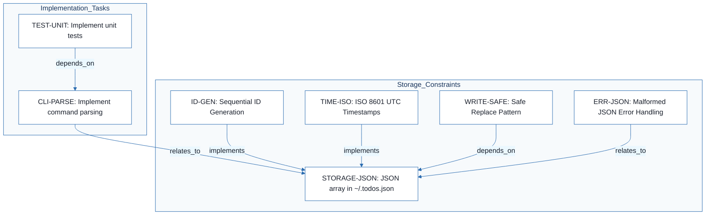
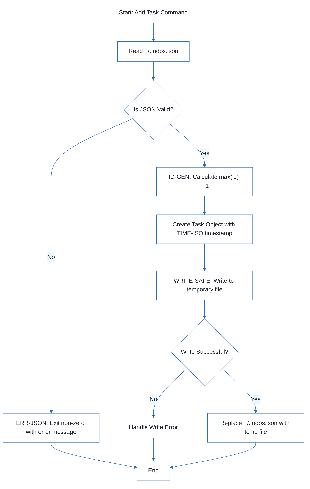
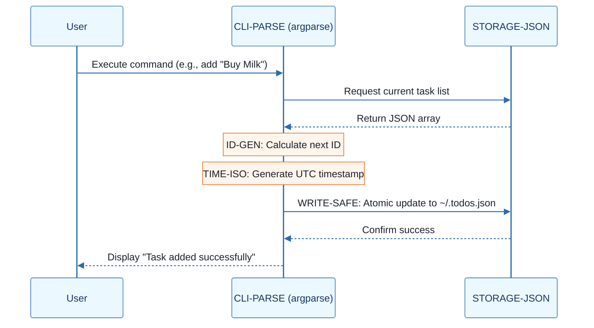
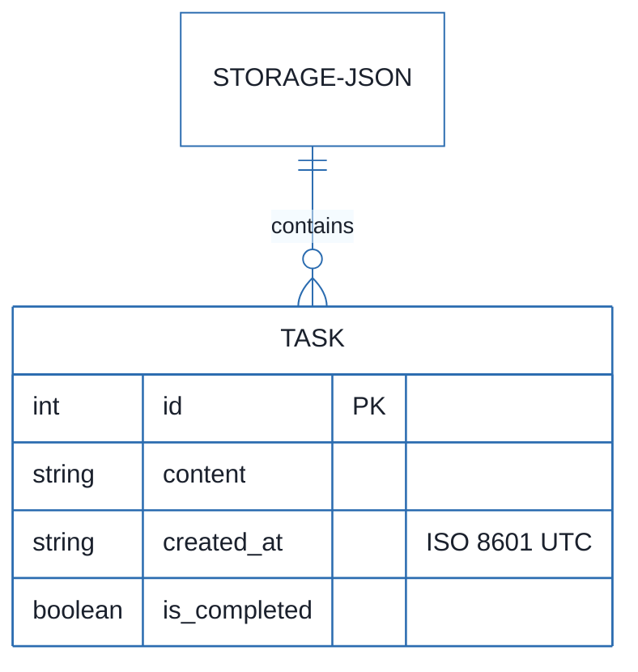

# CLI To-Do List Manager - Technical Specification & Architecture Document

## 1. Executive Summary & Architecture Overview

### 1.1 Executive Brief
A lightweight CLI To-Do List Manager implemented in Python, designed for local task management. The system utilizes a flat JSON array stored at `~/.todos.json` for persistence, prioritizing zero external dependencies by leveraging the Python standard library for command parsing, serialization, and testing.

### 1.2 Maturity Assessment
The project specifications are logically sound but currently in a state of REFINEMENT. While the architectural decisions are clear and the health index is high, the lack of a concrete execution checklist (high severity gap) means the research notes have not yet been translated into an actionable implementation roadmap.

### 1.3 Technical Stack
* Python
* argparse
* unittest

### 1.4 Architectural Constraints
* Storage must be a plain JSON array located at `~/.todos.json`.
* Task IDs must be generated as `max(existing_ids) + 1`, starting at 1.
* Timestamps for `created_at` must follow ISO 8601 UTC format.
* File updates must implement a safe replace pattern via temporary files to prevent corruption.
* Malformed JSON must trigger a non-zero exit code with a user-friendly error message.
* Zero external dependencies allowed; all core functionality must use the Python standard library.

### 1.5 Critical Dependencies
* Local filesystem access for `~/.todos.json`.
* Python Standard Library (`argparse`, `json`, `unittest`, `os`, `tempfile`).
* Strict referential integrity for sequential Task IDs based on existing JSON state.
* Atomic file replacement workflow for data persistence.

## 2. Architecture Workflows







```mermaid
%%{init: {
  'theme': 'base',
  'themeVariables': {
    'primaryColor': '#1A365D',
    'primaryTextColor': '#1A202C',
    'primaryBorderColor': '#2B6CB0',
    'lineColor': '#2B6CB0',
    'secondaryColor': '#EBF8FF',
    'tertiaryColor': '#EBF8FF',
    'background': '#FFFFFF',
    'mainBkg': '#FFFFFF',
    'secondBkg': '#EBF8FF',
    'tertiaryBkg': '#F7FAFC',
    'secondaryTextColor': '#4A5568',
    'fontSize': '16px',
    'fontFamily': 'Inter, system-ui, sans-serif',
    'nodePadding': '15px',
    'borderRadius': '8px',
    'edgeLabelBackground': '#EBF8FF',
    'clusterBkg': '#F7FAFC',
    'clusterBorder': '#2B6CB0',
    'defaultLinkColor': '#2B6CB0',
    'titleColor': '#1A365D',
    'actorBorder': '#2B6CB0',
    'actorBkg': '#EBF8FF',
    'actorTextColor': '#1A365D',
    'actorLineColor': '#2B6CB0',
    'signalColor': '#2B6CB0',
    'signalTextColor': '#1A202C',
    'labelBoxBorderColor': '#2B6CB0',
    'labelBoxBkgColor': '#EBF8FF',
    'labelTextColor': '#1A202C',
    'loopTextColor': '#1A202C',
    'arrowHeadColor': '#2B6CB0',
    'sequenceNumberColor': '#1A365D',
    'sequenceActorBorder': '#2B6CB0',
    'sequenceActorBkg': '#EBF8FF',
    'sequenceArrowColor': '#2B6CB0',
    'noteBkgColor': '#FFF5EB',
    'noteBorderColor': '#DD6B20',
    'noteTextColor': '#1A202C'
  }
}}%%
erDiagram
    STORAGE-JSON ||--o{ TASK : contains
    TASK {
        int id PK
        string content
        string created_at "ISO 8601 UTC"
        boolean is_completed
    }
``` & Visual Diagrams

### 2.1 CLI To-Do Manager Technical Traceability
```mermaid
%%{init: {
  'theme': 'base',
  'themeVariables': {
    'primaryColor': '#1A365D',
    'primaryTextColor': '#1A202C',
    'primaryBorderColor': '#2B6CB0',
    'lineColor': '#2B6CB0',
    'secondaryColor': '#EBF8FF',
    'tertiaryColor': '#EBF8FF',
    'background': '#FFFFFF',
    'mainBkg': '#FFFFFF',
    'secondBkg': '#EBF8FF',
    'tertiaryBkg': '#F7FAFC',
    'secondaryTextColor': '#4A5568',
    'fontSize': '16px',
    'fontFamily': 'Inter, system-ui, sans-serif',
    'nodePadding': '15px',
    'borderRadius': '8px',
    'edgeLabelBackground': '#EBF8FF',
    'clusterBkg': '#F7FAFC',
    'clusterBorder': '#2B6CB0',
    'defaultLinkColor': '#2B6CB0',
    'titleColor': '#1A365D',
    'actorBorder': '#2B6CB0',
    'actorBkg': '#EBF8FF',
    'actorTextColor': '#1A365D',
    'actorLineColor': '#2B6CB0',
    'signalColor': '#2B6CB0',
    'signalTextColor': '#1A202C',
    'labelBoxBorderColor': '#2B6CB0',
    'labelBoxBkgColor': '#EBF8FF',
    'labelTextColor': '#1A202C',
    'loopTextColor': '#1A202C',
    'arrowHeadColor': '#2B6CB0',
    'sequenceNumberColor': '#1A365D',
    'sequenceActorBorder': '#2B6CB0',
    'sequenceActorBkg': '#EBF8FF',
    'sequenceArrowColor': '#2B6CB0',
    'noteBkgColor': '#FFF5EB',
    'noteBorderColor': '#DD6B20',
    'noteTextColor': '#1A202C'
  }
}}%%
flowchart TD
    subgraph Implementation_Tasks
        CLI-PARSE["CLI-PARSE: Implement command parsing"]
        TEST-UNIT["TEST-UNIT: Implement unit tests"]
    end
    subgraph Storage_Constraints
        STORAGE-JSON["STORAGE-JSON: JSON array in ~/.todos.json"]
        ID-GEN["ID-GEN: Sequential ID Generation"]
        TIME-ISO["TIME-ISO: ISO 8601 UTC Timestamps"]
        WRITE-SAFE["WRITE-SAFE: Safe Replace Pattern"]
        ERR-JSON["ERR-JSON: Malformed JSON Error Handling"]
    end
    TEST-UNIT -->|"depends_on"| CLI-PARSE
    CLI-PARSE -->|"relates_to"| STORAGE-JSON
    ID-GEN -->|"implements"| STORAGE-JSON
    TIME-ISO -->|"implements"| STORAGE-JSON
    WRITE-SAFE -->|"depends_on"| STORAGE-JSON
    ERR-JSON -->|"relates_to"| STORAGE-JSON
```

### 2.2 Task Persistence Workflow


### 2.3 CLI Interaction Sequence


### 2.4 Data Model Specification


## 3. Detailed Technical Specifications & Business Rules

### 3.1 Requirements Traceability
| Identifier | Type | Requirement / Specification | Source Section |
| :--- | :--- | :--- | :--- |
| CLI-PARSE | task | Implement command parsing using argparse with subcommands: add, list, complete, remove, clear | 1. Command parsing will use `argparse` |
| STORAGE-JSON | constraint | Store tasks as a plain JSON array in ~/.todos.json | 2. Storage will be a plain JSON array of task objects |
| ID-GEN | sub_task | Generate task IDs as max(existing_ids) + 1, starting at 1 | 3. Task IDs will be assigned sequentially from the current maximum ID |
| TIME-ISO | constraint | Format created_at timestamps as ISO 8601 UTC strings | 4. The CLI will format timestamps as ISO 8601 UTC strings |
| WRITE-SAFE | constraint | Use safe replace pattern (write to temp file then replace target) for JSON updates | 5. File writes will use a safe replace pattern |
| TEST-UNIT | task | Implement unit and integration tests using the unittest library | 6. Tests will use `unittest` |
| ERR-JSON | acceptance_criterion | CLI must exit non-zero with a user-friendly error message if ~/.todos.json is malformed | 7. Corrupted JSON will fail with a user-friendly error |

### 3.2 Security Rules
* **Data Integrity**: The `WRITE-SAFE` pattern must be used for all file modifications to prevent data loss during process interruption.
* **Error Handling**: The `ERR-JSON` criterion ensures that malformed data does not lead to silent failures or data corruption.

### 3.3 Data Models
* **Storage Format**: Flat JSON array of objects.
* **Task Object Schema**:
    * `id` (Integer): Unique sequential identifier.
    * `content` (String): The task description.
    * `created_at` (String): ISO 8601 UTC timestamp.
    * `is_completed` (Boolean): Completion status.

## 4. Project Governance & Structural Gaps

### 4.1 Structural Gaps
| Missing Section | Priority | Remediation Advice |
| :--- | :--- | :--- |
| Dependencies & Integration Points | LOW | The document mentions standard library usage, but a formal list of dependencies (even if empty) is missing. |
| Checkboxes Checklist | HIGH | Convert the decisions into a concrete execution checklist for the developer. |
| Open Questions & Uncertainties | LOW | No open questions were listed in the research notes. |

### 4.2 Remediation & Workflow
The primary focus for the next phase is the translation of the `elements` list into a developer-ready checklist to resolve the HIGH priority gap.

## 5. Technical & Domain Glossary (Terminology Reference)

| Term | Category | Context Anchor | Project Definition |
| :--- | :--- | :--- | :--- |
| Alternatives considered | TECHNICAL_STACK | CLI-PARSE | The set of rejected architectural paths or libraries evaluated against the minimal dependency constraint. |
| Decision | TECHNICAL_STACK | CLI-PARSE | The final selected implementation path for a specific functional requirement. |
| ID | BUSINESS_DOMAIN | ID-GEN | A unique sequential integer starting at 1, calculated as the current maximum value plus one. |
| JSON | TECHNICAL_STACK | STORAGE-JSON | The lightweight data-interchange format used for the local flat-file array storage. |
| Rationale | TECHNICAL_STACK | CLI-PARSE | The technical justification supporting the selection of a specific tool or pattern. |
| UTC | TECHNICAL_STACK | TIME-ISO | The primary time standard used for unambiguous timestamp serialization. |