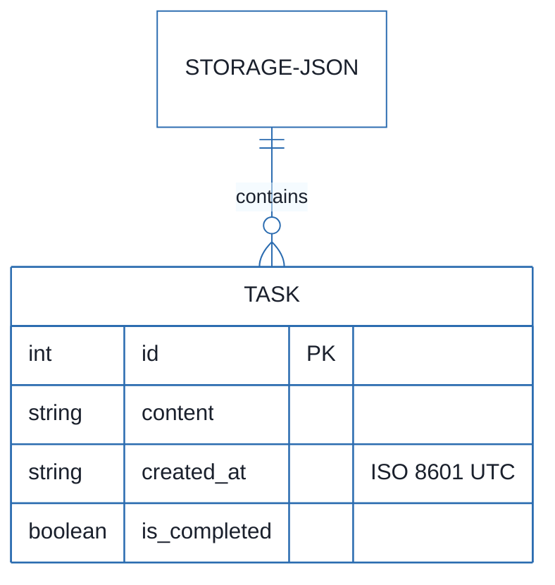
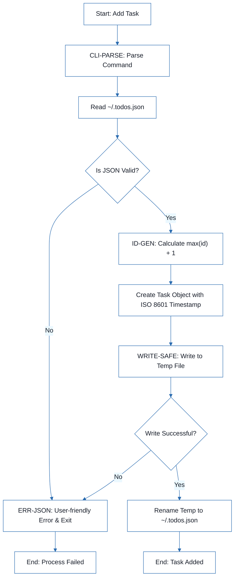
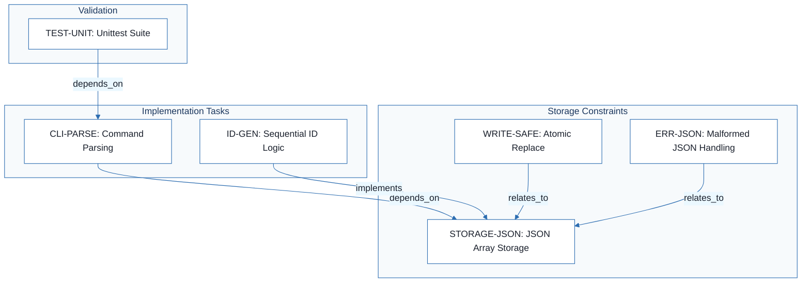
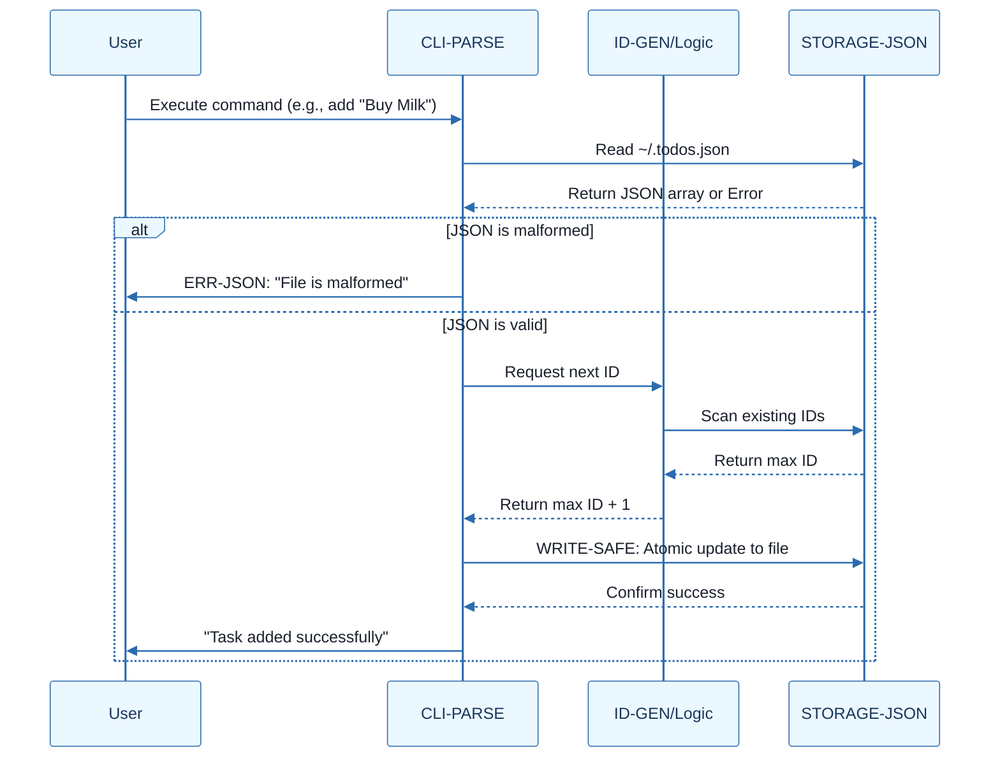

# CLI To-Do List Manager - Technical Specification & Architecture Document

## 1. Executive Summary & Architecture Overview

### 1.1 Executive Brief
A lightweight CLI To-Do List Manager implemented in Python, utilizing a local JSON file for persistence. The system follows a minimal-dependency philosophy, leveraging standard libraries for command parsing, storage, and testing to ensure a portable, single-binary-like experience for local task management.

### 1.2 Maturity Assessment
The project is in a REFINEMENT state. While the core technical decisions are logically sound and the completeness score is high, there is a critical lack of verifiable acceptance criteria and a formal operational checklist. The current specifications define 'how' to build but not 'how to validate' the final delivery.

### 1.3 Technical Stack
* Python
* argparse
* unittest

### 1.4 Architectural Constraints
* Storage must be a plain JSON array located at `~/.todos.json`.
* Task IDs must be generated sequentially using `max(existing_ids) + 1`, starting at 1.
* Timestamps for `created_at` must strictly follow ISO 8601 UTC strings.
* File updates must implement an atomic-replace pattern (write to temporary file then rename).
* Malformed JSON in `~/.todos.json` must trigger a non-zero exit code with a user-friendly error message.

### 1.5 Critical Dependencies
* Local filesystem access for `~/.todos.json`.
* Python Standard Library (`argparse`, `json`, `unittest`, `os`).
* Strict referential integrity between Task IDs and the JSON array sequence.
* Atomic file system operations for the safe replace pattern.

## 2. Architecture Workflows







```mermaid
%%{init: {
  'theme': 'base',
  'themeVariables': {
    'primaryColor': '#1A365D',
    'primaryTextColor': '#1A202C',
    'primaryBorderColor': '#2B6CB0',
    'lineColor': '#2B6CB0',
    'secondaryColor': '#EBF8FF',
    'tertiaryColor': '#EBF8FF',
    'background': '#FFFFFF',
    'mainBkg': '#FFFFFF',
    'secondBkg': '#EBF8FF',
    'tertiaryBkg': '#F7FAFC',
    'secondaryTextColor': '#4A5568',
    'fontSize': '16px',
    'fontFamily': 'Inter, system-ui, sans-serif',
    'nodePadding': '15px',
    'borderRadius': '8px',
    'edgeLabelBackground': '#EBF8FF',
    'clusterBkg': '#F7FAFC',
    'clusterBorder': '#2B6CB0',
    'defaultLinkColor': '#2B6CB0',
    'titleColor': '#1A365D',
    'actorBorder': '#2B6CB0',
    'actorBkg': '#EBF8FF',
    'actorTextColor': '#1A365D',
    'actorLineColor': '#2B6CB0',
    'signalColor': '#2B6CB0',
    'signalTextColor': '#1A202C',
    'labelBoxBorderColor': '#2B6CB0',
    'labelBoxBkgColor': '#EBF8FF',
    'labelTextColor': '#1A202C',
    'loopTextColor': '#1A202C',
    'arrowHeadColor': '#2B6CB0',
    'sequenceNumberColor': '#1A365D',
    'sequenceActorBorder': '#2B6CB0',
    'sequenceActorBkg': '#EBF8FF',
    'sequenceArrowColor': '#2B6CB0',
    'noteBkgColor': '#FFF5EB',
    'noteBorderColor': '#DD6B20',
    'noteTextColor': '#1A202C'
  }
}}%%
sequenceDiagram
    participant User
    participant CLI as CLI-PARSE
    participant Logic as ID-GEN/Logic
    participant Disk as STORAGE-JSON
    User->>CLI: Execute command (e.g., add "Buy Milk")
    CLI->>Disk: Read ~/.todos.json
    Disk-->>CLI: Return JSON array or Error
    alt JSON is malformed
        CLI->>User: ERR-JSON: "File is malformed"
    else JSON is valid
        CLI->>Logic: Request next ID
        Logic->>Disk: Scan existing IDs
        Disk-->>Logic: Return max ID
        Logic-->>CLI: Return max ID + 1
        CLI->>Disk: WRITE-SAFE: Atomic update to file
        Disk-->>CLI: Confirm success
        CLI->>User: "Task added successfully"
    end
``` & Visual Diagrams

### 2.1 CLI To-Do Manager Data Model
```mermaid
%%{init: {
  'theme': 'base',
  'themeVariables': {
    'primaryColor': '#1A365D',
    'primaryTextColor': '#1A202C',
    'primaryBorderColor': '#2B6CB0',
    'lineColor': '#2B6CB0',
    'secondaryColor': '#EBF8FF',
    'tertiaryColor': '#EBF8FF',
    'background': '#FFFFFF',
    'mainBkg': '#FFFFFF',
    'secondBkg': '#EBF8FF',
    'tertiaryBkg': '#F7FAFC',
    'secondaryTextColor': '#4A5568',
    'fontSize': '16px',
    'fontFamily': 'Inter, system-ui, sans-serif',
    'nodePadding': '15px',
    'borderRadius': '8px',
    'edgeLabelBackground': '#EBF8FF',
    'clusterBkg': '#F7FAFC',
    'clusterBorder': '#2B6CB0',
    'defaultLinkColor': '#2B6CB0',
    'titleColor': '#1A365D',
    'actorBorder': '#2B6CB0',
    'actorBkg': '#EBF8FF',
    'actorTextColor': '#1A365D',
    'actorLineColor': '#2B6CB0',
    'signalColor': '#2B6CB0',
    'signalTextColor': '#1A202C',
    'labelBoxBorderColor': '#2B6CB0',
    'labelBoxBkgColor': '#EBF8FF',
    'labelTextColor': '#1A202C',
    'loopTextColor': '#1A202C',
    'arrowHeadColor': '#2B6CB0',
    'sequenceNumberColor': '#1A365D',
    'sequenceActorBorder': '#2B6CB0',
    'sequenceActorBkg': '#EBF8FF',
    'sequenceArrowColor': '#2B6CB0',
    'noteBkgColor': '#FFF5EB',
    'noteBorderColor': '#DD6B20',
    'noteTextColor': '#1A202C'
  }
}}%%
erDiagram
    STORAGE-JSON ||--o{ TASK : "contains"
    TASK {
        int id PK
        string content
        string created_at "ISO 8601 UTC"
        boolean is_completed
    }
```

### 2.2 Task Management Workflow


### 2.3 Technical Traceability Map


### 2.4 CLI Interaction Sequence


## 3. Detailed Technical Specifications & Business Rules

### 3.1 Requirements Traceability
| Identifier | Type | Description | Source Section |
| :--- | :--- | :--- | :--- |
| CLI-PARSE | task | Implement command parsing using argparse with subcommands: add, list, complete, remove, clear. | 1. Command parsing will use `argparse` |
| STORAGE-JSON | constraint | Store tasks as a plain JSON array in ~/.todos.json | 2. Storage will be a plain JSON array of task objects |
| ID-GEN | sub_task | Generate sequential IDs using max(existing_ids) + 1, starting at 1. | 3. Task IDs will be assigned sequentially from the current maximum ID |
| TIME-ISO | constraint | Format created_at timestamps as ISO 8601 UTC strings. | 4. The CLI will format timestamps as ISO 8601 UTC strings |
| WRITE-SAFE | constraint | Use a safe replace pattern (write to temp file then rename) for JSON updates. | 5. File writes will use a safe replace pattern |
| TEST-UNIT | test_case | Implement unit and integration tests using the unittest standard library. | 6. Tests will use `unittest` |
| ERR-JSON | constraint | Exit non-zero with a user-friendly error message if ~/.todos.json is malformed. | 7. Corrupted JSON will fail with a user-friendly error |

### 3.2 Security Rules
* **Atomic Persistence**: To prevent data corruption during crashes or power failures, the system must use the `WRITE-SAFE` pattern: write to a temporary file and perform an atomic rename to `~/.todos.json`.
* **Error Handling**: The system must not silently ignore corrupted data. Any failure to parse the JSON storage must result in a non-zero exit code (`ERR-JSON`) to notify the user of the malformed state.

### 3.3 Data Models
* **Storage Format**: Flat JSON array of objects.
* **Task Object Schema**:
    * `id` (Integer): Unique sequential identifier.
    * `content` (String): The task description.
    * `created_at` (String): ISO 8601 UTC timestamp.
    * `is_completed` (Boolean): Completion status.

## 4. Project Governance & Structural Gaps

### 4.1 Structural Gaps
| Missing Section | Priority | Remediation Advice |
| :--- | :--- | :--- |
| Dependencies & Integration Points | MEDIUM | Define external dependencies (though the doc suggests none) and OS integration points. |
| Acceptance Criteria | HIGH | Convert the decisions into a set of verifiable acceptance criteria for the final product. |
| Checkboxes Checklist | MEDIUM | Create an operational checklist based on the identified tasks (CLI-PARSE, ID-GEN, etc.). |
| Open Questions & Uncertainties | LOW | Identify any remaining ambiguities in the implementation of the JSON storage. |

### 4.2 Remediation & Workflow
The project should transition from the Refinement phase to Implementation by first establishing a set of Acceptance Criteria (AC) for each identifier in Section 3.1. Once ACs are defined, the development should follow the sequence: `STORAGE-JSON` $\rightarrow$ `CLI-PARSE` $\rightarrow$ `ID-GEN` $\rightarrow$ `WRITE-SAFE` $\rightarrow$ `TEST-UNIT`.

## 5. Technical & Domain Glossary (Terminology Reference)

| Term | Category | Context Anchor | Project Definition |
| :--- | :--- | :--- | :--- |
| Alternatives considered | TECHNICAL_STACK | CLI-PARSE | The set of rejected architectural paths or libraries evaluated against the minimal dependency requirement. |
| Decision | TECHNICAL_STACK | CLI-PARSE | The final selected implementation path for a specific functional or technical requirement. |
| ID | BUSINESS_DOMAIN | ID-GEN | A unique sequential integer starting at 1, calculated as the current maximum value plus one. |
| JSON | TECHNICAL_STACK | STORAGE-JSON | The lightweight data-interchange format used for the local flat-file array storage at ~/.todos.json. |
| Rationale | TECHNICAL_STACK | CLI-PARSE | The technical justification explaining why a specific choice was made over other options. |
| UTC | TECHNICAL_STACK | TIME-ISO | The primary time standard used for created_at timestamps to ensure unambiguous serialization. |