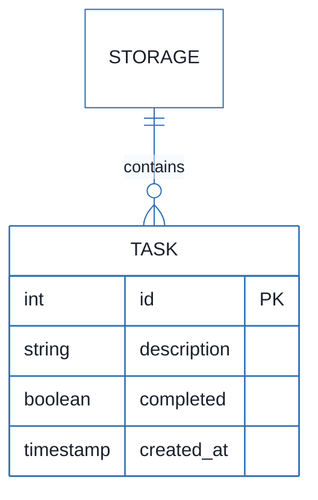
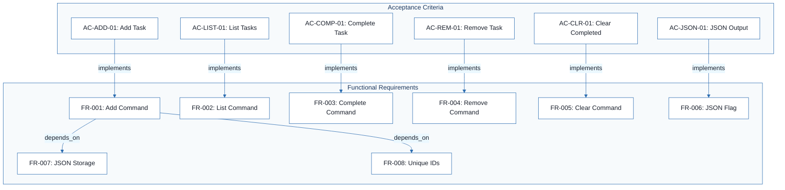
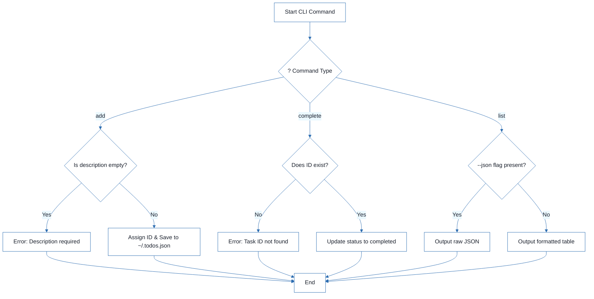
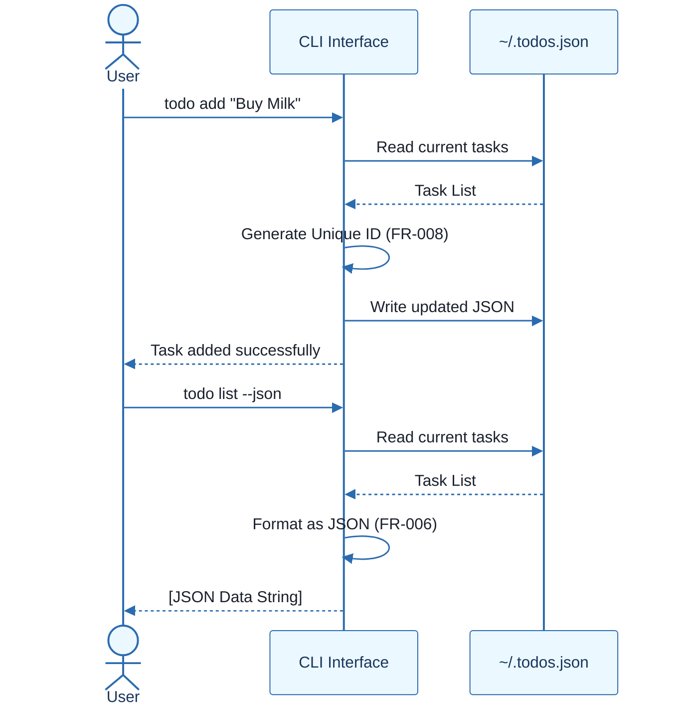

# CLI To-Do List Manager - Technical Specification & Architecture Document

## 1. Executive Summary & Architecture Overview

### 1.1 Executive Brief
A local CLI To-Do List Manager designed for rapid task capture and tracking. The application implements a file-based persistence pattern using a JSON store located at `~/.todos.json`, providing core CRUD operations and machine-readable output for automation.

### 1.2 Maturity Assessment
The project is in a REFINEMENT state. While functional requirements and acceptance criteria are fully mapped (100% completeness), the architecture lacks formal definitions for external library dependencies and fails to resolve critical edge cases regarding file corruption and concurrent access, as noted in the structural gaps.

### 1.3 Technical Stack
* **Language**: Python 3.8+
* **Storage**: Local JSON file (`~/.todos.json`)
* **Interface**: Command Line Interface (CLI)

### 1.4 Architectural Constraints
* **Persistence**: All data must be persisted in a local JSON file at `~/.todos.json`.
* **Performance**: All operations must execute in under 2 seconds on standard hardware.
* **Scalability**: System must handle 1000+ tasks without performance degradation.
* **Logic**: Tasks must be assigned unique sequential IDs.
* **Output**: Support for both human-readable and valid JSON formats via `--json` flag.

### 1.5 Critical Dependencies
* Write access to the user's home directory for `~/.todos.json`.
* Python 3.8+ runtime environment.
* Sequential ID generation logic for Task entity integrity.
* JSON serialization/deserialization for data persistence.

## 2. Architecture Workflows







```mermaid
%%{init: {
  'theme': 'base',
  'themeVariables': {
    'primaryColor': '#1A365D',
    'primaryTextColor': '#1A202C',
    'primaryBorderColor': '#2B6CB0',
    'lineColor': '#2B6CB0',
    'secondaryColor': '#EBF8FF',
    'tertiaryColor': '#EBF8FF',
    'background': '#FFFFFF',
    'mainBkg': '#FFFFFF',
    'secondBkg': '#EBF8FF',
    'tertiaryBkg': '#F7FAFC',
    'secondaryTextColor': '#4A5568',
    'fontSize': '16px',
    'fontFamily': 'Inter, system-ui, sans-serif',
    'nodePadding': '15px',
    'borderRadius': '8px',
    'edgeLabelBackground': '#EBF8FF',
    'clusterBkg': '#F7FAFC',
    'clusterBorder': '#2B6CB0',
    'defaultLinkColor': '#2B6CB0',
    'titleColor': '#1A365D',
    'actorBorder': '#2B6CB0',
    'actorBkg': '#EBF8FF',
    'actorTextColor': '#1A365D',
    'actorLineColor': '#2B6CB0',
    'signalColor': '#2B6CB0',
    'signalTextColor': '#1A202C',
    'labelBoxBorderColor': '#2B6CB0',
    'labelBoxBkgColor': '#EBF8FF',
    'labelTextColor': '#1A202C',
    'loopTextColor': '#1A202C',
    'arrowHeadColor': '#2B6CB0',
    'sequenceNumberColor': '#1A365D',
    'sequenceActorBorder': '#2B6CB0',
    'sequenceActorBkg': '#EBF8FF',
    'sequenceArrowColor': '#2B6CB0',
    'noteBkgColor': '#FFF5EB',
    'noteBorderColor': '#DD6B20',
    'noteTextColor': '#1A202C'
  }
}}%%
sequenceDiagram
    actor User
    participant CLI as CLI Interface
    participant Storage as ~/.todos.json
    User->>CLI: todo add "Buy Milk"
    CLI->>Storage: Read current tasks
    Storage-->>CLI: Task List
    CLI->>CLI: Generate Unique ID (FR-008)
    CLI->>Storage: Write updated JSON
    CLI-->>User: Task added successfully
    User->>CLI: todo list --json
    CLI->>Storage: Read current tasks
    Storage-->>CLI: Task List
    CLI->>CLI: Format as JSON (FR-006)
    CLI-->>User: [JSON Data String]
``` & Visual Diagrams

### 2.1 CLI To-Do Manager Data Model
```mermaid
%%{init: {
  'theme': 'base',
  'themeVariables': {
    'primaryColor': '#1A365D',
    'primaryTextColor': '#1A202C',
    'primaryBorderColor': '#2B6CB0',
    'lineColor': '#2B6CB0',
    'secondaryColor': '#EBF8FF',
    'tertiaryColor': '#EBF8FF',
    'background': '#FFFFFF',
    'mainBkg': '#FFFFFF',
    'secondBkg': '#EBF8FF',
    'tertiaryBkg': '#F7FAFC',
    'secondaryTextColor': '#4A5568',
    'fontSize': '16px',
    'fontFamily': 'Inter, system-ui, sans-serif',
    'nodePadding': '15px',
    'borderRadius': '8px',
    'edgeLabelBackground': '#EBF8FF',
    'clusterBkg': '#F7FAFC',
    'clusterBorder': '#2B6CB0',
    'defaultLinkColor': '#2B6CB0',
    'titleColor': '#1A365D',
    'actorBorder': '#2B6CB0',
    'actorBkg': '#EBF8FF',
    'actorTextColor': '#1A365D',
    'actorLineColor': '#2B6CB0',
    'signalColor': '#2B6CB0',
    'signalTextColor': '#1A202C',
    'labelBoxBorderColor': '#2B6CB0',
    'labelBoxBkgColor': '#EBF8FF',
    'labelTextColor': '#1A202C',
    'loopTextColor': '#1A202C',
    'arrowHeadColor': '#2B6CB0',
    'sequenceNumberColor': '#1A365D',
    'sequenceActorBorder': '#2B6CB0',
    'sequenceActorBkg': '#EBF8FF',
    'sequenceArrowColor': '#2B6CB0',
    'noteBkgColor': '#FFF5EB',
    'noteBorderColor': '#DD6B20',
    'noteTextColor': '#1A202C'
  }
}}%%
erDiagram
    TASK {
        int id PK
        string description
        boolean completed
        timestamp created_at
    }
    STORAGE ||--o{ TASK : "contains"
```

### 2.2 Requirements Traceability Matrix


### 2.3 Task Management Workflow


### 2.4 CLI Interaction Sequence


## 3. Detailed Technical Specifications & Business Rules

### 3.1 Requirements Traceability
| ID | Requirement Description | Priority | Acceptance Criterion |
| :--- | :--- | :--- | :--- |
| **FR-001** | Allow users to add new tasks with descriptions via the `add` command | P1 | AC-ADD-01 |
| **FR-002** | Display all tasks with their IDs, descriptions, and completion status via the `list` command | P2 | AC-LIST-01 |
| **FR-003** | Allow users to mark tasks as completed via the `complete` command | P1 | AC-COMP-01 |
| **FR-004** | Allow users to remove individual tasks via the `remove` command | P3 | AC-REM-01 |
| **FR-005** | Allow users to clear all completed tasks via the `clear` command | P3 | AC-CLR-01 |
| **FR-006** | Support JSON output format via `--json` flag | P2 | AC-JSON-01 |
| **FR-007** | Store all task data in a local JSON file at `~/.todos.json` | Constraint | N/A |
| **FR-008** | Assign unique sequential IDs to tasks | Constraint | N/A |
| **PERF-01** | Operations must execute in under 2 seconds on standard hardware | Constraint | SC-001 |
| **PERF-02** | Handle 1000+ tasks without performance degradation | Constraint | SC-002 |

### 3.2 Security Rules
* **File Access**: The system requires read/write permissions for the user's home directory to manage `~/.todos.json`.
* **Input Validation**:
    * Empty task descriptions must be rejected with a user-friendly error message.
    * Invalid Task IDs provided to `complete` or `remove` commands must be handled gracefully.
* **Data Integrity**: The system must handle corrupted or malformed JSON storage files to prevent application crashes.

### 3.3 Data Models
**Entity: Task**
| Attribute | Type | Description | Default |
| :--- | :--- | :--- | :--- |
| `id` | Integer | Unique sequential identifier (PK) | Auto-increment |
| `description` | String | Text describing the task | Required |
| `completed` | Boolean | Completion status | `false` |
| `created_at` | Timestamp | Creation date and time | Current Time |

## 4. Project Governance & Structural Gaps

### 4.1 Structural Gaps
| Gap ID | Missing Section | Priority | Remediation Advice |
| :--- | :--- | :--- | :--- |
| GAP-01 | Dependencies & Integration Points | MEDIUM | Define external library dependencies (e.g., argparse, json) and OS-level requirements. |
| GAP-02 | Open Questions & Uncertainties | LOW | The 'Edge Cases' section contains questions that should be formally moved here and answered. |

### 4.2 Remediation & Workflow
1. **Dependency Mapping**: Formalize the list of Python standard libraries required.
2. **Edge Case Resolution**: Define specific behaviors for:
    * Corrupted JSON files (e.g., backup and reset or error prompt).
    * Concurrent access (e.g., simple file locking).
    * Empty descriptions (e.g., validation error).

## 5. Technical & Domain Glossary (Terminology Reference)

| Term | Category | Context Anchor | Project Definition |
| :--- | :--- | :--- | :--- |
| Handle | TECHNICAL_STACK | Edge Cases | The operational logic used to manage corrupted storage files or concurrent file access attempts. |
| ID | BUSINESS_DOMAIN | FR-008 | A unique sequential integer assigned to each entry for precise referencing and mutation. |
| JSON | TECHNICAL_STACK | FR-007 | The standardized data interchange format used for local persistence at ~/.todos.json and machine-readable output. |
| Python 3.8 | TECHNICAL_STACK | Feature Specification: CLI To-Do List Manager | The minimum required runtime environment for executing the application. |
| todo clear | TECHNICAL_STACK | FR-005 | The specific command-line trigger that purges all entries marked as finished from the storage. |
| todo list | TECHNICAL_STACK | FR-002 | The specific command-line trigger that retrieves and displays all stored entries and their current states. |