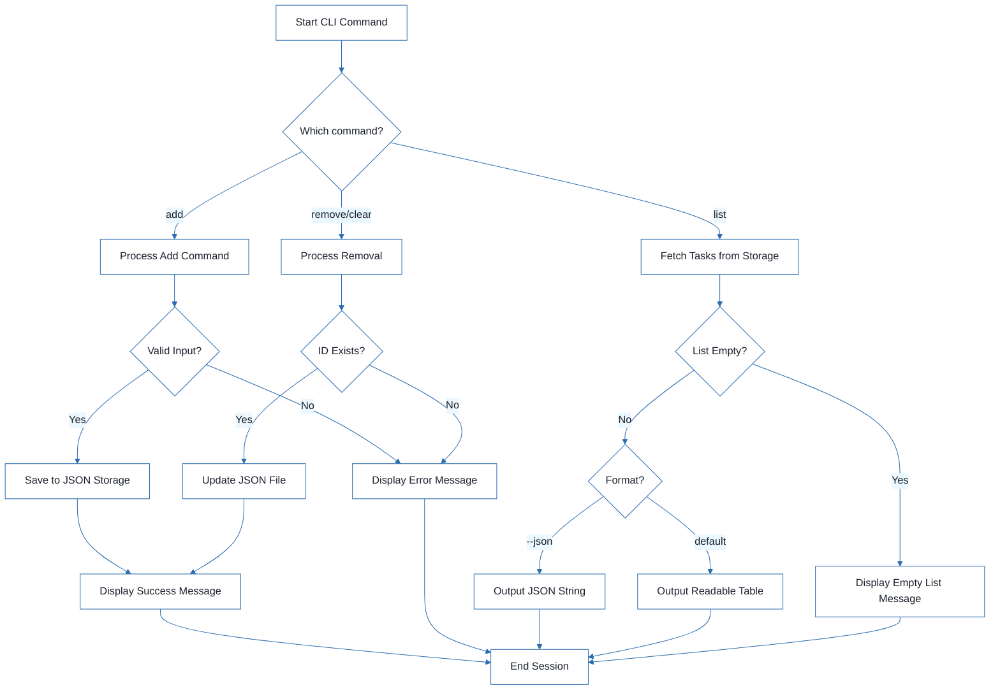

# CLI To-Do List Manager - Technical Specification & Architecture Document

## 1. Executive Summary & Architecture Overview

### 1.1 Executive Brief
The CLI To-Do List Manager is a Python-based command-line application designed for task lifecycle management using a local JSON storage pattern. It implements a service-oriented architecture separating CLI dispatch, business logic, and file I/O to enable independent user story implementation and testing.

### 1.2 Maturity Assessment
The project is structurally sound with a high health index, though it lacks formal acceptance criteria and explicit security/performance constraints. Given that only one minor task (T017) remains pending and the core infrastructure is validated, the project is READY for final execution.

### 1.3 Technical Stack
* Python
* pyproject.toml

### 1.4 Architectural Constraints
* Sequential ID assignment for task creation.
* Strict JSON serialization for data persistence.
* Human-readable and `--json` output modes for listing.
* Blocking dependency: Foundational phase must be complete before any User Story implementation.
* Storage path resolution restricted to `~/.todos.json`.

### 1.5 Critical Dependencies
* JSON file I/O for persistence in `~/.todos.json`.
* Sequential dependency: Setup $\rightarrow$ Foundational $\rightarrow$ User Stories $\rightarrow$ Polish.
* Internal data integrity: Task entity serialization helpers in `models.py`.
* CLI entry point configuration in `pyproject.toml`.
* Referential integrity for task removal based on unique IDs.

## 2. Architecture Workflows

```mermaid
%%{init: {
  'theme': 'base',
  'themeVariables': {
    'primaryColor': '#1A365D',
    'primaryTextColor': '#1A202C',
    'primaryBorderColor': '#2B6CB0',
    'lineColor': '#2B6CB0',
    'secondaryColor': '#EBF8FF',
    'tertiaryColor': '#EBF8FF',
    'background': '#FFFFFF',
    'mainBkg': '#FFFFFF',
    'secondBkg': '#EBF8FF',
    'tertiaryBkg': '#F7FAFC',
    'secondaryTextColor': '#4A5568',
    'fontSize': '16px',
    'fontFamily': 'Inter, system-ui, sans-serif',
    'nodePadding': '15px',
    'borderRadius': '8px',
    'edgeLabelBackground': '#EBF8FF',
    'clusterBkg': '#F7FAFC',
    'clusterBorder': '#2B6CB0',
    'defaultLinkColor': '#2B6CB0',
    'titleColor': '#1A365D',
    'actorBorder': '#2B6CB0',
    'actorBkg': '#EBF8FF',
    'actorTextColor': '#1A365D',
    'actorLineColor': '#2B6CB0',
    'signalColor': '#2B6CB0',
    'signalTextColor': '#1A202C',
    'labelBoxBorderColor': '#2B6CB0',
    'labelBoxBkgColor': '#EBF8FF',
    'labelTextColor': '#1A202C',
    'loopTextColor': '#1A202C',
    'arrowHeadColor': '#2B6CB0',
    'sequenceNumberColor': '#1A365D',
    'sequenceActorBorder': '#2B6CB0',
    'sequenceActorBkg': '#EBF8FF',
    'sequenceArrowColor': '#2B6CB0',
    'noteBkgColor': '#FFF5EB',
    'noteBorderColor': '#DD6B20',
    'noteTextColor': '#1A202C'
  }
}}%%
flowchart TD
  subgraph S1 ["Phase 1: Setup"]
    PHASE-01["PHASE-01: Setup (Shared Infrastructure)"]
    T001["T001: Package Skeleton"]
    T002["T002: Test Structure"]
    T003["T003: Project Metadata"]
    PHASE-01 --> T001
    PHASE-01 --> T002
    PHASE-01 --> T003
  end
  subgraph S2 ["Phase 2: Foundational"]
    PHASE-02["PHASE-02: Foundational (Blocking Prerequisites)"]
    T004["T004: Entity Definitions"]
    T005["T005: JSON Storage I/O"]
    T006["T006: CLI Parsing"]
    T007["T007: Service Error Handling"]
    T008["T008: Module Entry Behavior"]
    PHASE-02 --> T004
    PHASE-02 --> T005
    PHASE-02 --> T006
    PHASE-02 --> T007
    PHASE-02 --> T008
  end
  subgraph S3 ["Phase 3: US1 - Add/Manage"]
    PHASE-03["PHASE-03: User Story 1 - Add and Manage Tasks"]
    T009["T009: Add Command Flow"]
    T010["T010: Task Creation Logic"]
    T011["T011: Completion Updates"]
    T012["T012: User Messaging"]
    PHASE-03 --> T009
    PHASE-03 --> T010
    PHASE-03 --> T011
    PHASE-03 --> T012
  end
  subgraph S4 ["Phase 4: US2 - View/Filter"]
    PHASE-04["PHASE-04: User Story 2 - View and Filter Tasks"]
    T013["T013: Human-readable Output"]
    T014["T014: JSON Formatting"]
    T015["T015: Listing Logic"]
    T016["T016: Empty-list Handling"]
    PHASE-04 --> T013
    PHASE-04 --> T014
    PHASE-04 --> T015
    PHASE-04 --> T016
  end
  subgraph S5 ["Phase 5: US3 - Remove/Clear"]
    PHASE-05["PHASE-05: User Story 3 - Remove and Clear Tasks"]
    T017["T017: Remove Command Flow"]
    T018["T018: Clear Command Flow"]
    T019["T019: Not-found Handling"]
    T020["T020: Storage Persistence"]
    PHASE-05 --> T017
    PHASE-05 --> T018
    PHASE-05 --> T019
    PHASE-05 --> T020
  end
  subgraph S6 ["Phase 6: Polish"]
    PHASE-06["PHASE-06: Polish & Cross-Cutting Concerns"]
    T021["T021: Documentation"]
    T022["T022: Quickstart Notes"]
    T023["T023: Smoke Tests"]
    T024["T024: Linting/Formatting"]
    T025["T025: JSON Validation"]
    PHASE-06 --> T021
    PHASE-06 --> T022
    PHASE-06 --> T023
    PHASE-06 --> T024
    PHASE-06 --> T025
  end
  PHASE-01 --> PHASE-02
  PHASE-02 --> PHASE-03
  PHASE-02 --> PHASE-04
  PHASE-02 --> PHASE-05
  PHASE-03 --> PHASE-06
  PHASE-04 --> PHASE-06
  PHASE-05 --> PHASE-06
```



```mermaid
%%{init: {
  'theme': 'base',
  'themeVariables': {
    'primaryColor': '#1A365D',
    'primaryTextColor': '#1A202C',
    'primaryBorderColor': '#2B6CB0',
    'lineColor': '#2B6CB0',
    'secondaryColor': '#EBF8FF',
    'tertiaryColor': '#EBF8FF',
    'background': '#FFFFFF',
    'mainBkg': '#FFFFFF',
    'secondBkg': '#EBF8FF',
    'tertiaryBkg': '#F7FAFC',
    'secondaryTextColor': '#4A5568',
    'fontSize': '16px',
    'fontFamily': 'Inter, system-ui, sans-serif',
    'nodePadding': '15px',
    'borderRadius': '8px',
    'edgeLabelBackground': '#EBF8FF',
    'clusterBkg': '#F7FAFC',
    'clusterBorder': '#2B6CB0',
    'defaultLinkColor': '#2B6CB0',
    'titleColor': '#1A365D',
    'actorBorder': '#2B6CB0',
    'actorBkg': '#EBF8FF',
    'actorTextColor': '#1A365D',
    'actorLineColor': '#2B6CB0',
    'signalColor': '#2B6CB0',
    'signalTextColor': '#1A202C',
    'labelBoxBorderColor': '#2B6CB0',
    'labelBoxBkgColor': '#EBF8FF',
    'labelTextColor': '#1A202C',
    'loopTextColor': '#1A202C',
    'arrowHeadColor': '#2B6CB0',
    'sequenceNumberColor': '#1A365D',
    'sequenceActorBorder': '#2B6CB0',
    'sequenceActorBkg': '#EBF8FF',
    'sequenceArrowColor': '#2B6CB0',
    'noteBkgColor': '#FFF5EB',
    'noteBorderColor': '#DD6B20',
    'noteTextColor': '#1A202C'
  }
}}%%
flowchart TD
  START["Start CLI Command"] --> CMD_INPUT{"Which command?"}
  CMD_INPUT -- "add" --> ADD_FLOW["Process Add Command"]
  ADD_FLOW --> VAL_ADD{"Valid Input?"}
  VAL_ADD -- "No" --> ERR_MSG["Display Error Message"]
  VAL_ADD -- "Yes" --> SAVE_TASK["Save to JSON Storage"]
  SAVE_TASK --> SUCCESS_MSG["Display Success Message"]
  CMD_INPUT -- "list" --> LIST_FLOW["Fetch Tasks from Storage"]
  LIST_FLOW --> CHECK_EMPTY{"List Empty?"}
  CHECK_EMPTY -- "Yes" --> EMPTY_MSG["Display Empty List Message"]
  CHECK_EMPTY -- "No" --> FMT_DEC{"Format?"}
  FMT_DEC -- "--json" --> JSON_OUT["Output JSON String"]
  FMT_DEC -- "default" --> HUMAN_OUT["Output Readable Table"]
  CMD_INPUT -- "remove/clear" --> REM_FLOW["Process Removal"]
  REM_FLOW --> VAL_ID{"ID Exists?"}
  VAL_ID -- "No" --> ERR_MSG
  VAL_ID -- "Yes" --> UPDATE_STORAGE["Update JSON File"]
  UPDATE_STORAGE --> SUCCESS_MSG
  SUCCESS_MSG --> END["End Session"]
  ERR_MSG --> END
  JSON_OUT --> END
  HUMAN_OUT --> END
  EMPTY_MSG --> END
``` & Visual Diagrams

### 2.1 Project Implementation Roadmap & Traceability
Visualizes the dependency chain between project phases and the specific tasks contained within each phase, ensuring strict identifier preservation.

```mermaid
%%{init: {
  'theme': 'base',
  'themeVariables': {
    'primaryColor': '#1A365D',
    'primaryTextColor': '#1A202C',
    'primaryBorderColor': '#2B6CB0',
    'lineColor': '#2B6CB0',
    'secondaryColor': '#EBF8FF',
    'tertiaryColor': '#EBF8FF',
    'background': '#FFFFFF',
    'mainBkg': '#FFFFFF',
    'secondBkg': '#EBF8FF',
    'tertiaryBkg': '#F7FAFC',
    'secondaryTextColor': '#4A5568',
    'fontSize': '16px',
    'fontFamily': 'Inter, system-ui, sans-serif',
    'nodePadding': '15px',
    'borderRadius': '8px',
    'edgeLabelBackground': '#EBF8FF',
    'clusterBkg': '#F7FAFC',
    'clusterBorder': '#2B6CB0',
    'defaultLinkColor': '#2B6CB0',
    'titleColor': '#1A365D',
    'actorBorder': '#2B6CB0',
    'actorBkg': '#EBF8FF',
    'actorTextColor': '#1A365D',
    'actorLineColor': '#2B6CB0',
    'signalColor': '#2B6CB0',
    'signalTextColor': '#1A202C',
    'labelBoxBorderColor': '#2B6CB0',
    'labelBoxBkgColor': '#EBF8FF',
    'labelTextColor': '#1A202C',
    'loopTextColor': '#1A202C',
    'arrowHeadColor': '#2B6CB0',
    'sequenceNumberColor': '#1A365D',
    'sequenceActorBorder': '#2B6CB0',
    'sequenceActorBkg': '#EBF8FF',
    'sequenceArrowColor': '#2B6CB0',
    'noteBkgColor': '#FFF5EB',
    'noteBorderColor': '#DD6B20',
    'noteTextColor': '#1A202C'
  }
}}%%
flowchart TD
  subgraph S1 ["Phase 1: Setup"]
    PHASE-01["PHASE-01: Setup (Shared Infrastructure)"]
    T001["T001: Package Skeleton"]
    T002["T002: Test Structure"]
    T003["T003: Project Metadata"]
    PHASE-01 --> T001
    PHASE-01 --> T002
    PHASE-01 --> T003
  end
  subgraph S2 ["Phase 2: Foundational"]
    PHASE-02["PHASE-02: Foundational (Blocking Prerequisites)"]
    T004["T004: Entity Definitions"]
    T005["T005: JSON Storage I/O"]
    T006["T006: CLI Parsing"]
    T007["T007: Service Error Handling"]
    T008["T008: Module Entry Behavior"]
    PHASE-02 --> T004
    PHASE-02 --> T005
    PHASE-02 --> T006
    PHASE-02 --> T007
    PHASE-02 --> T008
  end
  subgraph S3 ["Phase 3: US1 - Add/Manage"]
    PHASE-03["PHASE-03: User Story 1 - Add and Manage Tasks"]
    T009["T009: Add Command Flow"]
    T010["T010: Task Creation Logic"]
    T011["T011: Completion Updates"]
    T012["T012: User Messaging"]
    PHASE-03 --> T009
    PHASE-03 --> T010
    PHASE-03 --> T011
    PHASE-03 --> T012
  end
  subgraph S4 ["Phase 4: US2 - View/Filter"]
    PHASE-04["PHASE-04: User Story 2 - View and Filter Tasks"]
    T013["T013: Human-readable Output"]
    T014["T014: JSON Formatting"]
    T015["T015: Listing Logic"]
    T016["T016: Empty-list Handling"]
    PHASE-04 --> T013
    PHASE-04 --> T014
    PHASE-04 --> T015
    PHASE-04 --> T016
  end
  subgraph S5 ["Phase 5: US3 - Remove/Clear"]
    PHASE-05["PHASE-05: User Story 3 - Remove and Clear Tasks"]
    T017["T017: Remove Command Flow"]
    T018["T018: Clear Command Flow"]
    T019["T019: Not-found Handling"]
    T020["T020: Storage Persistence"]
    PHASE-05 --> T017
    PHASE-05 --> T018
    PHASE-05 --> T019
    PHASE-05 --> T020
  end
  subgraph S6 ["Phase 6: Polish"]
    PHASE-06["PHASE-06: Polish & Cross-Cutting Concerns"]
    T021["T021: Documentation"]
    T022["T022: Quickstart Notes"]
    T023["T023: Smoke Tests"]
    T024["T024: Linting/Formatting"]
    T025["T025: JSON Validation"]
    PHASE-06 --> T021
    PHASE-06 --> T022
    PHASE-06 --> T023
    PHASE-06 --> T024
    PHASE-06 --> T025
  end
  PHASE-01 --> PHASE-02
  PHASE-02 --> PHASE-03
  PHASE-02 --> PHASE-04
  PHASE-02 --> PHASE-05
  PHASE-03 --> PHASE-06
  PHASE-04 --> PHASE-06
  PHASE-05 --> PHASE-06
```

### 2.2 CLI Task Management Workflow
Models the business logic for task operations including decision points for input validation and output formatting.



## 3. Detailed Technical Specifications & Business Rules

### 3.1 Requirements Traceability

| ID | Source Section | Description | Status |
| :--- | :--- | :--- | :--- |
| T001 | Phase 1: Setup | Create the Python package skeleton in src/todo_manager/__init__.py, __main__.py, cli.py, models.py, storage.py, and service.py | completed |
| T002 | Phase 1: Setup | Create the test directory structure in tests/unit/ and tests/integration/ | completed |
| T003 | Phase 1: Setup | Add project metadata and tooling entry points in pyproject.toml | completed |
| T004 | Phase 2: Foundational | Implement task entity definitions and serialization helpers in src/todo_manager/models.py | completed |
| T005 | Phase 2: Foundational | Implement JSON storage path resolution and file I/O helpers in src/todo_manager/storage.py | completed |
| T006 | Phase 2: Foundational | Implement shared command-line parsing and top-level dispatch in src/todo_manager/cli.py | completed |
| T007 | Phase 2: Foundational | Implement shared service-layer error handling and task collection utilities in src/todo_manager/service.py | completed |
| T008 | Phase 2: Foundational | Define module entry behavior for python -m todo_manager in src/todo_manager/__main__.py | completed |
| T009 | Implementation for US1 | Implement the add command flow in src/todo_manager/cli.py and src/todo_manager/service.py | completed |
| T010 | Implementation for US1 | Implement task creation, sequential ID assignment, and created_at population in src/todo_manager/models.py | completed |
| T011 | Implementation for US1 | Implement completion updates for existing tasks in src/todo_manager/service.py | completed |
| T012 | Implementation for US1 | Add user-facing success and error messages for add and complete operations in src/todo_manager/cli.py | completed |
| T013 | Implementation for US2 | Implement human-readable task listing output in src/todo_manager/cli.py | completed |
| T014 | Implementation for US2 | Implement --json output formatting in src/todo_manager/cli.py using the task serialization helpers in src/todo_manager/models.py | completed |
| T015 | Implementation for US2 | Add listing logic that preserves task order and status fields in src/todo_manager/service.py | completed |
| T016 | Implementation for US2 | Handle the empty-list case with a clear message in src/todo_manager/cli.py | completed |
| T017 | Implementation for US3 | Implement the remove command flow in src/todo_manager/cli.py and src/todo_manager/service.py | pending |
| T018 | Implementation for US3 | Implement the clear command flow for removing completed tasks in src/todo_manager/service.py | completed |
| T019 | Implementation for US3 | Add not-found handling for invalid task IDs in src/todo_manager/cli.py | completed |
| T020 | Implementation for US3 | Ensure storage writes persist removals and clears safely in src/todo_manager/storage.py | completed |
| T021 | Phase 6: Polish | Document the CLI usage and storage behavior in README.md | completed |
| T022 | Phase 6: Polish | Add quickstart verification notes and examples in specs/001-cli-todo-manager/quickstart.md | completed |
| T023 | Phase 6: Polish | Run a manual smoke test of add, list, complete, remove, and clear against ~/.todos.json | completed |
| T024 | Phase 6: Polish | Verify linting and formatting expectations for the source files in src/todo_manager/ | completed |
| T025 | Phase 6: Polish | Confirm the generated JSON output remains parseable for the todo list --json path | completed |

### 3.2 Security Rules
No specific security constraints were defined for this CLI tool.

### 3.3 Data Models
* **Task Entity**: Defined in `src/todo_manager/models.py`.
* **Persistence**: JSON format stored at `~/.todos.json`.
* **Attributes**: Includes sequential ID, description, completion status, and `created_at` timestamp.

## 4. Project Governance & Structural Gaps

### 4.1 Structural Gaps

| Missing Section | Priority | Remediation Advice |
| :--- | :--- | :--- |
| Acceptance Criteria | MEDIUM | While 'Independent Tests' are mentioned for user stories, formal acceptance criteria for each task are missing. |
| Security & Performance Constraints | LOW | No specific security or performance constraints were defined for this CLI tool. |
| Open Questions & Uncertainties | LOW | The document appears complete with no open questions listed. |

### 4.2 Remediation & Workflow
The project follows an incremental delivery model:
1. **Setup $\rightarrow$ Foundational**: Establish core I/O and entity models.
2. **User Story Implementation**: Implement US1 (MVP), then US2, then US3.
3. **Validation**: Each story is validated independently before proceeding.
4. **Polish**: Final smoke tests and documentation.

## 5. Technical & Domain Glossary (Terminology Reference)

| Term | Category | Context Anchor | Project Definition |
| :--- | :--- | :--- | :--- |
| Checkpoint | TECHNICAL_STACK | PHASE-02 | A synchronization gate ensuring all blocking prerequisites are verified before parallel development of user stories commences. |
| Foundational | TECHNICAL_STACK | PHASE-02 | The shared infrastructure layer containing core entity definitions and I/O helpers that blocks all subsequent feature implementation. |
| Goal | BUSINESS_DOMAIN | PHASE-03 | The high-level functional objective that a specific user story must satisfy to be considered complete. |
| ID | BUSINESS_DOMAIN | T010 | A sequential alphanumeric token assigned to each task to ensure unique identification within the persistent store. |
| JSON | TECHNICAL_STACK | T005 | The lightweight data-interchange format used for persistent storage in ~/.todos.json and for machine-readable output. |
| MVP | BUSINESS_DOMAIN | PHASE-03 | The minimum set of functional capabilities, specifically adding and completing tasks, required for the first viable release. |
| Organization | TECHNICAL_STACK | Tasks: CLI To-Do List Manager | The structural grouping of implementation units by user story to maintain independent testability. |
| Prerequisites | TECHNICAL_STACK | Tasks: CLI To-Do List Manager | The set of design documents including plan, spec, and data-model required before execution begins. |
| README | TECHNICAL_STACK | T021 | The primary documentation file detailing command-line usage and storage behavior. |
| Setup | TECHNICAL_STACK | PHASE-01 | The initial phase focused on project skeleton creation and pyproject.toml configuration. |
| T016 | TECHNICAL_STACK | T016 | The specific implementation unit responsible for handling empty-list scenarios in the user interface. |
| Tests | TECHNICAL_STACK | T002 | The verification suite divided into unit and integration directories to validate system behavior. |
| population in | BUSINESS_DOMAIN | T010 | The process of assigning a timestamp to the created_at field during task instantiation. |
| todo clear | BUSINESS_DOMAIN | T018 | The operational command that purges all entries marked as completed from the storage. |
| todo list | BUSINESS_DOMAIN | T013 | The operational command that retrieves and displays all stored entries in human-readable or machine-parseable formats. |
| ⚠️ CRITICAL | TECHNICAL_STACK | PHASE-02 | A high-priority constraint indicating that no subsequent work can proceed until the current phase is fully validated. |