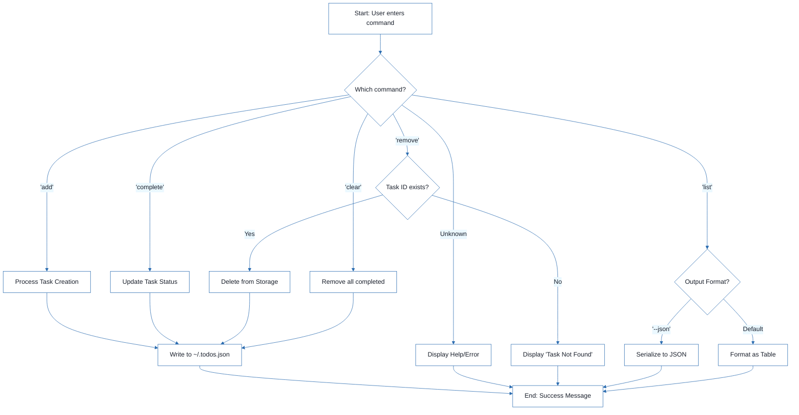
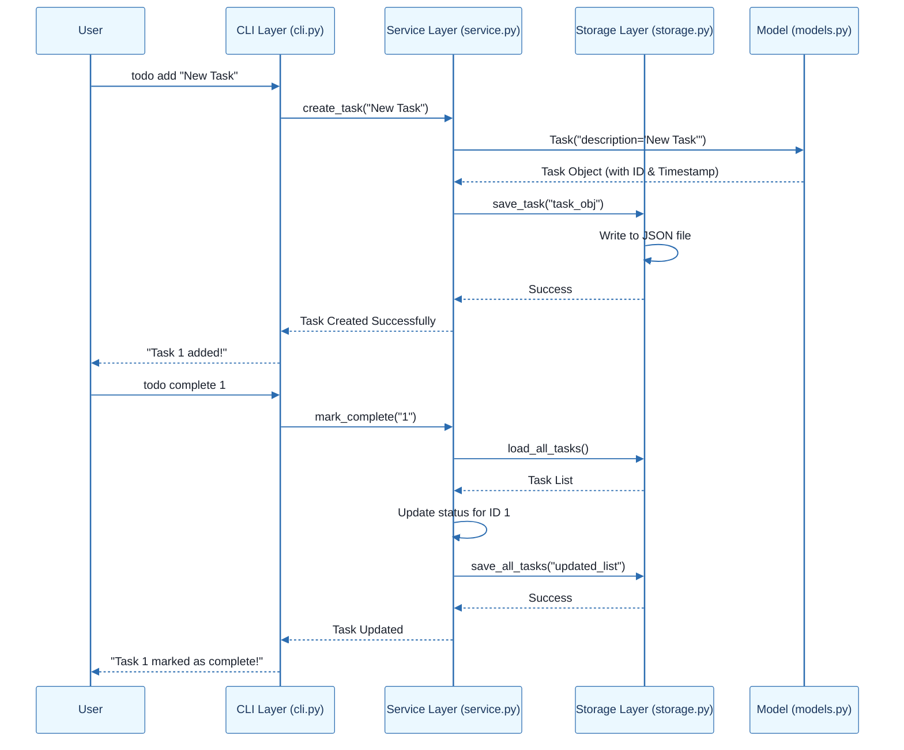

# CLI To-Do List Manager - Technical Specification & Architecture Document

## 1. Executive Summary & Architecture Overview

### 1.1 Executive Brief
The CLI To-Do List Manager is a Python-based command-line application designed for efficient task lifecycle management. The system utilizes a service-oriented architecture that strictly decouples the CLI presentation layer, the business logic (service layer), and the data persistence layer (JSON storage). This ensures that task creation, completion, listing, and removal are handled through a predictable and maintainable pipeline.

### 1.2 Maturity Assessment
The project is structurally sound with a high health index and a clear implementation roadmap. Core infrastructure and early user stories (US1, US2) are complete. The primary remaining gaps are the finalization of User Story 3 and the execution of the polish phase. While formal acceptance criteria and explicit security/performance constraints are absent, the project is deemed READY for final execution given the scope of a local CLI tool.

### 1.3 Technical Stack
* Python
* pyproject.toml (Project metadata & entry points)
* JSON (Persistence format)

### 1.4 Architectural Constraints
* **Persistence**: All data must be persisted in `~/.todos.json`.
* **Task Identity**: Mandatory sequential ID assignment for every new task.
* **Auditability**: Mandatory population of `created_at` timestamps upon task creation.
* **Interoperability**: JSON output via the `--json` flag must remain strictly parseable.
* **Execution Pipeline**: Strict linear dependency: Setup $\rightarrow$ Foundational $\rightarrow$ User Stories $\rightarrow$ Polish.
* **Blocking Gate**: The Foundational phase is a mandatory prerequisite for all feature implementation.

### 1.5 Critical Dependencies
* **File I/O**: Reliable read/write access to `~/.todos.json`.
* **CLI Configuration**: `pyproject.toml` for correct command-line entry point mapping.
* **Sequential Logic**: Phase 2 (Foundational) must be 100% complete before any User Story work.
* **Data Integrity**: Task serialization helpers in `models.py` are critical for both storage and JSON output.
* **Referential Integrity**: Removal and clear operations must ensure safe persistence without corrupting the JSON structure.

## 2. Architecture Workflows

```mermaid
%%{init: {
  'theme': 'base',
  'themeVariables': {
    'primaryColor': '#1A365D',
    'primaryTextColor': '#1A202C',
    'primaryBorderColor': '#2B6CB0',
    'lineColor': '#2B6CB0',
    'secondaryColor': '#EBF8FF',
    'tertiaryColor': '#EBF8FF',
    'background': '#FFFFFF',
    'mainBkg': '#FFFFFF',
    'secondBkg': '#EBF8FF',
    'tertiaryBkg': '#F7FAFC',
    'secondaryTextColor': '#4A5568',
    'fontSize': '16px',
    'fontFamily': 'Inter, system-ui, sans-serif',
    'nodePadding': '15px',
    'borderRadius': '8px',
    'edgeLabelBackground': '#EBF8FF',
    'clusterBkg': '#F7FAFC',
    'clusterBorder': '#2B6CB0',
    'defaultLinkColor': '#2B6CB0',
    'titleColor': '#1A365D',
    'actorBorder': '#2B6CB0',
    'actorBkg': '#EBF8FF',
    'actorTextColor': '#1A365D',
    'actorLineColor': '#2B6CB0',
    'signalColor': '#2B6CB0',
    'signalTextColor': '#1A202C',
    'labelBoxBorderColor': '#2B6CB0',
    'labelBoxBkgColor': '#EBF8FF',
    'labelTextColor': '#1A202C',
    'loopTextColor': '#1A202C',
    'arrowHeadColor': '#2B6CB0',
    'sequenceNumberColor': '#1A365D',
    'sequenceActorBorder': '#2B6CB0',
    'sequenceActorBkg': '#EBF8FF',
    'sequenceArrowColor': '#2B6CB0',
    'noteBkgColor': '#FFF5EB',
    'noteBorderColor': '#DD6B20',
    'noteTextColor': '#1A202C'
  }
}}%%
flowchart TD
    subgraph Setup_Phase [Phase 1: Setup]
        PHASE-1["PHASE-1: Setup (Shared Infrastructure)"]
    end
    subgraph Foundational_Phase [Phase 2: Foundational]
        PHASE-2["PHASE-2: Foundational (Blocking Prerequisites)"]
    end
    subgraph US1_Phase [Phase 3: User Story 1]
        PHASE-3["PHASE-3: User Story 1 - Add and Manage Tasks"]
        T009["T009: Implement add command"] --> PHASE-3
        T010["T010: Implement task creation"] --> PHASE-3
        T011["T011: Implement completion updates"] --> PHASE-3
        T012["T012: Add success/error messages"] --> PHASE-3
    end
    subgraph US2_Phase [Phase 4: User Story 2]
        PHASE-4["PHASE-4: User Story 2 - View and Filter Tasks"]
        T013["T013: Implement human-readable list"] --> PHASE-4
        T014["T014: Implement JSON output"] --> PHASE-4
        T015["T015: Add listing logic"] --> PHASE-4
        T016["T016: Handle empty-list case"] --> PHASE-4
    end
    subgraph US3_Phase [Phase 5: User Story 3]
        PHASE-5["PHASE-5: User Story 3 - Remove and Clear Tasks"]
        T017["T017: Implement remove command"] --> PHASE-5
        T018["T018: Implement clear command"] --> PHASE-5
        T019["T019: Add not-found handling"] --> PHASE-5
        T020["T020: Ensure storage persistence"] --> PHASE-5
    end
    subgraph Polish_Phase [Phase 6: Polish]
        PHASE-6["PHASE-6: Polish & Cross-Cutting Concerns"]
    end
    PHASE-2 -->|"depends_on"| PHASE-1
    PHASE-3 -->|"depends_on"| PHASE-2
    PHASE-4 -->|"depends_on"| PHASE-2
    PHASE-5 -->|"depends_on"| PHASE-2
    PHASE-6 -->|"depends_on"| PHASE-3
    PHASE-6 -->|"depends_on"| PHASE-4
    PHASE-6 -->|"depends_on"| PHASE-5
```





```mermaid
%%{init: {
  'theme': 'base',
  'themeVariables': {
    'primaryColor': '#1A365D',
    'primaryTextColor': '#1A202C',
    'primaryBorderColor': '#2B6CB0',
    'lineColor': '#2B6CB0',
    'secondaryColor': '#EBF8FF',
    'tertiaryColor': '#EBF8FF',
    'background': '#FFFFFF',
    'mainBkg': '#FFFFFF',
    'secondBkg': '#EBF8FF',
    'tertiaryBkg': '#F7FAFC',
    'secondaryTextColor': '#4A5568',
    'fontSize': '16px',
    'fontFamily': 'Inter, system-ui, sans-serif',
    'nodePadding': '15px',
    'borderRadius': '8px',
    'edgeLabelBackground': '#EBF8FF',
    'clusterBkg': '#F7FAFC',
    'clusterBorder': '#2B6CB0',
    'defaultLinkColor': '#2B6CB0',
    'titleColor': '#1A365D',
    'actorBorder': '#2B6CB0',
    'actorBkg': '#EBF8FF',
    'actorTextColor': '#1A365D',
    'actorLineColor': '#2B6CB0',
    'signalColor': '#2B6CB0',
    'signalTextColor': '#1A202C',
    'labelBoxBorderColor': '#2B6CB0',
    'labelBoxBkgColor': '#EBF8FF',
    'labelTextColor': '#1A202C',
    'loopTextColor': '#1A202C',
    'arrowHeadColor': '#2B6CB0',
    'sequenceNumberColor': '#1A365D',
    'sequenceActorBorder': '#2B6CB0',
    'sequenceActorBkg': '#EBF8FF',
    'sequenceArrowColor': '#2B6CB0',
    'noteBkgColor': '#FFF5EB',
    'noteBorderColor': '#DD6B20',
    'noteTextColor': '#1A202C'
  }
}}%%
sequenceDiagram
    participant User
    participant CLI as CLI Layer (cli.py)
    participant SVC as Service Layer (service.py)
    participant STG as Storage Layer (storage.py)
    participant MDL as Model (models.py)
    User->>CLI: todo add "New Task"
    CLI->>SVC: create_task("New Task")
    SVC->>MDL: Task("description='New Task'")
    MDL-->>SVC: Task Object (with ID & Timestamp)
    SVC->>STG: save_task("task_obj")
    STG->>STG: Write to JSON file
    STG-->>SVC: Success
    SVC-->>CLI: Task Created Successfully
    CLI-->>User: "Task 1 added!"
    User->>CLI: todo complete 1
    CLI->>SVC: mark_complete("1")
    SVC->>STG: load_all_tasks()
    STG-->>SVC: Task List
    SVC->>SVC: Update status for ID 1
    SVC->>STG: save_all_tasks("updated_list")
    STG-->>SVC: Success
    SVC-->>CLI: Task Updated
    CLI-->>User: "Task 1 marked as complete!"
``` & Visual Diagrams

### 2.1 Project Implementation Roadmap & Traceability
```mermaid
%%{init: {
  'theme': 'base',
  'themeVariables': {
    'primaryColor': '#1A365D',
    'primaryTextColor': '#1A202C',
    'primaryBorderColor': '#2B6CB0',
    'lineColor': '#2B6CB0',
    'secondaryColor': '#EBF8FF',
    'tertiaryColor': '#EBF8FF',
    'background': '#FFFFFF',
    'mainBkg': '#FFFFFF',
    'secondBkg': '#EBF8FF',
    'tertiaryBkg': '#F7FAFC',
    'secondaryTextColor': '#4A5568',
    'fontSize': '16px',
    'fontFamily': 'Inter, system-ui, sans-serif',
    'nodePadding': '15px',
    'borderRadius': '8px',
    'edgeLabelBackground': '#EBF8FF',
    'clusterBkg': '#F7FAFC',
    'clusterBorder': '#2B6CB0',
    'defaultLinkColor': '#2B6CB0',
    'titleColor': '#1A365D',
    'actorBorder': '#2B6CB0',
    'actorBkg': '#EBF8FF',
    'actorTextColor': '#1A365D',
    'actorLineColor': '#2B6CB0',
    'signalColor': '#2B6CB0',
    'signalTextColor': '#1A202C',
    'labelBoxBorderColor': '#2B6CB0',
    'labelBoxBkgColor': '#EBF8FF',
    'labelTextColor': '#1A202C',
    'loopTextColor': '#1A202C',
    'arrowHeadColor': '#2B6CB0',
    'sequenceNumberColor': '#1A365D',
    'sequenceActorBorder': '#2B6CB0',
    'sequenceActorBkg': '#EBF8FF',
    'sequenceArrowColor': '#2B6CB0',
    'noteBkgColor': '#FFF5EB',
    'noteBorderColor': '#DD6B20',
    'noteTextColor': '#1A202C'
  }
}}%%
flowchart TD
    subgraph Setup_Phase [Phase 1: Setup]
        PHASE-1["PHASE-1: Setup (Shared Infrastructure)"]
    end
    subgraph Foundational_Phase [Phase 2: Foundational]
        PHASE-2["PHASE-2: Foundational (Blocking Prerequisites)"]
    end
    subgraph US1_Phase [Phase 3: User Story 1]
        PHASE-3["PHASE-3: User Story 1 - Add and Manage Tasks"]
        T009["T009: Implement add command"] --> PHASE-3
        T010["T010: Implement task creation"] --> PHASE-3
        T011["T011: Implement completion updates"] --> PHASE-3
        T012["T012: Add success/error messages"] --> PHASE-3
    end
    subgraph US2_Phase [Phase 4: User Story 2]
        PHASE-4["PHASE-4: User Story 2 - View and Filter Tasks"]
        T013["T013: Implement human-readable list"] --> PHASE-4
        T014["T014: Implement JSON output"] --> PHASE-4
        T015["T015: Add listing logic"] --> PHASE-4
        T016["T016: Handle empty-list case"] --> PHASE-4
    end
    subgraph US3_Phase [Phase 5: User Story 3]
        PHASE-5["PHASE-5: User Story 3 - Remove and Clear Tasks"]
        T017["T017: Implement remove command"] --> PHASE-5
        T018["T018: Implement clear command"] --> PHASE-5
        T019["T019: Add not-found handling"] --> PHASE-5
        T020["T020: Ensure storage persistence"] --> PHASE-5
    end
    subgraph Polish_Phase [Phase 6: Polish]
        PHASE-6["PHASE-6: Polish & Cross-Cutting Concerns"]
    end
    PHASE-2 -->|"depends_on"| PHASE-1
    PHASE-3 -->|"depends_on"| PHASE-2
    PHASE-4 -->|"depends_on"| PHASE-2
    PHASE-5 -->|"depends_on"| PHASE-2
    PHASE-6 -->|"depends_on"| PHASE-3
    PHASE-6 -->|"depends_on"| PHASE-4
    PHASE-6 -->|"depends_on"| PHASE-5
```

### 2.2 CLI Command Execution Workflow


### 2.3 Task Management Sequence


## 3. Detailed Technical Specifications & Business Rules

### 3.1 Requirements Traceability
| ID | Requirement / Task Description | Source Phase | Status |
| :--- | :--- | :--- | :--- |
| T001 | Create Python package skeleton (`__init__.py`, `__main__.py`, `cli.py`, `models.py`, `storage.py`, `service.py`) | PHASE-1 | Completed |
| T002 | Create test directory structure (`tests/unit/`, `tests/integration/`) | PHASE-1 | Completed |
| T003 | Add project metadata and tooling entry points in `pyproject.toml` | PHASE-1 | Completed |
| T004 | Implement task entity definitions and serialization helpers in `models.py` | PHASE-2 | Completed |
| T005 | Implement JSON storage path resolution and file I/O helpers in `storage.py` | PHASE-2 | Completed |
| T006 | Implement shared command-line parsing and top-level dispatch in `cli.py` | PHASE-2 | Completed |
| T007 | Implement shared service-layer error handling and task collection utilities in `service.py` | PHASE-2 | Completed |
| T008 | Define module entry behavior for `python -m todo_manager` in `__main__.py` | PHASE-2 | Completed |
| T009 | Implement the `add` command flow in `cli.py` and `service.py` | PHASE-3 | Completed |
| T010 | Implement task creation, sequential ID assignment, and `created_at` population in `models.py` | PHASE-3 | Completed |
| T011 | Implement completion updates for existing tasks in `service.py` | PHASE-3 | Completed |
| T012 | Add user-facing success and error messages for add/complete in `cli.py` | PHASE-3 | Completed |
| T013 | Implement human-readable task listing output in `cli.py` | PHASE-4 | Completed |
| T014 | Implement `--json` output formatting in `cli.py` using `models.py` helpers | PHASE-4 | Completed |
| T015 | Add listing logic preserving task order and status fields in `service.py` | PHASE-4 | Completed |
| T016 | Handle the empty-list case with a clear message in `cli.py` | PHASE-4 | Completed |
| T017 | Implement the `remove` command flow in `cli.py` and `service.py` | PHASE-5 | Pending |
| T018 | Implement the `clear` command flow for removing completed tasks in `service.py` | PHASE-5 | Pending |
| T019 | Add not-found handling for invalid task IDs in `cli.py` | PHASE-5 | Pending |
| T020 | Ensure storage writes persist removals and clears safely in `storage.py` | PHASE-5 | Completed |
| T021 | Document CLI usage and storage behavior in `README.md` | PHASE-6 | Pending |
| T022 | Add quickstart verification notes and examples in `quickstart.md` | PHASE-6 | Pending |
| T023 | Run manual smoke test of all commands against `~/.todos.json` | PHASE-6 | Pending |
| T024 | Verify linting and formatting expectations for `src/todo_manager/` | PHASE-6 | Pending |
| T025 | Confirm generated JSON output remains parseable for `todo list --json` | PHASE-6 | Pending |
| TEST-US1 | Validation: `todo add` and `todo complete` reflect in stored list | PHASE-3 | N/A |
| TEST-US2 | Validation: `todo list` and `todo list --json` output correctness | PHASE-4 | N/A |
| TEST-US3 | Validation: `todo remove` and `todo clear` target correct entities | PHASE-5 | N/A |

### 3.2 Security Rules
* **Input Sanitization**: While not explicitly defined, the system must handle invalid task IDs (T019) to prevent application crashes.
* **File Permissions**: The application relies on the user's home directory permissions for `~/.todos.json`.

### 3.3 Data Models
* **Task Entity**:
    * `id`: Integer (Sequential, Unique)
    * `description`: String
    * `completed`: Boolean
    * `created_at`: Timestamp (ISO 8601)

## 4. Project Governance & Structural Gaps

### 4.1 Structural Gaps
| Gap | Priority | Remediation Advice |
| :--- | :--- | :--- |
| Acceptance Criteria | MEDIUM | While 'Independent Tests' exist, formal acceptance criteria per task would improve validation. |
| Security & Performance Constraints | LOW | Add constraints on maximum JSON file size or input string length sanitization. |
| Open Questions | LOW | No open questions were identified in the source documentation. |

### 4.2 Remediation & Workflow
The project follows an incremental delivery model. The current workflow requires the completion of Phase 5 (User Story 3) followed by the comprehensive Polish phase (Phase 6) to ensure all cross-cutting concerns (documentation, linting, smoke tests) are addressed before final release.

## 5. Technical & Domain Glossary (Terminology Reference)

| Term | Category | Context Anchor | Project Definition |
| :--- | :--- | :--- | :--- |
| Checkpoint | TECHNICAL_STACK | PHASE-2 | A synchronization gate ensuring all blocking infrastructure is verified before parallel feature development commences. |
| Foundational | TECHNICAL_STACK | PHASE-2 | The core shared infrastructure layer containing serialization, storage resolution, and dispatch logic required by all subsequent features. |
| Goal | BUSINESS_DOMAIN | PHASE-3 | The high-level functional objective that a specific user story must satisfy to be considered complete. |
| ID | BUSINESS_DOMAIN | T010 | A sequential numeric identifier assigned to each task entity to enable unique referencing and targeted mutation. |
| JSON | TECHNICAL_STACK | T005 | The lightweight data-interchange format used for persistent storage in ~/.todos.json and for scriptable output. |
| MVP | BUSINESS_DOMAIN | PHASE-3 | The minimum viable product consisting of the ability to create and mark tasks as finished. |
| Organization | TECHNICAL_STACK | Tasks: CLI To-Do List Manager | The structural grouping of implementation units by user story to ensure independent testability. |
| Prerequisites | TECHNICAL_STACK | Tasks: CLI To-Do List Manager | The set of mandatory design documents including plan, spec, research, data-model, and command contracts. |
| README | TECHNICAL_STACK | T021 | The primary documentation file detailing command-line usage and persistence behavior. |
| Setup | TECHNICAL_STACK | PHASE-1 | The initial phase involving package skeleton creation, directory structuring, and pyproject.toml configuration. |
| T016 | TECHNICAL_STACK | T016 | The specific implementation unit responsible for providing a clear user message when the task collection is empty. |
| Tests | TECHNICAL_STACK | T002 | The verification suite organized into unit and integration directories, validated via quickstart smoke tests. |
| population in | BUSINESS_DOMAIN | T010 | The process of assigning the created_at timestamp during the instantiation of a new task entity. |
| todo clear | BUSINESS_DOMAIN | T018 | The operational command that purges all entities marked as finished from the persistent store. |
| todo list | BUSINESS_DOMAIN | T013 | The operational command that retrieves and displays all stored entities in either human-readable or machine-parseable formats. |
| ⚠️ CRITICAL | TECHNICAL_STACK | PHASE-2 | A blocking constraint indicating that no feature work can proceed until the foundational infrastructure is fully implemented. |