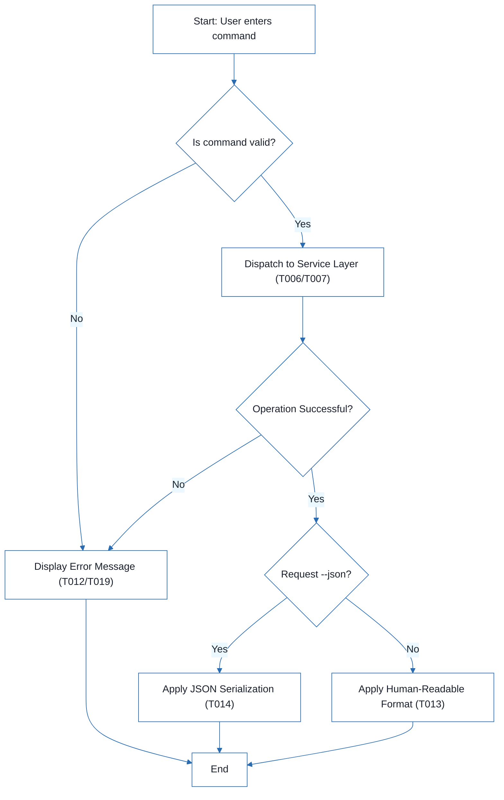

# CLI To-Do List Manager - Technical Specification & Architecture Document

## 1. Executive Summary & Architecture Overview

### 1.1 Executive Brief
The project is a Python-based CLI To-Do List Manager utilizing a JSON-based flat-file storage system for persistence. It implements a modular architecture separating the CLI entry point, service-layer logic, and data models. The system provides core task lifecycle management including creation, status updates, sequential ID assignment, and filtering via human-readable or JSON outputs.

### 1.2 Maturity Assessment
The specification is highly stable and structurally sound, reflecting a state of READY for execution. While there are medium-severity gaps regarding the formalization of Acceptance Criteria and low-severity omissions in security/performance constraints, the presence of explicit 'Independent Tests' for every user story provides sufficient functional coverage to proceed without further refinement.

### 1.3 Technical Stack
* Python
* pyproject.toml

### 1.4 Architectural Constraints
* **Strict sequential execution**: Phase 2 (Foundational) must be complete before any User Story implementation begins.
* **Storage pattern**: JSON file I/O for persistence located at `~/.todos.json`.
* **Data integrity**: Sequential ID assignment and mandatory `created_at` timestamp population during task creation.
* **Output requirements**: Dual-mode listing (Human-readable and parseable JSON via `--json` flag).
* **Ordering constraint**: Preservation of task order and status fields during listing operations.
* **Error handling**: Mandatory not-found handling for invalid task IDs.

### 1.5 Critical Dependencies
* JSON storage path resolution and file I/O helpers in `src/todo_manager/storage.py`.
* Task entity definitions and serialization helpers in `src/todo_manager/models.py`.
* Service-layer error handling and task collection utilities in `src/todo_manager/service.py`.
* Referential integrity between CLI command flow and service-layer logic.
* Dependency of Phase 6 (Polish) on the completion of all preceding User Stories (US1, US2, US3).

## 2. Architecture Workflows

```mermaid
%%{init: {
  'theme': 'base',
  'themeVariables': {
    'primaryColor': '#1A365D',
    'primaryTextColor': '#1A202C',
    'primaryBorderColor': '#2B6CB0',
    'lineColor': '#2B6CB0',
    'secondaryColor': '#EBF8FF',
    'tertiaryColor': '#EBF8FF',
    'background': '#FFFFFF',
    'mainBkg': '#FFFFFF',
    'secondBkg': '#EBF8FF',
    'tertiaryBkg': '#F7FAFC',
    'secondaryTextColor': '#4A5568',
    'fontSize': '16px',
    'fontFamily': 'Inter, system-ui, sans-serif',
    'nodePadding': '15px',
    'borderRadius': '8px',
    'edgeLabelBackground': '#EBF8FF',
    'clusterBkg': '#F7FAFC',
    'clusterBorder': '#2B6CB0',
    'defaultLinkColor': '#2B6CB0',
    'titleColor': '#1A365D',
    'actorBorder': '#2B6CB0',
    'actorBkg': '#EBF8FF',
    'actorTextColor': '#1A365D',
    'actorLineColor': '#2B6CB0',
    'signalColor': '#2B6CB0',
    'signalTextColor': '#1A202C',
    'labelBoxBorderColor': '#2B6CB0',
    'labelBoxBkgColor': '#EBF8FF',
    'labelTextColor': '#1A202C',
    'loopTextColor': '#1A202C',
    'arrowHeadColor': '#2B6CB0',
    'sequenceNumberColor': '#1A365D',
    'sequenceActorBorder': '#2B6CB0',
    'sequenceActorBkg': '#EBF8FF',
    'sequenceArrowColor': '#2B6CB0',
    'noteBkgColor': '#FFF5EB',
    'noteBorderColor': '#DD6B20',
    'noteTextColor': '#1A202C'
  }
}}%%
flowchart TD
  subgraph S1 ["Phase 1: Setup"]
    PHASE-1["PHASE-1: Setup (Shared Infrastructure)"]
    T001["T001: Package Skeleton"]
    T002["T002: Test Structure"]
    T003["T003: Project Metadata"]
    PHASE-1 --> T001
    PHASE-1 --> T002
    PHASE-1 --> T003
  end
  subgraph S2 ["Phase 2: Foundational"]
    PHASE-2["PHASE-2: Foundational (Blocking Prerequisites)"]
    T004["T004: Entity Definitions"]
    T005["T005: JSON Storage I/O"]
    T006["T006: CLI Parsing"]
    T007["T007: Service Error Handling"]
    T008["T008: Module Entry"]
    PHASE-2 --> T004
    PHASE-2 --> T005
    PHASE-2 --> T006
    PHASE-2 --> T007
    PHASE-2 --> T008
  end
  subgraph S3 ["Phase 3: US1 - Add/Manage"]
    PHASE-3["PHASE-3: User Story 1"]
    T009["T009: Add Command Flow"]
    T010["T010: Task Creation Logic"]
    T011["T011: Completion Updates"]
    T012["T012: User Messaging"]
    PHASE-3 --> T009
    PHASE-3 --> T010
    PHASE-3 --> T011
    PHASE-3 --> T012
  end
  subgraph S4 ["Phase 4: US2 - View/Filter"]
    PHASE-4["PHASE-4: User Story 2"]
    T013["T013: Human-Readable List"]
    T014["T014: JSON Output Formatting"]
    T015["T015: Listing Logic"]
    T016["T016: Empty-List Handling"]
    PHASE-4 --> T013
    PHASE-4 --> T014
    PHASE-4 --> T015
    PHASE-4 --> T016
  end
  subgraph S5 ["Phase 5: US3 - Remove/Clear"]
    PHASE-5["PHASE-5: User Story 3"]
    T017["T017: Remove Command Flow"]
    T018["T018: Clear Completed Flow"]
    T019["T019: Not-Found Handling"]
    T020["T020: Storage Persistence"]
    PHASE-5 --> T017
    PHASE-5 --> T018
    PHASE-5 --> T019
    PHASE-5 --> T020
  end
  subgraph S6 ["Phase 6: Polish"]
    PHASE-6["PHASE-6: Polish & Cross-Cutting"]
    T021["T021: Documentation"]
    T022["T022: Quickstart Notes"]
    T023["T023: Smoke Tests"]
    T024["T024: Linting/Formatting"]
    T025["T025: JSON Parse Validation"]
    PHASE-6 --> T021
    PHASE-6 --> T022
    PHASE-6 --> T023
    PHASE-6 --> T024
    PHASE-6 --> T025
  end
  PHASE-1 --> PHASE-2
  PHASE-2 --> PHASE-3
  PHASE-2 --> PHASE-4
  PHASE-2 --> PHASE-5
  PHASE-3 --> PHASE-6
  PHASE-4 --> PHASE-6
  PHASE-5 --> PHASE-6
  T014 --> T004
```



```mermaid
%%{init: {
  'theme': 'base',
  'themeVariables': {
    'primaryColor': '#1A365D',
    'primaryTextColor': '#1A202C',
    'primaryBorderColor': '#2B6CB0',
    'lineColor': '#2B6CB0',
    'secondaryColor': '#EBF8FF',
    'tertiaryColor': '#EBF8FF',
    'background': '#FFFFFF',
    'mainBkg': '#FFFFFF',
    'secondBkg': '#EBF8FF',
    'tertiaryBkg': '#F7FAFC',
    'secondaryTextColor': '#4A5568',
    'fontSize': '16px',
    'fontFamily': 'Inter, system-ui, sans-serif',
    'nodePadding': '15px',
    'borderRadius': '8px',
    'edgeLabelBackground': '#EBF8FF',
    'clusterBkg': '#F7FAFC',
    'clusterBorder': '#2B6CB0',
    'defaultLinkColor': '#2B6CB0',
    'titleColor': '#1A365D',
    'actorBorder': '#2B6CB0',
    'actorBkg': '#EBF8FF',
    'actorTextColor': '#1A365D',
    'actorLineColor': '#2B6CB0',
    'signalColor': '#2B6CB0',
    'signalTextColor': '#1A202C',
    'labelBoxBorderColor': '#2B6CB0',
    'labelBoxBkgColor': '#EBF8FF',
    'labelTextColor': '#1A202C',
    'loopTextColor': '#1A202C',
    'arrowHeadColor': '#2B6CB0',
    'sequenceNumberColor': '#1A365D',
    'sequenceActorBorder': '#2B6CB0',
    'sequenceActorBkg': '#EBF8FF',
    'sequenceArrowColor': '#2B6CB0',
    'noteBkgColor': '#FFF5EB',
    'noteBorderColor': '#DD6B20',
    'noteTextColor': '#1A202C'
  }
}}%%
flowchart TD
  START["Start: User enters command"] --> CMD_PARSE{"Is command valid?"}
  CMD_PARSE -- "No" --> ERR_MSG["Display Error Message (T012/T019)"]
  ERR_MSG --> END["End"]
  CMD_PARSE -- "Yes" --> SERVICE_CALL["Dispatch to Service Layer (T006/T007)"]
  SERVICE_CALL --> DATA_OP{"Operation Successful?"}
  DATA_OP -- "No" --> ERR_MSG
  DATA_OP -- "Yes" --> OUT_TYPE{"Request --json?"}
  OUT_TYPE -- "Yes" --> JSON_FMT["Apply JSON Serialization (T014)"]
  OUT_TYPE -- "No" --> HUMAN_FMT["Apply Human-Readable Format (T013)"]
  JSON_FMT --> END
  HUMAN_FMT --> END
``` & Visual Diagrams

### 2.1 Project Implementation Roadmap & Traceability
```mermaid
%%{init: {
  'theme': 'base',
  'themeVariables': {
    'primaryColor': '#1A365D',
    'primaryTextColor': '#1A202C',
    'primaryBorderColor': '#2B6CB0',
    'lineColor': '#2B6CB0',
    'secondaryColor': '#EBF8FF',
    'tertiaryColor': '#EBF8FF',
    'background': '#FFFFFF',
    'mainBkg': '#FFFFFF',
    'secondBkg': '#EBF8FF',
    'tertiaryBkg': '#F7FAFC',
    'secondaryTextColor': '#4A5568',
    'fontSize': '16px',
    'fontFamily': 'Inter, system-ui, sans-serif',
    'nodePadding': '15px',
    'borderRadius': '8px',
    'edgeLabelBackground': '#EBF8FF',
    'clusterBkg': '#F7FAFC',
    'clusterBorder': '#2B6CB0',
    'defaultLinkColor': '#2B6CB0',
    'titleColor': '#1A365D',
    'actorBorder': '#2B6CB0',
    'actorBkg': '#EBF8FF',
    'actorTextColor': '#1A365D',
    'actorLineColor': '#2B6CB0',
    'signalColor': '#2B6CB0',
    'signalTextColor': '#1A202C',
    'labelBoxBorderColor': '#2B6CB0',
    'labelBoxBkgColor': '#EBF8FF',
    'labelTextColor': '#1A202C',
    'loopTextColor': '#1A202C',
    'arrowHeadColor': '#2B6CB0',
    'sequenceNumberColor': '#1A365D',
    'sequenceActorBorder': '#2B6CB0',
    'sequenceActorBkg': '#EBF8FF',
    'sequenceArrowColor': '#2B6CB0',
    'noteBkgColor': '#FFF5EB',
    'noteBorderColor': '#DD6B20',
    'noteTextColor': '#1A202C'
  }
}}%%
flowchart TD
  subgraph S1 ["Phase 1: Setup"]
    PHASE-1["PHASE-1: Setup (Shared Infrastructure)"]
    T001["T001: Package Skeleton"]
    T002["T002: Test Structure"]
    T003["T003: Project Metadata"]
    PHASE-1 --> T001
    PHASE-1 --> T002
    PHASE-1 --> T003
  end
  subgraph S2 ["Phase 2: Foundational"]
    PHASE-2["PHASE-2: Foundational (Blocking Prerequisites)"]
    T004["T004: Entity Definitions"]
    T005["T005: JSON Storage I/O"]
    T006["T006: CLI Parsing"]
    T007["T007: Service Error Handling"]
    T008["T008: Module Entry"]
    PHASE-2 --> T004
    PHASE-2 --> T005
    PHASE-2 --> T006
    PHASE-2 --> T007
    PHASE-2 --> T008
  end
  subgraph S3 ["Phase 3: US1 - Add/Manage"]
    PHASE-3["PHASE-3: User Story 1"]
    T009["T009: Add Command Flow"]
    T010["T010: Task Creation Logic"]
    T011["T011: Completion Updates"]
    T012["T012: User Messaging"]
    PHASE-3 --> T009
    PHASE-3 --> T010
    PHASE-3 --> T011
    PHASE-3 --> T012
  end
  subgraph S4 ["Phase 4: US2 - View/Filter"]
    PHASE-4["PHASE-4: User Story 2"]
    T013["T013: Human-Readable List"]
    T014["T014: JSON Output Formatting"]
    T015["T015: Listing Logic"]
    T016["T016: Empty-List Handling"]
    PHASE-4 --> T013
    PHASE-4 --> T014
    PHASE-4 --> T015
    PHASE-4 --> T016
  end
  subgraph S5 ["Phase 5: US3 - Remove/Clear"]
    PHASE-5["PHASE-5: User Story 3"]
    T017["T017: Remove Command Flow"]
    T018["T018: Clear Completed Flow"]
    T019["T019: Not-Found Handling"]
    T020["T020: Storage Persistence"]
    PHASE-5 --> T017
    PHASE-5 --> T018
    PHASE-5 --> T019
    PHASE-5 --> T020
  end
  subgraph S6 ["Phase 6: Polish"]
    PHASE-6["PHASE-6: Polish & Cross-Cutting"]
    T021["T021: Documentation"]
    T022["T022: Quickstart Notes"]
    T023["T023: Smoke Tests"]
    T024["T024: Linting/Formatting"]
    T025["T025: JSON Parse Validation"]
    PHASE-6 --> T021
    PHASE-6 --> T022
    PHASE-6 --> T023
    PHASE-6 --> T024
    PHASE-6 --> T025
  end
  PHASE-1 --> PHASE-2
  PHASE-2 --> PHASE-3
  PHASE-2 --> PHASE-4
  PHASE-2 --> PHASE-5
  PHASE-3 --> PHASE-6
  PHASE-4 --> PHASE-6
  PHASE-5 --> PHASE-6
  T014 --> T004
```

### 2.2 CLI Command Execution Workflow


## 3. Detailed Technical Specifications & Business Rules

### 3.1 Requirements Traceability
| ID | Requirement / Task Description | Source Section | Status |
| :--- | :--- | :--- | :--- |
| T001 | Create the Python package skeleton in src/todo_manager/ | Phase 1: Setup | completed |
| T002 | Create the test directory structure in tests/unit/ and tests/integration/ | Phase 1: Setup | completed |
| T003 | Add project metadata and tooling entry points in pyproject.toml | Phase 1: Setup | completed |
| T004 | Implement task entity definitions and serialization helpers in src/todo_manager/models.py | Phase 2: Foundational | completed |
| T005 | Implement JSON storage path resolution and file I/O helpers in src/todo_manager/storage.py | Phase 2: Foundational | completed |
| T006 | Implement shared command-line parsing and top-level dispatch in src/todo_manager/cli.py | Phase 2: Foundational | completed |
| T007 | Implement shared service-layer error handling and task collection utilities in src/todo_manager/service.py | Phase 2: Foundational | completed |
| T008 | Define module entry behavior for python -m todo_manager in src/todo_manager/__main__.py | Phase 2: Foundational | completed |
| T009 | Implement the add command flow in src/todo_manager/cli.py and src/todo_manager/service.py | Implementation for User Story 1 | completed |
| T010 | Implement task creation, sequential ID assignment, and created_at population in src/todo_manager/models.py | Implementation for User Story 1 | completed |
| T011 | Implement completion updates for existing tasks in src/todo_manager/service.py | Implementation for User Story 1 | completed |
| T012 | Add user-facing success and error messages for add and complete operations in src/todo_manager/cli.py | Implementation for User Story 1 | completed |
| T013 | Implement human-readable task listing output in src/todo_manager/cli.py | Implementation for User Story 2 | completed |
| T014 | Implement --json output formatting in src/todo_manager/cli.py | Implementation for User Story 2 | completed |
| T015 | Add listing logic that preserves task order and status fields in src/todo_manager/service.py | Implementation for User Story 2 | completed |
| T016 | Handle the empty-list case with a clear message in src/todo_manager/cli.py | Implementation for User Story 2 | completed |
| T017 | Implement the remove command flow in src/todo_manager/cli.py and src/todo_manager/service.py | Implementation for User Story 3 | pending |
| T018 | Implement the clear command flow for removing completed tasks in src/todo_manager/service.py | Implementation for User Story 3 | pending |
| T019 | Add not-found handling for invalid task IDs in src/todo_manager/cli.py | Implementation for User Story 3 | completed |
| T020 | Ensure storage writes persist removals and clears safely in src/todo_manager/storage.py | Implementation for User Story 3 | completed |
| T021 | Document the CLI usage and storage behavior in README.md | Phase 6: Polish | pending |
| T022 | Add quickstart verification notes and examples in specs/001-cli-todo-manager/quickstart.md | Phase 6: Polish | pending |
| T023 | Run a manual smoke test of add, list, complete, remove, and clear against ~/.todos.json | Phase 6: Polish | pending |
| T024 | Verify linting and formatting expectations for the source files in src/todo_manager/ | Phase 6: Polish | pending |
| T025 | Confirm the generated JSON output remains parseable for the todo list --json path | Phase 6: Polish | pending |
| CRIT-FOUNDATION | No user story work can begin until Phase 2 is complete | Phase 2: Foundational | N/A |

### 3.2 Security Rules
* **File Access**: JSON storage is located at `~/.todos.json`. Access is governed by the operating system's user-level file permissions.
* **Input Validation**: Command-line arguments must be parsed and validated via the CLI dispatch layer (T006) before being passed to the service layer.

### 3.3 Data Models
* **Task Entity**: Defined in `src/todo_manager/models.py`.
* **Attributes**:
    * `id`: Unique sequential alphanumeric token.
    * `created_at`: Automatic timestamp population upon instantiation.
    * `status`: Completion state.
* **Persistence**: Flat-file JSON serialization.

## 4. Project Governance & Structural Gaps

### 4.1 Structural Gaps
| Gap | Priority | Remediation Advice |
| :--- | :--- | :--- |
| Acceptance Criteria | MEDIUM | The document contains 'Independent Tests' for each story; these should be formalized into a dedicated Acceptance Criteria section. |
| Security & Performance Constraints | LOW | Define constraints for JSON file access permissions or maximum task list sizes. |
| Open Questions & Uncertainties | LOW | No uncertainties were listed in the task document. |

### 4.2 Remediation & Workflow
The project follows an incremental delivery model:
1. **Setup & Foundational**: Establish the core infrastructure.
2. **User Story Implementation**: Execute US1 (MVP), then US2, then US3.
3. **Validation**: Each story is validated via its specific "Independent Test" before proceeding.
4. **Polish**: Final smoke tests and documentation.

## 5. Technical & Domain Glossary (Terminology Reference)

| Term | Category | Context Anchor | Project Definition |
| :--- | :--- | :--- | :--- |
| Checkpoint | TECHNICAL_STACK | PHASE-2 | A synchronization gate ensuring all prerequisites are satisfied before concurrent development of functional requirements commences. |
| Foundational | TECHNICAL_STACK | PHASE-2 | The architectural base layer consisting of shared utilities, entity definitions, and core I/O logic that blocks all subsequent user story implementation. |
| Goal | BUSINESS_DOMAIN | PHASE-3 | The specific operational outcome a user must achieve via the interface to satisfy a functional requirement. |
| ID | TECHNICAL_STACK | T010 | A unique, sequential alphanumeric token assigned to each record for precise targeting and retrieval. |
| JSON | TECHNICAL_STACK | T005 | The lightweight data-interchange format used for persistent storage and machine-readable output. |
| MVP | BUSINESS_DOMAIN | PHASE-3 | The minimum viable set of capabilities, specifically add and complete operations, required for the first functional validation. |
| Organization | BUSINESS_DOMAIN | Tasks: CLI To-Do List Manager | The method of grouping development efforts by user story to ensure independent implementability and verification. |
| Prerequisites | TECHNICAL_STACK | Tasks: CLI To-Do List Manager | The set of required design and contract documents that must be analyzed before executing the implementation plan. |
| README | TECHNICAL_STACK | T021 | The primary documentation file detailing interface usage and persistence behavior for end-users. |
| Setup | TECHNICAL_STACK | PHASE-1 | The initial phase of creating the package skeleton, directory structures, and build configuration. |
| T016 | TECHNICAL_STACK | T016 | The specific implementation unit responsible for providing a clear interface message when the task collection is empty. |
| Tests | TECHNICAL_STACK | T002 | The validation framework comprising unit and integration directory structures for verifying system behavior. |
| population in | TECHNICAL_STACK | T010 | The automatic assignment of timestamp values to the creation field during record instantiation. |
| todo clear | BUSINESS_DOMAIN | T018 | The operation of purging all records marked as finished from the persistent store. |
| todo list | BUSINESS_DOMAIN | T013 | The operation of retrieving and displaying all records in either human-readable or structured formats. |
| ⚠️ CRITICAL | TECHNICAL_STACK | CRIT-FOUNDATION | A strict dependency constraint prohibiting any functional development until the shared infrastructure phase is verified. |