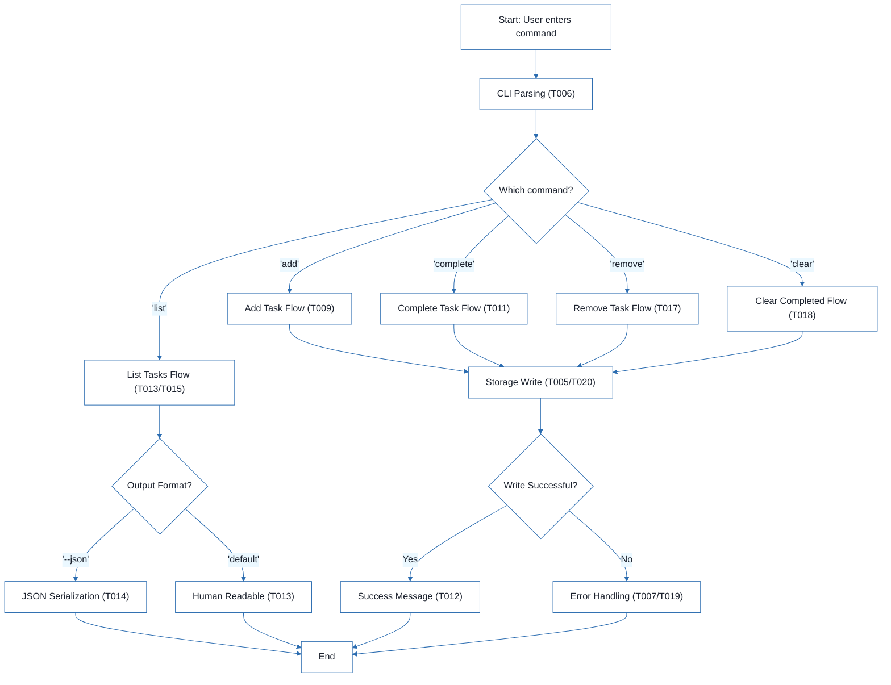

# CLI To-Do List Manager - Technical Specification & Architecture Document

## 1. Executive Summary & Architecture Overview

### 1.1 Executive Brief
The CLI To-Do List Manager is a Python-based command-line application designed for efficient task management with persistent JSON-based storage. The system follows a layered architectural pattern consisting of a CLI dispatch layer for user interaction, a service-level logic layer for business rules, and a storage helper layer for data persistence. Core capabilities include task creation with sequential ID tracking, status updates, and dual-format (Human/JSON) listing.

### 1.2 Maturity Assessment
The project is logically structured with a high degree of foundational completeness. The implementation follows a strict phased approach (Setup $\rightarrow$ Foundational $\rightarrow$ User Stories $\rightarrow$ Polish). However, the absence of formalized acceptance criteria and explicit security/performance constraints for the JSON storage file necessitates a final validation pass. 
**Status: READY.**

### 1.3 Technical Stack
* **Languages & Frameworks**: 
    * Python
    * pyproject.toml (Tooling & Metadata)
* **Storage**: 
    * JSON (Flat-file persistence)

### 1.4 Architectural Constraints
* **Sequential ID Assignment**: Task entities must use sequential integers for identification.
* **Strict JSON Serialization**: Data persistence must adhere to strict JSON formatting to ensure consistency.
* **Layered Dependency**: Mandatory completion of the Foundational layer before any User Story implementation.
* **Output Consistency**: The `--json` flag must always produce parseable JSON output.
* **Storage Location**: Path resolution must target `~/.todos.json`.

### 1.5 Critical Dependencies
* **Persistence**: Reliance on the `~/.todos.json` file for all data state.
* **ID Integrity**: Sequential ID dependency for precise task identification.
* **Execution Flow**: Strict hierarchy: Setup $\rightarrow$ Foundational $\rightarrow$ User Stories $\rightarrow$ Polish.
* **Serialization Bridge**: Integration between `src/todo_manager/models.py` serialization and CLI output formatting.
* **Referential Integrity**: Maintenance of task IDs during `remove` and `complete` operations.

## 2. Architecture Workflows

```mermaid
%%{init: {
  'theme': 'base',
  'themeVariables': {
    'primaryColor': '#1A365D',
    'primaryTextColor': '#1A202C',
    'primaryBorderColor': '#2B6CB0',
    'lineColor': '#2B6CB0',
    'secondaryColor': '#EBF8FF',
    'tertiaryColor': '#EBF8FF',
    'background': '#FFFFFF',
    'mainBkg': '#FFFFFF',
    'secondBkg': '#EBF8FF',
    'tertiaryBkg': '#F7FAFC',
    'secondaryTextColor': '#4A5568',
    'fontSize': '16px',
    'fontFamily': 'Inter, system-ui, sans-serif',
    'nodePadding': '15px',
    'borderRadius': '8px',
    'edgeLabelBackground': '#EBF8FF',
    'clusterBkg': '#F7FAFC',
    'clusterBorder': '#2B6CB0',
    'defaultLinkColor': '#2B6CB0',
    'titleColor': '#1A365D',
    'actorBorder': '#2B6CB0',
    'actorBkg': '#EBF8FF',
    'actorTextColor': '#1A365D',
    'actorLineColor': '#2B6CB0',
    'signalColor': '#2B6CB0',
    'signalTextColor': '#1A202C',
    'labelBoxBorderColor': '#2B6CB0',
    'labelBoxBkgColor': '#EBF8FF',
    'labelTextColor': '#1A202C',
    'loopTextColor': '#1A202C',
    'arrowHeadColor': '#2B6CB0',
    'sequenceNumberColor': '#1A365D',
    'sequenceActorBorder': '#2B6CB0',
    'sequenceActorBkg': '#EBF8FF',
    'sequenceArrowColor': '#2B6CB0',
    'noteBkgColor': '#FFF5EB',
    'noteBorderColor': '#DD6B20',
    'noteTextColor': '#1A202C'
  }
}}%%
flowchart TD
    subgraph Setup_Phase ["Phase 1: Setup"]
        PHASE-1-SETUP["PHASE-1-SETUP: Project Initialization"]
        T001["T001: Package Skeleton"]
        T002["T002: Test Structure"]
        T003["T003: Project Metadata"]
        PHASE-1-SETUP --> T001
        PHASE-1-SETUP --> T002
        PHASE-1-SETUP --> T003
    end
    subgraph Foundational_Phase ["Phase 2: Foundational"]
        PHASE-2-FOUND["PHASE-2-FOUND: Shared Infrastructure"]
        T004["T004: Entity Definitions"]
        T005["T005: JSON Storage I/O"]
        T006["T006: CLI Parsing"]
        T007["T007: Service Error Handling"]
        T008["T008: Module Entry"]
        PHASE-2-FOUND --> T004
        PHASE-2-FOUND --> T005
        PHASE-2-FOUND --> T006
        PHASE-2-FOUND --> T007
        PHASE-2-FOUND --> T008
    end
    subgraph US1_Phase ["Phase 3: User Story 1"]
        PHASE-3-US1["PHASE-3-US1: Add & Manage Tasks"]
        T009["T009: Add Command Flow"]
        T010["T010: Task Creation Logic"]
        T011["T011: Completion Updates"]
        T012["T012: User Messages"]
        TEST-US1["TEST-US1: Add/Complete Validation"]
        PHASE-3-US1 --> T009
        PHASE-3-US1 --> T010
        PHASE-3-US1 --> T011
        PHASE-3-US1 --> T012
        PHASE-3-US1 --> TEST-US1
    end
    subgraph US2_Phase ["Phase 4: User Story 2"]
        PHASE-4-US2["PHASE-4-US2: View & Filter Tasks"]
        T013["T013: Human Readable List"]
        T014["T014: JSON Formatting"]
        T015["T015: Listing Logic"]
        T016["T016: Empty List Handling"]
        TEST-US2["TEST-US2: List/JSON Validation"]
        PHASE-4-US2 --> T013
        PHASE-4-US2 --> T014
        PHASE-4-US2 --> T015
        PHASE-4-US2 --> T016
        PHASE-4-US2 --> TEST-US2
    end
    subgraph US3_Phase ["Phase 5: User Story 3"]
        PHASE-5-US3["PHASE-5-US3: Remove & Clear Tasks"]
        T017["T017: Remove Command Flow"]
        T018["T018: Clear Completed Flow"]
        T019["T019: Not-Found Handling"]
        T020["T020: Storage Persistence"]
        TEST-US3["TEST-US3: Remove/Clear Validation"]
        PHASE-5-US3 --> T017
        PHASE-5-US3 --> T018
        PHASE-5-US3 --> T019
        PHASE-5-US3 --> T020
        PHASE-5-US3 --> TEST-US3
    end
    subgraph Polish_Phase ["Phase 6: Polish"]
        PHASE-6-POLISH["PHASE-6-POLISH: Final Cleanup"]
        T021["T021: README Documentation"]
        T022["T022: Quickstart Notes"]
        T023["T023: Manual Smoke Test"]
        T024["T024: Linting Verification"]
        T025["T025: JSON Parseability Check"]
        PHASE-6-POLISH --> T021
        PHASE-6-POLISH --> T022
        PHASE-6-POLISH --> T023
        PHASE-6-POLISH --> T024
        PHASE-6-POLISH --> T025
    end
    PHASE-2-FOUND -->|"depends_on"| PHASE-1-SETUP
    PHASE-3-US1 -->|"depends_on"| PHASE-2-FOUND
    PHASE-4-US2 -->|"depends_on"| PHASE-2-FOUND
    PHASE-5-US3 -->|"depends_on"| PHASE-2-FOUND
    PHASE-6-POLISH -->|"depends_on"| PHASE-3-US1
    PHASE-6-POLISH -->|"depends_on"| PHASE-4-US2
    PHASE-6-POLISH -->|"depends_on"| PHASE-5-US3
```



```mermaid
%%{init: {
  'theme': 'base',
  'themeVariables': {
    'primaryColor': '#1A365D',
    'primaryTextColor': '#1A202C',
    'primaryBorderColor': '#2B6CB0',
    'lineColor': '#2B6CB0',
    'secondaryColor': '#EBF8FF',
    'tertiaryColor': '#EBF8FF',
    'background': '#FFFFFF',
    'mainBkg': '#FFFFFF',
    'secondBkg': '#EBF8FF',
    'tertiaryBkg': '#F7FAFC',
    'secondaryTextColor': '#4A5568',
    'fontSize': '16px',
    'fontFamily': 'Inter, system-ui, sans-serif',
    'nodePadding': '15px',
    'borderRadius': '8px',
    'edgeLabelBackground': '#EBF8FF',
    'clusterBkg': '#F7FAFC',
    'clusterBorder': '#2B6CB0',
    'defaultLinkColor': '#2B6CB0',
    'titleColor': '#1A365D',
    'actorBorder': '#2B6CB0',
    'actorBkg': '#EBF8FF',
    'actorTextColor': '#1A365D',
    'actorLineColor': '#2B6CB0',
    'signalColor': '#2B6CB0',
    'signalTextColor': '#1A202C',
    'labelBoxBorderColor': '#2B6CB0',
    'labelBoxBkgColor': '#EBF8FF',
    'labelTextColor': '#1A202C',
    'loopTextColor': '#1A202C',
    'arrowHeadColor': '#2B6CB0',
    'sequenceNumberColor': '#1A365D',
    'sequenceActorBorder': '#2B6CB0',
    'sequenceActorBkg': '#EBF8FF',
    'sequenceArrowColor': '#2B6CB0',
    'noteBkgColor': '#FFF5EB',
    'noteBorderColor': '#DD6B20',
    'noteTextColor': '#1A202C'
  }
}}%%
flowchart TD
    START["Start: User enters command"] --> CLI_PARSE["CLI Parsing (T006)"]
    CLI_PARSE --> CMD_DEC{"Which command?"}
    CMD_DEC -->|"'add'"| US1_FLOW["Add Task Flow (T009)"]
    CMD_DEC -->|"'list'"| US2_FLOW["List Tasks Flow (T013/T015)"]
    CMD_DEC -->|"'complete'"| US1_COMP["Complete Task Flow (T011)"]
    CMD_DEC -->|"'remove'"| US3_REM["Remove Task Flow (T017)"]
    CMD_DEC -->|"'clear'"| US3_CLR["Clear Completed Flow (T018)"]
    US1_FLOW --> STORAGE_WRITE["Storage Write (T005/T020)"]
    US1_COMP --> STORAGE_WRITE
    US3_REM --> STORAGE_WRITE
    US3_CLR --> STORAGE_WRITE
    US2_FLOW --> FORMAT_DEC{"Output Format?"}
    FORMAT_DEC -->|"'--json'"| JSON_OUT["JSON Serialization (T014)"]
    FORMAT_DEC -->|"'default'"| HUMAN_OUT["Human Readable (T013)"]
    STORAGE_WRITE --> VALID_DEC{"Write Successful?"}
    VALID_DEC -->|"Yes"| SUCCESS_MSG["Success Message (T012)"]
    VALID_DEC -->|"No"| ERR_MSG["Error Handling (T007/T019)"]
    JSON_OUT --> END["End"]
    HUMAN_OUT --> END
    SUCCESS_MSG --> END
    ERR_MSG --> END
``` & Visual Diagrams

### 2.1 Project Implementation Traceability Map
This flowchart maps the dependency flow from initial setup through foundational layers to specific user story implementation and final polish.

```mermaid
%%{init: {
  'theme': 'base',
  'themeVariables': {
    'primaryColor': '#1A365D',
    'primaryTextColor': '#1A202C',
    'primaryBorderColor': '#2B6CB0',
    'lineColor': '#2B6CB0',
    'secondaryColor': '#EBF8FF',
    'tertiaryColor': '#EBF8FF',
    'background': '#FFFFFF',
    'mainBkg': '#FFFFFF',
    'secondBkg': '#EBF8FF',
    'tertiaryBkg': '#F7FAFC',
    'secondaryTextColor': '#4A5568',
    'fontSize': '16px',
    'fontFamily': 'Inter, system-ui, sans-serif',
    'nodePadding': '15px',
    'borderRadius': '8px',
    'edgeLabelBackground': '#EBF8FF',
    'clusterBkg': '#F7FAFC',
    'clusterBorder': '#2B6CB0',
    'defaultLinkColor': '#2B6CB0',
    'titleColor': '#1A365D',
    'actorBorder': '#2B6CB0',
    'actorBkg': '#EBF8FF',
    'actorTextColor': '#1A365D',
    'actorLineColor': '#2B6CB0',
    'signalColor': '#2B6CB0',
    'signalTextColor': '#1A202C',
    'labelBoxBorderColor': '#2B6CB0',
    'labelBoxBkgColor': '#EBF8FF',
    'labelTextColor': '#1A202C',
    'loopTextColor': '#1A202C',
    'arrowHeadColor': '#2B6CB0',
    'sequenceNumberColor': '#1A365D',
    'sequenceActorBorder': '#2B6CB0',
    'sequenceActorBkg': '#EBF8FF',
    'sequenceArrowColor': '#2B6CB0',
    'noteBkgColor': '#FFF5EB',
    'noteBorderColor': '#DD6B20',
    'noteTextColor': '#1A202C'
  }
}}%%
flowchart TD
    subgraph Setup_Phase ["Phase 1: Setup"]
        PHASE-1-SETUP["PHASE-1-SETUP: Project Initialization"]
        T001["T001: Package Skeleton"]
        T002["T002: Test Structure"]
        T003["T003: Project Metadata"]
        PHASE-1-SETUP --> T001
        PHASE-1-SETUP --> T002
        PHASE-1-SETUP --> T003
    end
    subgraph Foundational_Phase ["Phase 2: Foundational"]
        PHASE-2-FOUND["PHASE-2-FOUND: Shared Infrastructure"]
        T004["T004: Entity Definitions"]
        T005["T005: JSON Storage I/O"]
        T006["T006: CLI Parsing"]
        T007["T007: Service Error Handling"]
        T008["T008: Module Entry"]
        PHASE-2-FOUND --> T004
        PHASE-2-FOUND --> T005
        PHASE-2-FOUND --> T006
        PHASE-2-FOUND --> T007
        PHASE-2-FOUND --> T008
    end
    subgraph US1_Phase ["Phase 3: User Story 1"]
        PHASE-3-US1["PHASE-3-US1: Add & Manage Tasks"]
        T009["T009: Add Command Flow"]
        T010["T010: Task Creation Logic"]
        T011["T011: Completion Updates"]
        T012["T012: User Messages"]
        TEST-US1["TEST-US1: Add/Complete Validation"]
        PHASE-3-US1 --> T009
        PHASE-3-US1 --> T010
        PHASE-3-US1 --> T011
        PHASE-3-US1 --> T012
        PHASE-3-US1 --> TEST-US1
    end
    subgraph US2_Phase ["Phase 4: User Story 2"]
        PHASE-4-US2["PHASE-4-US2: View & Filter Tasks"]
        T013["T013: Human Readable List"]
        T014["T014: JSON Formatting"]
        T015["T015: Listing Logic"]
        T016["T016: Empty List Handling"]
        TEST-US2["TEST-US2: List/JSON Validation"]
        PHASE-4-US2 --> T013
        PHASE-4-US2 --> T014
        PHASE-4-US2 --> T015
        PHASE-4-US2 --> T016
        PHASE-4-US2 --> TEST-US2
    end
    subgraph US3_Phase ["Phase 5: User Story 3"]
        PHASE-5-US3["PHASE-5-US3: Remove & Clear Tasks"]
        T017["T017: Remove Command Flow"]
        T018["T018: Clear Completed Flow"]
        T019["T019: Not-Found Handling"]
        T020["T020: Storage Persistence"]
        TEST-US3["TEST-US3: Remove/Clear Validation"]
        PHASE-5-US3 --> T017
        PHASE-5-US3 --> T018
        PHASE-5-US3 --> T019
        PHASE-5-US3 --> T020
        PHASE-5-US3 --> TEST-US3
    end
    subgraph Polish_Phase ["Phase 6: Polish"]
        PHASE-6-POLISH["PHASE-6-POLISH: Final Cleanup"]
        T021["T021: README Documentation"]
        T022["T022: Quickstart Notes"]
        T023["T023: Manual Smoke Test"]
        T024["T024: Linting Verification"]
        T025["T025: JSON Parseability Check"]
        PHASE-6-POLISH --> T021
        PHASE-6-POLISH --> T022
        PHASE-6-POLISH --> T023
        PHASE-6-POLISH --> T024
        PHASE-6-POLISH --> T025
    end
    PHASE-2-FOUND -->|"depends_on"| PHASE-1-SETUP
    PHASE-3-US1 -->|"depends_on"| PHASE-2-FOUND
    PHASE-4-US2 -->|"depends_on"| PHASE-2-FOUND
    PHASE-5-US3 -->|"depends_on"| PHASE-2-FOUND
    PHASE-6-POLISH -->|"depends_on"| PHASE-3-US1
    PHASE-6-POLISH -->|"depends_on"| PHASE-4-US2
    PHASE-6-POLISH -->|"depends_on"| PHASE-5-US3
```

### 2.2 CLI Command Execution Workflow
This flowchart models the general business logic for processing a CLI command, including the decision path for different user story actions.



## 3. Detailed Technical Specifications & Business Rules

### 3.1 Requirements Traceability
The following table provides an exhaustive mapping of all atomic identifiers to their implementation content.

| ID | Description | Source Section | Status |
| :--- | :--- | :--- | :--- |
| T001 | Create the Python package skeleton in src/todo_manager/__init__.py, __main__.py, cli.py, models.py, storage.py, and service.py | Phase 1: Setup | Completed |
| T002 | Create the test directory structure in tests/unit/ and tests/integration/ | Phase 1: Setup | Completed |
| T003 | Add project metadata and tooling entry points in pyproject.toml | Phase 1: Setup | Completed |
| T004 | Implement task entity definitions and serialization helpers in src/todo_manager/models.py | Phase 2: Foundational | Completed |
| T005 | Implement JSON storage path resolution and file I/O helpers in src/todo_manager/storage.py | Phase 2: Foundational | Completed |
| T006 | Implement shared command-line parsing and top-level dispatch in src/todo_manager/cli.py | Phase 2: Foundational | Completed |
| T007 | Implement shared service-layer error handling and task collection utilities in src/todo_manager/service.py | Phase 2: Foundational | Completed |
| T008 | Define module entry behavior for python -m todo_manager in src/todo_manager/__main__.py | Phase 2: Foundational | Completed |
| T009 | Implement the add command flow in src/todo_manager/cli.py and src/todo_manager/service.py | Implementation for US1 | Completed |
| T010 | Implement task creation, sequential ID assignment, and created_at population in src/todo_manager/models.py | Implementation for US1 | Completed |
| T011 | Implement completion updates for existing tasks in src/todo_manager/service.py | Implementation for US1 | Completed |
| T012 | Add user-facing success and error messages for add and complete operations in src/todo_manager/cli.py | Implementation for US1 | Completed |
| T013 | Implement human-readable task listing output in src/todo_manager/cli.py | Implementation for US2 | Completed |
| T014 | Implement --json output formatting in src/todo_manager/cli.py using serialization helpers | Implementation for US2 | Completed |
| T015 | Add listing logic that preserves task order and status fields in src/todo_manager/service.py | Implementation for US2 | Completed |
| T016 | Handle the empty-list case with a clear message in src/todo_manager/cli.py | Implementation for US2 | Completed |
| T017 | Implement the remove command flow in src/todo_manager/cli.py and src/todo_manager/service.py | Implementation for US3 | Pending |
| T018 | Implement the clear command flow for removing completed tasks in src/todo_manager/service.py | Implementation for US3 | Completed |
| T019 | Add not-found handling for invalid task IDs in src/todo_manager/cli.py | Implementation for US3 | Completed |
| T020 | Ensure storage writes persist removals and clears safely in src/todo_manager/storage.py | Implementation for US3 | Completed |
| T021 | Document the CLI usage and storage behavior in README.md | Phase 6: Polish | Pending |
| T022 | Add quickstart verification notes and examples in specs/001-cli-todo-manager/quickstart.md | Phase 6: Polish | Pending |
| T023 | Run a manual smoke test of add, list, complete, remove, and clear against ~/.todos.json | Phase 6: Polish | Pending |
| T024 | Verify linting and formatting expectations for the source files in src/todo_manager/ | Phase 6: Polish | Pending |
| T025 | Confirm the generated JSON output remains parseable for the todo list --json path | Phase 6: Polish | Pending |
| TEST-US1 | Run `todo add "Task description"` and `todo complete <id>`, confirm stored task list reflects the new task and status. | Phase 3: US1 | N/A |
| TEST-US2 | Run `todo list` and `todo list --json` and confirm output is readable or parseable JSON. | Phase 4: US2 | N/A |
| TEST-US3 | Run `todo remove <id>` and `todo clear`, confirm targeting works while others remain intact. | Phase 5: US3 | N/A |

### 3.2 Security Rules
* **Input Sanitization**: While not explicitly detailed in the source, the system must handle invalid task IDs (T019) to prevent application crashes.
* **File Access**: The application is restricted to reading and writing the `~/.todos.json` file.

### 3.3 Data Models
* **Task Entity**: Defined in `src/todo_manager/models.py`.
* **Attributes**:
    * `id`: Sequential integer.
    * `description`: String.
    * `status`: Boolean/Enum (Completed/Pending).
    * `created_at`: Timestamp.
* **Persistence**: JSON array of task objects.

## 4. Project Governance & Structural Gaps

### 4.1 Structural Gaps
| Gap | Priority | Remediation Advice |
| :--- | :--- | :--- |
| Acceptance Criteria | MEDIUM | While User Stories have goals and tests, a formal list of acceptance criteria for each story would improve validation. |
| Security & Performance Constraints | LOW | Document constraints on file size for `~/.todos.json` or input sanitization. |
| Open Questions & Uncertainties | LOW | No technical uncertainties were flagged in the task list. |

### 4.2 Remediation & Workflow
The project follows an incremental delivery strategy:
1. **MVP First**: Complete Setup $\rightarrow$ Foundational $\rightarrow$ US1 $\rightarrow$ Validate.
2. **Incremental Delivery**: Sequentially add US2 and US3, validating each independently.
3. **Finalization**: Execute the Polish phase (T021-T025) to ensure documentation and code quality.

## 5. Technical & Domain Glossary (Terminology Reference)

| Term | Category | Context Anchor | Project Definition |
| :--- | :--- | :--- | :--- |
| Checkpoint | TECHNICAL_STACK | PHASE-2-FOUND | A synchronization marker indicating that a mandatory structural layer is verified and subsequent development streams can be executed concurrently. |
| Foundational | TECHNICAL_STACK | PHASE-2-FOUND | The base architectural layer comprising shared I/O helpers and core entity logic that must be fully implemented before any feature-specific work. |
| Goal | BUSINESS_DOMAIN | PHASE-3-US1 | The primary operational objective that defines a successful outcome for a specific user-centric feature set. |
| ID | BUSINESS_DOMAIN | T010 | A unique sequential integer assigned to each entry to allow precise targeting for updates or deletions. |
| JSON | TECHNICAL_STACK | T005 | The lightweight data-interchange format used for persistent storage in the home directory and for machine-readable output. |
| MVP | BUSINESS_DOMAIN | PHASE-3-US1 | The smallest viable set of functional capabilities, specifically restricted to creation and completion of entries. |
| Organization | TECHNICAL_STACK | Tasks: CLI To-Do List Manager | The logical grouping of implementation steps based on user-centric requirements to ensure modular testability. |
| Prerequisites | TECHNICAL_STACK | Tasks: CLI To-Do List Manager | The set of external design documents and contracts required before execution of the task list. |
| README | TECHNICAL_STACK | T021 | The primary documentation file describing system usage and persistence behavior. |
| Setup | TECHNICAL_STACK | PHASE-1-SETUP | The initial project bootstrap phase including skeleton creation and tooling configuration. |
| T016 | TECHNICAL_STACK | T016 | The specific implementation step responsible for providing a non-empty response when the stored collection is void. |
| Tests | TECHNICAL_STACK | T002 | The verification suite split into unit and integration directories to ensure logic correctness. |
| population in | TECHNICAL_STACK | T010 | The act of assigning a timestamp value to the creation field during entity instantiation. |
| todo clear | BUSINESS_DOMAIN | T018 | The specific command operation that purges all entries currently marked as finished from the persistent store. |
| todo list | BUSINESS_DOMAIN | T013 | The command operation used to retrieve and display the entire collection of entries in either human or machine-readable formats. |
| ⚠️ CRITICAL | TECHNICAL_STACK | PHASE-2-FOUND | A high-priority blocking constraint indicating that no subsequent phase may be started until the current layer is fully verified. |