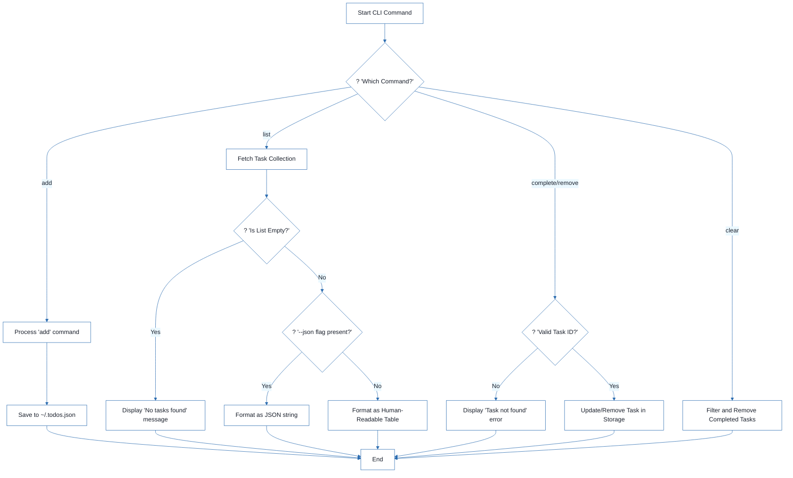
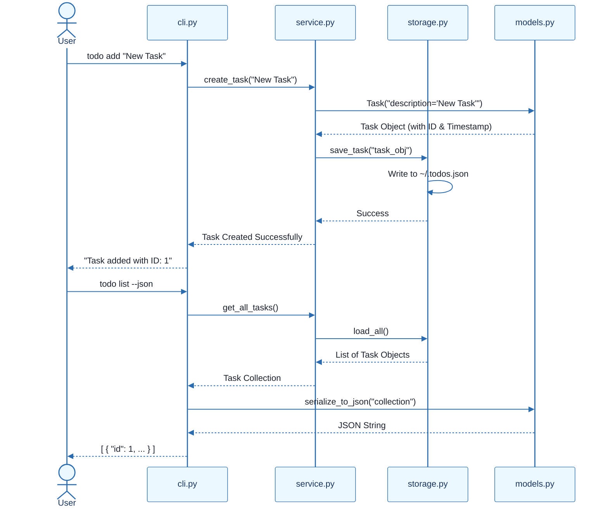
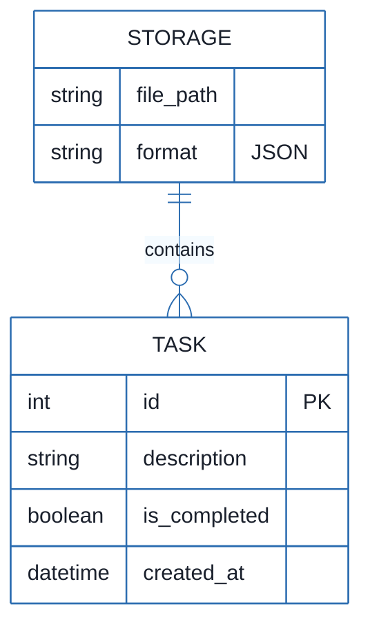

# CLI To-Do List Manager - Technical Specification & Architecture Document

## 1. Executive Summary & Architecture Overview

### 1.1 Executive Brief
A Python-based CLI To-Do List Manager utilizing a local JSON file for persistent storage. The system implements a layered architecture comprising a CLI dispatch layer, a service layer for business logic, and a storage layer for file I/O, enabling task creation, completion, listing, and removal.

### 1.2 Maturity Assessment
The project is structurally sound with a high health index, though it lacks formal acceptance criteria and explicit security/performance constraints. Given that the core foundational and MVP stories are largely implemented, the project is READY for final execution of the remaining removal logic and polish phases.

### 1.3 Technical Stack
* Python
* pyproject.toml

### 1.4 Architectural Constraints
* Storage must be persisted in `~/.todos.json`.
* Sequential ID assignment for task creation.
* Mandatory population of `created_at` timestamp.
* JSON output must remain parseable for the `--json` flag.
* Strict execution order: Setup -> Foundational -> User Stories -> Polish.

### 1.5 Critical Dependencies
* JSON file system I/O for `~/.todos.json`.
* Sequential dependency: Phase 2 (Foundational) must be complete before any User Story implementation.
* Internal data integrity: Task entity serialization helpers in `models.py` are required by both the service and CLI layers.
* Verification gate: Manual smoke tests of all commands (add, list, complete, remove, clear) before final sign-off.

## 2. Architecture Workflows

```mermaid
%%{init: {
  'theme': 'base',
  'themeVariables': {
    'primaryColor': '#1A365D',
    'primaryTextColor': '#1A202C',
    'primaryBorderColor': '#2B6CB0',
    'lineColor': '#2B6CB0',
    'secondaryColor': '#EBF8FF',
    'tertiaryColor': '#EBF8FF',
    'background': '#FFFFFF',
    'mainBkg': '#FFFFFF',
    'secondBkg': '#EBF8FF',
    'tertiaryBkg': '#F7FAFC',
    'secondaryTextColor': '#4A5568',
    'fontSize': '16px',
    'fontFamily': 'Inter, system-ui, sans-serif',
    'nodePadding': '15px',
    'borderRadius': '8px',
    'edgeLabelBackground': '#EBF8FF',
    'clusterBkg': '#F7FAFC',
    'clusterBorder': '#2B6CB0',
    'defaultLinkColor': '#2B6CB0',
    'titleColor': '#1A365D',
    'actorBorder': '#2B6CB0',
    'actorBkg': '#EBF8FF',
    'actorTextColor': '#1A365D',
    'actorLineColor': '#2B6CB0',
    'signalColor': '#2B6CB0',
    'signalTextColor': '#1A202C',
    'labelBoxBorderColor': '#2B6CB0',
    'labelBoxBkgColor': '#EBF8FF',
    'labelTextColor': '#1A202C',
    'loopTextColor': '#1A202C',
    'arrowHeadColor': '#2B6CB0',
    'sequenceNumberColor': '#1A365D',
    'sequenceActorBorder': '#2B6CB0',
    'sequenceActorBkg': '#EBF8FF',
    'sequenceArrowColor': '#2B6CB0',
    'noteBkgColor': '#FFF5EB',
    'noteBorderColor': '#DD6B20',
    'noteTextColor': '#1A202C'
  }
}}%%
flowchart TD
    subgraph Setup_Phase [Phase 1: Setup]
        PHASE-1["PHASE-1: Setup (Shared Infrastructure)"]
    end
    subgraph Foundational_Phase [Phase 2: Foundational]
        PHASE-2["PHASE-2: Foundational (Blocking Prerequisites)"]
    end
    subgraph US1_Phase [Phase 3: User Story 1]
        PHASE-3["PHASE-3: User Story 1 - Add and Manage Tasks"]
        T009["T009: Implement add command flow"]
        T010["T010: Implement task creation/ID assignment"]
        T011["T011: Implement completion updates"]
        T012["T012: Add user-facing messages"]
        PHASE-3 --> T009
        PHASE-3 --> T010
        PHASE-3 --> T011
        PHASE-3 --> T012
    end
    subgraph US2_Phase [Phase 4: User Story 2]
        PHASE-4["PHASE-4: User Story 2 - View and Filter Tasks"]
        T013["T013: Implement human-readable listing"]
        T014["T014: Implement JSON output formatting"]
        T015["T015: Add listing logic in service"]
        T016["T016: Handle empty-list case"]
        PHASE-4 --> T013
        PHASE-4 --> T014
        PHASE-4 --> T015
        PHASE-4 --> T016
    end
    subgraph US3_Phase [Phase 5: User Story 3]
        PHASE-5["PHASE-5: User Story 3 - Remove and Clear Tasks"]
        T017["T017: Implement remove command flow"]
        T018["T018: Implement clear command flow"]
        T019["T019: Add not-found handling"]
        T020["T020: Ensure storage writes persist removals"]
        PHASE-5 --> T017
        PHASE-5 --> T018
        PHASE-5 --> T019
        PHASE-5 --> T020
    end
    subgraph Polish_Phase [Phase 6: Polish]
        PHASE-6["PHASE-6: Polish & Cross-Cutting Concerns"]
    end
    PHASE-2 -->|"depends_on"| PHASE-1
    PHASE-3 -->|"depends_on"| PHASE-2
    PHASE-4 -->|"depends_on"| PHASE-2
    PHASE-5 -->|"depends_on"| PHASE-2
    PHASE-6 -->|"depends_on"| PHASE-3
    PHASE-6 -->|"depends_on"| PHASE-4
    PHASE-6 -->|"depends_on"| PHASE-5
```







```mermaid
%%{init: {
  'theme': 'base',
  'themeVariables': {
    'primaryColor': '#1A365D',
    'primaryTextColor': '#1A202C',
    'primaryBorderColor': '#2B6CB0',
    'lineColor': '#2B6CB0',
    'secondaryColor': '#EBF8FF',
    'tertiaryColor': '#EBF8FF',
    'background': '#FFFFFF',
    'mainBkg': '#FFFFFF',
    'secondBkg': '#EBF8FF',
    'tertiaryBkg': '#F7FAFC',
    'secondaryTextColor': '#4A5568',
    'fontSize': '16px',
    'fontFamily': 'Inter, system-ui, sans-serif',
    'nodePadding': '15px',
    'borderRadius': '8px',
    'edgeLabelBackground': '#EBF8FF',
    'clusterBkg': '#F7FAFC',
    'clusterBorder': '#2B6CB0',
    'defaultLinkColor': '#2B6CB0',
    'titleColor': '#1A365D',
    'actorBorder': '#2B6CB0',
    'actorBkg': '#EBF8FF',
    'actorTextColor': '#1A365D',
    'actorLineColor': '#2B6CB0',
    'signalColor': '#2B6CB0',
    'signalTextColor': '#1A202C',
    'labelBoxBorderColor': '#2B6CB0',
    'labelBoxBkgColor': '#EBF8FF',
    'labelTextColor': '#1A202C',
    'loopTextColor': '#1A202C',
    'arrowHeadColor': '#2B6CB0',
    'sequenceNumberColor': '#1A365D',
    'sequenceActorBorder': '#2B6CB0',
    'sequenceActorBkg': '#EBF8FF',
    'sequenceArrowColor': '#2B6CB0',
    'noteBkgColor': '#FFF5EB',
    'noteBorderColor': '#DD6B20',
    'noteTextColor': '#1A202C'
  }
}}%%
erDiagram
    TASK {
        int id PK
        string description
        boolean is_completed
        datetime created_at
    }
    STORAGE ||--o{ TASK : "contains"
    STORAGE {
        string file_path
        string format "JSON"
    }
``` & Visual Diagrams

### 2.1 Project Implementation Roadmap & Traceability
```mermaid
%%{init: {
  'theme': 'base',
  'themeVariables': {
    'primaryColor': '#1A365D',
    'primaryTextColor': '#1A202C',
    'primaryBorderColor': '#2B6CB0',
    'lineColor': '#2B6CB0',
    'secondaryColor': '#EBF8FF',
    'tertiaryColor': '#EBF8FF',
    'background': '#FFFFFF',
    'mainBkg': '#FFFFFF',
    'secondBkg': '#EBF8FF',
    'tertiaryBkg': '#F7FAFC',
    'secondaryTextColor': '#4A5568',
    'fontSize': '16px',
    'fontFamily': 'Inter, system-ui, sans-serif',
    'nodePadding': '15px',
    'borderRadius': '8px',
    'edgeLabelBackground': '#EBF8FF',
    'clusterBkg': '#F7FAFC',
    'clusterBorder': '#2B6CB0',
    'defaultLinkColor': '#2B6CB0',
    'titleColor': '#1A365D',
    'actorBorder': '#2B6CB0',
    'actorBkg': '#EBF8FF',
    'actorTextColor': '#1A365D',
    'actorLineColor': '#2B6CB0',
    'signalColor': '#2B6CB0',
    'signalTextColor': '#1A202C',
    'labelBoxBorderColor': '#2B6CB0',
    'labelBoxBkgColor': '#EBF8FF',
    'labelTextColor': '#1A202C',
    'loopTextColor': '#1A202C',
    'arrowHeadColor': '#2B6CB0',
    'sequenceNumberColor': '#1A365D',
    'sequenceActorBorder': '#2B6CB0',
    'sequenceActorBkg': '#EBF8FF',
    'sequenceArrowColor': '#2B6CB0',
    'noteBkgColor': '#FFF5EB',
    'noteBorderColor': '#DD6B20',
    'noteTextColor': '#1A202C'
  }
}}%%
flowchart TD
    subgraph Setup_Phase [Phase 1: Setup]
        PHASE-1["PHASE-1: Setup (Shared Infrastructure)"]
    end
    subgraph Foundational_Phase [Phase 2: Foundational]
        PHASE-2["PHASE-2: Foundational (Blocking Prerequisites)"]
    end
    subgraph US1_Phase [Phase 3: User Story 1]
        PHASE-3["PHASE-3: User Story 1 - Add and Manage Tasks"]
        T009["T009: Implement add command flow"]
        T010["T010: Implement task creation/ID assignment"]
        T011["T011: Implement completion updates"]
        T012["T012: Add user-facing messages"]
        PHASE-3 --> T009
        PHASE-3 --> T010
        PHASE-3 --> T011
        PHASE-3 --> T012
    end
    subgraph US2_Phase [Phase 4: User Story 2]
        PHASE-4["PHASE-4: User Story 2 - View and Filter Tasks"]
        T013["T013: Implement human-readable listing"]
        T014["T014: Implement JSON output formatting"]
        T015["T015: Add listing logic in service"]
        T016["T016: Handle empty-list case"]
        PHASE-4 --> T013
        PHASE-4 --> T014
        PHASE-4 --> T015
        PHASE-4 --> T016
    end
    subgraph US3_Phase [Phase 5: User Story 3]
        PHASE-5["PHASE-5: User Story 3 - Remove and Clear Tasks"]
        T017["T017: Implement remove command flow"]
        T018["T018: Implement clear command flow"]
        T019["T019: Add not-found handling"]
        T020["T020: Ensure storage writes persist removals"]
        PHASE-5 --> T017
        PHASE-5 --> T018
        PHASE-5 --> T019
        PHASE-5 --> T020
    end
    subgraph Polish_Phase [Phase 6: Polish]
        PHASE-6["PHASE-6: Polish & Cross-Cutting Concerns"]
    end
    PHASE-2 -->|"depends_on"| PHASE-1
    PHASE-3 -->|"depends_on"| PHASE-2
    PHASE-4 -->|"depends_on"| PHASE-2
    PHASE-5 -->|"depends_on"| PHASE-2
    PHASE-6 -->|"depends_on"| PHASE-3
    PHASE-6 -->|"depends_on"| PHASE-4
    PHASE-6 -->|"depends_on"| PHASE-5
```

### 2.2 CLI Task Management Workflow


### 2.3 CLI Command Execution Sequence


### 2.4 CLI To-Do Data Model


## 3. Detailed Technical Specifications & Business Rules

### 3.1 Requirements Traceability
| ID | Description | Status | Source Section |
| :--- | :--- | :--- | :--- |
| T001 | Create the Python package skeleton in src/todo_manager/__init__.py, __main__.py, cli.py, models.py, storage.py, and service.py | completed | Phase 1: Setup (Shared Infrastructure) |
| T002 | Create the test directory structure in tests/unit/ and tests/integration/ | completed | Phase 1: Setup (Shared Infrastructure) |
| T003 | Add project metadata and tooling entry points in pyproject.toml | completed | Phase 1: Setup (Shared Infrastructure) |
| T004 | Implement task entity definitions and serialization helpers in src/todo_manager/models.py | completed | Phase 2: Foundational (Blocking Prerequisites) |
| T005 | Implement JSON storage path resolution and file I/O helpers in src/todo_manager/storage.py | completed | Phase 2: Foundational (Blocking Prerequisites) |
| T006 | Implement shared command-line parsing and top-level dispatch in src/todo_manager/cli.py | completed | Phase 2: Foundational (Blocking Prerequisites) |
| T007 | Implement shared service-layer error handling and task collection utilities in src/todo_manager/service.py | completed | Phase 2: Foundational (Blocking Prerequisites) |
| T008 | Define module entry behavior for python -m todo_manager in src/todo_manager/__main__.py | completed | Phase 2: Foundational (Blocking Prerequisites) |
| T009 | Implement the `add` command flow in src/todo_manager/cli.py and src/todo_manager/service.py | completed | Implementation for User Story 1 |
| T010 | Implement task creation, sequential ID assignment, and `created_at` population in src/todo_manager/models.py | completed | Implementation for User Story 1 |
| T011 | Implement completion updates for existing tasks in src/todo_manager/service.py | completed | Implementation for User Story 1 |
| T012 | Add user-facing success and error messages for add and complete operations in src/todo_manager/cli.py | completed | Implementation for User Story 1 |
| T013 | Implement human-readable task listing output in src/todo_manager/cli.py | completed | Implementation for User Story 2 |
| T014 | Implement `--json` output formatting in src/todo_manager/cli.py using the task serialization helpers in src/todo_manager/models.py | completed | Implementation for User Story 2 |
| T015 | Add listing logic that preserves task order and status fields in src/todo_manager/service.py | completed | Implementation for User Story 2 |
| T016 | Handle the empty-list case with a clear message in src/todo_manager/cli.py | completed | Implementation for User Story 2 |
| T017 | Implement the `remove` command flow in src/todo_manager/cli.py and src/todo_manager/service.py | pending | Implementation for User Story 3 |
| T018 | Implement the `clear` command flow for removing completed tasks in src/todo_manager/service.py | completed | Implementation for User Story 3 |
| T019 | Add not-found handling for invalid task IDs in src/todo_manager/cli.py | completed | Implementation for User Story 3 |
| T020 | Ensure storage writes persist removals and clears safely in src/todo_manager/storage.py | completed | Implementation for User Story 3 |
| T021 | Document the CLI usage and storage behavior in README.md | completed | Phase 6: Polish & Cross-Cutting Concerns |
| T022 | Add quickstart verification notes and examples in specs/001-cli-todo-manager/quickstart.md | pending | Phase 6: Polish & Cross-Cutting Concerns |
| T023 | Run a manual smoke test of add, list, complete, remove, and clear against ~/.todos.json | pending | Phase 6: Polish & Cross-Cutting Concerns |
| T024 | Verify linting and formatting expectations for the source files in src/todo_manager/ | pending | Phase 6: Polish & Cross-Cutting Concerns |
| T025 | Confirm the generated JSON output remains parseable for the todo list --json path | pending | Phase 6: Polish & Cross-Cutting Concerns |
| TEST-US1 | Run `todo add "Task description"` and `todo complete <id>`, then confirm the stored task list reflects the new task and its completion status. | N/A | Phase 3: User Story 1 - Add and Manage Tasks (Priority: P1) 🎯 MVP |
| TEST-US2 | Run `todo list` and `todo list --json` and confirm the output is readable or parseable JSON while showing the full task collection. | N/A | Phase 4: User Story 2 - View and Filter Tasks (Priority: P2) |
| TEST-US3 | Run `todo remove <id>` and `todo clear`, then confirm the targeted task or completed tasks are removed while other tasks remain intact. | N/A | Phase 5: User Story 3 - Remove and Clear Tasks (Priority: P3) |

### 3.2 Security Rules
No specific security constraints were defined in the source documentation.

### 3.3 Data Models
The system uses a single `TASK` entity stored in a JSON array within `~/.todos.json`.
* **Fields**:
    * `id` (Integer, PK): Sequential unique identifier.
    * `description` (String): The task content.
    * `is_completed` (Boolean): Completion status.
    * `created_at` (DateTime): Timestamp of creation.

## 4. Project Governance & Structural Gaps

### 4.1 Structural Gaps
| Missing Section | Priority | Remediation Advice |
| :--- | :--- | :--- |
| Acceptance Criteria | MEDIUM | While 'Independent Tests' are provided, formal acceptance criteria for each task are not explicitly listed. |
| Security & Performance Constraints | LOW | No specific security or performance constraints were mentioned for this CLI tool. |
| Open Questions & Uncertainties | LOW | The document appears complete; no open questions were listed. |

### 4.2 Remediation & Workflow
The project follows an incremental delivery strategy:
1. **Setup & Foundational**: Establish the skeleton and shared I/O.
2. **MVP (US1)**: Implement core add/complete functionality.
3. **Expansion (US2 & US3)**: Implement listing and removal logic.
4. **Polish**: Final documentation and smoke testing.

## 5. Technical & Domain Glossary (Terminology Reference)

| Term | Category | Context Anchor | Project Definition |
| :--- | :--- | :--- | :--- |
| Checkpoint | TECHNICAL_STACK | PHASE-2 | A synchronization gate ensuring all blocking infrastructure is verified before parallel feature development commences. |
| Foundational | TECHNICAL_STACK | PHASE-2 | The core architectural layer containing shared utilities and blocking prerequisites required by all subsequent user stories. |
| Goal | BUSINESS_DOMAIN | PHASE-3 | The primary functional objective a user must achieve within a specific feature set. |
| ID | BUSINESS_DOMAIN | T010 | A sequential numeric identifier assigned to each entry to ensure unique referenceability. |
| JSON | TECHNICAL_STACK | T005 | The lightweight data-interchange format used for persistent storage and scriptable output. |
| MVP | BUSINESS_DOMAIN | PHASE-3 | The minimum viable product consisting of the most critical feature set required for initial validation. |
| Organization | TECHNICAL_STACK | Tasks: CLI To-Do List Manager | The structural grouping of implementation units by user story to maintain independent testability. |
| Prerequisites | TECHNICAL_STACK | Tasks: CLI To-Do List Manager | The set of mandatory design documents and specifications required before implementation begins. |
| README | TECHNICAL_STACK | T021 | The primary documentation file detailing usage instructions and storage behavior. |
| Setup | TECHNICAL_STACK | PHASE-1 | The initial phase focused on project skeleton creation and tooling configuration. |
| T016 | TECHNICAL_STACK | T016 | The specific implementation unit responsible for handling empty collection states in the interface. |
| Tests | TECHNICAL_STACK | T002 | The verification suite comprising unit and integration directories to ensure logic correctness. |
| population in | BUSINESS_DOMAIN | T010 | The act of assigning a timestamp to the creation field during entity instantiation. |
| todo clear | BUSINESS_DOMAIN | T018 | The operation that purges all entries marked as finished from the persistent store. |
| todo list | BUSINESS_DOMAIN | T013 | The operation that retrieves and displays all stored entries in either human-readable or machine-parseable formats. |
| ⚠️ CRITICAL | TECHNICAL_STACK | PHASE-2 | A high-priority constraint indicating a hard dependency that blocks all subsequent development. |