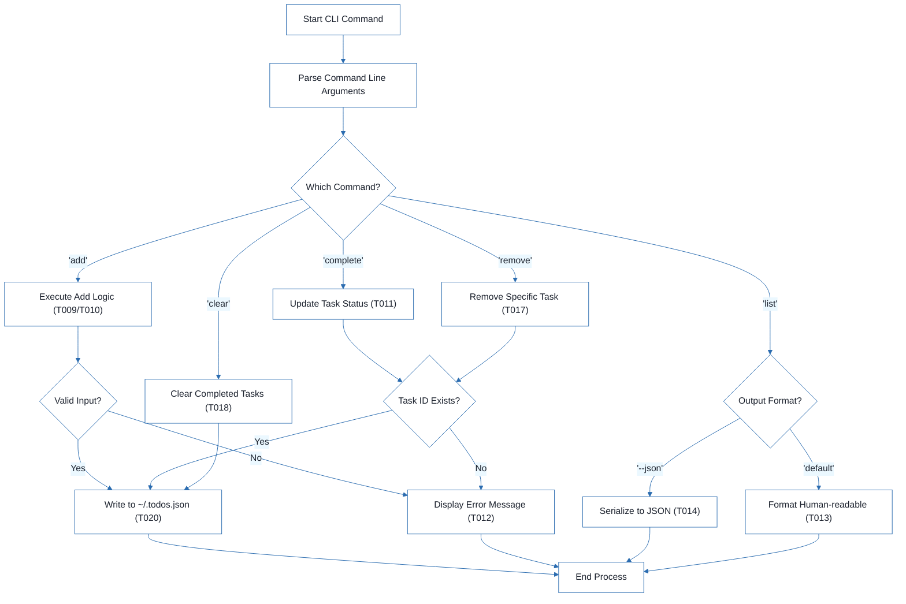
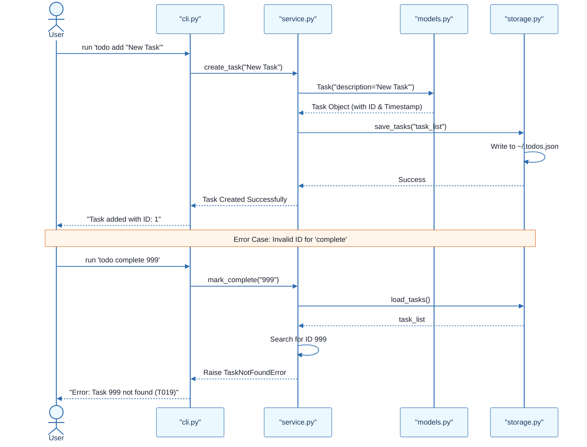

# CLI To-Do List Manager - Technical Specification & Architecture Document

## 1. Executive Summary & Architecture Overview

### 1.1 Executive Brief
The CLI To-Do List Manager is a Python-based command-line application designed for efficient task lifecycle management. The system utilizes a local JSON file for persistent storage and follows a layered architectural pattern consisting of a CLI dispatch layer, a service layer for business logic, and a storage layer for I/O operations. Core capabilities include task creation with sequential ID assignment, status updates, and flexible listing options.

### 1.2 Maturity Assessment
The project is structurally sound with a high health index, though it requires minor REFINEMENT. While the core implementation path is clearly defined, there is a lack of formal acceptance criteria for individual tasks and a need for defined security and performance constraints, specifically regarding JSON file size limits and input sanitization.

### 1.3 Technical Stack
* Python
* pyproject.toml

### 1.4 Architectural Constraints
* Storage must be persisted in `~/.todos.json`.
* Task IDs must be assigned sequentially.
* Output must support both human-readable and raw JSON formats via the `--json` flag.
* Strict execution order: Setup $\rightarrow$ Foundational $\rightarrow$ User Stories $\rightarrow$ Polish.
* Service logic must be implemented prior to CLI output formatting.

### 1.5 Critical Dependencies
* JSON file I/O for persistence in `~/.todos.json`.
* Sequential ID generation logic in `models.py`.
* Strict dependency of all User Stories on the Foundational Phase (PHASE-2).
* Referential integrity between CLI commands and service-layer task collection utilities.

## 2. Architecture Workflows

```mermaid
%%{init: {
  'theme': 'base',
  'themeVariables': {
    'primaryColor': '#1A365D',
    'primaryTextColor': '#1A202C',
    'primaryBorderColor': '#2B6CB0',
    'lineColor': '#2B6CB0',
    'secondaryColor': '#EBF8FF',
    'tertiaryColor': '#EBF8FF',
    'background': '#FFFFFF',
    'mainBkg': '#FFFFFF',
    'secondBkg': '#EBF8FF',
    'tertiaryBkg': '#F7FAFC',
    'secondaryTextColor': '#4A5568',
    'fontSize': '16px',
    'fontFamily': 'Inter, system-ui, sans-serif',
    'nodePadding': '15px',
    'borderRadius': '8px',
    'edgeLabelBackground': '#EBF8FF',
    'clusterBkg': '#F7FAFC',
    'clusterBorder': '#2B6CB0',
    'defaultLinkColor': '#2B6CB0',
    'titleColor': '#1A365D',
    'actorBorder': '#2B6CB0',
    'actorBkg': '#EBF8FF',
    'actorTextColor': '#1A365D',
    'actorLineColor': '#2B6CB0',
    'signalColor': '#2B6CB0',
    'signalTextColor': '#1A202C',
    'labelBoxBorderColor': '#2B6CB0',
    'labelBoxBkgColor': '#EBF8FF',
    'labelTextColor': '#1A202C',
    'loopTextColor': '#1A202C',
    'arrowHeadColor': '#2B6CB0',
    'sequenceNumberColor': '#1A365D',
    'sequenceActorBorder': '#2B6CB0',
    'sequenceActorBkg': '#EBF8FF',
    'sequenceArrowColor': '#2B6CB0',
    'noteBkgColor': '#FFF5EB',
    'noteBorderColor': '#DD6B20',
    'noteTextColor': '#1A202C'
  }
}}%%
flowchart TD
    subgraph PHASE_1_GRP["PHASE-1: Setup"]
        PHASE-1["PHASE-1: Setup (Shared Infrastructure)"]
        T001["T001: Package Skeleton"]
        T002["T002: Test Structure"]
        T003["T003: Project Metadata"]
        PHASE-1 --> T001
        PHASE-1 --> T002
        PHASE-1 --> T003
    end
    subgraph PHASE_2_GRP["PHASE-2: Foundational"]
        PHASE-2["PHASE-2: Foundational (Blocking Prerequisites)"]
        T004["T004: Entity Definitions"]
        T005["T005: JSON Storage I/O"]
        T006["T006: CLI Parsing"]
        T007["T007: Service Error Handling"]
        T008["T008: Module Entry"]
        PHASE-2 --> T004
        PHASE-2 --> T005
        PHASE-2 --> T006
        PHASE-2 --> T007
        PHASE-2 --> T008
    end
    subgraph PHASE_3_GRP["PHASE-3: US1 - Add/Manage"]
        PHASE-3["PHASE-3: User Story 1 - Add and Manage Tasks"]
        T009["T009: Add Command Flow"]
        T010["T010: Task Creation Logic"]
        T011["T011: Completion Updates"]
        T012["T012: User Messages"]
        PHASE-3 --> T009
        PHASE-3 --> T010
        PHASE-3 --> T011
        PHASE-3 --> T012
    end
    subgraph PHASE_4_GRP["PHASE-4: US2 - View/Filter"]
        PHASE-4["PHASE-4: User Story 2 - View and Filter Tasks"]
        T013["T013: Human-readable List"]
        T014["T014: JSON Formatting"]
        T015["T015: Listing Logic"]
        T016["T016: Empty-list Handling"]
        PHASE-4 --> T013
        PHASE-4 --> T014
        PHASE-4 --> T015
        PHASE-4 --> T016
    end
    subgraph PHASE_5_GRP["PHASE-5: US3 - Remove/Clear"]
        PHASE-5["PHASE-5: User Story 3 - Remove and Clear Tasks"]
        T017["T017: Remove Command Flow"]
        T018["T018: Clear Command Flow"]
        T019["T019: Not-found Handling"]
        T020["T020: Storage Persistence"]
        PHASE-5 --> T017
        PHASE-5 --> T018
        PHASE-5 --> T019
        PHASE-5 --> T020
    end
    subgraph PHASE_6_GRP["PHASE-6: Polish"]
        PHASE-6["PHASE-6: Polish & Cross-Cutting Concerns"]
        T021["T021: Documentation"]
        T022["T022: Quickstart Notes"]
        T023["T023: Smoke Tests"]
        T024["T024: Linting/Formatting"]
        T025["T025: JSON Validation"]
        PHASE-6 --> T021
        PHASE-6 --> T022
        PHASE-6 --> T023
        PHASE-6 --> T024
        PHASE-6 --> T025
    end
    PHASE-2 -->|"depends_on"| PHASE-1
    PHASE-3 -->|"depends_on"| PHASE-2
    PHASE-4 -->|"depends_on"| PHASE-2
    PHASE-5 -->|"depends_on"| PHASE-2
    PHASE-6 -->|"depends_on"| PHASE-3
    PHASE-6 -->|"depends_on"| PHASE-4
    PHASE-6 -->|"depends_on"| PHASE-5
```





```mermaid
%%{init: {
  'theme': 'base',
  'themeVariables': {
    'primaryColor': '#1A365D',
    'primaryTextColor': '#1A202C',
    'primaryBorderColor': '#2B6CB0',
    'lineColor': '#2B6CB0',
    'secondaryColor': '#EBF8FF',
    'tertiaryColor': '#EBF8FF',
    'background': '#FFFFFF',
    'mainBkg': '#FFFFFF',
    'secondBkg': '#EBF8FF',
    'tertiaryBkg': '#F7FAFC',
    'secondaryTextColor': '#4A5568',
    'fontSize': '16px',
    'fontFamily': 'Inter, system-ui, sans-serif',
    'nodePadding': '15px',
    'borderRadius': '8px',
    'edgeLabelBackground': '#EBF8FF',
    'clusterBkg': '#F7FAFC',
    'clusterBorder': '#2B6CB0',
    'defaultLinkColor': '#2B6CB0',
    'titleColor': '#1A365D',
    'actorBorder': '#2B6CB0',
    'actorBkg': '#EBF8FF',
    'actorTextColor': '#1A365D',
    'actorLineColor': '#2B6CB0',
    'signalColor': '#2B6CB0',
    'signalTextColor': '#1A202C',
    'labelBoxBorderColor': '#2B6CB0',
    'labelBoxBkgColor': '#EBF8FF',
    'labelTextColor': '#1A202C',
    'loopTextColor': '#1A202C',
    'arrowHeadColor': '#2B6CB0',
    'sequenceNumberColor': '#1A365D',
    'sequenceActorBorder': '#2B6CB0',
    'sequenceActorBkg': '#EBF8FF',
    'sequenceArrowColor': '#2B6CB0',
    'noteBkgColor': '#FFF5EB',
    'noteBorderColor': '#DD6B20',
    'noteTextColor': '#1A202C'
  }
}}%%
sequenceDiagram
    actor User
    participant CLI as "cli.py"
    participant Service as "service.py"
    participant Model as "models.py"
    participant Storage as "storage.py"
    User->>CLI: run 'todo add "New Task"'
    CLI->>Service: create_task("New Task")
    Service->>Model: Task("description='New Task'")
    Model-->>Service: Task Object (with ID & Timestamp)
    Service->>Storage: save_tasks("task_list")
    Storage->>Storage: Write to ~/.todos.json
    Storage-->>Service: Success
    Service-->>CLI: Task Created Successfully
    CLI-->>User: "Task added with ID: 1"
    Note over User, Storage: Error Case: Invalid ID for 'complete'
    User->>CLI: run 'todo complete 999'
    CLI->>Service: mark_complete("999")
    Service->>Storage: load_tasks()
    Storage-->>Service: task_list
    Service->>Service: Search for ID 999
    Service-->>CLI: Raise TaskNotFoundError
    CLI-->>User: "Error: Task 999 not found (T019)"
``` & Visual Diagrams

### 2.1 Project Implementation Roadmap & Traceability
```mermaid
%%{init: {
  'theme': 'base',
  'themeVariables': {
    'primaryColor': '#1A365D',
    'primaryTextColor': '#1A202C',
    'primaryBorderColor': '#2B6CB0',
    'lineColor': '#2B6CB0',
    'secondaryColor': '#EBF8FF',
    'tertiaryColor': '#EBF8FF',
    'background': '#FFFFFF',
    'mainBkg': '#FFFFFF',
    'secondBkg': '#EBF8FF',
    'tertiaryBkg': '#F7FAFC',
    'secondaryTextColor': '#4A5568',
    'fontSize': '16px',
    'fontFamily': 'Inter, system-ui, sans-serif',
    'nodePadding': '15px',
    'borderRadius': '8px',
    'edgeLabelBackground': '#EBF8FF',
    'clusterBkg': '#F7FAFC',
    'clusterBorder': '#2B6CB0',
    'defaultLinkColor': '#2B6CB0',
    'titleColor': '#1A365D',
    'actorBorder': '#2B6CB0',
    'actorBkg': '#EBF8FF',
    'actorTextColor': '#1A365D',
    'actorLineColor': '#2B6CB0',
    'signalColor': '#2B6CB0',
    'signalTextColor': '#1A202C',
    'labelBoxBorderColor': '#2B6CB0',
    'labelBoxBkgColor': '#EBF8FF',
    'labelTextColor': '#1A202C',
    'loopTextColor': '#1A202C',
    'arrowHeadColor': '#2B6CB0',
    'sequenceNumberColor': '#1A365D',
    'sequenceActorBorder': '#2B6CB0',
    'sequenceActorBkg': '#EBF8FF',
    'sequenceArrowColor': '#2B6CB0',
    'noteBkgColor': '#FFF5EB',
    'noteBorderColor': '#DD6B20',
    'noteTextColor': '#1A202C'
  }
}}%%
flowchart TD
    subgraph PHASE_1_GRP["PHASE-1: Setup"]
        PHASE-1["PHASE-1: Setup (Shared Infrastructure)"]
        T001["T001: Package Skeleton"]
        T002["T002: Test Structure"]
        T003["T003: Project Metadata"]
        PHASE-1 --> T001
        PHASE-1 --> T002
        PHASE-1 --> T003
    end
    subgraph PHASE_2_GRP["PHASE-2: Foundational"]
        PHASE-2["PHASE-2: Foundational (Blocking Prerequisites)"]
        T004["T004: Entity Definitions"]
        T005["T005: JSON Storage I/O"]
        T006["T006: CLI Parsing"]
        T007["T007: Service Error Handling"]
        T008["T008: Module Entry"]
        PHASE-2 --> T004
        PHASE-2 --> T005
        PHASE-2 --> T006
        PHASE-2 --> T007
        PHASE-2 --> T008
    end
    subgraph PHASE_3_GRP["PHASE-3: US1 - Add/Manage"]
        PHASE-3["PHASE-3: User Story 1 - Add and Manage Tasks"]
        T009["T009: Add Command Flow"]
        T010["T010: Task Creation Logic"]
        T011["T011: Completion Updates"]
        T012["T012: User Messages"]
        PHASE-3 --> T009
        PHASE-3 --> T010
        PHASE-3 --> T011
        PHASE-3 --> T012
    end
    subgraph PHASE_4_GRP["PHASE-4: US2 - View/Filter"]
        PHASE-4["PHASE-4: User Story 2 - View and Filter Tasks"]
        T013["T013: Human-readable List"]
        T014["T014: JSON Formatting"]
        T015["T015: Listing Logic"]
        T016["T016: Empty-list Handling"]
        PHASE-4 --> T013
        PHASE-4 --> T014
        PHASE-4 --> T015
        PHASE-4 --> T016
    end
    subgraph PHASE_5_GRP["PHASE-5: US3 - Remove/Clear"]
        PHASE-5["PHASE-5: User Story 3 - Remove and Clear Tasks"]
        T017["T017: Remove Command Flow"]
        T018["T018: Clear Command Flow"]
        T019["T019: Not-found Handling"]
        T020["T020: Storage Persistence"]
        PHASE-5 --> T017
        PHASE-5 --> T018
        PHASE-5 --> T019
        PHASE-5 --> T020
    end
    subgraph PHASE_6_GRP["PHASE-6: Polish"]
        PHASE-6["PHASE-6: Polish & Cross-Cutting Concerns"]
        T021["T021: Documentation"]
        T022["T022: Quickstart Notes"]
        T023["T023: Smoke Tests"]
        T024["T024: Linting/Formatting"]
        T025["T025: JSON Validation"]
        PHASE-6 --> T021
        PHASE-6 --> T022
        PHASE-6 --> T023
        PHASE-6 --> T024
        PHASE-6 --> T025
    end
    PHASE-2 -->|"depends_on"| PHASE-1
    PHASE-3 -->|"depends_on"| PHASE-2
    PHASE-4 -->|"depends_on"| PHASE-2
    PHASE-5 -->|"depends_on"| PHASE-2
    PHASE-6 -->|"depends_on"| PHASE-3
    PHASE-6 -->|"depends_on"| PHASE-4
    PHASE-6 -->|"depends_on"| PHASE-5
```

### 2.2 CLI Command Execution Workflow


### 2.3 CLI To-Do Manager Sequence Interaction


## 3. Detailed Technical Specifications & Business Rules

### 3.1 Requirements Traceability
| ID | Requirement / Task Description | Phase | Story | Status |
| :--- | :--- | :--- | :--- | :--- |
| T001 | Create Python package skeleton (`__init__.py`, `__main__.py`, `cli.py`, `models.py`, `storage.py`, `service.py`) | PHASE-1 | N/A | Completed |
| T002 | Create test directory structure (`tests/unit/`, `tests/integration/`) | PHASE-1 | N/A | Completed |
| T003 | Add project metadata and tooling entry points in `pyproject.toml` | PHASE-1 | N/A | Completed |
| T004 | Implement task entity definitions and serialization helpers in `models.py` | PHASE-2 | N/A | Completed |
| T005 | Implement JSON storage path resolution and file I/O helpers in `storage.py` | PHASE-2 | N/A | Completed |
| T006 | Implement shared command-line parsing and top-level dispatch in `cli.py` | PHASE-2 | N/A | Completed |
| T007 | Implement shared service-layer error handling and task collection utilities in `service.py` | PHASE-2 | N/A | Completed |
| T008 | Define module entry behavior for `python -m todo_manager` in `__main__.py` | PHASE-2 | N/A | Completed |
| T009 | Implement the `add` command flow in `cli.py` and `service.py` | PHASE-3 | US1 | Completed |
| T010 | Implement task creation, sequential ID assignment, and `created_at` population in `models.py` | PHASE-3 | US1 | Completed |
| T011 | Implement completion updates for existing tasks in `service.py` | PHASE-3 | US1 | Completed |
| T012 | Add user-facing success and error messages for add and complete operations in `cli.py` | PHASE-3 | US1 | Completed |
| T013 | Implement human-readable task listing output in `cli.py` | PHASE-4 | US2 | Completed |
| T014 | Implement `--json` output formatting in `cli.py` using serialization helpers | PHASE-4 | US2 | Completed |
| T015 | Add listing logic that preserves task order and status fields in `service.py` | PHASE-4 | US2 | Completed |
| T016 | Handle the empty-list case with a clear message in `cli.py` | PHASE-4 | US2 | Completed |
| T017 | Implement the `remove` command flow in `cli.py` and `service.py` | PHASE-5 | US3 | Pending |
| T018 | Implement the `clear` command flow for removing completed tasks in `service.py` | PHASE-5 | US3 | Completed |
| T019 | Add not-found handling for invalid task IDs in `cli.py` | PHASE-5 | US3 | Completed |
| T020 | Ensure storage writes persist removals and clears safely in `storage.py` | PHASE-5 | US3 | Completed |
| T021 | Document the CLI usage and storage behavior in `README.md` | PHASE-6 | N/A | Completed |
| T022 | Add quickstart verification notes and examples in `quickstart.md` | PHASE-6 | N/A | Pending |
| T023 | Run manual smoke test of `add`, `list`, `complete`, `remove`, and `clear` | PHASE-6 | N/A | Pending |
| T024 | Verify linting and formatting expectations for source files | PHASE-6 | N/A | Pending |
| T025 | Confirm generated JSON output remains parseable for `todo list --json` | PHASE-6 | N/A | Completed |
| TEST-US1 | Validation: `todo add` and `todo complete` reflect in stored task list | PHASE-3 | US1 | N/A |
| TEST-US2 | Validation: `todo list` and `todo list --json` output correctness | PHASE-4 | US2 | N/A |
| TEST-US3 | Validation: `todo remove` and `todo clear` target correct entries | PHASE-5 | US3 | N/A |

### 3.2 Security Rules
* **Input Sanitization**: (Gap identified) CLI inputs must be sanitized to prevent injection or malformed JSON writes.
* **File Permissions**: The application should ensure `~/.todos.json` is accessible only by the current user.

### 3.3 Data Models
* **Task Entity**:
    * `id`: Integer (Sequential)
    * `description`: String
    * `completed`: Boolean
    * `created_at`: Timestamp (ISO 8601)
* **Storage Format**: JSON array of Task objects.

## 4. Project Governance & Structural Gaps

### 4.1 Structural Gaps
| Missing Section | Priority | Remediation Advice |
| :--- | :--- | :--- |
| Acceptance Criteria | MEDIUM | While 'Independent Tests' are provided, formal acceptance criteria for each task would improve validation. |
| Security & Performance Constraints | LOW | Define constraints for JSON file size or input sanitization for the CLI. |
| Open Questions & Uncertainties | LOW | No open questions were listed in the source document. |

### 4.2 Remediation & Workflow
1. **Validation Enhancement**: Integrate formal acceptance criteria into the `T-series` tasks.
2. **Constraint Definition**: Establish a maximum file size for `~/.todos.json` to prevent performance degradation during I/O.
3. **Sanitization Layer**: Implement a validation utility in `service.py` to scrub CLI inputs before they reach the `Model` layer.

## 5. Technical & Domain Glossary (Terminology Reference)

| Term | Category | Context Anchor | Project Definition |
| :--- | :--- | :--- | :--- |
| Checkpoint | TECHNICAL_STACK | PHASE-2 | A synchronization gate ensuring all blocking infrastructure is verified before parallel feature development commences. |
| Foundational | TECHNICAL_STACK | PHASE-2 | The core shared infrastructure layer providing essential serialization and I/O capabilities required by all subsequent features. |
| Goal | BUSINESS_DOMAIN | PHASE-3 | The primary functional objective a user must achieve within a specific feature set. |
| ID | TECHNICAL_STACK | Format: `[ID] [P?] [Story] Description` | A unique alphanumeric token used to track specific implementation units within the project roadmap. |
| JSON | TECHNICAL_STACK | T005 | The lightweight data-interchange format used for persistent storage and machine-readable output. |
| MVP | BUSINESS_DOMAIN | PHASE-3 | The minimum set of functional capabilities required to provide basic value, specifically adding and completing entries. |
| Organization | BUSINESS_DOMAIN | Tasks: CLI To-Do List Manager | The structural grouping of implementation units by user story to ensure independent testability. |
| Prerequisites | TECHNICAL_STACK | Tasks: CLI To-Do List Manager | The set of design and research documents that must be available before implementation begins. |
| README | TECHNICAL_STACK | T021 | The primary documentation file detailing usage instructions and storage behavior. |
| Setup | TECHNICAL_STACK | PHASE-1 | The initial phase involving package skeleton creation and tooling configuration. |
| T016 | TECHNICAL_STACK | T016 | The specific implementation unit responsible for providing user feedback when no entries are available for display. |
| Tests | TECHNICAL_STACK | Tasks: CLI To-Do List Manager | The validation mechanisms, including unit, integration, and smoke verification, used to ensure system correctness. |
| population in | TECHNICAL_STACK | T010 | The process of assigning a timestamp to the creation field during entry instantiation. |
| todo clear | BUSINESS_DOMAIN | TEST-US3 | The operation that removes all entries marked as finished from the persistent store. |
| todo list | BUSINESS_DOMAIN | TEST-US2 | The operation that retrieves and displays all stored entries in either human-readable or structured formats. |
| ⚠️ CRITICAL | TECHNICAL_STACK | PHASE-2 | A high-priority constraint indicating a hard dependency that blocks all subsequent feature work. |