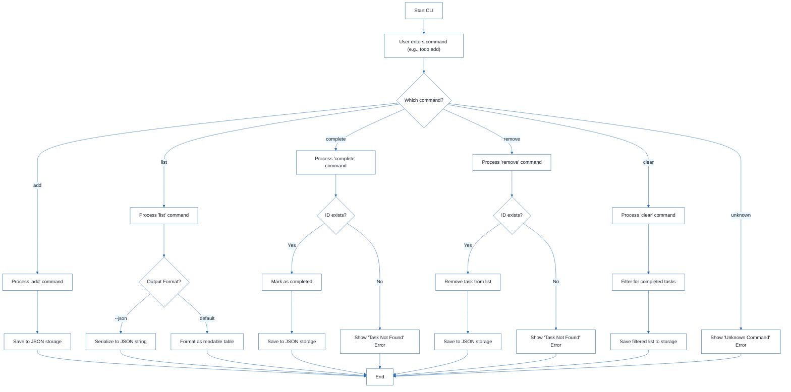
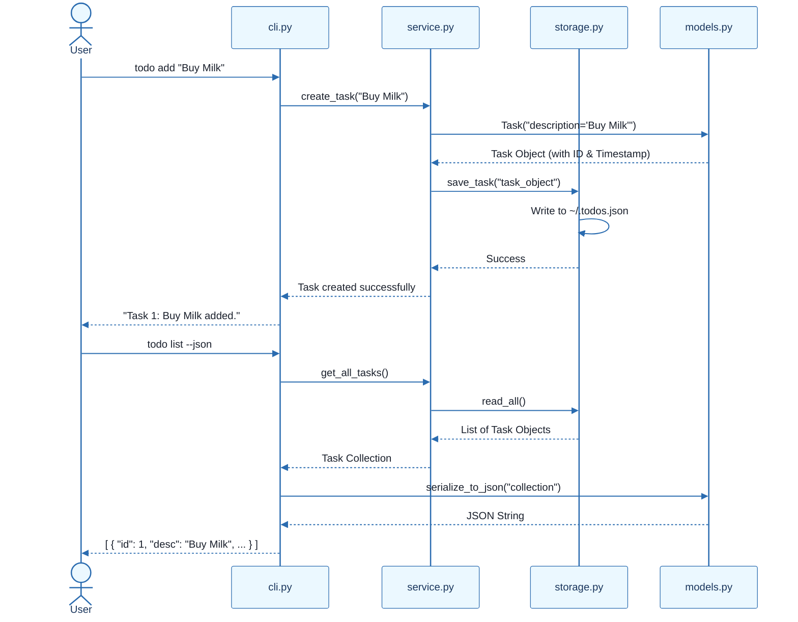
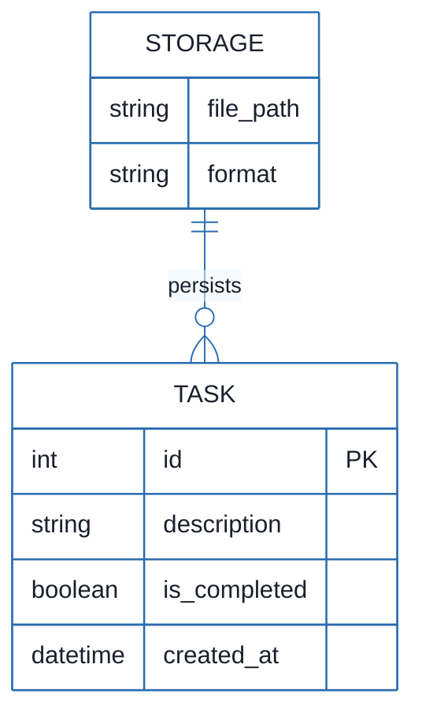

# CLI To-Do List Manager - Technical Specification & Architecture Document

## 1. Executive Summary & Architecture Overview

### 1.1 Executive Brief
The CLI To-Do List Manager is a Python-based command-line utility designed for efficient task management using a local JSON file for persistent storage. The system employs a service-oriented architecture to decouple command-line interface (CLI) parsing from core business logic and data I/O operations. This structure ensures that task creation, completion, listing, and removal are handled through a dedicated service layer, facilitating maintainability and testability.

### 1.2 Maturity Assessment
The project specifications are highly stable and logically sequenced, featuring a clear dependency graph from infrastructure setup to feature delivery. While minor gaps exist regarding explicit security and performance constraints for JSON storage, these are considered negligible given the tool's scope. The project is rated as **READY** for execution.

### 1.3 Technical Stack
* **Language**: Python
* **Configuration**: pyproject.toml
* **Storage**: JSON (Local File System)
* **Target Path**: `~/.todos.json`

### 1.4 Architectural Constraints
* **Sequential ID Assignment**: Task IDs must be assigned sequentially during creation.
* **Strict Serialization**: Data persistence must adhere to strict JSON serialization rules.
* **Dual Output Modes**: The system must support both human-readable and machine-parseable JSON output.
* **Blocking Foundation**: The Foundational phase (PHASE-2) must be 100% complete before any User Story implementation begins.
* **Validation**: Core commands (`add`, `list`, `complete`, `remove`, `clear`) must be validated via manual smoke tests against the local store.

### 1.5 Critical Dependencies
* **Storage I/O**: JSON file helpers located in `src/todo_manager/storage.py`.
* **Data Modeling**: Task entity definitions and serialization in `src/todo_manager/models.py`.
* **Service Layer**: Shared error handling and collection utilities in `src/todo_manager/service.py`.
* **Referential Integrity**: Strict mapping between CLI command inputs and service-layer logic.
* **Persistence**: Guaranteed write-back of removals and clears to the local JSON store.

## 2. Architecture Workflows

```mermaid
%%{init: {
  'theme': 'base',
  'themeVariables': {
    'primaryColor': '#1A365D',
    'primaryTextColor': '#1A202C',
    'primaryBorderColor': '#2B6CB0',
    'lineColor': '#2B6CB0',
    'secondaryColor': '#EBF8FF',
    'tertiaryColor': '#EBF8FF',
    'background': '#FFFFFF',
    'mainBkg': '#FFFFFF',
    'secondBkg': '#EBF8FF',
    'tertiaryBkg': '#F7FAFC',
    'secondaryTextColor': '#4A5568',
    'fontSize': '16px',
    'fontFamily': 'Inter, system-ui, sans-serif',
    'nodePadding': '15px',
    'borderRadius': '8px',
    'edgeLabelBackground': '#EBF8FF',
    'clusterBkg': '#F7FAFC',
    'clusterBorder': '#2B6CB0',
    'defaultLinkColor': '#2B6CB0',
    'titleColor': '#1A365D',
    'actorBorder': '#2B6CB0',
    'actorBkg': '#EBF8FF',
    'actorTextColor': '#1A365D',
    'actorLineColor': '#2B6CB0',
    'signalColor': '#2B6CB0',
    'signalTextColor': '#1A202C',
    'labelBoxBorderColor': '#2B6CB0',
    'labelBoxBkgColor': '#EBF8FF',
    'labelTextColor': '#1A202C',
    'loopTextColor': '#1A202C',
    'arrowHeadColor': '#2B6CB0',
    'sequenceNumberColor': '#1A365D',
    'sequenceActorBorder': '#2B6CB0',
    'sequenceActorBkg': '#EBF8FF',
    'sequenceArrowColor': '#2B6CB0',
    'noteBkgColor': '#FFF5EB',
    'noteBorderColor': '#DD6B20',
    'noteTextColor': '#1A202C'
  }
}}%%
flowchart TD
    subgraph Setup_Phase ["Phase 1: Setup"]
        PHASE-1["PHASE-1: Setup (Shared Infrastructure)"]
        T001["T001: Create Python package skeleton"]
        T002["T002: Create test directory structure"]
        T003["T003: Add project metadata"]
        PHASE-1 --> T001
        PHASE-1 --> T002
        PHASE-1 --> T003
    end
    subgraph Foundational_Phase ["Phase 2: Foundational"]
        PHASE-2["PHASE-2: Foundational (Blocking Prerequisites)"]
        T004["T004: Implement task entity definitions"]
        T005["T005: Implement JSON storage I/O"]
        T006["T006: Implement CLI parsing"]
        T007["T007: Implement service-layer error handling"]
        T008["T008: Define module entry behavior"]
        PHASE-2 --> T004
        PHASE-2 --> T005
        PHASE-2 --> T006
        PHASE-2 --> T007
        PHASE-2 --> T008
    end
    subgraph US1_Phase ["Phase 3: User Story 1"]
        PHASE-3["PHASE-3: User Story 1 - Add and Manage Tasks"]
        T009["T009: Implement add command flow"]
        T010["T010: Implement task creation logic"]
        T011["T011: Implement completion updates"]
        T012["T012: Add user-facing messages"]
        AC-US1["AC-US1: Create and mark tasks completed"]
        PHASE-3 --> T009
        PHASE-3 --> T010
        PHASE-3 --> T011
        PHASE-3 --> T012
        PHASE-3 --> AC-US1
    end
    subgraph US2_Phase ["Phase 4: User Story 2"]
        PHASE-4["PHASE-4: User Story 2 - View and Filter Tasks"]
        T013["T013: Implement human-readable output"]
        T014["T014: Implement JSON output formatting"]
        T015["T015: Add listing logic"]
        T016["T016: Handle empty-list case"]
        AC-US2["AC-US2: List tasks in readable/JSON form"]
        PHASE-4 --> T013
        PHASE-4 --> T014
        PHASE-4 --> T015
        PHASE-4 --> T016
        PHASE-4 --> AC-US2
    end
    subgraph US3_Phase ["Phase 5: User Story 3"]
        PHASE-5["PHASE-5: User Story 3 - Remove and Clear Tasks"]
        T017["T017: Implement remove command flow"]
        T018["T018: Implement clear command flow"]
        T019["T019: Add not-found handling"]
        T020["T020: Ensure storage persistence"]
        AC-US3["AC-US3: Remove single or clear completed tasks"]
        PHASE-5 --> T017
        PHASE-5 --> T018
        PHASE-5 --> T019
        PHASE-5 --> T020
        PHASE-5 --> AC-US3
    end
    subgraph Polish_Phase ["Phase 6: Polish"]
        PHASE-6["PHASE-6: Polish & Cross-Cutting Concerns"]
        T021["T021: Document CLI usage"]
        T022["T022: Add quickstart notes"]
        T023["T023: Manual smoke test"]
        T024["T024: Verify linting"]
        T025["T025: Confirm JSON parseability"]
        PHASE-6 --> T021
        PHASE-6 --> T022
        PHASE-6 --> T023
        PHASE-6 --> T024
        PHASE-6 --> T025
    end
    PHASE-2 -->|"depends_on"| PHASE-1
    PHASE-3 -->|"depends_on"| PHASE-2
    PHASE-4 -->|"depends_on"| PHASE-2
    PHASE-5 -->|"depends_on"| PHASE-2
    PHASE-6 -->|"depends_on"| PHASE-3
    PHASE-6 -->|"depends_on"| PHASE-4
    PHASE-6 -->|"depends_on"| PHASE-5
```







```mermaid
%%{init: {
  'theme': 'base',
  'themeVariables': {
    'primaryColor': '#1A365D',
    'primaryTextColor': '#1A202C',
    'primaryBorderColor': '#2B6CB0',
    'lineColor': '#2B6CB0',
    'secondaryColor': '#EBF8FF',
    'tertiaryColor': '#EBF8FF',
    'background': '#FFFFFF',
    'mainBkg': '#FFFFFF',
    'secondBkg': '#EBF8FF',
    'tertiaryBkg': '#F7FAFC',
    'secondaryTextColor': '#4A5568',
    'fontSize': '16px',
    'fontFamily': 'Inter, system-ui, sans-serif',
    'nodePadding': '15px',
    'borderRadius': '8px',
    'edgeLabelBackground': '#EBF8FF',
    'clusterBkg': '#F7FAFC',
    'clusterBorder': '#2B6CB0',
    'defaultLinkColor': '#2B6CB0',
    'titleColor': '#1A365D',
    'actorBorder': '#2B6CB0',
    'actorBkg': '#EBF8FF',
    'actorTextColor': '#1A365D',
    'actorLineColor': '#2B6CB0',
    'signalColor': '#2B6CB0',
    'signalTextColor': '#1A202C',
    'labelBoxBorderColor': '#2B6CB0',
    'labelBoxBkgColor': '#EBF8FF',
    'labelTextColor': '#1A202C',
    'loopTextColor': '#1A202C',
    'arrowHeadColor': '#2B6CB0',
    'sequenceNumberColor': '#1A365D',
    'sequenceActorBorder': '#2B6CB0',
    'sequenceActorBkg': '#EBF8FF',
    'sequenceArrowColor': '#2B6CB0',
    'noteBkgColor': '#FFF5EB',
    'noteBorderColor': '#DD6B20',
    'noteTextColor': '#1A202C'
  }
}}%%
erDiagram
    TASK {
        int id PK
        string description
        boolean is_completed
        datetime created_at
    }
    STORAGE {
        string file_path
        string format
    }
    STORAGE ||--o{ TASK : "persists"
``` & Visual Diagrams

### 2.1 Project Implementation Roadmap & Traceability
```mermaid
%%{init: {
  'theme': 'base',
  'themeVariables': {
    'primaryColor': '#1A365D',
    'primaryTextColor': '#1A202C',
    'primaryBorderColor': '#2B6CB0',
    'lineColor': '#2B6CB0',
    'secondaryColor': '#EBF8FF',
    'tertiaryColor': '#EBF8FF',
    'background': '#FFFFFF',
    'mainBkg': '#FFFFFF',
    'secondBkg': '#EBF8FF',
    'tertiaryBkg': '#F7FAFC',
    'secondaryTextColor': '#4A5568',
    'fontSize': '16px',
    'fontFamily': 'Inter, system-ui, sans-serif',
    'nodePadding': '15px',
    'borderRadius': '8px',
    'edgeLabelBackground': '#EBF8FF',
    'clusterBkg': '#F7FAFC',
    'clusterBorder': '#2B6CB0',
    'defaultLinkColor': '#2B6CB0',
    'titleColor': '#1A365D',
    'actorBorder': '#2B6CB0',
    'actorBkg': '#EBF8FF',
    'actorTextColor': '#1A365D',
    'actorLineColor': '#2B6CB0',
    'signalColor': '#2B6CB0',
    'signalTextColor': '#1A202C',
    'labelBoxBorderColor': '#2B6CB0',
    'labelBoxBkgColor': '#EBF8FF',
    'labelTextColor': '#1A202C',
    'loopTextColor': '#1A202C',
    'arrowHeadColor': '#2B6CB0',
    'sequenceNumberColor': '#1A365D',
    'sequenceActorBorder': '#2B6CB0',
    'sequenceActorBkg': '#EBF8FF',
    'sequenceArrowColor': '#2B6CB0',
    'noteBkgColor': '#FFF5EB',
    'noteBorderColor': '#DD6B20',
    'noteTextColor': '#1A202C'
  }
}}%%
flowchart TD
    subgraph Setup_Phase ["Phase 1: Setup"]
        PHASE-1["PHASE-1: Setup (Shared Infrastructure)"]
        T001["T001: Create Python package skeleton"]
        T002["T002: Create test directory structure"]
        T003["T003: Add project metadata"]
        PHASE-1 --> T001
        PHASE-1 --> T002
        PHASE-1 --> T003
    end
    subgraph Foundational_Phase ["Phase 2: Foundational"]
        PHASE-2["PHASE-2: Foundational (Blocking Prerequisites)"]
        T004["T004: Implement task entity definitions"]
        T005["T005: Implement JSON storage I/O"]
        T006["T006: Implement CLI parsing"]
        T007["T007: Implement service-layer error handling"]
        T008["T008: Define module entry behavior"]
        PHASE-2 --> T004
        PHASE-2 --> T005
        PHASE-2 --> T006
        PHASE-2 --> T007
        PHASE-2 --> T008
    end
    subgraph US1_Phase ["Phase 3: User Story 1"]
        PHASE-3["PHASE-3: User Story 1 - Add and Manage Tasks"]
        T009["T009: Implement add command flow"]
        T010["T010: Implement task creation logic"]
        T011["T011: Implement completion updates"]
        T012["T012: Add user-facing messages"]
        AC-US1["AC-US1: Create and mark tasks completed"]
        PHASE-3 --> T009
        PHASE-3 --> T010
        PHASE-3 --> T011
        PHASE-3 --> T012
        PHASE-3 --> AC-US1
    end
    subgraph US2_Phase ["Phase 4: User Story 2"]
        PHASE-4["PHASE-4: User Story 2 - View and Filter Tasks"]
        T013["T013: Implement human-readable output"]
        T014["T014: Implement JSON output formatting"]
        T015["T015: Add listing logic"]
        T016["T016: Handle empty-list case"]
        AC-US2["AC-US2: List tasks in readable/JSON form"]
        PHASE-4 --> T013
        PHASE-4 --> T014
        PHASE-4 --> T015
        PHASE-4 --> T016
        PHASE-4 --> AC-US2
    end
    subgraph US3_Phase ["Phase 5: User Story 3"]
        PHASE-5["PHASE-5: User Story 3 - Remove and Clear Tasks"]
        T017["T017: Implement remove command flow"]
        T018["T018: Implement clear command flow"]
        T019["T019: Add not-found handling"]
        T020["T020: Ensure storage persistence"]
        AC-US3["AC-US3: Remove single or clear completed tasks"]
        PHASE-5 --> T017
        PHASE-5 --> T018
        PHASE-5 --> T019
        PHASE-5 --> T020
        PHASE-5 --> AC-US3
    end
    subgraph Polish_Phase ["Phase 6: Polish"]
        PHASE-6["PHASE-6: Polish & Cross-Cutting Concerns"]
        T021["T021: Document CLI usage"]
        T022["T022: Add quickstart notes"]
        T023["T023: Manual smoke test"]
        T024["T024: Verify linting"]
        T025["T025: Confirm JSON parseability"]
        PHASE-6 --> T021
        PHASE-6 --> T022
        PHASE-6 --> T023
        PHASE-6 --> T024
        PHASE-6 --> T025
    end
    PHASE-2 -->|"depends_on"| PHASE-1
    PHASE-3 -->|"depends_on"| PHASE-2
    PHASE-4 -->|"depends_on"| PHASE-2
    PHASE-5 -->|"depends_on"| PHASE-2
    PHASE-6 -->|"depends_on"| PHASE-3
    PHASE-6 -->|"depends_on"| PHASE-4
    PHASE-6 -->|"depends_on"| PHASE-5
```

### 2.2 CLI Command Execution Workflow


### 2.3 CLI To-Do Manager Sequence


### 2.4 To-Do Data Model


## 3. Detailed Technical Specifications & Business Rules

### 3.1 Requirements Traceability
| ID | Description | Source Phase | Target File(s) |
| :--- | :--- | :--- | :--- |
| T001 | Create the Python package skeleton | PHASE-1 | `src/todo_manager/` |
| T002 | Create the test directory structure | PHASE-1 | `tests/unit/`, `tests/integration/` |
| T003 | Add project metadata and tooling entry points | PHASE-1 | `pyproject.toml` |
| T004 | Implement task entity definitions and serialization | PHASE-2 | `src/todo_manager/models.py` |
| T005 | Implement JSON storage path resolution and I/O | PHASE-2 | `src/todo_manager/storage.py` |
| T006 | Implement shared CLI parsing and dispatch | PHASE-2 | `src/todo_manager/cli.py` |
| T007 | Implement shared service-layer error handling | PHASE-2 | `src/todo_manager/service.py` |
| T008 | Define module entry behavior | PHASE-2 | `src/todo_manager/__main__.py` |
| T009 | Implement the `add` command flow | PHASE-3 | `cli.py`, `service.py` |
| T010 | Implement task creation, ID assignment, and timestamp | PHASE-3 | `src/todo_manager/models.py` |
| T011 | Implement completion updates for existing tasks | PHASE-3 | `src/todo_manager/service.py` |
| T012 | Add user-facing success and error messages | PHASE-3 | `src/todo_manager/cli.py` |
| T013 | Implement human-readable task listing output | PHASE-4 | `src/todo_manager/cli.py` |
| T014 | Implement `--json` output formatting | PHASE-4 | `src/todo_manager/cli.py` |
| T015 | Add listing logic preserving order and status | PHASE-4 | `src/todo_manager/service.py` |
| T016 | Handle the empty-list case with a clear message | PHASE-4 | `src/todo_manager/cli.py` |
| T017 | Implement the `remove` command flow | PHASE-5 | `cli.py`, `service.py` |
| T018 | Implement the `clear` command flow (completed tasks) | PHASE-5 | `src/todo_manager/service.py` |
| T019 | Add not-found handling for invalid task IDs | PHASE-5 | `src/todo_manager/cli.py` |
| T020 | Ensure storage writes persist removals and clears | PHASE-5 | `src/todo_manager/storage.py` |
| T021 | Document CLI usage and storage behavior | PHASE-6 | `README.md` |
| T022 | Add quickstart verification notes and examples | PHASE-6 | `specs/001-cli-todo-manager/quickstart.md` |
| T023 | Manual smoke test of all core commands | PHASE-6 | `~/.todos.json` |
| T024 | Verify linting and formatting expectations | PHASE-6 | `src/todo_manager/` |
| T025 | Confirm generated JSON output remains parseable | PHASE-6 | `todo list --json` |

### 3.2 Security Rules
* **Input Sanitization**: While not explicitly detailed in the source, all CLI inputs must be sanitized to prevent injection or file system traversal via the JSON path.
* **File Permissions**: The `~/.todos.json` file should be handled with appropriate user-level permissions to prevent unauthorized access.

### 3.3 Data Models
The system utilizes a flat-file JSON structure. The primary entity is the **Task**, defined as:
* `id` (Integer): Unique sequential identifier.
* `description` (String): The text content of the task.
* `is_completed` (Boolean): Status flag.
* `created_at` (DateTime): ISO 8601 timestamp of creation.

## 4. Project Governance & Structural Gaps

### 4.1 Structural Gaps
| Gap | Priority | Remediation Advice |
| :--- | :--- | :--- |
| Security & Performance Constraints | LOW | Implement constraints on JSON file size and input sanitization to prevent memory overflow or malicious input. |
| Open Questions & Uncertainties | LOW | No open questions were identified in the source documentation. |

### 4.2 Remediation & Workflow
The project follows an incremental delivery model:
1. **Infrastructure First**: Setup $\rightarrow$ Foundational.
2. **Feature Slicing**: US1 (MVP) $\rightarrow$ US2 $\rightarrow$ US3.
3. **Final Validation**: Polish $\rightarrow$ Smoke Tests.

## 5. Technical & Domain Glossary (Terminology Reference)

| Term | Category | Context Anchor | Project Definition |
| :--- | :--- | :--- | :--- |
| Checkpoint | TECHNICAL_STACK | PHASE-2 | A synchronization gate ensuring all blocking infrastructure is verified before parallel feature development commences. |
| Foundational | TECHNICAL_STACK | PHASE-2 | The core shared infrastructure layer containing serialization and I/O helpers that block all subsequent user story implementations. |
| Goal | BUSINESS_DOMAIN | PHASE-3 | The high-level functional objective a user must achieve to satisfy a specific requirement. |
| ID | TECHNICAL_STACK | T010 | A sequential alphanumeric token assigned to each entry to ensure unique reference and retrieval. |
| JSON | TECHNICAL_STACK | T005 | The lightweight data-interchange format used for persistent storage in the home directory. |
| MVP | BUSINESS_DOMAIN | PHASE-3 | The minimum set of functional capabilities, specifically adding and completing entries, required for initial validation. |
| Organization | BUSINESS_DOMAIN | Tasks: CLI To-Do List Manager | The structural grouping of implementation units by their corresponding user story to maintain independence. |
| Prerequisites | TECHNICAL_STACK | Tasks: CLI To-Do List Manager | The set of mandatory design documents and contracts required before implementation begins. |
| README | TECHNICAL_STACK | T021 | The primary documentation file detailing usage and storage behavior for the end user. |
| Setup | TECHNICAL_STACK | PHASE-1 | The initial phase involving package skeleton creation and tooling configuration. |
| T016 | TECHNICAL_STACK | T016 | The specific implementation unit responsible for handling empty collection states with a user-facing message. |
| Tests | TECHNICAL_STACK | T002 | The verification layer consisting of unit and integration directory structures. |
| population in | TECHNICAL_STACK | T010 | The act of assigning a timestamp to the creation field during entry instantiation. |
| todo clear | BUSINESS_DOMAIN | T018 | The operational command that purges all entries marked as finished from the persistent store. |
| todo list | BUSINESS_DOMAIN | T013 | The operational command that retrieves and displays all stored entries in human-readable or machine-parseable formats. |
| ⚠️ CRITICAL | TECHNICAL_STACK | PHASE-2 | A high-priority constraint indicating that no subsequent work can proceed until the current phase is fully validated. |