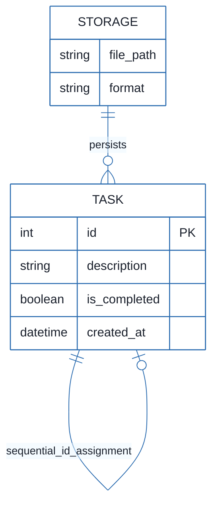
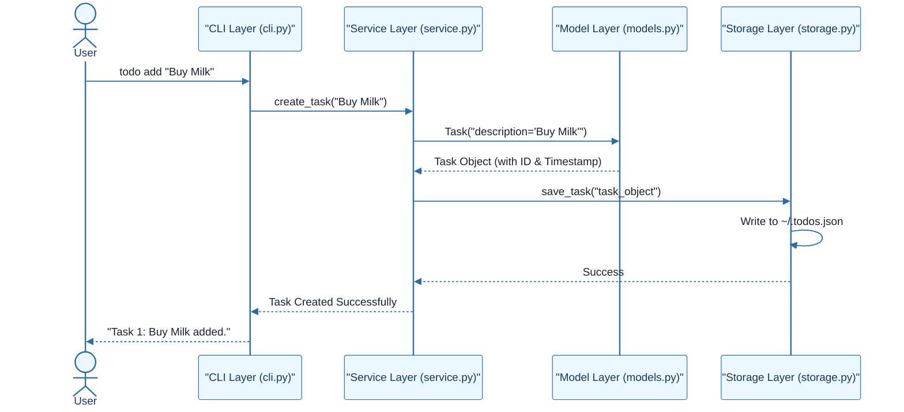

# CLI To-Do List Manager - Technical Specification & Architecture Document

## 1. Executive Summary & Architecture Overview

### 1.1 Executive Brief
The CLI To-Do List Manager is a Python-based command-line application designed for efficient task lifecycle management. The system utilizes a service-oriented architecture to decouple the user interface (CLI dispatch), business logic (Service layer), and data persistence (JSON storage). This separation ensures that the application remains maintainable and that the storage mechanism can be evolved independently of the business rules.

### 1.2 Maturity Assessment
The project is **READY** for execution. While a medium-severity gap exists regarding formal acceptance criteria for individual tasks, the inclusion of "Independent Tests" for each User Story provides sufficient validation gates to ensure functional correctness and successful delivery.

### 1.3 Technical Stack
* **Language**: Python
* **Configuration**: pyproject.toml
* **Storage**: JSON (Local File System)
* **Testing**: Unit and Integration test suites

### 1.4 Architectural Constraints
* **Persistence**: All data must be persisted in `~/.todos.json`.
* **Identity**: New tasks must follow a strict sequential ID assignment.
* **Audit**: Mandatory population of the `created_at` timestamp for every entry.
* **Output**: Support for dual output modes: human-readable and parseable JSON.
* **Execution Flow**: Strict linear dependency: Setup $\rightarrow$ Foundational $\rightarrow$ User Stories $\rightarrow$ Polish.
* **Blocking Gate**: The Foundational phase (PHASE-2) is a mandatory blocking prerequisite for all feature implementation.

### 1.5 Critical Dependencies
* **File System I/O**: Reliable read/write access to `~/.todos.json`.
* **ID Integrity**: Maintenance of sequential ID integrity for accurate task referencing.
* **Phase Sequence**: PHASE-2 must be complete before US1, US2, or US3.
* **Feature Completion**: All User Stories (US1, US2, US3) must be complete before Phase 6 (Polish).
* **Internal Mapping**: Task serialization helpers in `models.py` are critical for both storage and JSON output.

## 2. Architecture Workflows

```mermaid
%%{init: {
  'theme': 'base',
  'themeVariables': {
    'primaryColor': '#1A365D',
    'primaryTextColor': '#1A202C',
    'primaryBorderColor': '#2B6CB0',
    'lineColor': '#2B6CB0',
    'secondaryColor': '#EBF8FF',
    'tertiaryColor': '#EBF8FF',
    'background': '#FFFFFF',
    'mainBkg': '#FFFFFF',
    'secondBkg': '#EBF8FF',
    'tertiaryBkg': '#F7FAFC',
    'secondaryTextColor': '#4A5568',
    'fontSize': '16px',
    'fontFamily': 'Inter, system-ui, sans-serif',
    'nodePadding': '15px',
    'borderRadius': '8px',
    'edgeLabelBackground': '#EBF8FF',
    'clusterBkg': '#F7FAFC',
    'clusterBorder': '#2B6CB0',
    'defaultLinkColor': '#2B6CB0',
    'titleColor': '#1A365D',
    'actorBorder': '#2B6CB0',
    'actorBkg': '#EBF8FF',
    'actorTextColor': '#1A365D',
    'actorLineColor': '#2B6CB0',
    'signalColor': '#2B6CB0',
    'signalTextColor': '#1A202C',
    'labelBoxBorderColor': '#2B6CB0',
    'labelBoxBkgColor': '#EBF8FF',
    'labelTextColor': '#1A202C',
    'loopTextColor': '#1A202C',
    'arrowHeadColor': '#2B6CB0',
    'sequenceNumberColor': '#1A365D',
    'sequenceActorBorder': '#2B6CB0',
    'sequenceActorBkg': '#EBF8FF',
    'sequenceArrowColor': '#2B6CB0',
    'noteBkgColor': '#FFF5EB',
    'noteBorderColor': '#DD6B20',
    'noteTextColor': '#1A202C'
  }
}}%%
flowchart TD
    subgraph Setup_Phase ["Phase 1: Setup"]
        PHASE-1["PHASE-1: Setup (Shared Infrastructure)"]
        T001["T001: Package Skeleton"]
        T002["T002: Test Structure"]
        T003["T003: Project Metadata"]
        PHASE-1 --> T001
        PHASE-1 --> T002
        PHASE-1 --> T003
    end
    subgraph Foundational_Phase ["Phase 2: Foundational"]
        PHASE-2["PHASE-2: Foundational (Blocking Prerequisites)"]
        T004["T004: Entity Definitions"]
        T005["T005: JSON Storage I/O"]
        T006["T006: CLI Parsing"]
        T007["T007: Service Error Handling"]
        T008["T008: Module Entry"]
        PHASE-2 --> T004
        PHASE-2 --> T005
        PHASE-2 --> T006
        PHASE-2 --> T007
        PHASE-2 --> T008
    end
    subgraph US1_Phase ["Phase 3: User Story 1"]
        PHASE-3["PHASE-3: US1 - Add and Manage Tasks"]
        T009["T009: Add Command Flow"]
        T010["T010: Task Creation Logic"]
        T011["T011: Completion Updates"]
        T012["T012: User Messaging"]
        TEST-US1["TEST-US1: Add/Complete Validation"]
        PHASE-3 --> T009
        PHASE-3 --> T010
        PHASE-3 --> T011
        PHASE-3 --> T012
        PHASE-3 --> TEST-US1
    end
    subgraph US2_Phase ["Phase 4: User Story 2"]
        PHASE-4["PHASE-4: US2 - View and Filter Tasks"]
        T013["T013: Human-Readable List"]
        T014["T014: JSON Formatting"]
        T015["T015: Listing Logic"]
        T016["T016: Empty List Handling"]
        TEST-US2["TEST-US2: List/JSON Validation"]
        PHASE-4 --> T013
        PHASE-4 --> T014
        PHASE-4 --> T015
        PHASE-4 --> T016
        PHASE-4 --> TEST-US2
    end
    subgraph US3_Phase ["Phase 5: User Story 3"]
        PHASE-5["PHASE-5: US3 - Remove and Clear Tasks"]
        T017["T017: Remove Command Flow"]
        T018["T018: Clear Completed Flow"]
        T019["T019: Not-Found Handling"]
        T020["T020: Storage Persistence"]
        TEST-US3["TEST-US3: Remove/Clear Validation"]
        PHASE-5 --> T017
        PHASE-5 --> T018
        PHASE-5 --> T019
        PHASE-5 --> T020
        PHASE-5 --> TEST-US3
    end
    subgraph Polish_Phase ["Phase 6: Polish"]
        PHASE-6["PHASE-6: Polish & Cross-Cutting"]
        T021["T021: Documentation"]
        T022["T022: Quickstart Notes"]
        T023["T023: Smoke Tests"]
        T024["T024: Linting/Formatting"]
        T025["T025: JSON Parse Verification"]
        PHASE-6 --> T021
        PHASE-6 --> T022
        PHASE-6 --> T023
        PHASE-6 --> T024
        PHASE-6 --> T025
    end
    PHASE-2 -->|"depends_on"| PHASE-1
    PHASE-3 -->|"depends_on"| PHASE-2
    PHASE-4 -->|"depends_on"| PHASE-2
    PHASE-5 -->|"depends_on"| PHASE-2
    PHASE-6 -->|"depends_on"| PHASE-3
    PHASE-6 -->|"depends_on"| PHASE-4
    PHASE-6 -->|"depends_on"| PHASE-5
```



```mermaid
%%{init: {
  'theme': 'base',
  'themeVariables': {
    'primaryColor': '#1A365D',
    'primaryTextColor': '#1A202C',
    'primaryBorderColor': '#2B6CB0',
    'lineColor': '#2B6CB0',
    'secondaryColor': '#EBF8FF',
    'tertiaryColor': '#EBF8FF',
    'background': '#FFFFFF',
    'mainBkg': '#FFFFFF',
    'secondBkg': '#EBF8FF',
    'tertiaryBkg': '#F7FAFC',
    'secondaryTextColor': '#4A5568',
    'fontSize': '16px',
    'fontFamily': 'Inter, system-ui, sans-serif',
    'nodePadding': '15px',
    'borderRadius': '8px',
    'edgeLabelBackground': '#EBF8FF',
    'clusterBkg': '#F7FAFC',
    'clusterBorder': '#2B6CB0',
    'defaultLinkColor': '#2B6CB0',
    'titleColor': '#1A365D',
    'actorBorder': '#2B6CB0',
    'actorBkg': '#EBF8FF',
    'actorTextColor': '#1A365D',
    'actorLineColor': '#2B6CB0',
    'signalColor': '#2B6CB0',
    'signalTextColor': '#1A202C',
    'labelBoxBorderColor': '#2B6CB0',
    'labelBoxBkgColor': '#EBF8FF',
    'labelTextColor': '#1A202C',
    'loopTextColor': '#1A202C',
    'arrowHeadColor': '#2B6CB0',
    'sequenceNumberColor': '#1A365D',
    'sequenceActorBorder': '#2B6CB0',
    'sequenceActorBkg': '#EBF8FF',
    'sequenceArrowColor': '#2B6CB0',
    'noteBkgColor': '#FFF5EB',
    'noteBorderColor': '#DD6B20',
    'noteTextColor': '#1A202C'
  }
}}%%
flowchart TD
    START["Start: User enters command"] --> CMD_PARSE{"Command recognized?"}
    CMD_PARSE -- "No" --> ERR_CMD["Display Usage/Error Message"]
    ERR_CMD --> END["End"]
    CMD_PARSE -- "Yes" --> ARG_VAL{"Arguments Valid?"}
    ARG_VAL -- "No" --> ERR_ARG["Display Argument Error"]
    ERR_ARG --> END
    ARG_VAL -- "Yes" --> SVC_CALL["Call Service Layer Logic"]
    SVC_CALL --> DATA_OP{"Operation Successful?"}
    DATA_OP -- "No" --> ERR_SVC["Handle Service Error (T007)"]
    ERR_SVC --> END
    DATA_OP -- "Yes" --> FMT_DEC{"JSON Output Requested?"}
    FMT_DEC -- "Yes" --> FMT_JSON["Format as JSON (T014)"]
    FMT_DEC -- "No" --> FMT_HUMAN["Format as Human-Readable (T013)"]
    FMT_JSON --> SUCCESS_MSG["Display Success Message (T012)"]
    FMT_HUMAN --> SUCCESS_MSG
    SUCCESS_MSG --> END
```



```mermaid
%%{init: {
  'theme': 'base',
  'themeVariables': {
    'primaryColor': '#1A365D',
    'primaryTextColor': '#1A202C',
    'primaryBorderColor': '#2B6CB0',
    'lineColor': '#2B6CB0',
    'secondaryColor': '#EBF8FF',
    'tertiaryColor': '#EBF8FF',
    'background': '#FFFFFF',
    'mainBkg': '#FFFFFF',
    'secondBkg': '#EBF8FF',
    'tertiaryBkg': '#F7FAFC',
    'secondaryTextColor': '#4A5568',
    'fontSize': '16px',
    'fontFamily': 'Inter, system-ui, sans-serif',
    'nodePadding': '15px',
    'borderRadius': '8px',
    'edgeLabelBackground': '#EBF8FF',
    'clusterBkg': '#F7FAFC',
    'clusterBorder': '#2B6CB0',
    'defaultLinkColor': '#2B6CB0',
    'titleColor': '#1A365D',
    'actorBorder': '#2B6CB0',
    'actorBkg': '#EBF8FF',
    'actorTextColor': '#1A365D',
    'actorLineColor': '#2B6CB0',
    'signalColor': '#2B6CB0',
    'signalTextColor': '#1A202C',
    'labelBoxBorderColor': '#2B6CB0',
    'labelBoxBkgColor': '#EBF8FF',
    'labelTextColor': '#1A202C',
    'loopTextColor': '#1A202C',
    'arrowHeadColor': '#2B6CB0',
    'sequenceNumberColor': '#1A365D',
    'sequenceActorBorder': '#2B6CB0',
    'sequenceActorBkg': '#EBF8FF',
    'sequenceArrowColor': '#2B6CB0',
    'noteBkgColor': '#FFF5EB',
    'noteBorderColor': '#DD6B20',
    'noteTextColor': '#1A202C'
  }
}}%%
sequenceDiagram
    actor User
    participant CLI as "CLI Layer (cli.py)"
    participant SVC as "Service Layer (service.py)"
    participant MDL as "Model Layer (models.py)"
    participant STR as "Storage Layer (storage.py)"
    User->>CLI: todo add "Buy Milk"
    CLI->>SVC: create_task("Buy Milk")
    SVC->>MDL: Task("description='Buy Milk'")
    MDL-->>SVC: Task Object (with ID & Timestamp)
    SVC->>STR: save_task("task_object")
    STR->>STR: Write to ~/.todos.json
    STR-->>SVC: Success
    SVC-->>CLI: Task Created Successfully
    CLI-->>User: "Task 1: Buy Milk added."
``` & Visual Diagrams

### 2.1 Project Implementation Traceability Map
```mermaid
%%{init: {
  'theme': 'base',
  'themeVariables': {
    'primaryColor': '#1A365D',
    'primaryTextColor': '#1A202C',
    'primaryBorderColor': '#2B6CB0',
    'lineColor': '#2B6CB0',
    'secondaryColor': '#EBF8FF',
    'tertiaryColor': '#EBF8FF',
    'background': '#FFFFFF',
    'mainBkg': '#FFFFFF',
    'secondBkg': '#EBF8FF',
    'tertiaryBkg': '#F7FAFC',
    'secondaryTextColor': '#4A5568',
    'fontSize': '16px',
    'fontFamily': 'Inter, system-ui, sans-serif',
    'nodePadding': '15px',
    'borderRadius': '8px',
    'edgeLabelBackground': '#EBF8FF',
    'clusterBkg': '#F7FAFC',
    'clusterBorder': '#2B6CB0',
    'defaultLinkColor': '#2B6CB0',
    'titleColor': '#1A365D',
    'actorBorder': '#2B6CB0',
    'actorBkg': '#EBF8FF',
    'actorTextColor': '#1A365D',
    'actorLineColor': '#2B6CB0',
    'signalColor': '#2B6CB0',
    'signalTextColor': '#1A202C',
    'labelBoxBorderColor': '#2B6CB0',
    'labelBoxBkgColor': '#EBF8FF',
    'labelTextColor': '#1A202C',
    'loopTextColor': '#1A202C',
    'arrowHeadColor': '#2B6CB0',
    'sequenceNumberColor': '#1A365D',
    'sequenceActorBorder': '#2B6CB0',
    'sequenceActorBkg': '#EBF8FF',
    'sequenceArrowColor': '#2B6CB0',
    'noteBkgColor': '#FFF5EB',
    'noteBorderColor': '#DD6B20',
    'noteTextColor': '#1A202C'
  }
}}%%
flowchart TD
    subgraph Setup_Phase ["Phase 1: Setup"]
        PHASE-1["PHASE-1: Setup (Shared Infrastructure)"]
        T001["T001: Package Skeleton"]
        T002["T002: Test Structure"]
        T003["T003: Project Metadata"]
        PHASE-1 --> T001
        PHASE-1 --> T002
        PHASE-1 --> T003
    end
    subgraph Foundational_Phase ["Phase 2: Foundational"]
        PHASE-2["PHASE-2: Foundational (Blocking Prerequisites)"]
        T004["T004: Entity Definitions"]
        T005["T005: JSON Storage I/O"]
        T006["T006: CLI Parsing"]
        T007["T007: Service Error Handling"]
        T008["T008: Module Entry"]
        PHASE-2 --> T004
        PHASE-2 --> T005
        PHASE-2 --> T006
        PHASE-2 --> T007
        PHASE-2 --> T008
    end
    subgraph US1_Phase ["Phase 3: User Story 1"]
        PHASE-3["PHASE-3: US1 - Add and Manage Tasks"]
        T009["T009: Add Command Flow"]
        T010["T010: Task Creation Logic"]
        T011["T011: Completion Updates"]
        T012["T012: User Messaging"]
        TEST-US1["TEST-US1: Add/Complete Validation"]
        PHASE-3 --> T009
        PHASE-3 --> T010
        PHASE-3 --> T011
        PHASE-3 --> T012
        PHASE-3 --> TEST-US1
    end
    subgraph US2_Phase ["Phase 4: User Story 2"]
        PHASE-4["PHASE-4: US2 - View and Filter Tasks"]
        T013["T013: Human-Readable List"]
        T014["T014: JSON Formatting"]
        T015["T015: Listing Logic"]
        T016["T016: Empty List Handling"]
        TEST-US2["TEST-US2: List/JSON Validation"]
        PHASE-4 --> T013
        PHASE-4 --> T014
        PHASE-4 --> T015
        PHASE-4 --> T016
        PHASE-4 --> TEST-US2
    end
    subgraph US3_Phase ["Phase 5: User Story 3"]
        PHASE-5["PHASE-5: US3 - Remove and Clear Tasks"]
        T017["T017: Remove Command Flow"]
        T018["T018: Clear Completed Flow"]
        T019["T019: Not-Found Handling"]
        T020["T020: Storage Persistence"]
        TEST-US3["TEST-US3: Remove/Clear Validation"]
        PHASE-5 --> T017
        PHASE-5 --> T018
        PHASE-5 --> T019
        PHASE-5 --> T020
        PHASE-5 --> TEST-US3
    end
    subgraph Polish_Phase ["Phase 6: Polish"]
        PHASE-6["PHASE-6: Polish & Cross-Cutting"]
        T021["T021: Documentation"]
        T022["T022: Quickstart Notes"]
        T023["T023: Smoke Tests"]
        T024["T024: Linting/Formatting"]
        T025["T025: JSON Parse Verification"]
        PHASE-6 --> T021
        PHASE-6 --> T022
        PHASE-6 --> T023
        PHASE-6 --> T024
        PHASE-6 --> T025
    end
    PHASE-2 -->|"depends_on"| PHASE-1
    PHASE-3 -->|"depends_on"| PHASE-2
    PHASE-4 -->|"depends_on"| PHASE-2
    PHASE-5 -->|"depends_on"| PHASE-2
    PHASE-6 -->|"depends_on"| PHASE-3
    PHASE-6 -->|"depends_on"| PHASE-4
    PHASE-6 -->|"depends_on"| PHASE-5
```

### 2.2 CLI Command Execution Workflow
```mermaid
%%{init: {
  'theme': 'base',
  'themeVariables': {
    'primaryColor': '#1A365D',
    'primaryTextColor': '#1A202C',
    'primaryBorderColor': '#2B6CB0',
    'lineColor': '#2B6CB0',
    'secondaryColor': '#EBF8FF',
    'tertiaryColor': '#EBF8FF',
    'background': '#FFFFFF',
    'mainBkg': '#FFFFFF',
    'secondBkg': '#EBF8FF',
    'tertiaryBkg': '#F7FAFC',
    'secondaryTextColor': '#4A5568',
    'fontSize': '16px',
    'fontFamily': 'Inter, system-ui, sans-serif',
    'nodePadding': '15px',
    'borderRadius': '8px',
    'edgeLabelBackground': '#EBF8FF',
    'clusterBkg': '#F7FAFC',
    'clusterBorder': '#2B6CB0',
    'defaultLinkColor': '#2B6CB0',
    'titleColor': '#1A365D',
    'actorBorder': '#2B6CB0',
    'actorBkg': '#EBF8FF',
    'actorTextColor': '#1A365D',
    'actorLineColor': '#2B6CB0',
    'signalColor': '#2B6CB0',
    'signalTextColor': '#1A202C',
    'labelBoxBorderColor': '#2B6CB0',
    'labelBoxBkgColor': '#EBF8FF',
    'labelTextColor': '#1A202C',
    'loopTextColor': '#1A202C',
    'arrowHeadColor': '#2B6CB0',
    'sequenceNumberColor': '#1A365D',
    'sequenceActorBorder': '#2B6CB0',
    'sequenceActorBkg': '#EBF8FF',
    'sequenceArrowColor': '#2B6CB0',
    'noteBkgColor': '#FFF5EB',
    'noteBorderColor': '#DD6B20',
    'noteTextColor': '#1A202C'
  }
}}%%
flowchart TD
    START["Start: User enters command"] --> CMD_PARSE{"Command recognized?"}
    CMD_PARSE -- "No" --> ERR_CMD["Display Usage/Error Message"]
    ERR_CMD --> END["End"]
    CMD_PARSE -- "Yes" --> ARG_VAL{"Arguments Valid?"}
    ARG_VAL -- "No" --> ERR_ARG["Display Argument Error"]
    ERR_ARG --> END
    ARG_VAL -- "Yes" --> SVC_CALL["Call Service Layer Logic"]
    SVC_CALL --> DATA_OP{"Operation Successful?"}
    DATA_OP -- "No" --> ERR_SVC["Handle Service Error (T007)"]
    ERR_SVC --> END
    DATA_OP -- "Yes" --> FMT_DEC{"JSON Output Requested?"}
    FMT_DEC -- "Yes" --> FMT_JSON["Format as JSON (T014)"]
    FMT_DEC -- "No" --> FMT_HUMAN["Format as Human-Readable (T013)"]
    FMT_JSON --> SUCCESS_MSG["Display Success Message (T012)"]
    FMT_HUMAN --> SUCCESS_MSG
    SUCCESS_MSG --> END
```

### 2.3 CLI To-Do Manager Data Model


### 2.4 User Story Interaction Sequence


## 3. Detailed Technical Specifications & Business Rules

### 3.1 Requirements Traceability
| ID | Requirement / Task Description | Source Phase | Priority / Story |
| :--- | :--- | :--- | :--- |
| T001 | Create Python package skeleton (`__init__.py`, `__main__.py`, `cli.py`, `models.py`, `storage.py`, `service.py`) | PHASE-1 | Setup |
| T002 | Create test directory structure (`tests/unit/`, `tests/integration/`) | PHASE-1 | Setup |
| T003 | Add project metadata and tooling entry points in `pyproject.toml` | PHASE-1 | Setup |
| T004 | Implement task entity definitions and serialization helpers in `models.py` | PHASE-2 | Foundational |
| T005 | Implement JSON storage path resolution and file I/O helpers in `storage.py` | PHASE-2 | Foundational |
| T006 | Implement shared command-line parsing and top-level dispatch in `cli.py` | PHASE-2 | Foundational |
| T007 | Implement shared service-layer error handling and task collection utilities in `service.py` | PHASE-2 | Foundational |
| T008 | Define module entry behavior for `python -m todo_manager` in `__main__.py` | PHASE-2 | Foundational |
| T009 | Implement the `add` command flow in `cli.py` and `service.py` | PHASE-3 | US1 |
| T010 | Implement task creation, sequential ID assignment, and `created_at` population in `models.py` | PHASE-3 | US1 |
| T011 | Implement completion updates for existing tasks in `service.py` | PHASE-3 | US1 |
| T012 | Add user-facing success and error messages for add/complete in `cli.py` | PHASE-3 | US1 |
| T013 | Implement human-readable task listing output in `cli.py` | PHASE-4 | US2 |
| T014 | Implement `--json` output formatting in `cli.py` using `models.py` helpers | PHASE-4 | US2 |
| T015 | Add listing logic that preserves task order and status fields in `service.py` | PHASE-4 | US2 |
| T016 | Handle the empty-list case with a clear message in `cli.py` | PHASE-4 | US2 |
| T017 | Implement the `remove` command flow in `cli.py` and `service.py` | PHASE-5 | US3 |
| T018 | Implement the `clear` command flow for removing completed tasks in `service.py` | PHASE-5 | US3 |
| T019 | Add not-found handling for invalid task IDs in `cli.py` | PHASE-5 | US3 |
| T020 | Ensure storage writes persist removals and clears safely in `storage.py` | PHASE-5 | US3 |
| T021 | Document CLI usage and storage behavior in `README.md` | PHASE-6 | Polish |
| T022 | Add quickstart verification notes and examples in `quickstart.md` | PHASE-6 | Polish |
| T023 | Run manual smoke test of all commands against `~/.todos.json` | PHASE-6 | Polish |
| T024 | Verify linting and formatting expectations for `src/todo_manager/` | PHASE-6 | Polish |
| T025 | Confirm generated JSON output remains parseable for `todo list --json` | PHASE-6 | Polish |
| TEST-US1 | Validation: `todo add` and `todo complete` reflect in stored list | PHASE-3 | US1 |
| TEST-US2 | Validation: `todo list` and `todo list --json` output correctness | PHASE-4 | US2 |
| TEST-US3 | Validation: `todo remove` and `todo clear` target correct entries | PHASE-5 | US3 |

### 3.2 Security Rules
* **Data Integrity**: The system must ensure that sequential IDs are not duplicated during concurrent-like operations (though the tool is single-user CLI).
* **Input Validation**: All CLI arguments must be validated before being passed to the service layer to prevent crashes or corrupted JSON writes.
* **Error Handling**: Service-layer errors (T007) must be caught and translated into user-friendly messages in the CLI layer without leaking internal stack traces.

### 3.3 Data Models
* **Task Entity**:
    * `id` (Integer): Primary Key, sequential.
    * `description` (String): The task text.
    * `is_completed` (Boolean): Completion status.
    * `created_at` (DateTime): ISO 8601 timestamp.
* **Storage Entity**:
    * `file_path` (String): Path to `~/.todos.json`.
    * `format` (String): JSON.

## 4. Project Governance & Structural Gaps

### 4.1 Structural Gaps
| Gap | Priority | Remediation Advice |
| :--- | :--- | :--- |
| Acceptance Criteria | MEDIUM | While 'Independent Tests' are provided for User Stories, formal acceptance criteria for each individual task (T001-T025) are missing. |
| Security & Performance Constraints | LOW | No specific security or performance constraints were mentioned; however, for a CLI tool, this is generally acceptable. |
| Open Questions & Uncertainties | LOW | The document appears complete with no open questions listed. |

### 4.2 Remediation & Workflow
1. **Immediate Action**: Use the "Independent Tests" (TEST-US1, TEST-US2, TEST-US3) as the primary acceptance criteria for the associated task groups.
2. **Validation**: Perform the smoke tests (T023) as the final quality gate before project closure.

## 5. Technical & Domain Glossary (Terminology Reference)

| Term | Category | Context Anchor | Project Definition |
| :--- | :--- | :--- | :--- |
| Checkpoint | TECHNICAL_STACK | PHASE-2 | A synchronization gate ensuring all blocking infrastructure is verified before parallel feature development commences. |
| Foundational | TECHNICAL_STACK | PHASE-2 | The shared infrastructure layer containing core entity definitions, storage logic, and command dispatching that blocks all subsequent feature work. |
| Goal | BUSINESS_DOMAIN | PHASE-3 | The primary functional objective a user must achieve within a specific feature set. |
| ID | TECHNICAL_STACK | T010 | A sequential alphanumeric token assigned to each entry to ensure unique reference and retrieval. |
| JSON | TECHNICAL_STACK | T005 | The lightweight data-interchange format used for persistent storage in ~/.todos.json and for machine-readable output. |
| MVP | BUSINESS_DOMAIN | PHASE-3 | The minimum viable product consisting of the ability to create and mark entries as finished. |
| Organization | BUSINESS_DOMAIN | Tasks: CLI To-Do List Manager | The structural grouping of implementation units by user story to ensure independent testability. |
| Prerequisites | TECHNICAL_STACK | Tasks: CLI To-Do List Manager | The set of design documents including plan, spec, research, and data-model required before implementation. |
| README | TECHNICAL_STACK | T021 | The primary documentation file detailing usage and storage behavior. |
| Setup | TECHNICAL_STACK | PHASE-1 | The initial phase involving package skeleton creation and tooling configuration in pyproject.toml. |
| T016 | TECHNICAL_STACK | T016 | The specific implementation unit responsible for handling empty collection states with a user-facing message. |
| Tests | TECHNICAL_STACK | T002 | The verification suite divided into unit and integration directories. |
| population in | TECHNICAL_STACK | T010 | The process of assigning a timestamp to the created_at field during entity instantiation. |
| todo clear | BUSINESS_DOMAIN | T018 | The operation that removes all entries marked as finished from the persistent store. |
| todo list | BUSINESS_DOMAIN | T013 | The operation that retrieves and displays all entries in either human-readable or machine-parseable format. |
| ⚠️ CRITICAL | TECHNICAL_STACK | PHASE-2 | A high-priority constraint indicating that no subsequent work can begin until the current phase is fully validated. |