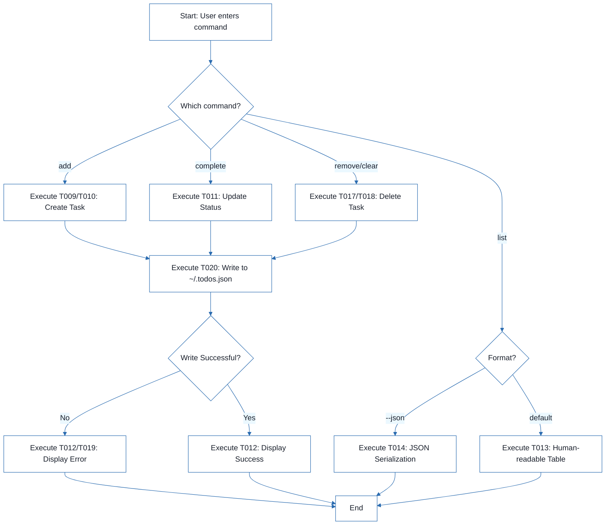
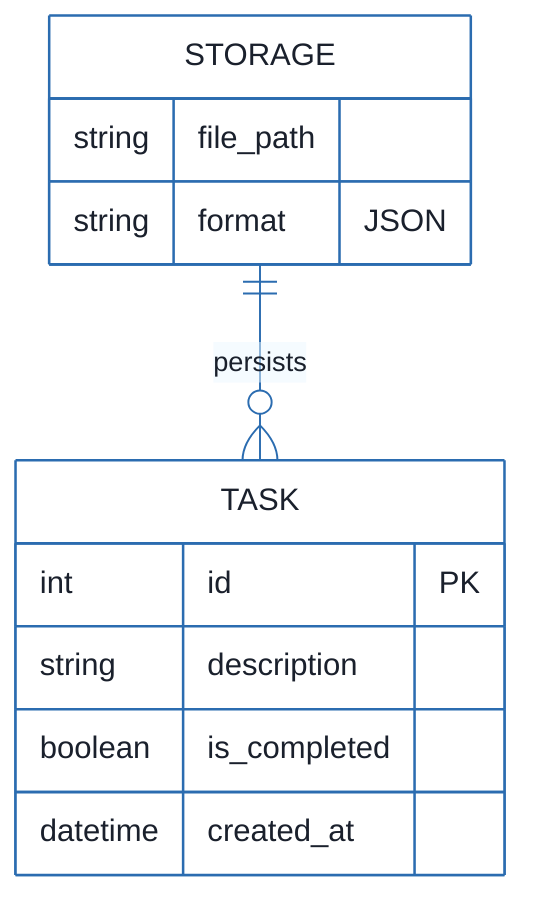
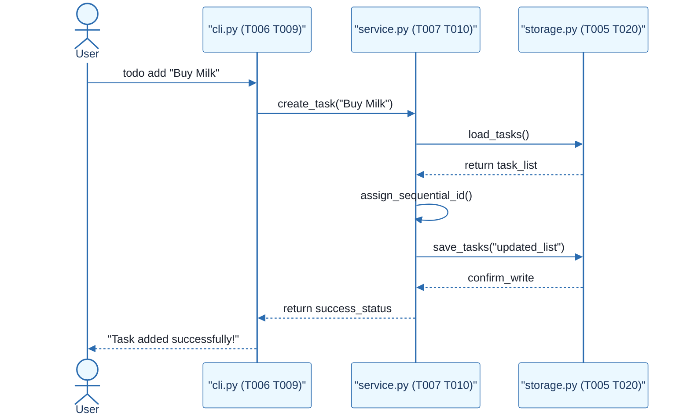

# CLI To-Do List Manager - Technical Specification & Architecture Document

## 1. Executive Summary & Architecture Overview

### 1.1 Executive Brief
The CLI To-Do List Manager is a Python-based command-line utility designed for task lifecycle management. It utilizes a local JSON file (`~/.todos.json`) for persistent storage, implementing a service-layer architecture to decouple CLI dispatching from data serialization and storage I/O. The system focuses on three core user stories: task creation/completion, filtered listing (human-readable and JSON), and targeted or bulk removal of tasks.

### 1.2 Maturity Assessment
The project is READY for execution. The structural integrity is high, with a clear phase-based roadmap and explicit task dependencies. While there are minor gaps regarding formal acceptance criteria and OS-level file permission constraints, the presence of 'Independent Tests' for each user story provides sufficient validation gates for the current scope.

### 1.3 Technical Stack
* Python
* pyproject.toml

### 1.4 Architectural Constraints
* Sequential ID assignment for task creation.
* Strict JSON serialization for data persistence.
* Human-readable and JSON output modes for listing.
* Storage path resolution targeting `~/.todos.json`.
* Blocking dependency: Foundational phase must be complete before any User Story implementation.
* Manual smoke test validation for all core commands (add, list, complete, remove, clear).

### 1.5 Critical Dependencies
* JSON file system I/O for `~/.todos.json`.
* Python package skeleton (`src/todo_manager/`).
* Sequential dependency: Setup $\rightarrow$ Foundational $\rightarrow$ User Stories $\rightarrow$ Polish.
* Internal data integrity: Task entity serialization helpers in `models.py` must precede service-layer implementation.
* CLI dispatch logic in `cli.py` as the primary entry point for all user stories.

## 2. Architecture Workflows

```mermaid
%%{init: {
  'theme': 'base',
  'themeVariables': {
    'primaryColor': '#1A365D',
    'primaryTextColor': '#1A202C',
    'primaryBorderColor': '#2B6CB0',
    'lineColor': '#2B6CB0',
    'secondaryColor': '#EBF8FF',
    'tertiaryColor': '#EBF8FF',
    'background': '#FFFFFF',
    'mainBkg': '#FFFFFF',
    'secondBkg': '#EBF8FF',
    'tertiaryBkg': '#F7FAFC',
    'secondaryTextColor': '#4A5568',
    'fontSize': '16px',
    'fontFamily': 'Inter, system-ui, sans-serif',
    'nodePadding': '15px',
    'borderRadius': '8px',
    'edgeLabelBackground': '#EBF8FF',
    'clusterBkg': '#F7FAFC',
    'clusterBorder': '#2B6CB0',
    'defaultLinkColor': '#2B6CB0',
    'titleColor': '#1A365D',
    'actorBorder': '#2B6CB0',
    'actorBkg': '#EBF8FF',
    'actorTextColor': '#1A365D',
    'actorLineColor': '#2B6CB0',
    'signalColor': '#2B6CB0',
    'signalTextColor': '#1A202C',
    'labelBoxBorderColor': '#2B6CB0',
    'labelBoxBkgColor': '#EBF8FF',
    'labelTextColor': '#1A202C',
    'loopTextColor': '#1A202C',
    'arrowHeadColor': '#2B6CB0',
    'sequenceNumberColor': '#1A365D',
    'sequenceActorBorder': '#2B6CB0',
    'sequenceActorBkg': '#EBF8FF',
    'sequenceArrowColor': '#2B6CB0',
    'noteBkgColor': '#FFF5EB',
    'noteBorderColor': '#DD6B20',
    'noteTextColor': '#1A202C'
  }
}}%%
flowchart TD
    subgraph S1 ["Phase 1: Setup"]
        PHASE-1["PHASE-1: Setup (Shared Infrastructure)"]
        T001["T001: Package Skeleton"]
        T002["T002: Test Structure"]
        T003["T003: Project Metadata"]
        PHASE-1 --> T001
        PHASE-1 --> T002
        PHASE-1 --> T003
    end
    subgraph S2 ["Phase 2: Foundational"]
        PHASE-2["PHASE-2: Foundational (Blocking Prerequisites)"]
        T004["T004: Entity Definitions"]
        T005["T005: JSON Storage I/O"]
        T006["T006: CLI Parsing"]
        T007["T007: Service Error Handling"]
        T008["T008: Module Entry"]
        PHASE-2 --> T004
        PHASE-2 --> T005
        PHASE-2 --> T006
        PHASE-2 --> T007
        PHASE-2 --> T008
    end
    subgraph S3 ["Phase 3: User Story 1"]
        PHASE-3["PHASE-3: US1 - Add and Manage Tasks"]
        T009["T009: Add Command Flow"]
        T010["T010: Task Creation Logic"]
        T011["T011: Completion Updates"]
        T012["T012: Success/Error Messages"]
        TEST-US1["TEST-US1: Add/Complete Validation"]
        PHASE-3 --> T009
        PHASE-3 --> T010
        PHASE-3 --> T011
        PHASE-3 --> T012
        PHASE-3 --> TEST-US1
    end
    subgraph S4 ["Phase 4: User Story 2"]
        PHASE-4["PHASE-4: US2 - View and Filter Tasks"]
        T013["T013: Human-readable List"]
        T014["T014: JSON Output Formatting"]
        T015["T015: Listing Logic"]
        T016["T016: Empty-list Handling"]
        TEST-US2["TEST-US2: List/JSON Validation"]
        PHASE-4 --> T013
        PHASE-4 --> T014
        PHASE-4 --> T015
        PHASE-4 --> T016
        PHASE-4 --> TEST-US2
    end
    subgraph S5 ["Phase 5: User Story 3"]
        PHASE-5["PHASE-5: US3 - Remove and Clear Tasks"]
        T017["T017: Remove Command Flow"]
        T018["T018: Clear Completed Flow"]
        T019["T019: Not-found Handling"]
        T020["T020: Storage Persistence"]
        TEST-US3["TEST-US3: Remove/Clear Validation"]
        PHASE-5 --> T017
        PHASE-5 --> T018
        PHASE-5 --> T019
        PHASE-5 --> T020
        PHASE-5 --> TEST-US3
    end
    subgraph S6 ["Phase 6: Polish"]
        PHASE-6["PHASE-6: Polish & Cross-Cutting"]
        T021["T021: README Documentation"]
        T022["T022: Quickstart Notes"]
        T023["T023: Manual Smoke Test"]
        T024["T024: Linting Verification"]
        T025["T025: JSON Parseability"]
        PHASE-6 --> T021
        PHASE-6 --> T022
        PHASE-6 --> T023
        PHASE-6 --> T024
        PHASE-6 --> T025
    end
    PHASE-2 --> PHASE-1
    PHASE-3 --> PHASE-2
    PHASE-4 --> PHASE-2
    PHASE-5 --> PHASE-2
    PHASE-6 --> PHASE-3
    PHASE-6 --> PHASE-4
    PHASE-6 --> PHASE-5
```







```mermaid
%%{init: {
  'theme': 'base',
  'themeVariables': {
    'primaryColor': '#1A365D',
    'primaryTextColor': '#1A202C',
    'primaryBorderColor': '#2B6CB0',
    'lineColor': '#2B6CB0',
    'secondaryColor': '#EBF8FF',
    'tertiaryColor': '#EBF8FF',
    'background': '#FFFFFF',
    'mainBkg': '#FFFFFF',
    'secondBkg': '#EBF8FF',
    'tertiaryBkg': '#F7FAFC',
    'secondaryTextColor': '#4A5568',
    'fontSize': '16px',
    'fontFamily': 'Inter, system-ui, sans-serif',
    'nodePadding': '15px',
    'borderRadius': '8px',
    'edgeLabelBackground': '#EBF8FF',
    'clusterBkg': '#F7FAFC',
    'clusterBorder': '#2B6CB0',
    'defaultLinkColor': '#2B6CB0',
    'titleColor': '#1A365D',
    'actorBorder': '#2B6CB0',
    'actorBkg': '#EBF8FF',
    'actorTextColor': '#1A365D',
    'actorLineColor': '#2B6CB0',
    'signalColor': '#2B6CB0',
    'signalTextColor': '#1A202C',
    'labelBoxBorderColor': '#2B6CB0',
    'labelBoxBkgColor': '#EBF8FF',
    'labelTextColor': '#1A202C',
    'loopTextColor': '#1A202C',
    'arrowHeadColor': '#2B6CB0',
    'sequenceNumberColor': '#1A365D',
    'sequenceActorBorder': '#2B6CB0',
    'sequenceActorBkg': '#EBF8FF',
    'sequenceArrowColor': '#2B6CB0',
    'noteBkgColor': '#FFF5EB',
    'noteBorderColor': '#DD6B20',
    'noteTextColor': '#1A202C'
  }
}}%%
sequenceDiagram
    actor User
    participant CLI as "cli.py (T006/T009)"
    participant SVC as "service.py (T007/T010)"
    participant STG as "storage.py (T005/T020)"
    User->>CLI: todo add "Buy Milk"
    CLI->>SVC: create_task("Buy Milk")
    SVC->>STG: load_tasks()
    STG-->>SVC: return task_list
    SVC->>SVC: assign_sequential_id()
    SVC->>STG: save_tasks("updated_list")
    STG-->>SVC: confirm_write
    SVC-->>CLI: return success_status
    CLI-->>User: "Task added successfully!"
``` & Visual Diagrams

### 2.1 Project Implementation Roadmap & Traceability
```mermaid
%%{init: {
  'theme': 'base',
  'themeVariables': {
    'primaryColor': '#1A365D',
    'primaryTextColor': '#1A202C',
    'primaryBorderColor': '#2B6CB0',
    'lineColor': '#2B6CB0',
    'secondaryColor': '#EBF8FF',
    'tertiaryColor': '#EBF8FF',
    'background': '#FFFFFF',
    'mainBkg': '#FFFFFF',
    'secondBkg': '#EBF8FF',
    'tertiaryBkg': '#F7FAFC',
    'secondaryTextColor': '#4A5568',
    'fontSize': '16px',
    'fontFamily': 'Inter, system-ui, sans-serif',
    'nodePadding': '15px',
    'borderRadius': '8px',
    'edgeLabelBackground': '#EBF8FF',
    'clusterBkg': '#F7FAFC',
    'clusterBorder': '#2B6CB0',
    'defaultLinkColor': '#2B6CB0',
    'titleColor': '#1A365D',
    'actorBorder': '#2B6CB0',
    'actorBkg': '#EBF8FF',
    'actorTextColor': '#1A365D',
    'actorLineColor': '#2B6CB0',
    'signalColor': '#2B6CB0',
    'signalTextColor': '#1A202C',
    'labelBoxBorderColor': '#2B6CB0',
    'labelBoxBkgColor': '#EBF8FF',
    'labelTextColor': '#1A202C',
    'loopTextColor': '#1A202C',
    'arrowHeadColor': '#2B6CB0',
    'sequenceNumberColor': '#1A365D',
    'sequenceActorBorder': '#2B6CB0',
    'sequenceActorBkg': '#EBF8FF',
    'sequenceArrowColor': '#2B6CB0',
    'noteBkgColor': '#FFF5EB',
    'noteBorderColor': '#DD6B20',
    'noteTextColor': '#1A202C'
  }
}}%%
flowchart TD
    subgraph S1 ["Phase 1: Setup"]
        PHASE-1["PHASE-1: Setup (Shared Infrastructure)"]
        T001["T001: Package Skeleton"]
        T002["T002: Test Structure"]
        T003["T003: Project Metadata"]
        PHASE-1 --> T001
        PHASE-1 --> T002
        PHASE-1 --> T003
    end
    subgraph S2 ["Phase 2: Foundational"]
        PHASE-2["PHASE-2: Foundational (Blocking Prerequisites)"]
        T004["T004: Entity Definitions"]
        T005["T005: JSON Storage I/O"]
        T006["T006: CLI Parsing"]
        T007["T007: Service Error Handling"]
        T008["T008: Module Entry"]
        PHASE-2 --> T004
        PHASE-2 --> T005
        PHASE-2 --> T006
        PHASE-2 --> T007
        PHASE-2 --> T008
    end
    subgraph S3 ["Phase 3: User Story 1"]
        PHASE-3["PHASE-3: US1 - Add and Manage Tasks"]
        T009["T009: Add Command Flow"]
        T010["T010: Task Creation Logic"]
        T011["T011: Completion Updates"]
        T012["T012: Success/Error Messages"]
        TEST-US1["TEST-US1: Add/Complete Validation"]
        PHASE-3 --> T009
        PHASE-3 --> T010
        PHASE-3 --> T011
        PHASE-3 --> T012
        PHASE-3 --> TEST-US1
    end
    subgraph S4 ["Phase 4: User Story 2"]
        PHASE-4["PHASE-4: US2 - View and Filter Tasks"]
        T013["T013: Human-readable List"]
        T014["T014: JSON Output Formatting"]
        T015["T015: Listing Logic"]
        T016["T016: Empty-list Handling"]
        TEST-US2["TEST-US2: List/JSON Validation"]
        PHASE-4 --> T013
        PHASE-4 --> T014
        PHASE-4 --> T015
        PHASE-4 --> T016
        PHASE-4 --> TEST-US2
    end
    subgraph S5 ["Phase 5: User Story 3"]
        PHASE-5["PHASE-5: US3 - Remove and Clear Tasks"]
        T017["T017: Remove Command Flow"]
        T018["T018: Clear Completed Flow"]
        T019["T019: Not-found Handling"]
        T020["T020: Storage Persistence"]
        TEST-US3["TEST-US3: Remove/Clear Validation"]
        PHASE-5 --> T017
        PHASE-5 --> T018
        PHASE-5 --> T019
        PHASE-5 --> T020
        PHASE-5 --> TEST-US3
    end
    subgraph S6 ["Phase 6: Polish"]
        PHASE-6["PHASE-6: Polish & Cross-Cutting"]
        T021["T021: README Documentation"]
        T022["T022: Quickstart Notes"]
        T023["T023: Manual Smoke Test"]
        T024["T024: Linting Verification"]
        T025["T025: JSON Parseability"]
        PHASE-6 --> T021
        PHASE-6 --> T022
        PHASE-6 --> T023
        PHASE-6 --> T024
        PHASE-6 --> T025
    end
    PHASE-2 --> PHASE-1
    PHASE-3 --> PHASE-2
    PHASE-4 --> PHASE-2
    PHASE-5 --> PHASE-2
    PHASE-6 --> PHASE-3
    PHASE-6 --> PHASE-4
    PHASE-6 --> PHASE-5
```

### 2.2 CLI Command Execution Workflow


### 2.3 CLI To-Do Manager Data Model


### 2.4 User Story Interaction Sequence


## 3. Detailed Technical Specifications & Business Rules

### 3.1 Requirements Traceability
| ID | Description | Source Phase | Status |
| :--- | :--- | :--- | :--- |
| T001 | Create the Python package skeleton in src/todo_manager/__init__.py, __main__.py, cli.py, models.py, storage.py, and service.py | PHASE-1 | completed |
| T002 | Create the test directory structure in tests/unit/ and tests/integration/ | PHASE-1 | completed |
| T003 | Add project metadata and tooling entry points in pyproject.toml | PHASE-1 | completed |
| T004 | Implement task entity definitions and serialization helpers in src/todo_manager/models.py | PHASE-2 | completed |
| T005 | Implement JSON storage path resolution and file I/O helpers in src/todo_manager/storage.py | PHASE-2 | completed |
| T006 | Implement shared command-line parsing and top-level dispatch in src/todo_manager/cli.py | PHASE-2 | completed |
| T007 | Implement shared service-layer error handling and task collection utilities in src/todo_manager/service.py | PHASE-2 | completed |
| T008 | Define module entry behavior for python -m todo_manager in src/todo_manager/__main__.py | PHASE-2 | completed |
| T009 | Implement the `add` command flow in src/todo_manager/cli.py and src/todo_manager/service.py | PHASE-3 | pending |
| T010 | Implement task creation, sequential ID assignment, and `created_at` population in src/todo_manager/models.py | PHASE-3 | pending |
| T011 | Implement completion updates for existing tasks in src/todo_manager/service.py | PHASE-3 | pending |
| T012 | Add user-facing success and error messages for add and complete operations in src/todo_manager/cli.py | PHASE-3 | completed |
| T013 | Implement human-readable task listing output in src/todo_manager/cli.py | PHASE-4 | pending |
| T014 | Implement `--json` output formatting in src/todo_manager/cli.py using the task serialization helpers in src/todo_manager/models.py | PHASE-4 | pending |
| T015 | Add listing logic that preserves task order and status fields in src/todo_manager/service.py | PHASE-4 | pending |
| T016 | Handle the empty-list case with a clear message in src/todo_manager/cli.py | PHASE-4 | pending |
| T017 | Implement the `remove` command flow in src/todo_manager/cli.py and src/todo_manager/service.py | PHASE-5 | pending |
| T018 | Implement the `clear` command flow for removing completed tasks in src/todo_manager/service.py | PHASE-5 | pending |
| T019 | Add not-found handling for invalid task IDs in src/todo_manager/cli.py | PHASE-5 | pending |
| T020 | Ensure storage writes persist removals and clears safely in src/todo_manager/storage.py | PHASE-5 | pending |
| T021 | Document the CLI usage and storage behavior in README.md | PHASE-6 | pending |
| T022 | Add quickstart verification notes and examples in specs/001-cli-todo-manager/quickstart.md | PHASE-6 | pending |
| T023 | Run a manual smoke test of add, list, complete, remove, and clear against ~/.todos.json | PHASE-6 | pending |
| T024 | Verify linting and formatting expectations for the source files in src/todo_manager/ | PHASE-6 | pending |
| T025 | Confirm the generated JSON output remains parseable for the todo list --json path | PHASE-6 | pending |
| TEST-US1 | Run `todo add "Task description"` and `todo complete <id>`, then confirm the stored task list reflects the new task and its completion status. | PHASE-3 | pending |
| TEST-US2 | Run `todo list` and `todo list --json` and confirm the output is readable or parseable JSON while showing the full task collection. | PHASE-4 | pending |
| TEST-US3 | Run `todo remove <id>` and `todo clear`, then confirm the targeted task or completed tasks are removed while other tasks remain intact. | PHASE-5 | pending |

### 3.2 Security Rules
* **File Permissions**: The application must ensure that `~/.todos.json` is accessible only by the current user to prevent unauthorized task modification.
* **Input Validation**: CLI inputs for task descriptions must be sanitized to prevent injection or corruption of the JSON storage file.

### 3.3 Data Models
The system utilizes a flat JSON structure stored in the user's home directory.
* **Task Entity**:
    * `id` (Integer): Primary Key, sequentially assigned.
    * `description` (String): The text of the task.
    * `is_completed` (Boolean): Completion status.
    * `created_at` (DateTime): ISO 8601 timestamp of creation.
* **Storage Entity**:
    * `file_path` (String): Absolute path to `~/.todos.json`.
    * `format` (String): Fixed as "JSON".

## 4. Project Governance & Structural Gaps

### 4.1 Structural Gaps
| Gap | Priority | Remediation Advice |
| :--- | :--- | :--- |
| Acceptance Criteria | MEDIUM | While 'Independent Tests' are provided, formal acceptance criteria for each user story should be explicitly listed. |
| Security & Performance Constraints | LOW | Define constraints regarding JSON file size or OS-level file permissions for `~/.todos.json`. |
| Open Questions & Uncertainties | LOW | No open questions were listed in the source; verify if any edge cases (e.g., corrupted JSON) need addressing. |

### 4.2 Remediation & Workflow
1. **Validation Phase**: Integrate formal Acceptance Criteria into the `TEST-USx` identifiers.
2. **Hardening Phase**: Implement file permission checks during the `T005` (Storage I/O) implementation.
3. **Edge Case Analysis**: Add a task to `PHASE-6` to specifically test corrupted JSON recovery.

## 5. Technical & Domain Glossary (Terminology Reference)

| Term | Category | Context Anchor | Project Definition |
| :--- | :--- | :--- | :--- |
| Checkpoint | TECHNICAL_STACK | PHASE-2 | A synchronization gate ensuring all blocking infrastructure is verified before parallel feature development commences. |
| Foundational | TECHNICAL_STACK | PHASE-2 | The shared infrastructure layer containing core entity definitions and I/O helpers that block all subsequent user story implementation. |
| Goal | BUSINESS_DOMAIN | PHASE-3 | The high-level functional objective a user must achieve within a specific feature set. |
| ID | BUSINESS_DOMAIN | T010 | A sequential alphanumeric token assigned to each entry to enable unique targeting for updates or removals. |
| JSON | TECHNICAL_STACK | T005 | The lightweight data-interchange format used for persistent storage in the home directory and for scriptable output. |
| MVP | BUSINESS_DOMAIN | PHASE-3 | The minimum viable product consisting of the ability to create and mark entries as finished. |
| Organization | TECHNICAL_STACK | Tasks: CLI To-Do List Manager | The structural grouping of implementation units by user story to ensure independent testability. |
| Prerequisites | TECHNICAL_STACK | Tasks: CLI To-Do List Manager | The set of mandatory design documents including data models and command contracts required before coding. |
| README | TECHNICAL_STACK | T021 | The primary documentation file detailing usage instructions and storage behavior. |
| Setup | TECHNICAL_STACK | PHASE-1 | The initial phase involving package skeleton creation and tooling configuration in the project metadata file. |
| T016 | TECHNICAL_STACK | T016 | The specific implementation unit responsible for providing a clear message when the collection is empty. |
| Tests | TECHNICAL_STACK | T002 | The verification suite divided into unit and integration directories to validate system behavior. |
| population in | TECHNICAL_STACK | T010 | The process of assigning a timestamp to the creation field during entity instantiation. |
| todo clear | BUSINESS_DOMAIN | T018 | The operational command that purges all entries marked as finished from the persistent store. |
| todo list | BUSINESS_DOMAIN | T013 | The operational command that retrieves and displays all entries in either human-readable or machine-parseable format. |
| ⚠️ CRITICAL | TECHNICAL_STACK | PHASE-2 | A high-priority constraint indicating that no feature work can proceed until the current phase is fully validated. |