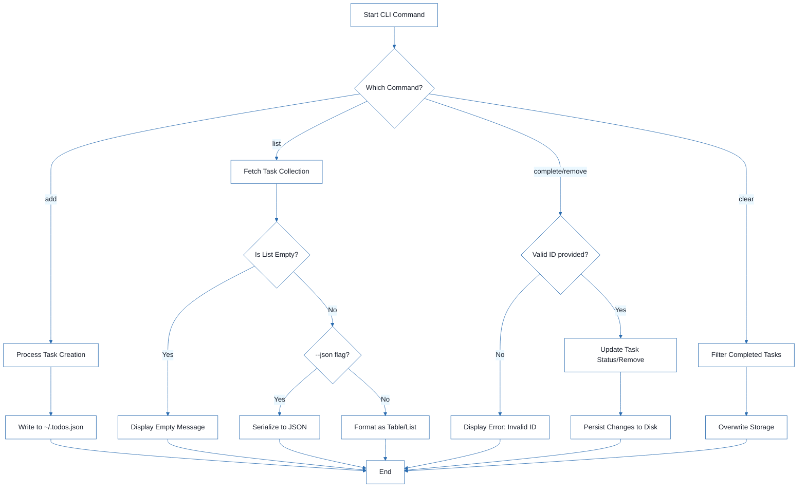

# CLI To-Do List Manager - Technical Specification & Architecture Document

## 1. Executive Summary & Architecture Overview

### 1.1 Executive Brief
The CLI To-Do List Manager is a Python-based command-line utility designed for efficient task lifecycle management. The system employs a layered architecture consisting of a CLI dispatch layer for user interaction, a service layer for business logic orchestration, and a storage layer for persistent data management via a local JSON file. Core capabilities include task creation, completion tracking, filtering, and targeted deletion.

### 1.2 Maturity Assessment
The project is **READY** for execution. The structural integrity is high, featuring a complete mapping of the implementation pipeline from initial setup to final polish. While a medium-severity gap exists regarding formal acceptance criteria for individual tasks, the inclusion of "Independent Tests" for each user story provides sufficient functional guidance for successful implementation.

### 1.3 Technical Stack
* Python
* pyproject.toml

### 1.4 Architectural Constraints
* **Data Persistence**: Strict JSON serialization targeting `~/.todos.json`.
* **Task Identification**: Mandatory sequential ID assignment for all new task creations.
* **Execution Order**: Blocking dependency on the Foundational Phase (PHASE-2); no user story implementation may begin until this phase is complete.
* **Output Versatility**: Dual-mode output support (human-readable and raw JSON via `--json` flag).
* **Validation**: Mandatory manual smoke tests for all core commands (`add`, `list`, `complete`, `remove`, `clear`).

### 1.5 Critical Dependencies
* **File System**: JSON file system I/O for `~/.todos.json`.
* **Project Structure**: Python package skeleton located in `src/todo_manager/`.
* **Pipeline Sequence**: Setup $\rightarrow$ Foundational $\rightarrow$ User Stories $\rightarrow$ Polish.
* **Data Integrity**: Strict consistency of Task IDs across the service and storage layers.
* **Referential Integrity**: Safe persistence of task removals and clears within the JSON store.

## 2. Architecture Workflows

```mermaid
%%{init: {
  'theme': 'base',
  'themeVariables': {
    'primaryColor': '#1A365D',
    'primaryTextColor': '#1A202C',
    'primaryBorderColor': '#2B6CB0',
    'lineColor': '#2B6CB0',
    'secondaryColor': '#EBF8FF',
    'tertiaryColor': '#EBF8FF',
    'background': '#FFFFFF',
    'mainBkg': '#FFFFFF',
    'secondBkg': '#EBF8FF',
    'tertiaryBkg': '#F7FAFC',
    'secondaryTextColor': '#4A5568',
    'fontSize': '16px',
    'fontFamily': 'Inter, system-ui, sans-serif',
    'nodePadding': '15px',
    'borderRadius': '8px',
    'edgeLabelBackground': '#EBF8FF',
    'clusterBkg': '#F7FAFC',
    'clusterBorder': '#2B6CB0',
    'defaultLinkColor': '#2B6CB0',
    'titleColor': '#1A365D',
    'actorBorder': '#2B6CB0',
    'actorBkg': '#EBF8FF',
    'actorTextColor': '#1A365D',
    'actorLineColor': '#2B6CB0',
    'signalColor': '#2B6CB0',
    'signalTextColor': '#1A202C',
    'labelBoxBorderColor': '#2B6CB0',
    'labelBoxBkgColor': '#EBF8FF',
    'labelTextColor': '#1A202C',
    'loopTextColor': '#1A202C',
    'arrowHeadColor': '#2B6CB0',
    'sequenceNumberColor': '#1A365D',
    'sequenceActorBorder': '#2B6CB0',
    'sequenceActorBkg': '#EBF8FF',
    'sequenceArrowColor': '#2B6CB0',
    'noteBkgColor': '#FFF5EB',
    'noteBorderColor': '#DD6B20',
    'noteTextColor': '#1A202C'
  }
}}%%
flowchart TD
    subgraph P1 ["PHASE-1: Setup"]
        T001["T001: Package Skeleton"]
        T002["T002: Test Structure"]
        T003["T003: Project Metadata"]
    end
    subgraph P2 ["PHASE-2: Foundational"]
        T004["T004: Entity Definitions"]
        T005["T005: JSON Storage I/O"]
        T006["T006: CLI Parsing"]
        T007["T007: Service Error Handling"]
        T008["T008: Module Entry"]
    end
    subgraph P3 ["PHASE-3: US1 - Add/Manage"]
        T009["T009: Add Command Flow"]
        T010["T010: Task Creation Logic"]
        T011["T011: Completion Updates"]
        T012["T012: User Messages"]
    end
    subgraph P4 ["PHASE-4: US2 - View/Filter"]
        T013["T013: Human-Readable List"]
        T014["T014: JSON Formatting"]
        T015["T015: Listing Logic"]
        T016["T016: Empty List Handling"]
    end
    subgraph P5 ["PHASE-5: US3 - Remove/Clear"]
        T017["T017: Remove Command Flow"]
        T018["T018: Clear Completed Flow"]
        T019["T019: Not-Found Handling"]
        T020["T020: Storage Persistence"]
    end
    subgraph P6 ["PHASE-6: Polish"]
        T021["T021: Documentation"]
        T022["T022: Quickstart Notes"]
        T023["T023: Smoke Tests"]
        T024["T024: Linting/Formatting"]
        T025["T025: JSON Parse Validation"]
    end
    PHASE-1 --> PHASE-2
    PHASE-2 --> PHASE-3
    PHASE-2 --> PHASE-4
    PHASE-2 --> PHASE-5
    PHASE-3 --> PHASE-6
    PHASE-4 --> PHASE-6
    PHASE-5 --> PHASE-6
    PHASE-1 --- T001
    PHASE-1 --- T002
    PHASE-1 --- T003
    PHASE-2 --- T004
    PHASE-2 --- T005
    PHASE-2 --- T006
    PHASE-2 --- T007
    PHASE-2 --- T008
    PHASE-3 --- T009
    PHASE-3 --- T010
    PHASE-3 --- T011
    PHASE-3 --- T012
    PHASE-4 --- T013
    PHASE-4 --- T014
    PHASE-4 --- T015
    PHASE-4 --- T016
    PHASE-5 --- T017
    PHASE-5 --- T018
    PHASE-5 --- T019
    PHASE-5 --- T020
    PHASE-6 --- T021
    PHASE-6 --- T022
    PHASE-6 --- T023
    PHASE-6 --- T024
    PHASE-6 --- T025
```



```mermaid
%%{init: {
  'theme': 'base',
  'themeVariables': {
    'primaryColor': '#1A365D',
    'primaryTextColor': '#1A202C',
    'primaryBorderColor': '#2B6CB0',
    'lineColor': '#2B6CB0',
    'secondaryColor': '#EBF8FF',
    'tertiaryColor': '#EBF8FF',
    'background': '#FFFFFF',
    'mainBkg': '#FFFFFF',
    'secondBkg': '#EBF8FF',
    'tertiaryBkg': '#F7FAFC',
    'secondaryTextColor': '#4A5568',
    'fontSize': '16px',
    'fontFamily': 'Inter, system-ui, sans-serif',
    'nodePadding': '15px',
    'borderRadius': '8px',
    'edgeLabelBackground': '#EBF8FF',
    'clusterBkg': '#F7FAFC',
    'clusterBorder': '#2B6CB0',
    'defaultLinkColor': '#2B6CB0',
    'titleColor': '#1A365D',
    'actorBorder': '#2B6CB0',
    'actorBkg': '#EBF8FF',
    'actorTextColor': '#1A365D',
    'actorLineColor': '#2B6CB0',
    'signalColor': '#2B6CB0',
    'signalTextColor': '#1A202C',
    'labelBoxBorderColor': '#2B6CB0',
    'labelBoxBkgColor': '#EBF8FF',
    'labelTextColor': '#1A202C',
    'loopTextColor': '#1A202C',
    'arrowHeadColor': '#2B6CB0',
    'sequenceNumberColor': '#1A365D',
    'sequenceActorBorder': '#2B6CB0',
    'sequenceActorBkg': '#EBF8FF',
    'sequenceArrowColor': '#2B6CB0',
    'noteBkgColor': '#FFF5EB',
    'noteBorderColor': '#DD6B20',
    'noteTextColor': '#1A202C'
  }
}}%%
flowchart TD
    START["Start CLI Command"] --> CMD_TYPE{"Which Command?"}
    CMD_TYPE -- "add" --> ADD_PROC["Process Task Creation"]
    ADD_PROC --> SAVE_JSON["Write to ~/.todos.json"]
    SAVE_JSON --> END["End"]
    CMD_TYPE -- "list" --> LIST_PROC["Fetch Task Collection"]
    LIST_PROC --> EMPTY_CHECK{"Is List Empty?"}
    EMPTY_CHECK -- "Yes" --> MSG_EMPTY["Display Empty Message"]
    EMPTY_CHECK -- "No" --> FMT_CHECK{"--json flag?"}
    FMT_CHECK -- "Yes" --> FMT_JSON["Serialize to JSON"]
    FMT_CHECK -- "No" --> FMT_HUMAN["Format as Table/List"]
    MSG_EMPTY --> END
    FMT_JSON --> END
    FMT_HUMAN --> END
    CMD_TYPE -- "complete/remove" --> ID_CHECK{"Valid ID provided?"}
    ID_CHECK -- "No" --> ERR_ID["Display Error: Invalid ID"]
    ID_CHECK -- "Yes" --> OP_PROC["Update Task Status/Remove"]
    OP_PROC --> SAVE_JSON_OP["Persist Changes to Disk"]
    ERR_ID --> END
    SAVE_JSON_OP --> END
    CMD_TYPE -- "clear" --> CLEAR_PROC["Filter Completed Tasks"]
    CLEAR_PROC --> SAVE_JSON_CLR["Overwrite Storage"]
    SAVE_JSON_CLR --> END
``` & Visual Diagrams

### 2.1 Project Implementation Roadmap & Traceability
This diagram visualizes the phase-based execution order and the mapping of tasks to their respective project phases.

```mermaid
%%{init: {
  'theme': 'base',
  'themeVariables': {
    'primaryColor': '#1A365D',
    'primaryTextColor': '#1A202C',
    'primaryBorderColor': '#2B6CB0',
    'lineColor': '#2B6CB0',
    'secondaryColor': '#EBF8FF',
    'tertiaryColor': '#EBF8FF',
    'background': '#FFFFFF',
    'mainBkg': '#FFFFFF',
    'secondBkg': '#EBF8FF',
    'tertiaryBkg': '#F7FAFC',
    'secondaryTextColor': '#4A5568',
    'fontSize': '16px',
    'fontFamily': 'Inter, system-ui, sans-serif',
    'nodePadding': '15px',
    'borderRadius': '8px',
    'edgeLabelBackground': '#EBF8FF',
    'clusterBkg': '#F7FAFC',
    'clusterBorder': '#2B6CB0',
    'defaultLinkColor': '#2B6CB0',
    'titleColor': '#1A365D',
    'actorBorder': '#2B6CB0',
    'actorBkg': '#EBF8FF',
    'actorTextColor': '#1A365D',
    'actorLineColor': '#2B6CB0',
    'signalColor': '#2B6CB0',
    'signalTextColor': '#1A202C',
    'labelBoxBorderColor': '#2B6CB0',
    'labelBoxBkgColor': '#EBF8FF',
    'labelTextColor': '#1A202C',
    'loopTextColor': '#1A202C',
    'arrowHeadColor': '#2B6CB0',
    'sequenceNumberColor': '#1A365D',
    'sequenceActorBorder': '#2B6CB0',
    'sequenceActorBkg': '#EBF8FF',
    'sequenceArrowColor': '#2B6CB0',
    'noteBkgColor': '#FFF5EB',
    'noteBorderColor': '#DD6B20',
    'noteTextColor': '#1A202C'
  }
}}%%
flowchart TD
    subgraph P1 ["PHASE-1: Setup"]
        T001["T001: Package Skeleton"]
        T002["T002: Test Structure"]
        T003["T003: Project Metadata"]
    end
    subgraph P2 ["PHASE-2: Foundational"]
        T004["T004: Entity Definitions"]
        T005["T005: JSON Storage I/O"]
        T006["T006: CLI Parsing"]
        T007["T007: Service Error Handling"]
        T008["T008: Module Entry"]
    end
    subgraph P3 ["PHASE-3: US1 - Add/Manage"]
        T009["T009: Add Command Flow"]
        T010["T010: Task Creation Logic"]
        T011["T011: Completion Updates"]
        T012["T012: User Messages"]
    end
    subgraph P4 ["PHASE-4: US2 - View/Filter"]
        T013["T013: Human-Readable List"]
        T014["T014: JSON Formatting"]
        T015["T015: Listing Logic"]
        T016["T016: Empty List Handling"]
    end
    subgraph P5 ["PHASE-5: US3 - Remove/Clear"]
        T017["T017: Remove Command Flow"]
        T018["T018: Clear Completed Flow"]
        T019["T019: Not-Found Handling"]
        T020["T020: Storage Persistence"]
    end
    subgraph P6 ["PHASE-6: Polish"]
        T021["T021: Documentation"]
        T022["T022: Quickstart Notes"]
        T023["T023: Smoke Tests"]
        T024["T024: Linting/Formatting"]
        T025["T025: JSON Parse Validation"]
    end
    PHASE-1 --> PHASE-2
    PHASE-2 --> PHASE-3
    PHASE-2 --> PHASE-4
    PHASE-2 --> PHASE-5
    PHASE-3 --> PHASE-6
    PHASE-4 --> PHASE-6
    PHASE-5 --> PHASE-6
    PHASE-1 --- T001
    PHASE-1 --- T002
    PHASE-1 --- T003
    PHASE-2 --- T004
    PHASE-2 --- T005
    PHASE-2 --- T006
    PHASE-2 --- T007
    PHASE-2 --- T008
    PHASE-3 --- T009
    PHASE-3 --- T010
    PHASE-3 --- T011
    PHASE-3 --- T012
    PHASE-4 --- T013
    PHASE-4 --- T014
    PHASE-4 --- T015
    PHASE-4 --- T016
    PHASE-5 --- T017
    PHASE-5 --- T018
    PHASE-5 --- T019
    PHASE-5 --- T020
    PHASE-6 --- T021
    PHASE-6 --- T022
    PHASE-6 --- T023
    PHASE-6 --- T024
    PHASE-6 --- T025
```

### 2.2 CLI Task Management Workflow
This workflow models the business logic for task operations, including decision points for validation and output formatting.



## 3. Detailed Technical Specifications & Business Rules

### 3.1 Requirements Traceability
The following table maps every atomic task identifier to its functional description and associated project phase.

| ID | Description | Phase | Story/Context |
| :--- | :--- | :--- | :--- |
| T001 | Create the Python package skeleton | PHASE-1 | Setup |
| T002 | Create the test directory structure | PHASE-1 | Setup |
| T003 | Add project metadata and tooling entry points in pyproject.toml | PHASE-1 | Setup |
| T004 | Implement task entity definitions and serialization helpers | PHASE-2 | Foundational |
| T005 | Implement JSON storage path resolution and file I/O helpers | PHASE-2 | Foundational |
| T006 | Implement shared command-line parsing and top-level dispatch | PHASE-2 | Foundational |
| T007 | Implement shared service-layer error handling and task collection utilities | PHASE-2 | Foundational |
| T008 | Define module entry behavior for `python -m todo_manager` | PHASE-2 | Foundational |
| T009 | Implement the `add` command flow | PHASE-3 | US1 |
| T010 | Implement task creation, sequential ID assignment, and `created_at` population | PHASE-3 | US1 |
| T011 | Implement completion updates for existing tasks | PHASE-3 | US1 |
| T012 | Add user-facing success and error messages for add and complete operations | PHASE-3 | US1 |
| T013 | Implement human-readable task listing output | PHASE-4 | US2 |
| T014 | Implement `--json` output formatting | PHASE-4 | US2 |
| T015 | Add listing logic that preserves task order and status fields | PHASE-4 | US2 |
| T016 | Handle the empty-list case with a clear message | PHASE-4 | US2 |
| T017 | Implement the `remove` command flow | PHASE-5 | US3 |
| T018 | Implement the `clear` command flow for removing completed tasks | PHASE-5 | US3 |
| T019 | Add not-found handling for invalid task IDs | PHASE-5 | US3 |
| T020 | Ensure storage writes persist removals and clears safely | PHASE-5 | US3 |
| T021 | Document the CLI usage and storage behavior in `README.md` | PHASE-6 | Polish |
| T022 | Add quickstart verification notes and examples | PHASE-6 | Polish |
| T023 | Run a manual smoke test of add, list, complete, remove, and clear | PHASE-6 | Polish |
| T024 | Verify linting and formatting expectations | PHASE-6 | Polish |
| T025 | Confirm the generated JSON output remains parseable | PHASE-6 | Polish |

### 3.2 Security Rules
No specific security constraints were defined for this CLI tool. Standard file system permissions for `~/.todos.json` apply.

### 3.3 Data Models
* **Task Entity**: Defined in `src/todo_manager/models.py`.
* **Attributes**:
    * `id`: Sequential numeric identifier.
    * `description`: String.
    * `status`: Boolean/Enum (Completed/Pending).
    * `created_at`: Timestamp.
* **Persistence**: JSON array of Task objects stored in `~/.todos.json`.

## 4. Project Governance & Structural Gaps

### 4.1 Structural Gaps
| Gap | Priority | Remediation Advice |
| :--- | :--- | :--- |
| Acceptance Criteria | MEDIUM | While 'Independent Tests' are mentioned in the goals, formal acceptance criteria for each task are not explicitly listed. |
| Security & Performance Constraints | LOW | No specific security or performance constraints were defined for this CLI tool. |
| Open Questions & Uncertainties | LOW | The document appears complete for the current scope. |

### 4.2 Remediation & Workflow
The implementation will follow an incremental delivery model:
1. **Setup & Foundational**: Establish the core skeleton and I/O.
2. **US1 (MVP)**: Implement `add` and `complete` and validate against storage.
3. **US2**: Implement `list` (Human/JSON) and validate output.
4. **US3**: Implement `remove` and `clear` and validate persistence.
5. **Polish**: Final documentation, linting, and smoke testing.

## 5. Technical & Domain Glossary (Terminology Reference)

| Term | Category | Context Anchor | Project Definition |
| :--- | :--- | :--- | :--- |
| Checkpoint | TECHNICAL_STACK | PHASE-2 | A synchronization gate ensuring all blocking infrastructure is verified before parallel feature development commences. |
| Foundational | TECHNICAL_STACK | PHASE-2 | The core infrastructure layer containing shared serialization, storage, and dispatch logic required by all subsequent features. |
| Goal | BUSINESS_DOMAIN | PHASE-3 | The primary functional objective a user must achieve within a specific feature set. |
| ID | BUSINESS_DOMAIN | T010 | A sequential numeric identifier assigned to each entry to enable unique referencing and targeted mutation. |
| JSON | TECHNICAL_STACK | T005 | The lightweight data-interchange format used for persistent storage and machine-readable output. |
| MVP | BUSINESS_DOMAIN | PHASE-3 | The minimal set of functional capabilities, specifically adding and completing entries, required for initial validation. |
| Organization | TECHNICAL_STACK | Tasks: CLI To-Do List Manager | The structural grouping of implementation units by user story to ensure independent testability. |
| Prerequisites | TECHNICAL_STACK | Tasks: CLI To-Do List Manager | The set of design documents and specifications that must be available before implementation begins. |
| README | TECHNICAL_STACK | T021 | The primary documentation file detailing usage instructions and storage behavior. |
| Setup | TECHNICAL_STACK | PHASE-1 | The initial phase involving package skeleton creation and tooling configuration. |
| T016 | TECHNICAL_STACK | T016 | The specific implementation unit responsible for providing a clear message when no entries are available for display. |
| Tests | TECHNICAL_STACK | T002 | The verification suite comprising unit and integration directories to validate system behavior. |
| population in | TECHNICAL_STACK | T010 | The process of automatically assigning a timestamp to the creation field of a new entry. |
| todo clear | BUSINESS_DOMAIN | T018 | The operation that removes all entries marked as finished from the persistent store. |
| todo list | BUSINESS_DOMAIN | PHASE-4 | The operation that retrieves and displays all stored entries in either human-readable or machine-parseable formats. |
| ⚠️ CRITICAL | TECHNICAL_STACK | PHASE-2 | A blocking constraint indicating that no feature work can proceed until the current phase is fully validated. |