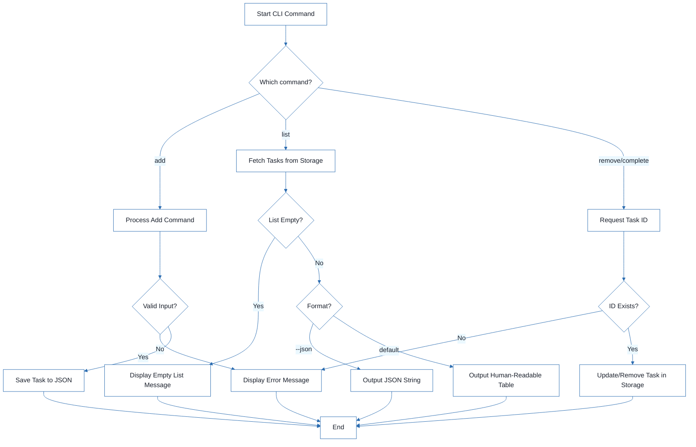
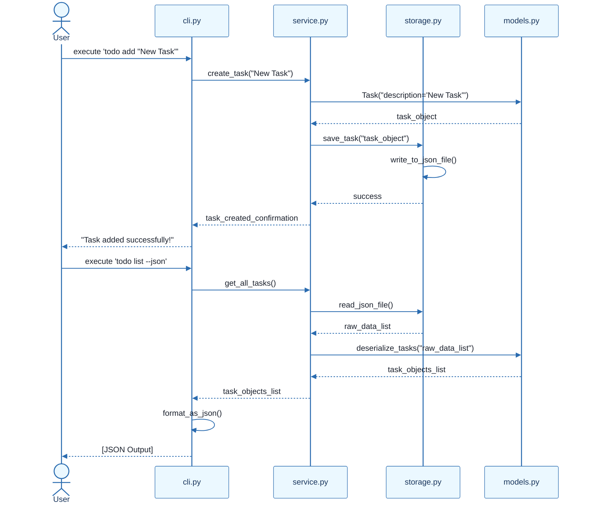

# CLI To-Do List Manager - Technical Specification & Architecture Document

## 1. Executive Summary & Architecture Overview

### 1.1 Executive Brief
The CLI To-Do List Manager is a Python-based command-line application designed for task lifecycle management using a local JSON storage pattern. It implements a layered architecture comprising a CLI dispatch layer, a service layer for business logic, and a storage layer for file I/O. The system focuses on core CRUD operations: adding tasks with sequential IDs, listing tasks in human-readable or JSON formats, and managing task completion and removal.

### 1.2 Maturity Assessment
The project is READY for execution. While there are medium-severity gaps regarding formal acceptance criteria and low-severity omissions of security/performance constraints, the task graph is structurally complete with a high health index. The execution path is clearly defined through a blocking foundational phase followed by independent user stories, ensuring a stable implementation sequence.

### 1.3 Technical Stack
* Python
* pyproject.toml

### 1.4 Architectural Constraints
* Sequential ID assignment for task creation.
* Strict JSON storage format for persistence.
* Mandatory completion of Foundational Phase (PHASE-02) before any User Story implementation.
* Human-readable and JSON output modes for listing.
* Manual smoke test validation for all core commands (add, list, complete, remove, clear).
* Linting and formatting verification required for all source files in `src/todo_manager/`.

### 1.5 Critical Dependencies
* Local file system access for `~/.todos.json` storage.
* Python package skeleton integrity (`src/todo_manager/`).
* Sequential dependency: Setup $\rightarrow$ Foundational $\rightarrow$ User Stories $\rightarrow$ Polish.
* Internal data integrity: Task entity serialization helpers must precede CLI wiring.
* Internal data integrity: Service-layer logic must precede output formatting.

## 2. Architecture Workflows

```mermaid
%%{init: {
  'theme': 'base',
  'themeVariables': {
    'primaryColor': '#1A365D',
    'primaryTextColor': '#1A202C',
    'primaryBorderColor': '#2B6CB0',
    'lineColor': '#2B6CB0',
    'secondaryColor': '#EBF8FF',
    'tertiaryColor': '#EBF8FF',
    'background': '#FFFFFF',
    'mainBkg': '#FFFFFF',
    'secondBkg': '#EBF8FF',
    'tertiaryBkg': '#F7FAFC',
    'secondaryTextColor': '#4A5568',
    'fontSize': '16px',
    'fontFamily': 'Inter, system-ui, sans-serif',
    'nodePadding': '15px',
    'borderRadius': '8px',
    'edgeLabelBackground': '#EBF8FF',
    'clusterBkg': '#F7FAFC',
    'clusterBorder': '#2B6CB0',
    'defaultLinkColor': '#2B6CB0',
    'titleColor': '#1A365D',
    'actorBorder': '#2B6CB0',
    'actorBkg': '#EBF8FF',
    'actorTextColor': '#1A365D',
    'actorLineColor': '#2B6CB0',
    'signalColor': '#2B6CB0',
    'signalTextColor': '#1A202C',
    'labelBoxBorderColor': '#2B6CB0',
    'labelBoxBkgColor': '#EBF8FF',
    'labelTextColor': '#1A202C',
    'loopTextColor': '#1A202C',
    'arrowHeadColor': '#2B6CB0',
    'sequenceNumberColor': '#1A365D',
    'sequenceActorBorder': '#2B6CB0',
    'sequenceActorBkg': '#EBF8FF',
    'sequenceArrowColor': '#2B6CB0',
    'noteBkgColor': '#FFF5EB',
    'noteBorderColor': '#DD6B20',
    'noteTextColor': '#1A202C'
  }
}}%%
flowchart TD
  subgraph S1 ["Phase 1: Setup"]
    PHASE-01["PHASE-01: Setup (Shared Infrastructure)"]
    T001["T001: Create Python package skeleton"]
    T002["T002: Create test directory structure"]
    T003["T003: Add project metadata"]
    PHASE-01 --> T001
    PHASE-01 --> T002
    PHASE-01 --> T003
  end
  subgraph S2 ["Phase 2: Foundational"]
    PHASE-02["PHASE-02: Foundational (Blocking Prerequisites)"]
    T004["T004: Implement task entity definitions"]
    T005["T005: Implement JSON storage helpers"]
    T006["T006: Implement CLI parsing"]
    T007["T007: Implement service-layer error handling"]
    T008["T008: Define module entry behavior"]
    PHASE-02 --> T004
    PHASE-02 --> T005
    PHASE-02 --> T006
    PHASE-02 --> T007
    PHASE-02 --> T008
  end
  subgraph S3 ["Phase 3: US1 - Add/Manage"]
    PHASE-03["PHASE-03: User Story 1 - Add and Manage Tasks"]
    T009["T009: Implement add command flow"]
    T010["T010: Implement task creation logic"]
    T011["T011: Implement completion updates"]
    T012["T012: Add user-facing messages"]
    PHASE-03 --> T009
    PHASE-03 --> T010
    PHASE-03 --> T011
    PHASE-03 --> T012
  end
  subgraph S4 ["Phase 4: US2 - View/Filter"]
    PHASE-04["PHASE-04: User Story 2 - View and Filter Tasks"]
    T013["T013: Implement human-readable output"]
    T014["T014: Implement JSON output formatting"]
    T015["T015: Add listing logic"]
    T016["T016: Handle empty-list case"]
    PHASE-04 --> T013
    PHASE-04 --> T014
    PHASE-04 --> T015
    PHASE-04 --> T016
  end
  subgraph S5 ["Phase 5: US3 - Remove/Clear"]
    PHASE-05["PHASE-05: User Story 3 - Remove and Clear Tasks"]
    T017["T017: Implement remove command flow"]
    T018["T018: Implement clear command flow"]
    T019["T019: Add not-found handling"]
    T020["T020: Ensure storage persistence"]
    PHASE-05 --> T017
    PHASE-05 --> T018
    PHASE-05 --> T019
    PHASE-05 --> T020
  end
  subgraph S6 ["Phase 6: Polish"]
    PHASE-06["PHASE-06: Polish & Cross-Cutting Concerns"]
    T021["T021: Document CLI usage"]
    T022["T022: Add quickstart notes"]
    T023["T023: Run manual smoke tests"]
    T024["T024: Verify linting/formatting"]
    T025["T025: Confirm JSON parseability"]
    PHASE-06 --> T021
    PHASE-06 --> T022
    PHASE-06 --> T023
    PHASE-06 --> T024
    PHASE-06 --> T025
  end
  PHASE-02 --> PHASE-01
  PHASE-03 --> PHASE-02
  PHASE-04 --> PHASE-02
  PHASE-05 --> PHASE-02
  PHASE-06 --> PHASE-03
  PHASE-06 --> PHASE-04
  PHASE-06 --> PHASE-05
```





```mermaid
%%{init: {
  'theme': 'base',
  'themeVariables': {
    'primaryColor': '#1A365D',
    'primaryTextColor': '#1A202C',
    'primaryBorderColor': '#2B6CB0',
    'lineColor': '#2B6CB0',
    'secondaryColor': '#EBF8FF',
    'tertiaryColor': '#EBF8FF',
    'background': '#FFFFFF',
    'mainBkg': '#FFFFFF',
    'secondBkg': '#EBF8FF',
    'tertiaryBkg': '#F7FAFC',
    'secondaryTextColor': '#4A5568',
    'fontSize': '16px',
    'fontFamily': 'Inter, system-ui, sans-serif',
    'nodePadding': '15px',
    'borderRadius': '8px',
    'edgeLabelBackground': '#EBF8FF',
    'clusterBkg': '#F7FAFC',
    'clusterBorder': '#2B6CB0',
    'defaultLinkColor': '#2B6CB0',
    'titleColor': '#1A365D',
    'actorBorder': '#2B6CB0',
    'actorBkg': '#EBF8FF',
    'actorTextColor': '#1A365D',
    'actorLineColor': '#2B6CB0',
    'signalColor': '#2B6CB0',
    'signalTextColor': '#1A202C',
    'labelBoxBorderColor': '#2B6CB0',
    'labelBoxBkgColor': '#EBF8FF',
    'labelTextColor': '#1A202C',
    'loopTextColor': '#1A202C',
    'arrowHeadColor': '#2B6CB0',
    'sequenceNumberColor': '#1A365D',
    'sequenceActorBorder': '#2B6CB0',
    'sequenceActorBkg': '#EBF8FF',
    'sequenceArrowColor': '#2B6CB0',
    'noteBkgColor': '#FFF5EB',
    'noteBorderColor': '#DD6B20',
    'noteTextColor': '#1A202C'
  }
}}%%
sequenceDiagram
    actor User
    participant CLI as cli.py
    participant SVC as service.py
    participant STG as storage.py
    participant MDL as models.py
    User->>CLI: execute 'todo add "New Task"'
    CLI->>SVC: create_task("New Task")
    SVC->>MDL: Task("description='New Task'")
    MDL-->>SVC: task_object
    SVC->>STG: save_task("task_object")
    STG->>STG: write_to_json_file()
    STG-->>SVC: success
    SVC-->>CLI: task_created_confirmation
    CLI-->>User: "Task added successfully!"
    User->>CLI: execute 'todo list --json'
    CLI->>SVC: get_all_tasks()
    SVC->>STG: read_json_file()
    STG-->>SVC: raw_data_list
    SVC->>MDL: deserialize_tasks("raw_data_list")
    MDL-->>SVC: task_objects_list
    SVC-->>CLI: task_objects_list
    CLI->>CLI: format_as_json()
    CLI-->>User: [JSON Output]
``` & Visual Diagrams

### 2.1 Project Implementation Roadmap & Traceability
Visualizes the dependency chain between project phases and the specific tasks contained within each phase, ensuring strict traceability to original identifiers.

```mermaid
%%{init: {
  'theme': 'base',
  'themeVariables': {
    'primaryColor': '#1A365D',
    'primaryTextColor': '#1A202C',
    'primaryBorderColor': '#2B6CB0',
    'lineColor': '#2B6CB0',
    'secondaryColor': '#EBF8FF',
    'tertiaryColor': '#EBF8FF',
    'background': '#FFFFFF',
    'mainBkg': '#FFFFFF',
    'secondBkg': '#EBF8FF',
    'tertiaryBkg': '#F7FAFC',
    'secondaryTextColor': '#4A5568',
    'fontSize': '16px',
    'fontFamily': 'Inter, system-ui, sans-serif',
    'nodePadding': '15px',
    'borderRadius': '8px',
    'edgeLabelBackground': '#EBF8FF',
    'clusterBkg': '#F7FAFC',
    'clusterBorder': '#2B6CB0',
    'defaultLinkColor': '#2B6CB0',
    'titleColor': '#1A365D',
    'actorBorder': '#2B6CB0',
    'actorBkg': '#EBF8FF',
    'actorTextColor': '#1A365D',
    'actorLineColor': '#2B6CB0',
    'signalColor': '#2B6CB0',
    'signalTextColor': '#1A202C',
    'labelBoxBorderColor': '#2B6CB0',
    'labelBoxBkgColor': '#EBF8FF',
    'labelTextColor': '#1A202C',
    'loopTextColor': '#1A202C',
    'arrowHeadColor': '#2B6CB0',
    'sequenceNumberColor': '#1A365D',
    'sequenceActorBorder': '#2B6CB0',
    'sequenceActorBkg': '#EBF8FF',
    'sequenceArrowColor': '#2B6CB0',
    'noteBkgColor': '#FFF5EB',
    'noteBorderColor': '#DD6B20',
    'noteTextColor': '#1A202C'
  }
}}%%
flowchart TD
  subgraph S1 ["Phase 1: Setup"]
    PHASE-01["PHASE-01: Setup (Shared Infrastructure)"]
    T001["T001: Create Python package skeleton"]
    T002["T002: Create test directory structure"]
    T003["T003: Add project metadata"]
    PHASE-01 --> T001
    PHASE-01 --> T002
    PHASE-01 --> T003
  end
  subgraph S2 ["Phase 2: Foundational"]
    PHASE-02["PHASE-02: Foundational (Blocking Prerequisites)"]
    T004["T004: Implement task entity definitions"]
    T005["T005: Implement JSON storage helpers"]
    T006["T006: Implement CLI parsing"]
    T007["T007: Implement service-layer error handling"]
    T008["T008: Define module entry behavior"]
    PHASE-02 --> T004
    PHASE-02 --> T005
    PHASE-02 --> T006
    PHASE-02 --> T007
    PHASE-02 --> T008
  end
  subgraph S3 ["Phase 3: US1 - Add/Manage"]
    PHASE-03["PHASE-03: User Story 1 - Add and Manage Tasks"]
    T009["T009: Implement add command flow"]
    T010["T010: Implement task creation logic"]
    T011["T011: Implement completion updates"]
    T012["T012: Add user-facing messages"]
    PHASE-03 --> T009
    PHASE-03 --> T010
    PHASE-03 --> T011
    PHASE-03 --> T012
  end
  subgraph S4 ["Phase 4: US2 - View/Filter"]
    PHASE-04["PHASE-04: User Story 2 - View and Filter Tasks"]
    T013["T013: Implement human-readable output"]
    T014["T014: Implement JSON output formatting"]
    T015["T015: Add listing logic"]
    T016["T016: Handle empty-list case"]
    PHASE-04 --> T013
    PHASE-04 --> T014
    PHASE-04 --> T015
    PHASE-04 --> T016
  end
  subgraph S5 ["Phase 5: US3 - Remove/Clear"]
    PHASE-05["PHASE-05: User Story 3 - Remove and Clear Tasks"]
    T017["T017: Implement remove command flow"]
    T018["T018: Implement clear command flow"]
    T019["T019: Add not-found handling"]
    T020["T020: Ensure storage persistence"]
    PHASE-05 --> T017
    PHASE-05 --> T018
    PHASE-05 --> T019
    PHASE-05 --> T020
  end
  subgraph S6 ["Phase 6: Polish"]
    PHASE-06["PHASE-06: Polish & Cross-Cutting Concerns"]
    T021["T021: Document CLI usage"]
    T022["T022: Add quickstart notes"]
    T023["T023: Run manual smoke tests"]
    T024["T024: Verify linting/formatting"]
    T025["T025: Confirm JSON parseability"]
    PHASE-06 --> T021
    PHASE-06 --> T022
    PHASE-06 --> T023
    PHASE-06 --> T024
    PHASE-06 --> T025
  end
  PHASE-02 --> PHASE-01
  PHASE-03 --> PHASE-02
  PHASE-04 --> PHASE-02
  PHASE-05 --> PHASE-02
  PHASE-06 --> PHASE-03
  PHASE-06 --> PHASE-04
  PHASE-06 --> PHASE-05
```

### 2.2 CLI Task Management Workflow
Models the business logic for task operations, including decision points for input validation and output formatting.


### 2.3 CLI Command Execution Sequence
Illustrates the interaction between the CLI layer, the Service layer, and the Storage layer for a typical task operation.



## 3. Detailed Technical Specifications & Business Rules

### 3.1 Requirements Traceability

| ID | Requirement / Task Description | Source Section | Attributes / Notes |
| :--- | :--- | :--- | :--- |
| T001 | Create the Python package skeleton | Phase 1: Setup | Files: `src/todo_manager/` |
| T002 | Create the test directory structure | Phase 1: Setup | `tests/unit/`, `tests/integration/` |
| T003 | Add project metadata and tooling entry points in pyproject.toml | Phase 1: Setup | Parallel execution enabled |
| T004 | Implement task entity definitions and serialization helpers | Phase 2: Foundational | `src/todo_manager/models.py` |
| T005 | Implement JSON storage path resolution and file I/O helpers | Phase 2: Foundational | `src/todo_manager/storage.py` |
| T006 | Implement shared command-line parsing and top-level dispatch | Phase 2: Foundational | Parallel; `src/todo_manager/cli.py` |
| T007 | Implement shared service-layer error handling and task collection utilities | Phase 2: Foundational | `src/todo_manager/service.py` |
| T008 | Define module entry behavior for python -m todo_manager | Phase 2: Foundational | `src/todo_manager/__main__.py` |
| T009 | Implement the add command flow | Implementation for US1 | Story: US1 |
| T010 | Implement task creation, sequential ID assignment, and created_at population | Implementation for US1 | Story: US1 |
| T011 | Implement completion updates for existing tasks | Implementation for US1 | Story: US1 |
| T012 | Add user-facing success and error messages for add and complete operations | Implementation for US1 | Story: US1 |
| T013 | Implement human-readable task listing output | Implementation for US2 | Story: US2 |
| T014 | Implement --json output formatting | Implementation for US2 | Story: US2 |
| T015 | Add listing logic that preserves task order and status fields | Implementation for US2 | Story: US2 |
| T016 | Handle the empty-list case with a clear message | Implementation for US2 | Story: US2 |
| T017 | Implement the remove command flow | Implementation for US3 | Story: US3 |
| T018 | Implement the clear command flow for removing completed tasks | Implementation for US3 | Story: US3 |
| T019 | Add not-found handling for invalid task IDs | Implementation for US3 | Story: US3 |
| T020 | Ensure storage writes persist removals and clears safely | Implementation for US3 | Story: US3 |
| T021 | Document the CLI usage and storage behavior in README.md | Phase 6: Polish | Parallel execution enabled |
| T022 | Add quickstart verification notes and examples | Phase 6: Polish | Parallel execution enabled |
| T023 | Run a manual smoke test of add, list, complete, remove, and clear | Phase 6: Polish | Type: smoke_test |
| T024 | Verify linting and formatting expectations | Phase 6: Polish | `src/todo_manager/` |
| T025 | Confirm the generated JSON output remains parseable | Phase 6: Polish | Validation of `todo list --json` |

### 3.2 Security Rules
* No specific security constraints were defined for this CLI tool.

### 3.3 Data Models
* **Task Entity**: Defined in `src/todo_manager/models.py`. Includes sequential ID, description, completion status, and `created_at` timestamp.
* **Persistence**: JSON file located at `~/.todos.json`.

## 4. Project Governance & Structural Gaps

### 4.1 Structural Gaps

| Missing Section | Priority | Remediation Advice |
| :--- | :--- | :--- |
| Acceptance Criteria | MEDIUM | While 'Independent Tests' are mentioned for user stories, formal acceptance criteria for each task are missing. |
| Security & Performance Constraints | LOW | No specific security or performance constraints were defined for this CLI tool. |
| Open Questions & Uncertainties | LOW | The document appears complete from a task perspective; no open questions were listed. |

### 4.2 Remediation & Workflow
The project follows an incremental delivery model:
1. **Setup $\rightarrow$ Foundational**: Establish the core I/O and model layers.
2. **User Story Implementation**: Execute US1 (MVP), then US2, then US3.
3. **Validation**: Each story is validated independently before proceeding.
4. **Polish**: Final smoke tests and documentation.

## 5. Technical & Domain Glossary (Terminology Reference)

| Term | Category | Context Anchor | Project Definition |
| :--- | :--- | :--- | :--- |
| Checkpoint | TECHNICAL_STACK | PHASE-02 | A synchronization gate ensuring all blocking infrastructure is verified before parallel feature development commences. |
| Foundational | TECHNICAL_STACK | PHASE-02 | The critical infrastructure layer containing shared serialization and I/O logic that blocks all subsequent user story implementation. |
| Goal | BUSINESS_DOMAIN | PHASE-03 | The primary functional objective a user must achieve within a specific feature set. |
| ID | BUSINESS_DOMAIN | T010 | A sequential alphanumeric token assigned to each entry to ensure unique reference and retrieval. |
| JSON | TECHNICAL_STACK | T005 | The lightweight data-interchange format used for persistent storage and scriptable output. |
| MVP | BUSINESS_DOMAIN | PHASE-03 | The minimum viable product consisting of the most critical feature set required for initial validation. |
| Organization | TECHNICAL_STACK | Tasks: CLI To-Do List Manager | The structural grouping of implementation units by their corresponding user story to ensure independent testability. |
| Prerequisites | TECHNICAL_STACK | Tasks: CLI To-Do List Manager | The set of design and contract documents required before implementation begins. |
| README | TECHNICAL_STACK | T021 | The primary documentation file detailing usage and storage behavior. |
| Setup | TECHNICAL_STACK | PHASE-01 | The initial phase focused on package skeleton creation and tooling configuration. |
| T016 | TECHNICAL_STACK | T016 | The specific implementation unit responsible for handling empty collection states with user-facing messages. |
| Tests | TECHNICAL_STACK | T002 | The verification suite comprising unit and integration directories to validate system behavior. |
| population in | BUSINESS_DOMAIN | T010 | The process of assigning a timestamp to the creation field during entry instantiation. |
| todo clear | BUSINESS_DOMAIN | T018 | The operation that purges all entries marked as finished from the persistent store. |
| todo list | BUSINESS_DOMAIN | T013 | The operation that retrieves and displays all stored entries in either human-readable or machine-parseable formats. |
| ⚠️ CRITICAL | TECHNICAL_STACK | PHASE-02 | A high-priority constraint indicating that subsequent work is strictly blocked until the current phase is finalized. |