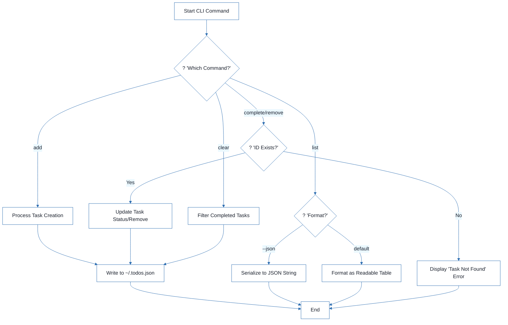
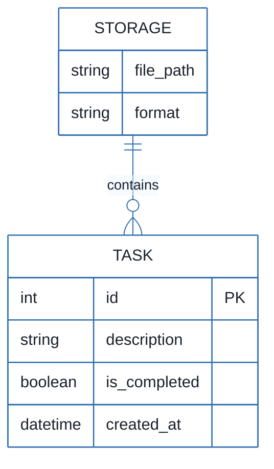
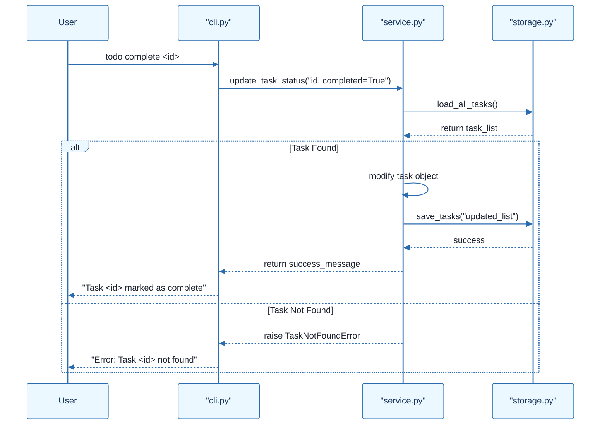

# CLI To-Do List Manager - Technical Specification & Architecture Document

## 1. Executive Summary & Architecture Overview

### 1.1 Executive Brief
A Python-based CLI To-Do Manager utilizing a local JSON file for persistent storage. The system implements a service-oriented architecture separating CLI dispatch, business logic, and file I/O to manage task lifecycles including creation, completion, and removal.

### 1.2 Maturity Assessment
The project is structurally sound with a high health index and a clear execution roadmap. While formal acceptance criteria and explicit security constraints are missing, the presence of independent test cases for each user story provides sufficient validation paths. The project is READY for execution.

### 1.3 Technical Stack
* Python
* pyproject.toml

### 1.4 Architectural Constraints
* Storage must be persisted in `~/.todos.json`.
* Sequential ID assignment for task creation.
* Mandatory population of `created_at` timestamps.
* Strict execution order: Phase 2 (Foundational) must be complete before any User Story implementation.
* Output must support both human-readable and parseable JSON formats via `--json` flag.

### 1.5 Critical Dependencies
* JSON storage path resolution and file I/O helpers in `storage.py`.
* Task entity serialization helpers in `models.py`.
* Sequential dependency: Setup $\rightarrow$ Foundational $\rightarrow$ User Stories $\rightarrow$ Polish.
* Internal data integrity: Task ID validity for remove and complete operations.
* Environment: Python runtime with `pyproject.toml` entry points.

## 2. Architecture Workflows

```mermaid
%%{init: {
  'theme': 'base',
  'themeVariables': {
    'primaryColor': '#1A365D',
    'primaryTextColor': '#1A202C',
    'primaryBorderColor': '#2B6CB0',
    'lineColor': '#2B6CB0',
    'secondaryColor': '#EBF8FF',
    'tertiaryColor': '#EBF8FF',
    'background': '#FFFFFF',
    'mainBkg': '#FFFFFF',
    'secondBkg': '#EBF8FF',
    'tertiaryBkg': '#F7FAFC',
    'secondaryTextColor': '#4A5568',
    'fontSize': '16px',
    'fontFamily': 'Inter, system-ui, sans-serif',
    'nodePadding': '15px',
    'borderRadius': '8px',
    'edgeLabelBackground': '#EBF8FF',
    'clusterBkg': '#F7FAFC',
    'clusterBorder': '#2B6CB0',
    'defaultLinkColor': '#2B6CB0',
    'titleColor': '#1A365D',
    'actorBorder': '#2B6CB0',
    'actorBkg': '#EBF8FF',
    'actorTextColor': '#1A365D',
    'actorLineColor': '#2B6CB0',
    'signalColor': '#2B6CB0',
    'signalTextColor': '#1A202C',
    'labelBoxBorderColor': '#2B6CB0',
    'labelBoxBkgColor': '#EBF8FF',
    'labelTextColor': '#1A202C',
    'loopTextColor': '#1A202C',
    'arrowHeadColor': '#2B6CB0',
    'sequenceNumberColor': '#1A365D',
    'sequenceActorBorder': '#2B6CB0',
    'sequenceActorBkg': '#EBF8FF',
    'sequenceArrowColor': '#2B6CB0',
    'noteBkgColor': '#FFF5EB',
    'noteBorderColor': '#DD6B20',
    'noteTextColor': '#1A202C'
  }
}}%%
flowchart TD
    subgraph Setup_Phase ["Phase 1: Setup"]
        PHASE-1["PHASE-1: Setup (Shared Infrastructure)"]
    end
    subgraph Foundational_Phase ["Phase 2: Foundational"]
        PHASE-2["PHASE-2: Foundational (Blocking Prerequisites)"]
    end
    subgraph User_Stories ["User Story Implementation"]
        PHASE-3["PHASE-3: User Story 1 - Add and Manage Tasks"]
        PHASE-4["PHASE-4: User Story 2 - View and Filter Tasks"]
        PHASE-5["PHASE-5: User Story 3 - Remove and Clear Tasks"]
        T009["T009: Implement add command"] --> PHASE-3
        T010["T010: Implement task creation"] --> PHASE-3
        T011["T011: Implement completion updates"] --> PHASE-3
        T012["T012: Add success/error messages"] --> PHASE-3
        T013["T013: Implement human-readable list"] --> PHASE-4
        T014["T014: Implement JSON formatting"] --> PHASE-4
        T015["T015: Add listing logic"] --> PHASE-4
        T016["T016: Handle empty-list case"] --> PHASE-4
        T017["T017: Implement remove command"] --> PHASE-5
        T018["T018: Implement clear command"] --> PHASE-5
        T019["T019: Add not-found handling"] --> PHASE-5
        T020["T020: Ensure storage persistence"] --> PHASE-5
    end
    subgraph Validation ["Validation & Polish"]
        PHASE-6["PHASE-6: Polish & Cross-Cutting Concerns"]
        TEST-US1["TEST-US1: Add/Complete Test"]
        TEST-US2["TEST-US2: List/JSON Test"]
        TEST-US3["TEST-US3: Remove/Clear Test"]
    end
    PHASE-1 --> PHASE-2
    PHASE-2 --> PHASE-3
    PHASE-2 --> PHASE-4
    PHASE-2 --> PHASE-5
    PHASE-3 --> TEST-US1
    PHASE-4 --> TEST-US2
    PHASE-5 --> TEST-US3
    PHASE-3 --> PHASE-6
    PHASE-4 --> PHASE-6
    PHASE-5 --> PHASE-6
```







```mermaid
%%{init: {
  'theme': 'base',
  'themeVariables': {
    'primaryColor': '#1A365D',
    'primaryTextColor': '#1A202C',
    'primaryBorderColor': '#2B6CB0',
    'lineColor': '#2B6CB0',
    'secondaryColor': '#EBF8FF',
    'tertiaryColor': '#EBF8FF',
    'background': '#FFFFFF',
    'mainBkg': '#FFFFFF',
    'secondBkg': '#EBF8FF',
    'tertiaryBkg': '#F7FAFC',
    'secondaryTextColor': '#4A5568',
    'fontSize': '16px',
    'fontFamily': 'Inter, system-ui, sans-serif',
    'nodePadding': '15px',
    'borderRadius': '8px',
    'edgeLabelBackground': '#EBF8FF',
    'clusterBkg': '#F7FAFC',
    'clusterBorder': '#2B6CB0',
    'defaultLinkColor': '#2B6CB0',
    'titleColor': '#1A365D',
    'actorBorder': '#2B6CB0',
    'actorBkg': '#EBF8FF',
    'actorTextColor': '#1A365D',
    'actorLineColor': '#2B6CB0',
    'signalColor': '#2B6CB0',
    'signalTextColor': '#1A202C',
    'labelBoxBorderColor': '#2B6CB0',
    'labelBoxBkgColor': '#EBF8FF',
    'labelTextColor': '#1A202C',
    'loopTextColor': '#1A202C',
    'arrowHeadColor': '#2B6CB0',
    'sequenceNumberColor': '#1A365D',
    'sequenceActorBorder': '#2B6CB0',
    'sequenceActorBkg': '#EBF8FF',
    'sequenceArrowColor': '#2B6CB0',
    'noteBkgColor': '#FFF5EB',
    'noteBorderColor': '#DD6B20',
    'noteTextColor': '#1A202C'
  }
}}%%
sequenceDiagram
    participant User
    participant CLI as "cli.py"
    participant Service as "service.py"
    participant Storage as "storage.py"
    User->>CLI: todo complete <id>
    CLI->>Service: update_task_status("id, completed=True")
    Service->>Storage: load_all_tasks()
    Storage-->>Service: return task_list
    alt Task Found
        Service->>Service: modify task object
        Service->>Storage: save_tasks("updated_list")
        Storage-->>Service: success
        Service-->>CLI: return success_message
        CLI-->>User: "Task <id> marked as complete"
    else Task Not Found
        Service-->>CLI: raise TaskNotFoundError
        CLI-->>User: "Error: Task <id> not found"
    end
``` & Visual Diagrams

### 2.1 Project Implementation Traceability Map
Maps the dependency flow from project setup through foundational work to specific user story implementation and final polish.

```mermaid
%%{init: {
  'theme': 'base',
  'themeVariables': {
    'primaryColor': '#1A365D',
    'primaryTextColor': '#1A202C',
    'primaryBorderColor': '#2B6CB0',
    'lineColor': '#2B6CB0',
    'secondaryColor': '#EBF8FF',
    'tertiaryColor': '#EBF8FF',
    'background': '#FFFFFF',
    'mainBkg': '#FFFFFF',
    'secondBkg': '#EBF8FF',
    'tertiaryBkg': '#F7FAFC',
    'secondaryTextColor': '#4A5568',
    'fontSize': '16px',
    'fontFamily': 'Inter, system-ui, sans-serif',
    'nodePadding': '15px',
    'borderRadius': '8px',
    'edgeLabelBackground': '#EBF8FF',
    'clusterBkg': '#F7FAFC',
    'clusterBorder': '#2B6CB0',
    'defaultLinkColor': '#2B6CB0',
    'titleColor': '#1A365D',
    'actorBorder': '#2B6CB0',
    'actorBkg': '#EBF8FF',
    'actorTextColor': '#1A365D',
    'actorLineColor': '#2B6CB0',
    'signalColor': '#2B6CB0',
    'signalTextColor': '#1A202C',
    'labelBoxBorderColor': '#2B6CB0',
    'labelBoxBkgColor': '#EBF8FF',
    'labelTextColor': '#1A202C',
    'loopTextColor': '#1A202C',
    'arrowHeadColor': '#2B6CB0',
    'sequenceNumberColor': '#1A365D',
    'sequenceActorBorder': '#2B6CB0',
    'sequenceActorBkg': '#EBF8FF',
    'sequenceArrowColor': '#2B6CB0',
    'noteBkgColor': '#FFF5EB',
    'noteBorderColor': '#DD6B20',
    'noteTextColor': '#1A202C'
  }
}}%%
flowchart TD
    subgraph Setup_Phase ["Phase 1: Setup"]
        PHASE-1["PHASE-1: Setup (Shared Infrastructure)"]
    end
    subgraph Foundational_Phase ["Phase 2: Foundational"]
        PHASE-2["PHASE-2: Foundational (Blocking Prerequisites)"]
    end
    subgraph User_Stories ["User Story Implementation"]
        PHASE-3["PHASE-3: User Story 1 - Add and Manage Tasks"]
        PHASE-4["PHASE-4: User Story 2 - View and Filter Tasks"]
        PHASE-5["PHASE-5: User Story 3 - Remove and Clear Tasks"]
        T009["T009: Implement add command"] --> PHASE-3
        T010["T010: Implement task creation"] --> PHASE-3
        T011["T011: Implement completion updates"] --> PHASE-3
        T012["T012: Add success/error messages"] --> PHASE-3
        T013["T013: Implement human-readable list"] --> PHASE-4
        T014["T014: Implement JSON formatting"] --> PHASE-4
        T015["T015: Add listing logic"] --> PHASE-4
        T016["T016: Handle empty-list case"] --> PHASE-4
        T017["T017: Implement remove command"] --> PHASE-5
        T018["T018: Implement clear command"] --> PHASE-5
        T019["T019: Add not-found handling"] --> PHASE-5
        T020["T020: Ensure storage persistence"] --> PHASE-5
    end
    subgraph Validation ["Validation & Polish"]
        PHASE-6["PHASE-6: Polish & Cross-Cutting Concerns"]
        TEST-US1["TEST-US1: Add/Complete Test"]
        TEST-US2["TEST-US2: List/JSON Test"]
        TEST-US3["TEST-US3: Remove/Clear Test"]
    end
    PHASE-1 --> PHASE-2
    PHASE-2 --> PHASE-3
    PHASE-2 --> PHASE-4
    PHASE-2 --> PHASE-5
    PHASE-3 --> TEST-US1
    PHASE-4 --> TEST-US2
    PHASE-5 --> TEST-US3
    PHASE-3 --> PHASE-6
    PHASE-4 --> PHASE-6
    PHASE-5 --> PHASE-6
```

### 2.2 CLI Task Management Workflow
Business logic flow for managing tasks via the CLI, including decision points for output formatting and error handling.


### 2.3 CLI To-Do Data Model
The logical data structure for the To-Do manager stored in JSON.


### 2.4 Task Operation Sequence
Interaction flow between the CLI layer, Service layer, and Storage layer for a typical task update.



## 3. Detailed Technical Specifications & Business Rules

### 3.1 Requirements Traceability

| ID | Type | Description | Status | Source Section |
| :--- | :--- | :--- | :--- | :--- |
| T001 | task | Create the Python package skeleton in src/todo_manager/__init__.py, __main__.py, cli.py, models.py, storage.py, and service.py | completed | Phase 1: Setup (Shared Infrastructure) |
| T002 | task | Create the test directory structure in tests/unit/ and tests/integration/ | completed | Phase 1: Setup (Shared Infrastructure) |
| T003 | task | Add project metadata and tooling entry points in pyproject.toml | completed | Phase 1: Setup (Shared Infrastructure) |
| T004 | task | Implement task entity definitions and serialization helpers in src/todo_manager/models.py | completed | Phase 2: Foundational (Blocking Prerequisites) |
| T005 | task | Implement JSON storage path resolution and file I/O helpers in src/todo_manager/storage.py | completed | Phase 2: Foundational (Blocking Prerequisites) |
| T006 | task | Implement shared command-line parsing and top-level dispatch in src/todo_manager/cli.py | completed | Phase 2: Foundational (Blocking Prerequisites) |
| T007 | task | Implement shared service-layer error handling and task collection utilities in src/todo_manager/service.py | completed | Phase 2: Foundational (Blocking Prerequisites) |
| T008 | task | Define module entry behavior for python -m todo_manager in src/todo_manager/__main__.py | completed | Phase 2: Foundational (Blocking Prerequisites) |
| T009 | task | Implement the `add` command flow in src/todo_manager/cli.py and src/todo_manager/service.py | completed | Implementation for User Story 1 |
| T010 | task | Implement task creation, sequential ID assignment, and `created_at` population in src/todo_manager/models.py | completed | Implementation for User Story 1 |
| T011 | task | Implement completion updates for existing tasks in src/todo_manager/service.py | completed | Implementation for User Story 1 |
| T012 | task | Add user-facing success and error messages for add and complete operations in src/todo_manager/cli.py | completed | Implementation for User Story 1 |
| T013 | task | Implement human-readable task listing output in src/todo_manager/cli.py | pending | Implementation for User Story 2 |
| T014 | task | Implement `--json` output formatting in src/todo_manager/cli.py using the task serialization helpers in src/todo_manager/models.py | pending | Implementation for User Story 2 |
| T015 | task | Add listing logic that preserves task order and status fields in src/todo_manager/service.py | completed | Implementation for User Story 2 |
| T016 | task | Handle the empty-list case with a clear message in src/todo_manager/cli.py | completed | Implementation for User Story 2 |
| T017 | task | Implement the `remove` command flow in src/todo_manager/cli.py and src/todo_manager/service.py | pending | Implementation for User Story 3 |
| T018 | task | Implement the `clear` command flow for removing completed tasks in src/todo_manager/service.py | pending | Implementation for User Story 3 |
| T019 | task | Add not-found handling for invalid task IDs in src/todo_manager/cli.py | pending | Implementation for User Story 3 |
| T020 | task | Ensure storage writes persist removals and clears safely in src/todo_manager/storage.py | pending | Implementation for User Story 3 |
| T021 | task | Document the CLI usage and storage behavior in README.md | pending | Phase 6: Polish & Cross-Cutting Concerns |
| T022 | task | Add quickstart verification notes and examples in specs/001-cli-todo-manager/quickstart.md | pending | Phase 6: Polish & Cross-Cutting Concerns |
| T023 | task | Run a manual smoke test of add, list, complete, remove, and clear against ~/.todos.json | pending | Phase 6: Polish & Cross-Cutting Concerns |
| T024 | task | Verify linting and formatting expectations for the source files in src/todo_manager/ | pending | Phase 6: Polish & Cross-Cutting Concerns |
| T025 | task | Confirm the generated JSON output remains parseable for the todo list --json path | pending | Phase 6: Polish & Cross-Cutting Concerns |
| TEST-US1 | test_case | Run `todo add "Task description"` and `todo complete <id>`, then confirm the stored task list reflects the new task and its completion status. | N/A | Phase 3: User Story 1 - Add and Manage Tasks (Priority: P1) 🎯 MVP |
| TEST-US2 | test_case | Run `todo list` and `todo list --json` and confirm the output is readable or parseable JSON while showing the full task collection. | N/A | Phase 4: User Story 2 - View and Filter Tasks (Priority: P2) |
| TEST-US3 | test_case | Run `todo remove <id>` and `todo clear`, then confirm the targeted task or completed tasks are removed while other tasks remain intact. | N/A | Phase 5: User Story 3 - Remove and Clear Tasks (Priority: P3) |

### 3.2 Security Rules
* No explicit security constraints provided in source.
* Remediation: Implement basic input sanitization for task descriptions to prevent injection or formatting corruption in the JSON store.

### 3.3 Data Models
* **Task Entity**:
    * `id` (Integer, PK): Sequential unique identifier.
    * `description` (String): Text content of the task.
    * `is_completed` (Boolean): Completion status.
    * `created_at` (DateTime): Timestamp of creation.
* **Storage**:
    * `file_path`: `~/.todos.json`.
    * `format`: JSON.

## 4. Project Governance & Structural Gaps

### 4.1 Structural Gaps
| Gap | Priority | Remediation Advice |
| :--- | :--- | :--- |
| Acceptance Criteria | MEDIUM | While 'Independent Tests' are provided, formal acceptance criteria for each task would improve validation. |
| Security & Performance Constraints | LOW | The project is a simple CLI tool, but constraints on file size or input sanitization could be added. |
| Open Questions & Uncertainties | LOW | No open questions were listed in the source document. |

### 4.2 Remediation & Workflow
1. **Validation**: Integrate the `TEST-USx` cases as formal acceptance criteria for each User Story.
2. **Hardening**: Add a validation layer in `service.py` to ensure `id` inputs are positive integers.
3. **Documentation**: Ensure `T021` and `T022` are completed to provide a clear onboarding path for new developers.

## 5. Technical & Domain Glossary (Terminology Reference)

| Term | Category | Context Anchor | Project Definition |
| :--- | :--- | :--- | :--- |
| Checkpoint | TECHNICAL_STACK | PHASE-2 | A synchronization gate ensuring all blocking infrastructure is verified before parallel feature development commences. |
| Foundational | TECHNICAL_STACK | PHASE-2 | The core shared infrastructure layer that provides essential services and blocking prerequisites for all subsequent user stories. |
| Goal | BUSINESS_DOMAIN | PHASE-3 | The primary functional objective a user must achieve within a specific feature set. |
| ID | TECHNICAL_STACK | T010 | A sequential numeric unique identifier assigned to each task entity during creation. |
| JSON | TECHNICAL_STACK | T005 | The lightweight data-interchange format used for persistent storage and scriptable output. |
| MVP | BUSINESS_DOMAIN | PHASE-3 | The minimum viable product consisting of the first priority user story to enable basic task creation and completion. |
| Organization | BUSINESS_DOMAIN | Tasks: CLI To-Do List Manager | The structural grouping of implementation units by user story to ensure independent testability. |
| Prerequisites | TECHNICAL_STACK | Tasks: CLI To-Do List Manager | The set of mandatory design documents and specifications required before implementation begins. |
| README | TECHNICAL_STACK | T021 | The primary documentation file detailing command-line usage and storage behavior. |
| Setup | TECHNICAL_STACK | PHASE-1 | The initial project bootstrapping phase involving package skeleton creation and tooling configuration. |
| T016 | TECHNICAL_STACK | T016 | The specific implementation unit responsible for handling empty collection states with user-facing messages. |
| Tests | TECHNICAL_STACK | T002 | The verification suite comprising unit and integration directory structures for validating system behavior. |
| population in | TECHNICAL_STACK | T010 | The process of assigning a timestamp to the creation date field of a task entity. |
| todo clear | BUSINESS_DOMAIN | TEST-US3 | The operational command that purges all tasks marked as finished from the persistent store. |
| todo list | BUSINESS_DOMAIN | TEST-US2 | The operational command that retrieves and displays the current collection of tasks in human-readable or machine-parseable formats. |
| ⚠️ CRITICAL | TECHNICAL_STACK | PHASE-2 | A high-severity blocking constraint that prohibits the start of any feature work until the current phase is fully validated. |