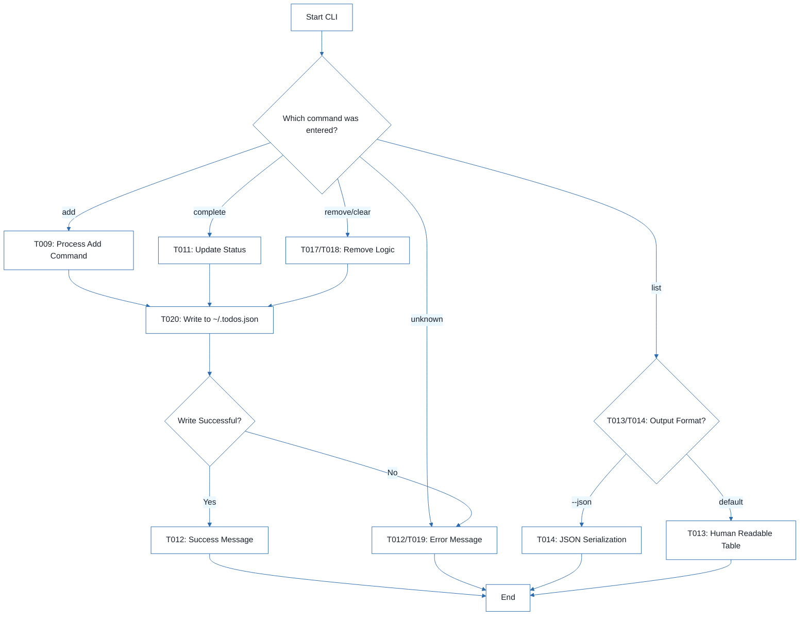
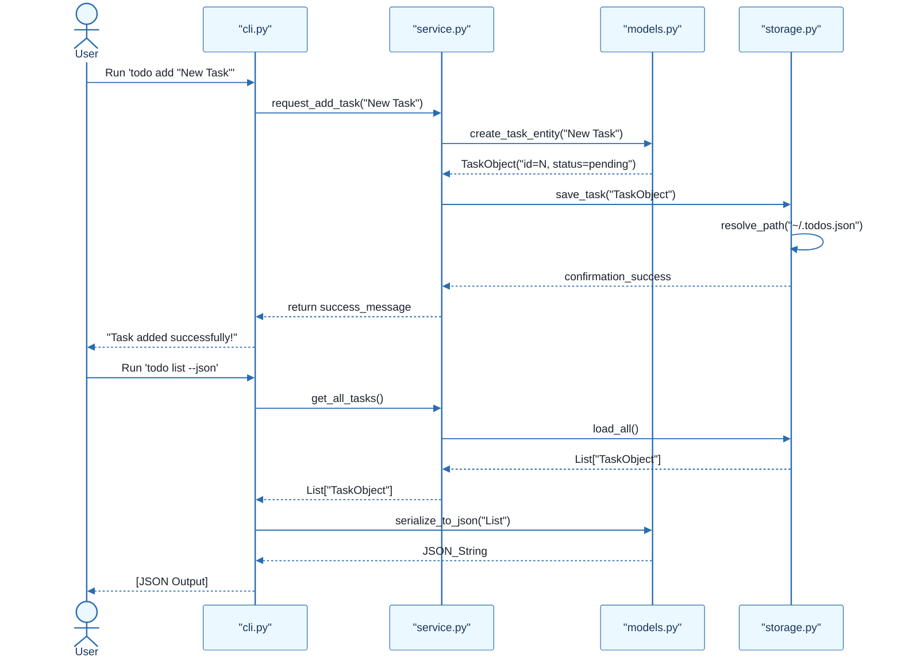
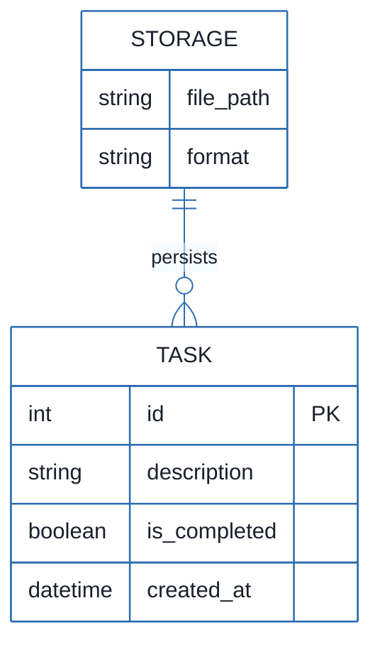

# CLI To-Do List Manager - Technical Specification & Architecture Document

## 1. Executive Summary & Architecture Overview

### 1.1 Executive Brief
A Python-based CLI To-Do List Manager utilizing a local JSON file for persistent storage. The system implements a service-oriented architecture separating CLI dispatch, business logic, and file I/O to manage task lifecycles including creation, completion, and removal.

### 1.2 Maturity Assessment
The project is structurally sound with a high health index and a clear execution roadmap. While formal acceptance criteria are missing for individual tasks, the presence of 'Independent Tests' for each user story provides sufficient validation gates. The project is READY for execution.

### 1.3 Technical Stack
* Python
* pyproject.toml

### 1.4 Architectural Constraints
* Sequential ID assignment for task creation.
* Strict JSON serialization for data persistence.
* Storage path resolution targeting `~/.todos.json`.
* Human-readable and JSON output modes for task listing.
* Blocking dependency: Foundational phase must be complete before any User Story implementation.

### 1.5 Critical Dependencies
* JSON file system I/O for `~/.todos.json`.
* Sequential ID generation logic in `models.py`.
* Referential integrity between CLI commands and service-layer utilities.
* `pyproject.toml` entry points for CLI execution.
* Cascading dependency: Phase 6 (Polish) requires completion of US1, US2, and US3.

## 2. Architecture Workflows

```mermaid
%%{init: {
  'theme': 'base',
  'themeVariables': {
    'primaryColor': '#1A365D',
    'primaryTextColor': '#1A202C',
    'primaryBorderColor': '#2B6CB0',
    'lineColor': '#2B6CB0',
    'secondaryColor': '#EBF8FF',
    'tertiaryColor': '#EBF8FF',
    'background': '#FFFFFF',
    'mainBkg': '#FFFFFF',
    'secondBkg': '#EBF8FF',
    'tertiaryBkg': '#F7FAFC',
    'secondaryTextColor': '#4A5568',
    'fontSize': '16px',
    'fontFamily': 'Inter, system-ui, sans-serif',
    'nodePadding': '15px',
    'borderRadius': '8px',
    'edgeLabelBackground': '#EBF8FF',
    'clusterBkg': '#F7FAFC',
    'clusterBorder': '#2B6CB0',
    'defaultLinkColor': '#2B6CB0',
    'titleColor': '#1A365D',
    'actorBorder': '#2B6CB0',
    'actorBkg': '#EBF8FF',
    'actorTextColor': '#1A365D',
    'actorLineColor': '#2B6CB0',
    'signalColor': '#2B6CB0',
    'signalTextColor': '#1A202C',
    'labelBoxBorderColor': '#2B6CB0',
    'labelBoxBkgColor': '#EBF8FF',
    'labelTextColor': '#1A202C',
    'loopTextColor': '#1A202C',
    'arrowHeadColor': '#2B6CB0',
    'sequenceNumberColor': '#1A365D',
    'sequenceActorBorder': '#2B6CB0',
    'sequenceActorBkg': '#EBF8FF',
    'sequenceArrowColor': '#2B6CB0',
    'noteBkgColor': '#FFF5EB',
    'noteBorderColor': '#DD6B20',
    'noteTextColor': '#1A202C'
  }
}}%%
flowchart TD
    subgraph PHASE_1_SUB["PHASE-1: Setup"]
        T001["T001: Package Skeleton"]
        T002["T002: Test Structure"]
        T003["T003: Project Metadata"]
    end
    subgraph PHASE_2_SUB["PHASE-2: Foundational"]
        T004["T004: Entity Definitions"]
        T005["T005: JSON Storage I/O"]
        T006["T006: CLI Parsing"]
        T007["T007: Service Error Handling"]
        T008["T008: Module Entry"]
    end
    subgraph PHASE_3_SUB["PHASE-3: US1 - Add/Manage"]
        T009["T009: Add Command Flow"]
        T010["T010: Task Creation Logic"]
        T011["T011: Completion Updates"]
        T012["T012: User Messages"]
        TEST-US1["TEST-US1: US1 Validation"]
    end
    subgraph PHASE_4_SUB["PHASE-4: US2 - View/Filter"]
        T013["T013: Human-Readable List"]
        T014["T014: JSON Formatting"]
        T015["T015: Listing Logic"]
        T016["T016: Empty List Handling"]
        TEST-US2["TEST-US2: US2 Validation"]
    end
    subgraph PHASE_5_SUB["PHASE-5: US3 - Remove/Clear"]
        T017["T017: Remove Command Flow"]
        T018["T018: Clear Command Flow"]
        T019["T019: Not-Found Handling"]
        T020["T020: Storage Persistence"]
        TEST-US3["TEST-US3: US3 Validation"]
    end
    subgraph PHASE_6_SUB["PHASE-6: Polish"]
        T021["T021: README Documentation"]
        T022["T022: Quickstart Notes"]
        T023["T023: Smoke Tests"]
        T024["T024: Linting/Formatting"]
        T025["T025: JSON Parse Validation"]
    end
    PHASE-1["PHASE-1"] --> T001
    PHASE-1 --> T002
    PHASE-1 --> T003
    PHASE-2["PHASE-2"] --> T004
    PHASE-2 --> T005
    PHASE-2 --> T006
    PHASE-2 --> T007
    PHASE-2 --> T008
    PHASE-2 --> PHASE-1
    PHASE-3["PHASE-3"] --> T009
    PHASE-3 --> T010
    PHASE-3 --> T011
    PHASE-3 --> T012
    PHASE-3 --> TEST-US1
    PHASE-3 --> PHASE-2
    PHASE-4["PHASE-4"] --> T013
    PHASE-4 --> T014
    PHASE-4 --> T015
    PHASE-4 --> T016
    PHASE-4 --> TEST-US2
    PHASE-4 --> PHASE-2
    PHASE-5["PHASE-5"] --> T017
    PHASE-5 --> T018
    PHASE-5 --> T019
    PHASE-5 --> T020
    PHASE-5 --> TEST-US3
    PHASE-5 --> PHASE-2
    PHASE-6["PHASE-6"] --> T021
    PHASE-6 --> T022
    PHASE-6 --> T023
    PHASE-6 --> T024
    PHASE-6 --> T025
    PHASE-6 --> PHASE-3
    PHASE-6 --> PHASE-4
    PHASE-6 --> PHASE-5
```







```mermaid
%%{init: {
  'theme': 'base',
  'themeVariables': {
    'primaryColor': '#1A365D',
    'primaryTextColor': '#1A202C',
    'primaryBorderColor': '#2B6CB0',
    'lineColor': '#2B6CB0',
    'secondaryColor': '#EBF8FF',
    'tertiaryColor': '#EBF8FF',
    'background': '#FFFFFF',
    'mainBkg': '#FFFFFF',
    'secondBkg': '#EBF8FF',
    'tertiaryBkg': '#F7FAFC',
    'secondaryTextColor': '#4A5568',
    'fontSize': '16px',
    'fontFamily': 'Inter, system-ui, sans-serif',
    'nodePadding': '15px',
    'borderRadius': '8px',
    'edgeLabelBackground': '#EBF8FF',
    'clusterBkg': '#F7FAFC',
    'clusterBorder': '#2B6CB0',
    'defaultLinkColor': '#2B6CB0',
    'titleColor': '#1A365D',
    'actorBorder': '#2B6CB0',
    'actorBkg': '#EBF8FF',
    'actorTextColor': '#1A365D',
    'actorLineColor': '#2B6CB0',
    'signalColor': '#2B6CB0',
    'signalTextColor': '#1A202C',
    'labelBoxBorderColor': '#2B6CB0',
    'labelBoxBkgColor': '#EBF8FF',
    'labelTextColor': '#1A202C',
    'loopTextColor': '#1A202C',
    'arrowHeadColor': '#2B6CB0',
    'sequenceNumberColor': '#1A365D',
    'sequenceActorBorder': '#2B6CB0',
    'sequenceActorBkg': '#EBF8FF',
    'sequenceArrowColor': '#2B6CB0',
    'noteBkgColor': '#FFF5EB',
    'noteBorderColor': '#DD6B20',
    'noteTextColor': '#1A202C'
  }
}}%%
erDiagram
    TASK {
        int id PK
        string description
        boolean is_completed
        datetime created_at
    }
    STORAGE {
        string file_path
        string format
    }
    STORAGE ||--o{ TASK : "persists"
``` & Visual Diagrams

### 2.1 Project Implementation Roadmap & Traceability
```mermaid
%%{init: {
  'theme': 'base',
  'themeVariables': {
    'primaryColor': '#1A365D',
    'primaryTextColor': '#1A202C',
    'primaryBorderColor': '#2B6CB0',
    'lineColor': '#2B6CB0',
    'secondaryColor': '#EBF8FF',
    'tertiaryColor': '#EBF8FF',
    'background': '#FFFFFF',
    'mainBkg': '#FFFFFF',
    'secondBkg': '#EBF8FF',
    'tertiaryBkg': '#F7FAFC',
    'secondaryTextColor': '#4A5568',
    'fontSize': '16px',
    'fontFamily': 'Inter, system-ui, sans-serif',
    'nodePadding': '15px',
    'borderRadius': '8px',
    'edgeLabelBackground': '#EBF8FF',
    'clusterBkg': '#F7FAFC',
    'clusterBorder': '#2B6CB0',
    'defaultLinkColor': '#2B6CB0',
    'titleColor': '#1A365D',
    'actorBorder': '#2B6CB0',
    'actorBkg': '#EBF8FF',
    'actorTextColor': '#1A365D',
    'actorLineColor': '#2B6CB0',
    'signalColor': '#2B6CB0',
    'signalTextColor': '#1A202C',
    'labelBoxBorderColor': '#2B6CB0',
    'labelBoxBkgColor': '#EBF8FF',
    'labelTextColor': '#1A202C',
    'loopTextColor': '#1A202C',
    'arrowHeadColor': '#2B6CB0',
    'sequenceNumberColor': '#1A365D',
    'sequenceActorBorder': '#2B6CB0',
    'sequenceActorBkg': '#EBF8FF',
    'sequenceArrowColor': '#2B6CB0',
    'noteBkgColor': '#FFF5EB',
    'noteBorderColor': '#DD6B20',
    'noteTextColor': '#1A202C'
  }
}}%%
flowchart TD
    subgraph PHASE_1_SUB["PHASE-1: Setup"]
        T001["T001: Package Skeleton"]
        T002["T002: Test Structure"]
        T003["T003: Project Metadata"]
    end
    subgraph PHASE_2_SUB["PHASE-2: Foundational"]
        T004["T004: Entity Definitions"]
        T005["T005: JSON Storage I/O"]
        T006["T006: CLI Parsing"]
        T007["T007: Service Error Handling"]
        T008["T008: Module Entry"]
    end
    subgraph PHASE_3_SUB["PHASE-3: US1 - Add/Manage"]
        T009["T009: Add Command Flow"]
        T010["T010: Task Creation Logic"]
        T011["T011: Completion Updates"]
        T012["T012: User Messages"]
        TEST-US1["TEST-US1: US1 Validation"]
    end
    subgraph PHASE_4_SUB["PHASE-4: US2 - View/Filter"]
        T013["T013: Human-Readable List"]
        T014["T014: JSON Formatting"]
        T015["T015: Listing Logic"]
        T016["T016: Empty List Handling"]
        TEST-US2["TEST-US2: US2 Validation"]
    end
    subgraph PHASE_5_SUB["PHASE-5: US3 - Remove/Clear"]
        T017["T017: Remove Command Flow"]
        T018["T018: Clear Command Flow"]
        T019["T019: Not-Found Handling"]
        T020["T020: Storage Persistence"]
        TEST-US3["TEST-US3: US3 Validation"]
    end
    subgraph PHASE_6_SUB["PHASE-6: Polish"]
        T021["T021: README Documentation"]
        T022["T022: Quickstart Notes"]
        T023["T023: Smoke Tests"]
        T024["T024: Linting/Formatting"]
        T025["T025: JSON Parse Validation"]
    end
    PHASE-1["PHASE-1"] --> T001
    PHASE-1 --> T002
    PHASE-1 --> T003
    PHASE-2["PHASE-2"] --> T004
    PHASE-2 --> T005
    PHASE-2 --> T006
    PHASE-2 --> T007
    PHASE-2 --> T008
    PHASE-2 --> PHASE-1
    PHASE-3["PHASE-3"] --> T009
    PHASE-3 --> T010
    PHASE-3 --> T011
    PHASE-3 --> T012
    PHASE-3 --> TEST-US1
    PHASE-3 --> PHASE-2
    PHASE-4["PHASE-4"] --> T013
    PHASE-4 --> T014
    PHASE-4 --> T015
    PHASE-4 --> T016
    PHASE-4 --> TEST-US2
    PHASE-4 --> PHASE-2
    PHASE-5["PHASE-5"] --> T017
    PHASE-5 --> T018
    PHASE-5 --> T019
    PHASE-5 --> T020
    PHASE-5 --> TEST-US3
    PHASE-5 --> PHASE-2
    PHASE-6["PHASE-6"] --> T021
    PHASE-6 --> T022
    PHASE-6 --> T023
    PHASE-6 --> T024
    PHASE-6 --> T025
    PHASE-6 --> PHASE-3
    PHASE-6 --> PHASE-4
    PHASE-6 --> PHASE-5
```

### 2.2 CLI Command Execution Workflow


### 2.3 Task Management Sequence


### 2.4 CLI To-Do Data Model


## 3. Detailed Technical Specifications & Business Rules

### 3.1 Requirements Traceability
| ID | Description | Source Phase | Status |
| :--- | :--- | :--- | :--- |
| T001 | Create the Python package skeleton in src/todo_manager/__init__.py, __main__.py, cli.py, models.py, storage.py, and service.py | PHASE-1 | completed |
| T002 | Create the test directory structure in tests/unit/ and tests/integration/ | PHASE-1 | completed |
| T003 | Add project metadata and tooling entry points in pyproject.toml | PHASE-1 | completed |
| T004 | Implement task entity definitions and serialization helpers in src/todo_manager/models.py | PHASE-2 | completed |
| T005 | Implement JSON storage path resolution and file I/O helpers in src/todo_manager/storage.py | PHASE-2 | completed |
| T006 | Implement shared command-line parsing and top-level dispatch in src/todo_manager/cli.py | PHASE-2 | completed |
| T007 | Implement shared service-layer error handling and task collection utilities in src/todo_manager/service.py | PHASE-2 | completed |
| T008 | Define module entry behavior for python -m todo_manager in src/todo_manager/__main__.py | PHASE-2 | completed |
| T009 | Implement the `add` command flow in src/todo_manager/cli.py and src/todo_manager/service.py | PHASE-3 | completed |
| T010 | Implement task creation, sequential ID assignment, and `created_at` population in src/todo_manager/models.py | PHASE-3 | completed |
| T011 | Implement completion updates for existing tasks in src/todo_manager/service.py | PHASE-3 | completed |
| T012 | Add user-facing success and error messages for add and complete operations in src/todo_manager/cli.py | PHASE-3 | completed |
| T013 | Implement human-readable task listing output in src/todo_manager/cli.py | PHASE-4 | pending |
| T014 | Implement `--json` output formatting in src/todo_manager/cli.py using the task serialization helpers in src/todo_manager/models.py | PHASE-4 | completed |
| T015 | Add listing logic that preserves task order and status fields in src/todo_manager/service.py | PHASE-4 | completed |
| T016 | Handle the empty-list case with a clear message in src/todo_manager/cli.py | PHASE-4 | completed |
| T017 | Implement the `remove` command flow in src/todo_manager/cli.py and src/todo_manager/service.py | PHASE-5 | pending |
| T018 | Implement the `clear` command flow for removing completed tasks in src/todo_manager/service.py | PHASE-5 | pending |
| T019 | Add not-found handling for invalid task IDs in src/todo_manager/cli.py | PHASE-5 | pending |
| T020 | Ensure storage writes persist removals and clears safely in src/todo_manager/storage.py | PHASE-5 | pending |
| T021 | Document the CLI usage and storage behavior in README.md | PHASE-6 | pending |
| T022 | Add quickstart verification notes and examples in specs/001-cli-todo-manager/quickstart.md | PHASE-6 | pending |
| T023 | Run a manual smoke test of add, list, complete, remove, and clear against ~/.todos.json | PHASE-6 | pending |
| T024 | Verify linting and formatting expectations for the source files in src/todo_manager/ | PHASE-6 | pending |
| T025 | Confirm the generated JSON output remains parseable for the todo list --json path | PHASE-6 | pending |
| TEST-US1 | Run `todo add "Task description"` and `todo complete <id>`, then confirm the stored task list reflects the new task and its completion status. | PHASE-3 | N/A |
| TEST-US2 | Run `todo list` and `todo list --json` and confirm the output is readable or parseable JSON while showing the full task collection. | PHASE-4 | N/A |
| TEST-US3 | Run `todo remove <id>` and `todo clear`, then confirm the targeted task or completed tasks are removed while other tasks remain intact. | PHASE-5 | N/A |

### 3.2 Security Rules
* No specific security constraints defined; however, input sanitization for CLI arguments is recommended to prevent unexpected behavior during JSON serialization.

### 3.3 Data Models
* **Task Entity**:
    * `id` (Integer, PK): Sequential unique identifier.
    * `description` (String): The task content.
    * `is_completed` (Boolean): Completion status.
    * `created_at` (DateTime): Timestamp of creation.
* **Storage**:
    * `file_path` (String): Path to `~/.todos.json`.
    * `format` (String): JSON.

## 4. Project Governance & Structural Gaps

### 4.1 Structural Gaps
| Gap | Priority | Remediation Advice |
| :--- | :--- | :--- |
| Acceptance Criteria | MEDIUM | While 'Independent Tests' are provided, formal acceptance criteria for each task would improve validation. |
| Security & Performance Constraints | LOW | The project is a simple CLI tool, but constraints on file size or input sanitization could be added. |
| Open Questions & Uncertainties | LOW | No open questions were identified in the source document. |

### 4.2 Remediation & Workflow
1. **Validation**: Implement formal acceptance criteria for each task in Phase 6.
2. **Hardening**: Add basic input validation in `cli.py` to ensure task descriptions are not empty.
3. **Verification**: Execute the smoke tests (T023) as the final gate before project closure.

## 5. Technical & Domain Glossary (Terminology Reference)

| Term | Category | Context Anchor | Project Definition |
| :--- | :--- | :--- | :--- |
| Checkpoint | TECHNICAL_STACK | PHASE-2 | A synchronization gate ensuring all blocking infrastructure is verified before parallel feature development commences. |
| Foundational | TECHNICAL_STACK | PHASE-2 | The core shared infrastructure layer that provides essential serialization and I/O capabilities required by all subsequent features. |
| Goal | BUSINESS_DOMAIN | PHASE-3 | The primary functional objective a user must achieve within a specific feature set. |
| ID | BUSINESS_DOMAIN | T010 | A unique sequential numeric identifier assigned to each entry for precise targeting during updates or removals. |
| JSON | TECHNICAL_STACK | T005 | The lightweight data-interchange format used for persistent storage in the home directory and for machine-readable output. |
| MVP | BUSINESS_DOMAIN | PHASE-3 | The minimum viable product consisting of the absolute essential capabilities to create and mark entries as finished. |
| Organization | TECHNICAL_STACK | Tasks: CLI To-Do List Manager | The structural grouping of implementation units by user story to ensure independent testability. |
| Prerequisites | TECHNICAL_STACK | Tasks: CLI To-Do List Manager | The set of mandatory design and contract documents required before implementation begins. |
| README | TECHNICAL_STACK | T021 | The primary documentation file detailing usage instructions and storage behavior. |
| Setup | TECHNICAL_STACK | PHASE-1 | The initial phase involving package skeleton creation and tooling configuration. |
| T016 | TECHNICAL_STACK | T016 | The specific implementation unit responsible for providing user feedback when no entries are available to display. |
| Tests | TECHNICAL_STACK | T002 | The verification suite divided into unit and integration directories to ensure logic correctness. |
| population in | TECHNICAL_STACK | T010 | The process of automatically assigning a timestamp to the creation field during entry instantiation. |
| todo clear | BUSINESS_DOMAIN | T018 | The operation that purges all entries marked as finished from the persistent store. |
| todo list | BUSINESS_DOMAIN | T013 | The operation that retrieves and displays all stored entries in either human-readable or machine-parseable formats. |
| ⚠️ CRITICAL | TECHNICAL_STACK | PHASE-2 | A high-priority constraint indicating that subsequent work is strictly blocked until the current phase is fully validated. |