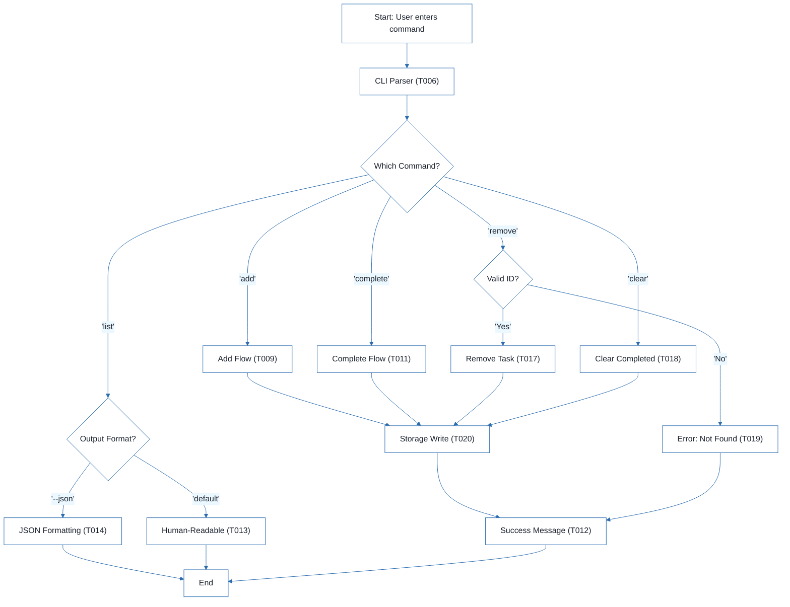
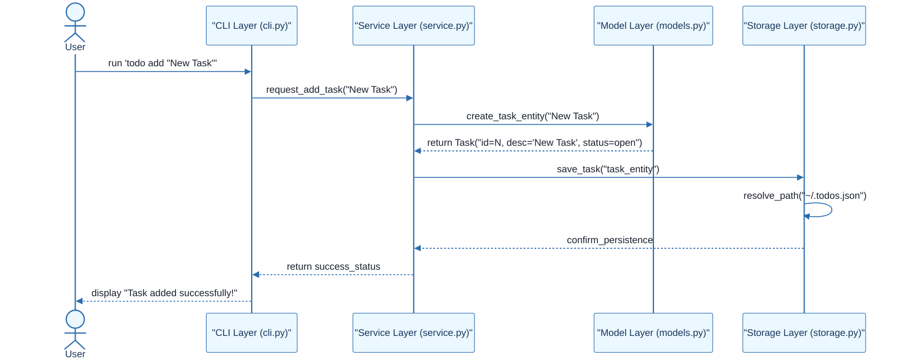

# CLI To-Do List Manager - Technical Specification & Architecture Document

## 1. Executive Summary & Architecture Overview

### 1.1 Executive Brief
The CLI To-Do List Manager is a Python-based command-line application designed for task lifecycle management using a local JSON storage pattern. It implements a service-oriented architecture separating CLI dispatch, business logic, and file I/O to enable independent user story implementation and testing.

### 1.2 Maturity Assessment
The project is structurally sound with a high health index and a clear execution roadmap. While formal acceptance criteria and explicit performance bounds for the JSON storage are missing, the presence of independent test cases for each user story ensures functional verifiability. The project is READY for execution.

### 1.3 Technical Stack
* Python
* pyproject.toml

### 1.4 Architectural Constraints
* Sequential ID assignment for task creation.
* Strict JSON serialization for data persistence.
* Storage path resolution targeting `~/.todos.json`.
* Human-readable and JSON output modes for listing.
* Blocking dependency: Foundational Phase (Phase 2) must be complete before any User Story implementation.
* Manual smoke test validation for all core commands (add, list, complete, remove, clear).

### 1.5 Critical Dependencies
* JSON file I/O for persistence in `~/.todos.json`.
* `pyproject.toml` for CLI entry point and tooling configuration.
* Sequential dependency: Setup $\rightarrow$ Foundational $\rightarrow$ User Stories $\rightarrow$ Polish.
* Internal data integrity: Task entity serialization helpers must precede CLI wiring.
* Referential integrity: Task ID validation for remove and complete operations.

## 2. Architecture Workflows

```mermaid
%%{init: {
  'theme': 'base',
  'themeVariables': {
    'primaryColor': '#1A365D',
    'primaryTextColor': '#1A202C',
    'primaryBorderColor': '#2B6CB0',
    'lineColor': '#2B6CB0',
    'secondaryColor': '#EBF8FF',
    'tertiaryColor': '#EBF8FF',
    'background': '#FFFFFF',
    'mainBkg': '#FFFFFF',
    'secondBkg': '#EBF8FF',
    'tertiaryBkg': '#F7FAFC',
    'secondaryTextColor': '#4A5568',
    'fontSize': '16px',
    'fontFamily': 'Inter, system-ui, sans-serif',
    'nodePadding': '15px',
    'borderRadius': '8px',
    'edgeLabelBackground': '#EBF8FF',
    'clusterBkg': '#F7FAFC',
    'clusterBorder': '#2B6CB0',
    'defaultLinkColor': '#2B6CB0',
    'titleColor': '#1A365D',
    'actorBorder': '#2B6CB0',
    'actorBkg': '#EBF8FF',
    'actorTextColor': '#1A365D',
    'actorLineColor': '#2B6CB0',
    'signalColor': '#2B6CB0',
    'signalTextColor': '#1A202C',
    'labelBoxBorderColor': '#2B6CB0',
    'labelBoxBkgColor': '#EBF8FF',
    'labelTextColor': '#1A202C',
    'loopTextColor': '#1A202C',
    'arrowHeadColor': '#2B6CB0',
    'sequenceNumberColor': '#1A365D',
    'sequenceActorBorder': '#2B6CB0',
    'sequenceActorBkg': '#EBF8FF',
    'sequenceArrowColor': '#2B6CB0',
    'noteBkgColor': '#FFF5EB',
    'noteBorderColor': '#DD6B20',
    'noteTextColor': '#1A202C'
  }
}}%%
flowchart TD
  subgraph S1 ["Phase 1: Setup"]
    PHASE-1["PHASE-1: Setup (Shared Infrastructure)"]
    T001["T001: Package Skeleton"]
    T002["T002: Test Structure"]
    T003["T003: Project Metadata"]
    PHASE-1 --> T001
    PHASE-1 --> T002
    PHASE-1 --> T003
  end
  subgraph S2 ["Phase 2: Foundational"]
    PHASE-2["PHASE-2: Foundational (Blocking Prerequisites)"]
    T004["T004: Entity Definitions"]
    T005["T005: JSON Storage I/O"]
    T006["T006: CLI Parsing"]
    T007["T007: Service Error Handling"]
    T008["T008: Module Entry"]
    PHASE-2 --> T004
    PHASE-2 --> T005
    PHASE-2 --> T006
    PHASE-2 --> T007
    PHASE-2 --> T008
  end
  subgraph S3 ["Phase 3: US1 - Add/Manage"]
    PHASE-3["PHASE-3: User Story 1"]
    T009["T009: Add Command Flow"]
    T010["T010: Task Creation Logic"]
    T011["T011: Completion Updates"]
    T012["T012: User Messages"]
    TEST-US1["TEST-US1: US1 Validation"]
    PHASE-3 --> T009
    PHASE-3 --> T010
    PHASE-3 --> T011
    PHASE-3 --> T012
    PHASE-3 --> TEST-US1
  end
  subgraph S4 ["Phase 4: US2 - View/Filter"]
    PHASE-4["PHASE-4: User Story 2"]
    T013["T013: Human-Readable List"]
    T014["T014: JSON Output"]
    T015["T015: Listing Logic"]
    T016["T016: Empty List Handling"]
    TEST-US2["TEST-US2: US2 Validation"]
    PHASE-4 --> T013
    PHASE-4 --> T014
    PHASE-4 --> T015
    PHASE-4 --> T016
    PHASE-4 --> TEST-US2
  end
  subgraph S5 ["Phase 5: US3 - Remove/Clear"]
    PHASE-5["PHASE-5: User Story 3"]
    T017["T017: Remove Command Flow"]
    T018["T018: Clear Completed Flow"]
    T019["T019: Not-Found Handling"]
    T020["T020: Storage Persistence"]
    TEST-US3["TEST-US3: US3 Validation"]
    PHASE-5 --> T017
    PHASE-5 --> T018
    PHASE-5 --> T019
    PHASE-5 --> T020
    PHASE-5 --> TEST-US3
  end
  subgraph S6 ["Phase 6: Polish"]
    PHASE-6["PHASE-6: Polish & Cross-Cutting"]
    T021["T021: Documentation"]
    T022["T022: Quickstart Notes"]
    T023["T023: Smoke Tests"]
    T024["T024: Linting/Formatting"]
    T025["T025: JSON Parse Validation"]
    PHASE-6 --> T021
    PHASE-6 --> T022
    PHASE-6 --> T023
    PHASE-6 --> T024
    PHASE-6 --> T025
  end
  PHASE-2 -->|"depends_on"| PHASE-1
  PHASE-3 -->|"depends_on"| PHASE-2
  PHASE-4 -->|"depends_on"| PHASE-2
  PHASE-5 -->|"depends_on"| PHASE-2
  PHASE-6 -->|"depends_on"| PHASE-3
  PHASE-6 -->|"depends_on"| PHASE-4
  PHASE-6 -->|"depends_on"| PHASE-5
```





```mermaid
%%{init: {
  'theme': 'base',
  'themeVariables': {
    'primaryColor': '#1A365D',
    'primaryTextColor': '#1A202C',
    'primaryBorderColor': '#2B6CB0',
    'lineColor': '#2B6CB0',
    'secondaryColor': '#EBF8FF',
    'tertiaryColor': '#EBF8FF',
    'background': '#FFFFFF',
    'mainBkg': '#FFFFFF',
    'secondBkg': '#EBF8FF',
    'tertiaryBkg': '#F7FAFC',
    'secondaryTextColor': '#4A5568',
    'fontSize': '16px',
    'fontFamily': 'Inter, system-ui, sans-serif',
    'nodePadding': '15px',
    'borderRadius': '8px',
    'edgeLabelBackground': '#EBF8FF',
    'clusterBkg': '#F7FAFC',
    'clusterBorder': '#2B6CB0',
    'defaultLinkColor': '#2B6CB0',
    'titleColor': '#1A365D',
    'actorBorder': '#2B6CB0',
    'actorBkg': '#EBF8FF',
    'actorTextColor': '#1A365D',
    'actorLineColor': '#2B6CB0',
    'signalColor': '#2B6CB0',
    'signalTextColor': '#1A202C',
    'labelBoxBorderColor': '#2B6CB0',
    'labelBoxBkgColor': '#EBF8FF',
    'labelTextColor': '#1A202C',
    'loopTextColor': '#1A202C',
    'arrowHeadColor': '#2B6CB0',
    'sequenceNumberColor': '#1A365D',
    'sequenceActorBorder': '#2B6CB0',
    'sequenceActorBkg': '#EBF8FF',
    'sequenceArrowColor': '#2B6CB0',
    'noteBkgColor': '#FFF5EB',
    'noteBorderColor': '#DD6B20',
    'noteTextColor': '#1A202C'
  }
}}%%
sequenceDiagram
    actor User
    participant CLI as "CLI Layer (cli.py)"
    participant SVC as "Service Layer (service.py)"
    participant MDL as "Model Layer (models.py)"
    participant STR as "Storage Layer (storage.py)"
    User->>CLI: run 'todo add "New Task"'
    CLI->>SVC: request_add_task("New Task")
    SVC->>MDL: create_task_entity("New Task")
    MDL-->>SVC: return Task("id=N, desc='New Task', status=open")
    SVC->>STR: save_task("task_entity")
    STR->>STR: resolve_path("~/.todos.json")
    STR-->>SVC: confirm_persistence
    SVC-->>CLI: return success_status
    CLI-->>User: display "Task added successfully!"
``` & Visual Diagrams

### 2.1 Project Implementation Roadmap & Traceability
Visualizes the dependency chain between project phases and the specific tasks contained within each phase, ensuring full traceability from setup to polish.

```mermaid
%%{init: {
  'theme': 'base',
  'themeVariables': {
    'primaryColor': '#1A365D',
    'primaryTextColor': '#1A202C',
    'primaryBorderColor': '#2B6CB0',
    'lineColor': '#2B6CB0',
    'secondaryColor': '#EBF8FF',
    'tertiaryColor': '#EBF8FF',
    'background': '#FFFFFF',
    'mainBkg': '#FFFFFF',
    'secondBkg': '#EBF8FF',
    'tertiaryBkg': '#F7FAFC',
    'secondaryTextColor': '#4A5568',
    'fontSize': '16px',
    'fontFamily': 'Inter, system-ui, sans-serif',
    'nodePadding': '15px',
    'borderRadius': '8px',
    'edgeLabelBackground': '#EBF8FF',
    'clusterBkg': '#F7FAFC',
    'clusterBorder': '#2B6CB0',
    'defaultLinkColor': '#2B6CB0',
    'titleColor': '#1A365D',
    'actorBorder': '#2B6CB0',
    'actorBkg': '#EBF8FF',
    'actorTextColor': '#1A365D',
    'actorLineColor': '#2B6CB0',
    'signalColor': '#2B6CB0',
    'signalTextColor': '#1A202C',
    'labelBoxBorderColor': '#2B6CB0',
    'labelBoxBkgColor': '#EBF8FF',
    'labelTextColor': '#1A202C',
    'loopTextColor': '#1A202C',
    'arrowHeadColor': '#2B6CB0',
    'sequenceNumberColor': '#1A365D',
    'sequenceActorBorder': '#2B6CB0',
    'sequenceActorBkg': '#EBF8FF',
    'sequenceArrowColor': '#2B6CB0',
    'noteBkgColor': '#FFF5EB',
    'noteBorderColor': '#DD6B20',
    'noteTextColor': '#1A202C'
  }
}}%%
flowchart TD
  subgraph S1 ["Phase 1: Setup"]
    PHASE-1["PHASE-1: Setup (Shared Infrastructure)"]
    T001["T001: Package Skeleton"]
    T002["T002: Test Structure"]
    T003["T003: Project Metadata"]
    PHASE-1 --> T001
    PHASE-1 --> T002
    PHASE-1 --> T003
  end
  subgraph S2 ["Phase 2: Foundational"]
    PHASE-2["PHASE-2: Foundational (Blocking Prerequisites)"]
    T004["T004: Entity Definitions"]
    T005["T005: JSON Storage I/O"]
    T006["T006: CLI Parsing"]
    T007["T007: Service Error Handling"]
    T008["T008: Module Entry"]
    PHASE-2 --> T004
    PHASE-2 --> T005
    PHASE-2 --> T006
    PHASE-2 --> T007
    PHASE-2 --> T008
  end
  subgraph S3 ["Phase 3: US1 - Add/Manage"]
    PHASE-3["PHASE-3: User Story 1"]
    T009["T009: Add Command Flow"]
    T010["T010: Task Creation Logic"]
    T011["T011: Completion Updates"]
    T012["T012: User Messages"]
    TEST-US1["TEST-US1: US1 Validation"]
    PHASE-3 --> T009
    PHASE-3 --> T010
    PHASE-3 --> T011
    PHASE-3 --> T012
    PHASE-3 --> TEST-US1
  end
  subgraph S4 ["Phase 4: US2 - View/Filter"]
    PHASE-4["PHASE-4: User Story 2"]
    T013["T013: Human-Readable List"]
    T014["T014: JSON Output"]
    T015["T015: Listing Logic"]
    T016["T016: Empty List Handling"]
    TEST-US2["TEST-US2: US2 Validation"]
    PHASE-4 --> T013
    PHASE-4 --> T014
    PHASE-4 --> T015
    PHASE-4 --> T016
    PHASE-4 --> TEST-US2
  end
  subgraph S5 ["Phase 5: US3 - Remove/Clear"]
    PHASE-5["PHASE-5: User Story 3"]
    T017["T017: Remove Command Flow"]
    T018["T018: Clear Completed Flow"]
    T019["T019: Not-Found Handling"]
    T020["T020: Storage Persistence"]
    TEST-US3["TEST-US3: US3 Validation"]
    PHASE-5 --> T017
    PHASE-5 --> T018
    PHASE-5 --> T019
    PHASE-5 --> T020
    PHASE-5 --> TEST-US3
  end
  subgraph S6 ["Phase 6: Polish"]
    PHASE-6["PHASE-6: Polish & Cross-Cutting"]
    T021["T021: Documentation"]
    T022["T022: Quickstart Notes"]
    T023["T023: Smoke Tests"]
    T024["T024: Linting/Formatting"]
    T025["T025: JSON Parse Validation"]
    PHASE-6 --> T021
    PHASE-6 --> T022
    PHASE-6 --> T023
    PHASE-6 --> T024
    PHASE-6 --> T025
  end
  PHASE-2 -->|"depends_on"| PHASE-1
  PHASE-3 -->|"depends_on"| PHASE-2
  PHASE-4 -->|"depends_on"| PHASE-2
  PHASE-5 -->|"depends_on"| PHASE-2
  PHASE-6 -->|"depends_on"| PHASE-3
  PHASE-6 -->|"depends_on"| PHASE-4
  PHASE-6 -->|"depends_on"| PHASE-5
```

### 2.2 CLI Command Execution Workflow
Models the business logic flow of the CLI tool, including the dispatch mechanism and decision points for different commands.


### 2.3 CLI To-Do Manager Sequence Interaction
Illustrates the interaction between the User, CLI layer, Service layer, and Storage layer for a typical 'Add Task' operation.



## 3. Detailed Technical Specifications & Business Rules

### 3.1 Requirements Traceability

| ID | Description | Status | Source/Story |
| :--- | :--- | :--- | :--- |
| T001 | Create the Python package skeleton in src/todo_manager/__init__.py, __main__.py, cli.py, models.py, storage.py, and service.py | Completed | PHASE-1 |
| T002 | Create the test directory structure in tests/unit/ and tests/integration/ | Completed | PHASE-1 |
| T003 | Add project metadata and tooling entry points in pyproject.toml | Completed | PHASE-1 |
| T004 | Implement task entity definitions and serialization helpers in src/todo_manager/models.py | Completed | PHASE-2 |
| T005 | Implement JSON storage path resolution and file I/O helpers in src/todo_manager/storage.py | Completed | PHASE-2 |
| T006 | Implement shared command-line parsing and top-level dispatch in src/todo_manager/cli.py | Completed | PHASE-2 |
| T007 | Implement shared service-layer error handling and task collection utilities in src/todo_manager/service.py | Completed | PHASE-2 |
| T008 | Define module entry behavior for python -m todo_manager in src/todo_manager/__main__.py | Completed | PHASE-2 |
| T009 | Implement the `add` command flow in src/todo_manager/cli.py and src/todo_manager/service.py | Completed | US1 |
| T010 | Implement task creation, sequential ID assignment, and `created_at` population in src/todo_manager/models.py | Completed | US1 |
| T011 | Implement completion updates for existing tasks in src/todo_manager/service.py | Completed | US1 |
| T012 | Add user-facing success and error messages for add and complete operations in src/todo_manager/cli.py | Completed | US1 |
| T013 | Implement human-readable task listing output in src/todo_manager/cli.py | Completed | US2 |
| T014 | Implement `--json` output formatting in src/todo_manager/cli.py using the task serialization helpers in src/todo_manager/models.py | Completed | US2 |
| T015 | Add listing logic that preserves task order and status fields in src/todo_manager/service.py | Completed | US2 |
| T016 | Handle the empty-list case with a clear message in src/todo_manager/cli.py | Completed | US2 |
| T017 | Implement the `remove` command flow in src/todo_manager/cli.py and src/todo_manager/service.py | Pending | US3 |
| T018 | Implement the `clear` command flow for removing completed tasks in src/todo_manager/service.py | Pending | US3 |
| T019 | Add not-found handling for invalid task IDs in src/todo_manager/cli.py | Pending | US3 |
| T020 | Ensure storage writes persist removals and clears safely in src/todo_manager/storage.py | Pending | US3 |
| T021 | Document the CLI usage and storage behavior in README.md | Pending | PHASE-6 |
| T022 | Add quickstart verification notes and examples in specs/001-cli-todo-manager/quickstart.md | Pending | PHASE-6 |
| T023 | Run a manual smoke test of add, list, complete, remove, and clear against ~/.todos.json | Pending | PHASE-6 |
| T024 | Verify linting and formatting expectations for the source files in src/todo_manager/ | Pending | PHASE-6 |
| T025 | Confirm the generated JSON output remains parseable for the todo list --json path | Pending | PHASE-6 |
| TEST-US1 | Run `todo add "Task description"` and `todo complete <id>`, then confirm the stored task list reflects the new task and its completion status. | N/A | US1 |
| TEST-US2 | Run `todo list` and `todo list --json` and confirm the output is readable or parseable JSON while showing the full task collection. | N/A | US2 |
| TEST-US3 | Run `todo remove <id>` and `todo clear`, then confirm the targeted task or completed tasks are removed while other tasks remain intact. | N/A | US3 |

### 3.2 Security Rules
* No explicit security rules defined in source.
* Recommended: Implement input sanitization for task descriptions to prevent injection or formatting issues in JSON.

### 3.3 Data Models
* **Task Entity**:
    * `id`: Sequential alphanumeric token (T010).
    * `description`: String.
    * `status`: Open/Completed.
    * `created_at`: Timestamp populated during instantiation (T010).
* **Persistence**: JSON file located at `~/.todos.json` (T005).

## 4. Project Governance & Structural Gaps

### 4.1 Structural Gaps

| Missing Section | Priority | Remediation Advice |
| :--- | :--- | :--- |
| Acceptance Criteria | MEDIUM | While 'Independent Tests' are provided, formal acceptance criteria for each task would improve validation. |
| Security & Performance Constraints | LOW | The project is a simple CLI tool, but constraints on JSON file size or input sanitization could be added. |
| Open Questions & Uncertainties | LOW | No open questions were listed in the source document. |

### 4.2 Remediation & Workflow
1. **Validation**: Integrate formal acceptance criteria into the "Polish" phase (Phase 6).
2. **Performance**: Define a maximum JSON file size limit to prevent CLI degradation.
3. **Security**: Add a validation layer in `service.py` to sanitize user input before it reaches `models.py`.

## 5. Technical & Domain Glossary (Terminology Reference)

| Term | Category | Context Anchor | Project Definition |
| :--- | :--- | :--- | :--- |
| Checkpoint | TECHNICAL_STACK | PHASE-2 | A synchronization gate ensuring all blocking infrastructure is verified before parallel feature development commences. |
| Foundational | TECHNICAL_STACK | PHASE-2 | The core shared infrastructure layer containing serialization and I/O helpers that block all subsequent user story implementations. |
| Goal | BUSINESS_DOMAIN | PHASE-3 | The primary functional objective a user must achieve within a specific feature set. |
| ID | TECHNICAL_STACK | T010 | A sequential alphanumeric token assigned to each entry to ensure unique referenceability. |
| JSON | TECHNICAL_STACK | T005 | The lightweight data-interchange format used for persistent storage in the home directory. |
| MVP | BUSINESS_DOMAIN | PHASE-3 | The minimum viable product consisting of the first priority user story for basic task creation and completion. |
| Organization | BUSINESS_DOMAIN | Tasks: CLI To-Do List Manager | The structural grouping of implementation units by user story to ensure independent testability. |
| Prerequisites | TECHNICAL_STACK | Tasks: CLI To-Do List Manager | The set of mandatory design documents including plan, spec, and data-model required before coding. |
| README | TECHNICAL_STACK | T021 | The primary documentation file detailing command-line usage and storage behavior. |
| Setup | TECHNICAL_STACK | PHASE-1 | The initial phase involving package skeleton creation and tooling configuration in the project metadata file. |
| T016 | TECHNICAL_STACK | T016 | The specific implementation unit responsible for providing a clear message when the task collection is empty. |
| Tests | TECHNICAL_STACK | T002 | The directory structure for unit and integration verification, validated via quickstart smoke tests. |
| population in | TECHNICAL_STACK | T010 | The process of assigning a timestamp to the creation field during entity instantiation. |
| todo clear | BUSINESS_DOMAIN | T018 | The operation that removes all entries marked as finished from the persistent store. |
| todo list | BUSINESS_DOMAIN | T013 | The operation that retrieves and displays all entries in either human-readable or machine-parseable formats. |
| ⚠️ CRITICAL | TECHNICAL_STACK | PHASE-2 | A high-severity constraint indicating that no feature work can proceed until the current phase is fully completed. |